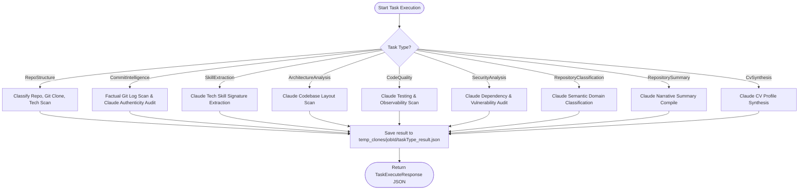
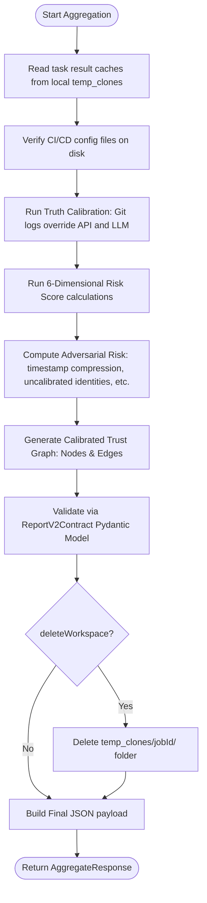

# 04 - Orchestrator Analysis

This document audits the orchestrator classes defined in the `app/orchestrators` directory, detailing the execution steps, workspace caching, truth calibration algorithms, trust graph models, and retry behaviors.

---

## Orchestrator Directory Audit

1.  **`GitHubAnalysisOrchestrator` (Active)**: Coordinates the sequential task execution and results aggregation for repository verification.
2.  **`CvAnalysisOrchestrator` (Skeleton)**: Intended to orchestrate resume profile extractions. Currently returns `{}`.
3.  **`JobMatchingOrchestrator` (Skeleton)**: Intended to match candidate profiles to jobs. Currently returns `[]`.

---

## GitHubAnalysisOrchestrator Execution Flow

The `GitHubAnalysisOrchestrator` exposes two primary operational endpoints invoked by CVerify.Core:

### 1. Task Execution (`execute_task`)
Runs a single, discrete analysis step based on `task_type`.

### 2. Results Aggregation (`aggregate_results`)
Combines task outputs, runs truth calibration and adversarial checks, and validates the final Report V2 schema.

---

## Detailed Component Analysis (GitHubAnalysisOrchestrator)

### 1. Workspace Caching
*   **Mechanism**: The C# backend manages orchestration sequentially. To share context between steps without passing huge payloads, CVerify.AI writes task results to disk in the job's temporary workspace folder: `CVerify.AI/temp_clones/{job_id}/{task_type}_result.json`.
*   **Example**: `CvSynthesis` reads the outputs of `RepositoryClassification`, `SkillExtraction`, `CommitIntelligence`, and `RepositorySummary` directly from the cached workspace files to build the prompt.

### 2. Truth Calibration Layer & Conflict Resolution
The orchestrator implements a strict hierarchical validation layer to resolve conflicts between developer-reported metrics, GitHub API counts, and LLM inferences:
*   **Hierarchical Order**: Local Git Logs (`S_git`: highest authority) ➔ GitHub API (`S_api`: medium authority) ➔ LLM Inference (`S_llm`: advisory authority).
*   **Skill Calibration**: LLM-inferred skills are cross-referenced with files detected during the directory walk. Skills unsupported by manifest file references are rejected.
*   **Authorship Calibration**: If Git logs indicate the user's commit ratio is under 20%, any claims by GitHub API metadata or Claude identifying the user as the primary author are overridden.

### 3. Adversarial Risk & Uncertainty Metrics
The orchestrator calculates six metrics to detect repository manipulation:
*   **Variance**: stability parameter reflecting commit size and frequency (`100.0 / (total_commits + 1)`).
*   **Sampling Bias Risk**: ratio of files skipped during sampling (`1.0 - (sampled_files / scanned_files)`).
*   **Uncalibrated Identities**: count of author email addresses in the Git log that do not match the user's profile.
*   **Timestamp Compression**: ratio of commits occurring within compressed windows (e.g. bulk copy-paste history dumps).
*   **Unverified Commits**: count of Git commits missing cryptographic signatures.
*   **Adversarial Risk Score**: combined index which penalizes the final trust score (up to a 50% reduction) if spoofing or identity mismatch is detected.

### 4. Structured Trust Graph Generation
The aggregation step compiles an interactive graph of the verified evidence:
*   **Nodes**:
    *   `developer`: representing the candidate.
    *   `repository`: representing the audited codebase.
    *   `skill`: calibrated developer skills.
    *   `evidence`: specific quality or security findings that verify skills.
*   **Edges**:
    *   `dev-owns-repo` (weight based on commit ratio).
    *   `dev-has-skill` (weight based on trust score).
    *   `repo-uses-skill`.
    *   `evidence-supports-repo`.

---

## Failure Points and Retry Behavior

*   **Task Interruption**: If any task fails, the C# coordinator logs the exception, halts subsequent tasks, and marks the job as `Failed`.
*   **API Outages**: Recovered via exponential backoff retries within the `ClaudeService` (up to 5 attempts).
*   **Cleanup Failures**: If deleting the directory `temp_clones/{jobId}` fails, the orchestrator logs a warning but does not fail the job.

---

## AI Agent Consumption Optimization

| Field | Reference Value / Path |
|---|---|
| **Entry Points** | `execute_task` and `aggregate_results` in [app/orchestrators/github_analysis_orchestrator.py](../orchestrators/github_analysis_orchestrator.py) |
| **Dependencies** | Python: `shutil`, `tempfile`, `subprocess`, `asyncio`, `json`, Pydantic models |
| **Execution Flow** | Route execute calls ➔ run logic ➔ cache result on disk. Final aggregation ➔ read caches ➔ calibrate metrics ➔ build trust graph ➔ validate and return. |
| **Common Failure Modes** | **Disk full** (failure to write caches), **Task out-of-order** (running CommitIntelligence before RepoStructure causes missing metadata exceptions), **Pydantic Validation Failures** (during aggregation schema checks). |
| **Related Files** | [app/routes/analysis_router.py](../routes/analysis_router.py), `RepositoryAnalysisService.cs` |
| **Related Services** | [ClaudeService](../services/claude_service.py), [TechnologyDetector](../github/technology_detector.py), [CodeSampler](../github/code_sampler.py) |
| **Related DTOs** | `TaskExecutionRequest`, `AggregationRequest`, `ReportV2Contract` |
| **Related Database Tables** | `AnalysisJobs`, `AnalysisTasks`, `AnalysisTaskResults`, `AnalysisReports` |
| **Related Frontend Components** | `DetailedAnalysisModal.tsx` |
