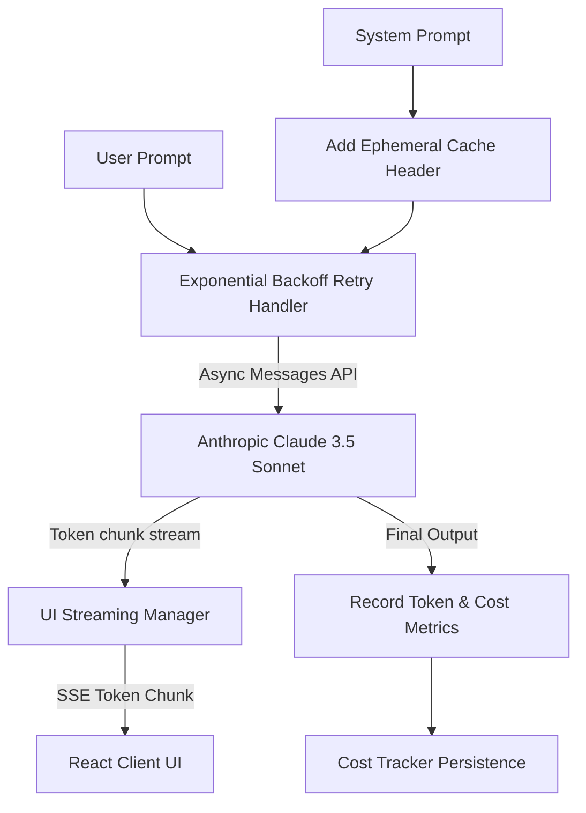

# 06 - Claude Integration

This document analyzes the integration with Anthropic's Claude API via the `ClaudeService`, reviewing the service configurations, exponential backoff retries, cost tracking metrics, token streaming, and prompt caching.

---

## Claude Service Architecture

The `ClaudeService` (defined in `app/services/claude_service.py`) encapsulates all interactions with Anthropic's Async SDK. It provides two execution modes:

1.  **Task-Specific Analysis (`analyze_repo_with_telemetry`)**: A streaming request with low temperature (`0.2`) and strict JSON output formatting guidelines. It yields real-time token events to the frontend and returns full text along with usage telemetry.
2.  **Conversational Chat Streaming (`stream_chat`)**: A token-by-token server-sent event generator with moderate temperature (`0.7`) and markdown formatting guidelines.



---

## Model and API Configurations

*   **SDK Client**: Instantiated using the asynchronous Anthropic SDK `AsyncAnthropic(api_key=settings.anthropic_api_key)`.
*   **Model Parameter**: Loaded dynamically from `settings.claude_model`. Defaults to `claude-3-5-sonnet-20241022` (Claude 3.5 Sonnet).
*   **Token Output Limit**: Set to `max_tokens=8192`.
*   **Temperature Setting**:
    *   *Task-Specific Analysis*: `0.2` to reduce creative liberties and force adherence to the JSON schema.
    *   *Chat Streaming*: `0.7` for conversational fluency.

---

## Cost Optimization & Prompt Caching

Repository analysis prompts contain large code samples. To minimize token overhead, `ClaudeService` enables Anthropic's **Prompt Caching** (specifically Ephemeral Prompt Caching) on system prompts:

*   **Configuration**:
    ```python
    system_config = [
        {
            "type": "text",
            "text": system_prompt,
            "cache_control": {"type": "ephemeral"}
        }
    ]
    ```
*   **Functionality**: Reduces input processing costs by up to 90% and decreases execution latency for sequential or concurrent queries with identical system prompts.

---

## Robust Transient Error Handling: Exponential Backoff Retries

To prevent rate limits or temporary network outages from crashing background analysis jobs, the service runs all API calls through `retry_with_exponential_backoff`:

*   **Retry Criteria**: Catches transient codes (HTTP 429, 500, 502, 503, 504) or errors containing `"rate limit"`, `"timeout"`, or `"connection"`.
*   **Backoff Schedule**: Retries up to **5 times** starting with a 1.0 second initial delay, multiplying by a factor of 2.0 on each failure, and adding random jitter to prevent synchronization collisions.
*   **Non-Transient Errors**: Immediately propagates non-transient errors (such as HTTP 400 Bad Request or API key authentication failure) on the first attempt without retrying.

---

## Observability: Cost Tracking and Token Streaming

*   **Token Streaming**: The orchestrator handles LLM invocation in streaming mode. As text chunks arrive, they are dynamically published to the client via `UIStreamingManager().enqueue_ui_event()`, enabling real-time typing displays in the frontend.
*   **Usage Telemetry**: Consumes the `message_start` and `message_delta` events to read the actual input tokens, output tokens, cached tokens, and cache write tokens.
*   **Cost Tracking**: Calls `cost_tracker.record_execution()` or `cost_tracker.record_usage()`. Financial metrics (estimated cost in USD) are calculated and saved under the correlation ID.

---

## AI Agent Consumption Optimization

| Field | Reference Value / Path |
|---|---|
| **Entry Points** | `analyze_repo_with_telemetry` and `stream_chat` in [app/services/claude_service.py](../services/claude_service.py) |
| **Dependencies** | Python: `anthropic`, `app.monitoring.ai_cost_tracker`, `app.monitoring.observability` |
| **Execution Flow** | Task execute ➔ Invokes ClaudeService ➔ Wrap API stream call in backoff handler ➔ Stream chunks to UI ➔ Calculate final tokens/costs on close. |
| **Common Failure Modes** | **API Key Expired** (causes non-transient HTTP 401 error, halts loop), **Concurrency Exhaustion** (causes rate limits, but successfully retries via backoff). |
| **Related Files** | [app/orchestrators/github_analysis_orchestrator.py](../orchestrators/github_analysis_orchestrator.py) |
| **Related Services** | `AiCostTracker` in `app/monitoring/ai_cost_tracker.py` |
| **Related DTOs** | None |
| **Related Database Tables** | `AnalysisExecutions` (stores token counts and USD estimates) |
| **Related Frontend Components** | `DetailedAnalysisModal.tsx` |
