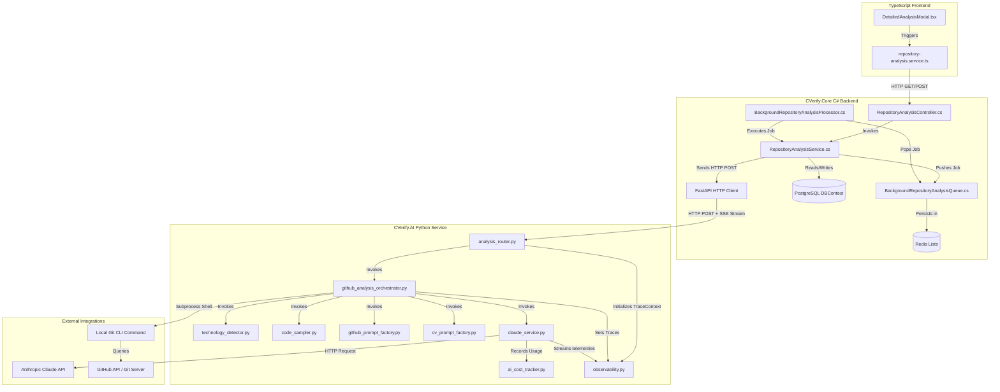
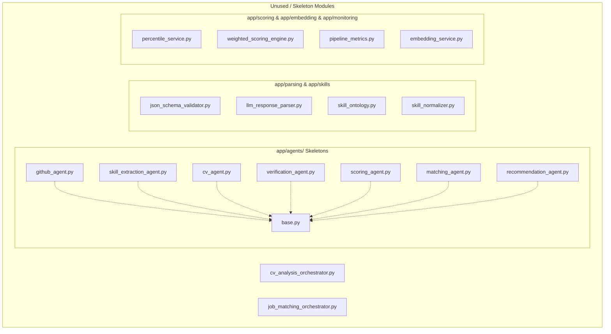

# 12 - Dependency Graph

This document provides a comprehensive map of structural and runtime dependencies across the CVerify platform, distinguishing active production paths from dead code pathways.

---

## Active Pipeline Dependency Map

The diagram below details the active execution chain starting from the frontend trigger down to external database persistence and the Anthropic Claude API.

---

## Inactive and Dead Dependency Chains

The codebase contains several modules, folder blocks, and files that are completely decoupled from runtime execution. The diagram below illustrates these dead-end dependency nodes:

---

## AI Agent Consumption Optimization

| Field | Reference Value / Path |
|---|---|
| **Entry Points** | None (dependency directory mapping) |
| **Dependencies** | Core C# Backend, Python FastAPI Backend, Postgres SQL, Redis Server |
| **Execution Flow** | Component structural relationships mapped in visual flowcharts. |
| **Common Failure Modes** | Broken architecture boundaries (e.g. attempting to import `app.agents` inside orchestrators, which would import skeleton classes). |
| **Related Files** | [app/main.py](../main.py), `RepositoryAnalysisService.cs` |
| **Related Services** | [ClaudeService](../services/claude_service.py), `BackgroundRepositoryAnalysisProcessor` |
| **Related DTOs** | None |
| **Related Database Tables** | `AnalysisJobs`, `AnalysisReports` |
| **Related Frontend Components** | `DetailedAnalysisModal.tsx` |
