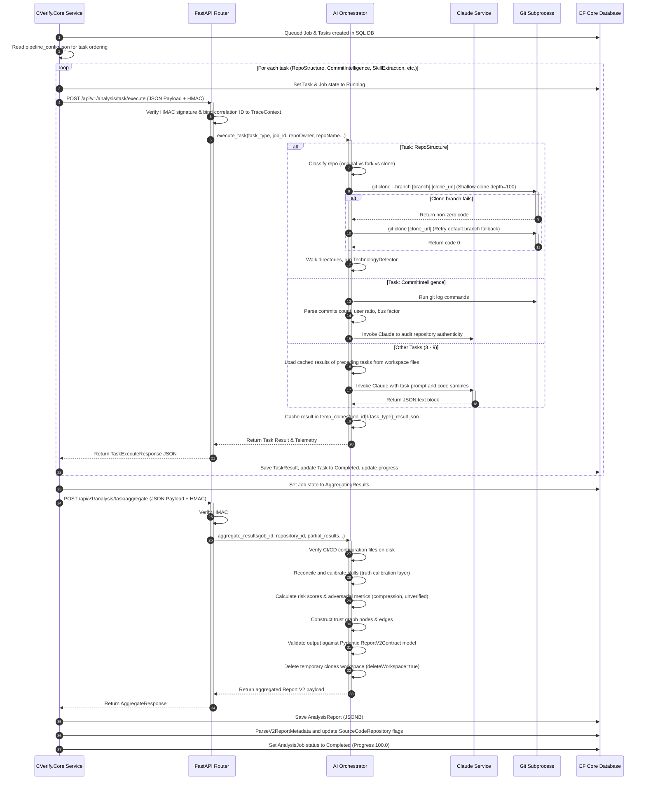

# 16 - AI Analysis Workflow

This document traces the workflow of the repository intelligence pipeline, from the C# backend task execution loop through the Python FastAPI microservice to Claude and back.

---

## Detailed Sequence Diagram

The following diagram maps the exact step-by-step execution flow of the discrete task execution pipeline:

---

## Error and Cancellation Pathways

### 1. User/Timeout Cancellation
*   **Trigger**: The user cancels the job, or execution exceeds the 10-minute timeout.
*   **Workflow**:
    1.  C# `RepositoryAnalysisService` cancels the HTTP client cancellation token.
    2.  Catches `OperationCanceledException` in `ExecuteAnalysisJobAsync`.
    3.  If the job is not already `Cancelled` (user-triggered), updates status in database to `TimedOut` and records error.
    4.  Publishes progress event to Redis Pub/Sub to close any active frontend SSE progress connections.

### 2. Git Clone Fallback Path
*   **Trigger**: Subprocess clone of the designated branch fails (due to branch renaming or removal).
*   **Workflow**:
    1.  Python microservice catches `subprocess.run` clone failure.
    2.  Deletes failed directory via `shutil.rmtree(clone_dir, ignore_errors=True)`.
    3.  Attempts second `subprocess.run` cloning only the repository root *without* branch tags (remote falls back to its default branch).
    4.  If fallback fails, raises a generic Exception to halt the task.

### 3. CV Synthesis Self-Correction Retry
*   **Trigger**: Claude returns an unparseable JSON format, or Pydantic validation fails during CV Synthesis.
*   **Workflow**:
    1.  Orchestrator catches validation error.
    2.  If it is attempt 1, appends the validation error trace to the user prompt and invokes Claude again for self-correction (attempt 2).
    3.  If attempt 2 also fails, it triggers the deterministic fallback builder to prevent pipeline crashes.

---

## AI Agent Consumption Optimization

| Field | Reference Value / Path |
|---|---|
| **Entry Points** | `/api/v1/analysis/task/execute` and `/api/v1/analysis/task/aggregate` in [app/routes/analysis_router.py](../routes/analysis_router.py) |
| **Dependencies** | Python: `fastapi`, `anthropic`, `redis`, `subprocess`. C#: `HttpClient`, `EF Core`, `StackExchange.Redis`. |
| **Execution Flow** | Orchestrated sequence detailed in sequence diagram. |
| **Common Failure Modes** | Invalid HMAC headers, Claude API rate limits, Pydantic validation failures. |
| **Related Files** | [app/orchestrators/github_analysis_orchestrator.py](../orchestrators/github_analysis_orchestrator.py), `RepositoryAnalysisService.cs` |
| **Related Services** | [ClaudeService](../services/claude_service.py) |
| **Related DTOs** | `TaskExecutionRequest`, `AggregationRequest`, `TaskExecuteResponse` |
| **Related Database Tables** | `AnalysisJobs`, `AnalysisTasks`, `AnalysisTaskResults`, `AnalysisReports` |
| **Related Frontend Components** | `DetailedAnalysisModal.tsx` |
