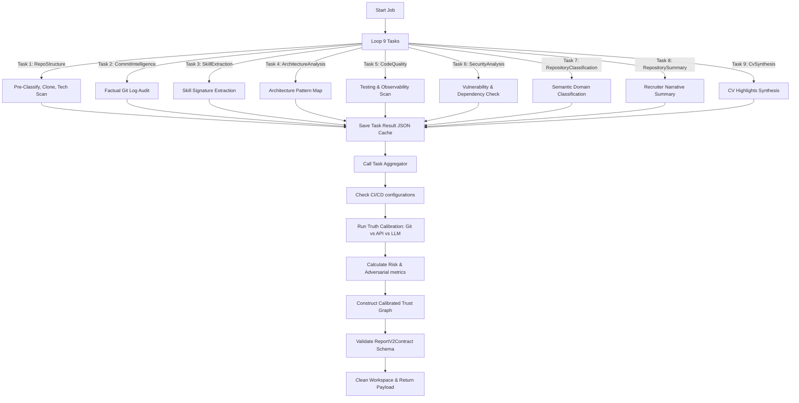

# Pipeline Catalog

This catalog documents the step-by-step pipeline execution for the CVerify Repository Intelligence Engine.

## Repository Analysis Pipeline Steps

## Step Details

### 1. Task Execute Loop
The C# Core Background Worker sequentially triggers the 9 tasks by calling `/api/v1/analysis/task/execute` on CVerify.AI.
* **Module**: `RepositoryAnalysisService.cs` (C#)

### 2. Workspace JSON Caching
Each execution task processes its designated code samples, Git logs, or preceding outputs, and saves its JSON result under `temp_clones/{job_id}/{task_type}_result.json`.
* **Module**: [github_analysis_orchestrator.py](../../app/orchestrators/github_analysis_orchestrator.py)

### 3. Truth Calibration Aggregator
Called via `/api/v1/analysis/task/aggregate` at the end of the execution loop. It merges cached results, verifies physical CI/CD configs on disk, runs risk scores (6 dimensions), calculates adversarial risk (timestamp compression, unverified commits, variance, sampling bias, uncalibrated email accounts), compiles the trust graph nodes/edges, and enforces `ReportV2Contract` validation.
* **Module**: [github_analysis_orchestrator.py](../../app/orchestrators/github_analysis_orchestrator.py)

## Traceability Links

* [Repository Analysis Pipeline](./07-repository-analysis-pipeline.md)
* [Analysis Pipeline Playbook](./15-analysis-pipeline-playbook.md)
