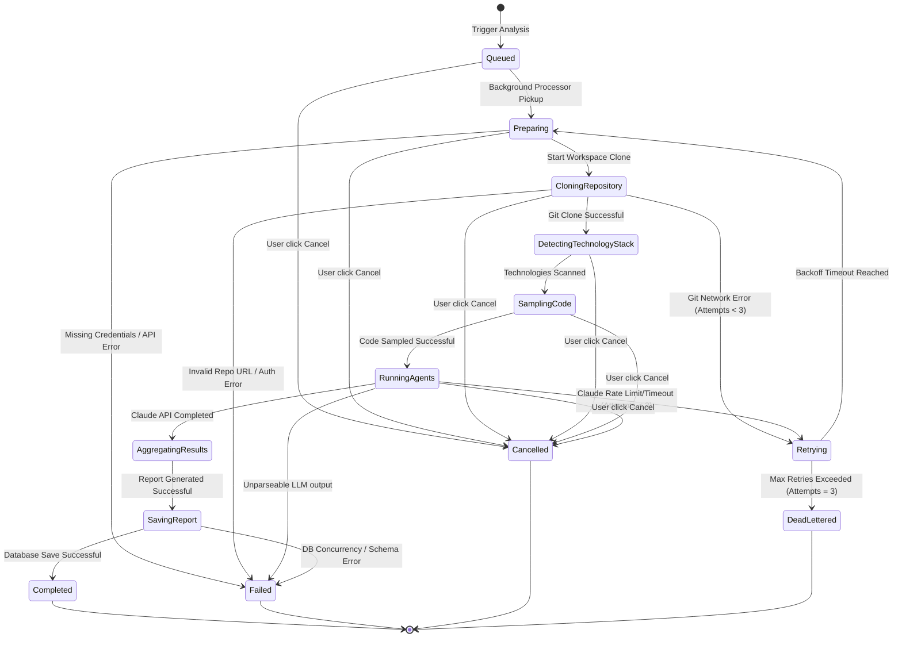

# State Machine Catalog

This catalog documents the lifecycle states, operational transition rules, and error recovery states of the CVerify Repository Analysis Engine.

## State Transition Map

## State Definitions

| State | Progress (%) | Description | Next Allowed States |
|---|---|---|---|
| **`Queued`** | 0.0% | Job record created in Postgres database, enqueued to Redis list. | `Preparing`, `Cancelled` |
| **`Preparing`** | 10.0% | Job popped by background worker; credentials resolved and decrypted. | `CloningRepository`, `Failed`, `Cancelled` |
| **`CloningRepository`** | 20.0% | Local shallow clone started by the Python microservice. | `DetectingTechnologyStack`, `Retrying`, `Failed`, `Cancelled` |
| **`DetectingTechnologyStack`** | 40.0% | Analyzing directory structure and manifests. | `SamplingCode`, `Failed`, `Cancelled` |
| **`SamplingCode`** | 60.0% | Truncating and loading up to 10 codebase files. | `RunningAgents`, `Failed`, `Cancelled` |
| **`RunningAgents`** | 80.0% | Invocations dispatched to Anthropic's API. | `AggregatingResults`, `Retrying`, `Failed`, `Cancelled` |
| **`Retrying`** | - | Transient failure recovery state. Applies backoff time sleep. | `Preparing`, `DeadLettered` |
| **`AggregatingResults`** | 90.0% | Validating schema and verifying evidence paths. | `SavingReport`, `Failed` |
| **`SavingReport`** | 95.0% | Committing JSON report to PostgreSQL database. | `Completed`, `Failed` |
| **`Completed`** | 100.0% | Job finished successfully. Score mapped to DB. | None |
| **`Failed`** | - | Permanent terminal error encountered. | None |
| **`Cancelled`** | - | Manually aborted by user or system administrator. | None |
| **`DeadLettered`** | - | Job failed maximum retry attempts. Excluded from queue. | None |

## Traceability Links

* [Request Lifecycle](./02-request-lifecycle.md)
* [Analysis Pipeline Playbook](./15-analysis-pipeline-playbook.md)
* [AI Analysis Workflow](./16-ai-analysis-workflow.md)
