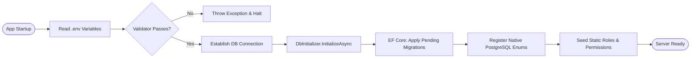

# CVerify Backend Server Layer

Welcome to the **CVerify AI Backend Server Layer**. This is a highly resilient, enterprise-grade REST API built using the modern **.NET 10.0** ecosystem. The application follows a rigorous Clean Architecture pattern, prioritizing a decoupled design, fast fail-safe validation, explicit database naming conventions, cost-optimized caching strategies, and secure session management.

---

## 🛠️ Technology Stack

The backend is built utilizing a high-performance, industry-standard stack designed for low latency, secure data transport, and optimal AI orchestration:

*   **Runtime & Framework**: [ASP.NET Core v10](https://learn.microsoft.com/en-us/aspnet/core/) — High-performance RESTful APIs.
*   **Database Engine**: [PostgreSQL >= 15.x](https://www.postgresql.org/) — Served as the absolute source of truth.
*   **ORM Layer**: [Entity Framework Core (EF Core) v10](https://learn.microsoft.com/en-us/ef/core/) — Utilizing snake_case naming conventions, custom converters, and PostgreSQL native enum mappings.
*   **Distributed Caching**: [Redis v6.x / v7.x](https://redis.io/) — Used for distributed sessions, caching external API responses, and rate limiters.
*   **AI Engine Integration**: [Claude API (Anthropic)](https://www.anthropic.com/claude) — Integrates **Claude Sonnet 4.6** (`claude-sonnet-4-6`) for complex AI travel planning and **Claude Haiku 4.5** for validation, recommendations, and lightweight parsing tasks.
*   **Email Transports**: [MailKit (SMTP)](https://github.com/jstedfast/MailKit) & [SendGrid](https://sendgrid.com/) — Multi-channel failover system utilizing the Outbox pattern.
*   **Telemetry**: Custom Diagnostics (`AuthMetrics`, `EmailProviderHealthCheck`) and [ASP.NET Core Health Checks](https://learn.microsoft.com/en-us/aspnet/core/host-and-deploy/health-checks).

---

## 🏛️ Clean Architecture Design Blueprint

The backend project structure is organized into decoupled layers, enforcing a strict dependency rule (outer layers depend inward, and the core domain depends on nothing):

```
CVerify.Core/
├── API/                    # Presentation Layer (REST Controllers, Middlewares, Extensions)
│   ├── Controllers/        # HTTP Handlers (AuthController, SystemController, EmailTestController)
│   ├── Extensions/         # Startup config helpers (Authorization, Email, Middlewares)
│   └── Middlewares/        # Custom HTTP pipelines (SecurityHeadersMiddleware, GlobalExceptionHandler)
├── Application/            # Business Logic & Usecases Layer
│   ├── DTOs/               # Input/Output Data Transfer Objects
│   ├── Exceptions/         # Domain-specific custom exceptions (e.g. ConflictException)
│   ├── Interfaces/         # Interface abstractions (Services, Repositories, Caching)
│   └── Services/           # Core use-case implementations (AuthService, AccountService)
├── Core/                   # Domain Core Layer (No external dependencies)
│   └── Entities/           # Database Domain entities, Value Objects, and Enums
├── Infrastructure/         # Adapter Infrastructure Layer (Data persistence, External services)
│   ├── Configuration/      # Env configs and Fail-Fast Environment validators
│   ├── Diagnostics/        # AuthMetrics counters and third-party API HealthChecks
│   ├── EmailTemplates/     # Pre-compiled HTML layout resources for verification & resets
│   ├── Persistence/        # EF Core DbContext, DB seeds, and Identity repositories
│   └── Services/           # Adapters (BackgroundQueue, Cache, Token, MailKit, SendGrid)
├── tests/                  # Robust automated testing suites
│   ├── CVerify.API.Benchmarks/       # High-performance code path bench markers
│   ├── CVerify.API.IntegrationTests/ # End-to-End API test executions
│   ├── CVerify.API.PerformanceTests/ # Stress and concurrent load tests
│   └── CVerify.API.UnitTests/        # Isolated mock service test suites
├── Program.cs              # Global Application Bootstrapper & Dependency Injection Container
├── appsettings.json        # Static base configurations
└── CVerify.sln           # Multi-project solution configuration file
```

---

## ⚙️ Environment Variables

The backend relies on the environment configurations specified in the `.env` file at root. The `EnvValidator` validates all environment settings at application startup, enforcing a **Fail-Fast** rule (the server will refuse to run if key variables are missing or incorrectly typed).

### Configuration Schema Reference

| Environment Key | Required | Default | Purpose / Details |
| :--- | :--- | :--- | :--- |
| **`DB_HOST`** | Yes | `localhost` | Hostname of the PostgreSQL instance. |
| **`DB_PORT`** | Yes | `5432` | Port of the PostgreSQL instance. |
| **`DB_NAME`** | Yes | `cverify_db` | Name of the primary database. |
| **`DB_USER`** | Yes | `postgres` | Database admin or app username. |
| **`DB_PASSWORD`** | Yes | — | Password for the database user. |
| **`REDIS_HOST`** | Yes | `localhost` | Hostname of the Redis server. |
| **`REDIS_PORT`** | Yes | `6379` | Port of the Redis server. |
| **`REDIS_PASSWORD`**| No | — | Password for the Redis server. |
| **`JWT_KEY`** | Yes | — | Secret signature key (HS256 requires `>= 32` characters). |
| **`PORT`** | No | `5247` | Port for the ASP.NET Core web host. |
| **`EMAIL_SENDER_EMAIL`**| Yes| `dev@cverify.ai` | Sender address shown in system emails. |
| **`SMTP_HOST`** | No | `localhost` | SMTP host for MailKit failover email transport. |
| **`SMTP_PORT`** | No | `587` | SMTP port for MailKit failover email transport. |
| **`SMTP_USERNAME`** | No | — | Username credentials for the SMTP mail host. |
| **`SMTP_PASSWORD`** | No | — | Password credentials for the SMTP mail host. |
| **`SENDGRID_API_KEY`**| No | — | API key for the SendGrid primary HTTP email service. |
| **`GOOGLE_CLIENT_ID`**| Yes | — | Client ID used to verify Google SSO ID tokens. |

---

## 🗄️ Database Setup & Migrations

The database is built on **PostgreSQL** using **EF Core**. The application applies migrations automatically on startup, so manually executing migration scripts during local onboarding is not required.

### Database Initialization Flow



### Manual Command-Line Migrations (EF CLI)

If you need to make schema changes or manage migrations manually, use the following [.NET Entity Framework Core Tools](https://learn.microsoft.com/en-us/ef/core/cli/dotnet) commands:

*   **Prerequisite**: Install the EF Core Global tool:
    ```bash
    dotnet tool install --global dotnet-ef
    ```
*   **Add a new migration**:
    ```bash
    dotnet ef migrations add NameOfYourMigration --project CVerify.API.csproj
    ```
*   **Manually apply migrations to database**:
    ```bash
    dotnet ef database update --project CVerify.API.csproj
    ```

---

## 🔒 Security Architecture: Authentication & Gating

CVerify uses a highly secure, stateless token authentication architecture utilizing dual HttpOnly cookies and IP-partitioned rate limiting filters.

### 1. Dual Cookie Authentication Mechanism

Upon successful login or Google OAuth token exchange:
*   **Access Token**: Issued as a JWT with a **15-minute** lifespan. Contains standard claims (User ID, Email) and custom authorization parameters (`isEmailVerified`, roles, permission sets). Written into a `Secure`, `HttpOnly`, `SameSite=Lax` cookie named `access_token`.
*   **Refresh Token**: Issued with a cryptographically secure value and a **7-day** lifespan. Recorded in the PostgreSQL database. Written to an `HttpOnly`, `Secure`, `SameSite=Strict` cookie named `refresh_token`.
*   **Cookie Extraction**: The backend automatically extracts tokens from HttpOnly cookies via a custom authentication handler, removing the need for the frontend to manage cookies manually.

### 2. IP-Partitioned Rate Limiting

The application registers strict IP-partitioned fixed-window limiters under `Program.cs` to prevent brute force and resource exhaustion attacks:

```csharp
builder.Services.AddRateLimiter(options => {
    options.RejectionStatusCode = StatusCodes.Status429TooManyRequests;
    // - ForgotPasswordLimit: Allows 3 recovery attempts per 15 minutes.
    // - ResetPasswordLimit: Allows 5 password changes per 15 minutes.
    // - ResendVerificationLimit: Allows 3 emails per 10 minutes.
    // - VerifyEmailLimit: Allows 5 confirmation requests per 10 minutes.
    // - RegisterLimit: Allows 5 user sign-ups per 15 minutes.
});
```

---

## 📧 Resilient Email Transport (Outbox Pattern)

To guarantee email delivery even during network failures, CVerify separates database transactions from actual network tasks:

1.  **Outbox Table Storage**: When a user registers or triggers a password reset, a record is added to the `outbox_messages` table within the same transaction.
2.  **Hosted Background Processor**: The `EmailOutboxBackgroundProcessor` hosted service scans the database outbox table at periodic intervals.
3.  **Primary SendGrid API**: Emails are sent using the primary SendGrid HTTP API client.
4.  **MailKit SMTP Failover**: If the SendGrid API fails or returns a status error, the `FailoverEmailSender` automatically switches to the SMTP provider utilizing MailKit.
5.  **Audit Logs**: Delivery success or failure metrics are written to the database.

---

## 🔍 API Telemetry & OpenAPI Sandbox

In **Development** mode, the backend exposes comprehensive API documentation via Microsoft's custom OpenApi library and Swagger UI:

*   **Swagger Web UI**: `http://localhost:5247/swagger`
*   **OpenAPI Documentation JSON**: `http://localhost:5247/openapi/v1.json`

### Testing Authenticated Endpoints in Swagger

The Swagger UI includes a custom document transformer that configures Bearer Token Authentication directly inside the sandbox:
1.  Navigate to `/swagger`.
2.  Click the **Authorize** button in the top right.
3.  Enter your raw JWT token in the format `Bearer <token>` (or utilize the HttpOnly cookie login which will automatically attach cookies in your browser session).

---

## ⚡ Setup & Local Running

### 1. Restore Dependencies
Navigate to the project root and restore NuGet packages:
```bash
dotnet restore
```

### 2. Run the Application
Start the ASP.NET Core server:
```bash
dotnet run
```
The server will automatically start and bind to `http://localhost:5247`.

### 3. Run Automated Test Suites
Execute all unit and integration tests across the test project:
```bash
dotnet test
```

---

## 🔍 Troubleshooting & Common Issues

### 1. "JWT Key must be at least 32 characters long"
*   **Symptom**: The backend server throws an initialization exception on startup and exits with an error.
*   **Root Cause**: In C#, the symmetric cryptographic security key used to sign HS256 tokens requires a minimum key length of 256 bits (32 bytes).
*   **Solution**: Open `.env` and configure `JWT_KEY` with a string that is 32 characters or longer.

### 2. PostgreSQL Enum Mapping Exception
*   **Symptom**: EF Core throws an exception during DB queries: `42804: column "status" is of type user_status but expression is of type integer`.
*   **Root Cause**: PostgreSQL native enums are stored as string values in database tables, but EF Core maps them as standard integers by default if not configured.
*   **Solution**: Ensure that enums are registered in the `DbContext` constructor via `.MapEnum<UserStatus>("user_status")` and the matching migrations have been successfully synchronized.

### 3. Outbox background queue blocks or email delivery is delayed
*   **Symptom**: Account registration completes successfully, but verification emails are delayed or not sent at all.
*   **Root Cause**: The background worker thread has encountered a database access lock or the network timeout for the primary email sender is set too high.
*   **Solution**: Check `EmailOutboxBackgroundProcessor` logs. Verify that your SMTP and SendGrid credentials are correct. You can also trigger emails directly by hitting the `/api/email-test` endpoint in Swagger.
