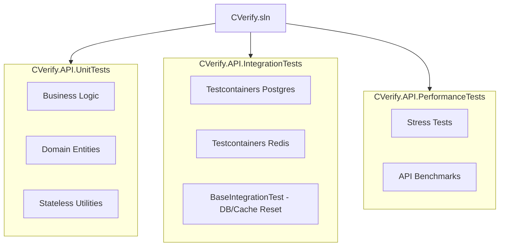

# CVerify Backend Testing Guide

This document describes the testing architecture, database/cache lifecycle management, recent structural fixes, and operational instructions for testing the **CVerify C# ASP.NET Core** backend.

---

## 1. Testing Architecture Overview

The backend testing suite is structured into three discrete layers located under `CVerify.Core/tests`:



### Key Projects
* **`CVerify.API.UnitTests`:** Extremely fast, in-memory, mock-driven tests verifying domain transitions (e.g., status changes), entity behaviors, and stateless application services.
* **`CVerify.API.IntegrationTests`:** Full-pipeline endpoint tests that spin up PostgreSQL and Redis database instances inside lightweight Docker containers to execute end-to-end HTTP requests under real infrastructure environments.
* **`CVerify.API.PerformanceTests`:** Focused tests validating endpoints under intensive loads and ensuring performance metrics remain within specified parameters.

---

## 2. Infrastructure & Testcontainers Lifecycle

The integration tests employ **Testcontainers** (`DotNet.Testcontainers`) to achieve complete state isolation. This ensures database queries and caching mechanisms run against actual Postgres and Redis engines, not fragile mocks or slow in-memory drivers.

### How it Works
1. **Container Startup (`SharedTestcontainerFixture.cs`):** 
   A single PostgreSQL and Redis container instance is launched concurrently. An `ICollectionFixture` manages this instance across all test suites mapped to the `"Shared Containers Collection"`. This avoids the expensive overhead of starting new containers for every single test case.
2. **Schema Initialization:** 
   Upon startup, the Postgres container executes the raw SQL seed script `Initialize SQL.sql` located in `/resources` using ADO.NET (`NpgsqlConnection`) to synchronize the schema.
3. **Database and Cache Reset (`BaseIntegrationTest.cs`):**
   Between every test case run (`InitializeAsync`), the database and cache are wiped clean in milliseconds:
   * **Database:** Wiped using **Respawn** (`Respawner.CreateAsync`), which intelligently cleans tables in the `public` schema in correct dependency order.
   * **Cache:** Wiped using StackExchange.Redis `FlushDatabaseAsync` across all multiplexer endpoints.

---

## 3. Core Testing Lifecycle Fixes

Recently, the integration test suite was refined to fix three critical structural bugs that caused container startup or execution crashes:

### Bug 1: Premature Traversal in Fallback Path Resolution
* **Issue:** The fallback path resolution for `Initialize SQL.sql` traversed directories upward looking for the first `resources` folder. Since `CVerify.Core` contains a `/resources` folder (containing only `permissions-registry.json`), the loop stopped there and threw a `FileNotFoundException` because it never reached the root `CVerify/resources` folder containing `Initialize SQL.sql`.
* **Fix:** Updated the folder traversal conditional from `!Directory.Exists(...)` to `!File.Exists(Path.Combine(..., "Initialize SQL.sql"))`, ensuring the loop only halts when it has located the actual SQL file.

### Bug 2: Redis Connection String Parsing Exception
* **Issue:** Testcontainers returns connection URIs with the `redis://` prefix (e.g., `redis://localhost:59182`). Splitting this on `:` resulted in a malformed port representation (`"//localhost,allowAdmin=true"`), which completely bypassed the Testcontainer's dynamic port allocation and fell back to the default `localhost:6379` local instance. This threw `RedisCommandException` because `allowAdmin` was missing on the local instance.
* **Fix:** Stripped the `redis://` protocol string before executing the split:
  ```csharp
  var redisConnStr = _containerFixture.RedisConnectionString;
  if (redisConnStr.StartsWith("redis://", StringComparison.OrdinalIgnoreCase))
  {
      redisConnStr = redisConnStr.Substring("redis://".Length);
  }
  ```

### Bug 3: Environment Variable Collisions via `.env` Overwrite
* **Issue:** The main backend `.env` loader in `Program.cs` was unconditionally setting variables, thereby overwriting the dynamically assigned Testcontainer variables (`REDIS_HOST`, `REDIS_PORT`, etc.) set by the testing factory constructor.
* **Fix:** Patched the `.env` parser to act as a proper local fallback. It now checks if the environment variable is already set before overriding:
  ```csharp
  if (string.IsNullOrEmpty(Environment.GetEnvironmentVariable(key))) {
      Environment.SetEnvironmentVariable(key, val);
  }
  ```

---

## 4. How to Run Tests

Ensure you have **Docker** running on your local machine before executing integration tests.

Run these commands inside the `CVerify.Core` directory:

### Run All Solution Tests
Runs all unit, integration, and performance tests at once:
```powershell
dotnet test CVerify.sln
```

### Run Unit Tests Only
```powershell
dotnet test tests/CVerify.API.UnitTests/CVerify.API.UnitTests.csproj
```

### Run Integration Tests Only
```powershell
dotnet test tests/CVerify.API.IntegrationTests/CVerify.API.IntegrationTests.csproj
```

### Run Specific Test Suites or Test Cases
Use the `--filter` argument to specify target tests:
```powershell
# Run a specific class of tests
dotnet test CVerify.sln --filter "FullyQualifiedName~VerifyEmailFlowTests"

# Run a specific individual test
dotnet test CVerify.sln --filter "FullyQualifiedName=CVerify.API.IntegrationTests.Auth.VerifyEmailFlowTests.Verify_With_Valid_Token_Should_Activate_User"
```

---

## 5. Best Practices for Writing New Tests

When writing new tests for the CVerify backend, follow these conventions:

1. **Inheritance for Integration Tests:**
   Ensure every database-backed or cache-backed integration test class inherits from `BaseIntegrationTest` and passes down the `SharedTestcontainerFixture`:
   ```csharp
   [Collection("Shared Containers Collection")]
   public class MyNewIntegrationTests : BaseIntegrationTest
   {
       public MyNewIntegrationTests(SharedTestcontainerFixture fixture) : base(fixture)
       {
       }

       [Fact]
       public async Task MyTest_ShouldBehavior_WhenCondition()
       {
           // Act
           var response = await Client.GetAsync("/health");
           
           // Assert
           Assert.True(response.IsSuccessStatusCode);
       }
   }
   ```
2. **Avoid `ConfigureAwait(false)` in Test Cases:**
   In xUnit test methods, omit `.ConfigureAwait(false)` to prevent bypasses in framework parallelization limits. Standard ASP.NET Core libraries can use it, but test assertions should keep the default synchronization context.
3. **Wiping State Clean:**
   Always let the `BaseIntegrationTest` handle database and cache resets between test cases. Avoid manual schema migrations or direct database truncates inside your test methods.
