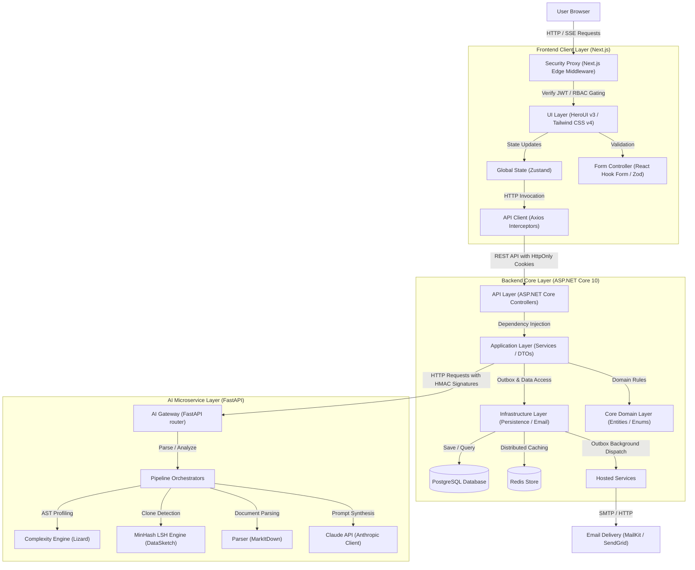

# CVerify - Developer Source Code Verification and Trust Intelligence Platform

Welcome to **CVerify**, an enterprise-grade developer source code verification and trust intelligence platform. CVerify leverages large language models and static analysis to analyze candidate code repositories, evaluate developer contributions, detect plagiarism or AI-generated segments, and synthesize verified CV profiles. 

It features a responsive React/Next.js frontend client, a resilient ASP.NET Core backend gateway, and a dedicated FastAPI AI microservice.

This repository is structured as a monorepo containing:
* **Frontend Client Layer (`/client`)**: Next.js 16 (App Router), React 19, HeroUI v3, Tailwind CSS v4, and Zustand. Employs a strict feature-driven folder structure.
* **Backend Server Layer (`/CVerify.Core`)**: ASP.NET Core v10, PostgreSQL, Entity Framework Core, Redis, and a custom email failover infrastructure. Follows Clean Architecture design principles.
* **AI Microservice Layer (`/CVerify.AI`)**: Python 3.11, FastAPI, Lizard AST complexity analyzer, DataSketch MinHash LSH clone-detector, MarkItDown, and the Anthropic Claude API.

---

## Architecture Blueprint

CVerify uses a decoupled architecture with strict separation of concerns, ensuring scalability, security, and developer efficiency.



---

## 🐋 Dockerized Development Setup (Recommended)

CVerify provides a fully containerized, production-ready, and hardened Docker infrastructure. 

### Key Docker Hardening Features
* **Docker Network Segmentation**: Microservices are divided into isolated virtual bridge networks (`cverify-frontend-net`, `cverify-backend-net`, `cverify-infra-net`). The Next.js frontend has zero network access to the Postgres database or Redis cache.
* **Non-Root Execution**: Every container executes under dedicated, unprivileged system users (`nodejs`, `appuser`, `app`, `postgres`, `redis`) to prevent container-escape vulnerabilities.
* **Redis Security Hardening**: Authentication is enabled with a password (`123123` by default) and the network port is bound to the loopback interface (`127.0.0.1:6379`) to prevent external exposure.
* **Resource Limits & Logs**: Strict CPU limits, memory allocations, ulimits, and automatic log rotation (limiting logs to a maximum of 10MB per file, max 5 files) are configured for all services.
* **BuildKit Caching & Standalone Builds**: Client image sizes are optimized using Next.js standalone output (reducing size by ~90%), and package installations are accelerated via Docker BuildKit caching.

---

### 1. One-Click Bootstrap Start

You can spawn the entire system in a single step. The bootstrapper scripts automatically copy `.env.example` to `.env` and generate cryptographically secure credentials for database, cache, JWT, and HMAC communications.

#### Windows (PowerShell)
```powershell
powershell -File ./setup.ps1
```

#### Unix / macOS
```bash
chmod +x ./setup.sh
./setup.sh
```

---

### 2. Docker Compose Command Reference

Once bootstrapped, manage your containerized stack using standard Docker Compose commands from the repository root:

#### Checking Service Status and Health
To view all running services, their mapped ports, and health statuses:
```bash
docker compose ps
```

#### Viewing Logs
To stream real-time logs from all services:
```bash
docker compose logs -f
```
Or for a specific service (e.g., the Next.js Client or ASP.NET Backend):
```bash
docker compose logs -f cverify-client
docker compose logs -f cverify-core
```

#### Rebuilding and Restarting a Specific Service
If you make changes to a subproject code (e.g., client or backend code) and need to recompile:
```bash
docker compose up --build -d cverify-client
docker compose up --build -d cverify-core
```

#### Stopping and Tearing Down Containers
To stop and remove all containers, networks, and internal configurations:
```bash
docker compose down
```
To also delete the Postgres database volume (WARNING: this resets database data):
```bash
docker compose down -v
```

#### Accessing Container Shells
To enter a container shell for debugging or inspection:
```bash
# Enter Next.js client container
docker compose exec cverify-client sh

# Enter ASP.NET Core backend container
docker compose exec cverify-core sh

# Enter FastAPI AI container
docker compose exec cverify-ai sh

# Enter Redis database CLI
docker compose exec redis redis-cli -a 123123
```

---

## 💻 Monorepo Setup Guide (Host-Only Fallback)

If you prefer to run all three services directly on your host operating system rather than inside Docker, follow this fallback guide.

### Prerequisites

Ensure you have the following software installed:

| Technology | Minimum Version | Purpose |
| :--- | :--- | :--- |
| **Node.js** | >= 18.x | Frontend Web runtime environment |
| **.NET SDK** | 10.0.x | Backend core API gateway runtime |
| **Python** | 3.11.x | AI microservice runtime environment |
| **Docker Desktop** | Latest | Runs Postgres database and Redis caching engines |
| **Tesseract OCR** | Latest | OCR fallback engine for certificate image parsing |

### Step-by-Step Installation

#### Step 1: Start Infrastructure Containers
Ensure Docker is running, then start only the PostgreSQL and Redis containers from the repository root:
```bash
docker compose up -d postgres redis
```
This starts:
* PostgreSQL on host port `5433` (as configured in the root `.env`)
* Redis on host port `6379`

Create an empty database named `cverify_db_dev` inside PostgreSQL using your database management tool or the psql CLI:
```sql
CREATE DATABASE cverify_db_dev;
```

#### Step 2: Configure and Run the Backend (.NET Core)
1. Navigate to the backend directory:
   ```bash
   cd CVerify.Core
   ```
2. Copy the environment configuration template:
   ```bash
   cp .env.example .env
   ```
3. Open `.env` and set the required variables, particularly `DB_PASSWORD` (database password) and `JWT_KEY` (secret key, must be 32+ characters):
   ```env
   DB_PASSWORD=123123
   JWT_KEY=DbqDgBM1u2H5lNnUFBgYrRaotpSP9Wda8jASgjIbFh6
   TOKEN_ENCRYPTION_KEY=h7X8k2P9q4W1v5Z0y3N6s9B2m5C8x1R4
   AI_SERVICE_SHARED_SECRET=6G5GvVeN165jXi1JhlOyTT3Kb9Lj2oKOauRoYq5Nmh1
   ```
4. Restore NuGet packages and run the server:
   ```bash
   dotnet restore
   dotnet run
   ```
   *Note: Database migrations apply automatically on application startup.*

#### Step 3: Configure and Run the AI Microservice (Python)
1. Open a new terminal and navigate to the AI service directory:
   ```bash
   cd CVerify.AI
   ```
2. Create a virtual environment:
   ```bash
   python -m venv .venv
   ```
3. Activate the virtual environment:
   * **Windows (PowerShell)**: `.venv\Scripts\Activate.ps1`
   * **Unix / macOS**: `source .venv/bin/activate`
4. Install python packages:
   ```bash
   pip install -r requirements.txt
   ```
5. Copy the environment configuration template:
   ```bash
   cp .env.example .env
   ```
6. Open `.env` and set the variables, ensuring the `SHARED_SECRET` matches `AI_SERVICE_SHARED_SECRET` in the backend:
   ```env
   ANTHROPIC_API_KEY=sk-ant-api03-...
   SHARED_SECRET=6G5GvVeN165jXi1JhlOyTT3Kb9Lj2oKOauRoYq5Nmh1
   ```
7. Start the Uvicorn dev server:
   ```bash
   uvicorn app.main:app --reload
   ```

#### Step 4: Configure and Run the Frontend Client (Next.js)
1. Open a new terminal and navigate to the client directory:
   ```bash
   cd client
   ```
2. Copy the environment configuration template:
   ```bash
   cp .env.example .env.local
   ```
3. Open `.env.local` and set the variables, ensuring `JWT_SECRET` matches `JWT_KEY` in the backend `.env`:
   ```env
   NEXT_PUBLIC_API_URL=http://localhost:5247/api
   JWT_SECRET=DbqDgBM1u2H5lNnUFBgYrRaotpSP9Wda8jASgjIbFh6
   NEXT_PUBLIC_GOOGLE_CLIENT_ID=657343963077-fibbjib6vbr94654q2qnuqi58nim483u.apps.googleusercontent.com
   ```
4. Install npm packages:
   ```bash
   npm install
   ```
5. Start the development server with Turbopack support:
   ```bash
   npm run dev
   ```

---

## System Ports and URLs

When running inside Docker, system components bind to the following host configurations:

| Component | Host URL / Address | Description | Mapped Container Port |
| :--- | :--- | :--- | :--- |
| **Next.js Client Portal** | [http://localhost:3000](http://localhost:3000) | Frontend User Web Interface | `3000` |
| **ASP.NET Core API Gateway** | [http://localhost:5247](http://localhost:5247) | Core REST API Endpoint | `5000` |
| **OpenAPI Swagger Sandbox** | [http://localhost:5247/swagger](http://localhost:5247/swagger) | API Documentation Sandbox | `5000/swagger` |
| **FastAPI AI Microservice** | [http://localhost:8000](http://localhost:8000) | AI Processing Endpoint | `8000` |
| **PostgreSQL Database** | `localhost:5433` | Primary Transactional Store | `5432` |
| **Redis Cache Server** | `localhost:6379` | State and Cache Store | `6379` (with auth) |

---

## Integration Verification Checklist

To confirm the full monorepo stack is running and integrated, perform the following validation checks:

1. **API Health Endpoint**: Navigate to `http://localhost:5247/health`. You should receive a status code `200` with JSON health statistics proving DB and Redis caches are reachable.
2. **System Status Endpoint**: Navigate to `http://localhost:5247/api/system/status`. This returns current server telemetry.
3. **Swagger Documentation**: Visit `http://localhost:5247/swagger` to inspect endpoints.
4. **AI Service Documentation**: Visit `http://localhost:8000/docs` to verify the FastAPI routing layer is running.
5. **User Registration**: Navigate to `http://localhost:3000/register`. Register a new account. The registration should write data to PostgreSQL, trigger an outbox email log, and redirect to the email verification page.
6. **Multi-Tab Session Sync**: Log in to `http://localhost:3000/login` in one tab and open `http://localhost:3000/dashboard` in another tab. Log out in one tab. The second tab should instantly log out and redirect to `/login` via broadcast channel notifications.

---

## Sub-Project Developer Guides

For detailed configurations, technologies, and structures of specific layers:
* **Frontend Client Guide**: [client/README.md](client/README.md) - Details on Next.js Edge routing, Zustand stores, state hydration, and HeroUI integration.
* **Backend Core Server Guide**: [CVerify.Core/README.md](CVerify.Core/README.md) - Clean Architecture details, rate limiting, and EF Core mappings.
* **AI Microservice Guide**: [CVerify.AI/README.md](CVerify.AI/README.md) - FastAPI routes, Lizard AST complexity analyzer, and datasketch clone detection.
