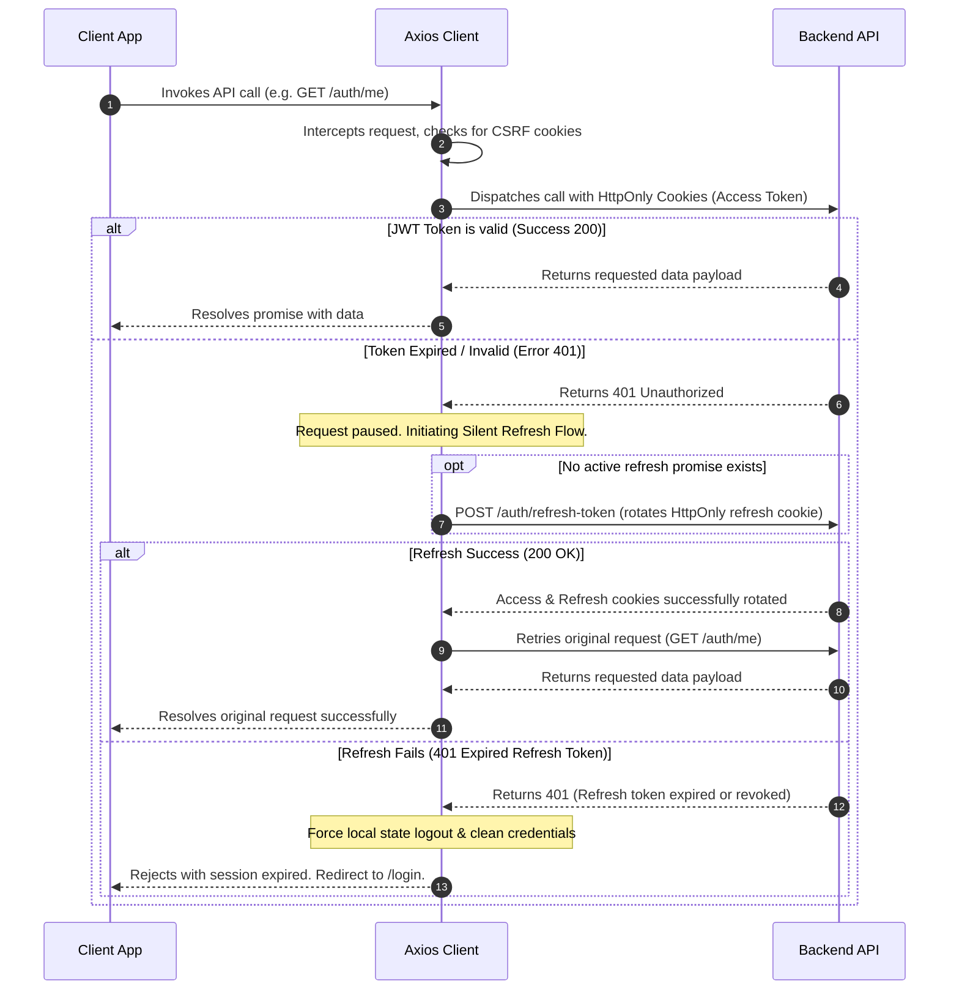

# CVerify Frontend Client Layer

Welcome to the **CVerify AI Client Layer**. This is a state-of-the-art, premium frontend application built with React 19 and Next.js 16 (App Router). The UI features responsive glassmorphic interfaces, smooth animations, dynamic states, and robust edge-level security protections. It serves as the primary verification and evaluation portal for CVerify developers and recruitment partners.

---

## 🛠️ Technology Stack

The client layer is built utilizing a curated, professional technology stack ensuring maximum performance, visual excellence, and secure routing:

*   **Core Engine**: [Next.js 16 (App Router)](https://nextjs.org/) using Server Components for speed, SEO, and optimal bundle size.
*   **UI Library**: [HeroUI v3](https://v3.heroui.com/) — Next-generation React Aria-based components ensuring AAA accessibility, keyboard navigation, and micro-interactions.
*   **Styling Engine**: [Tailwind CSS v4](https://tailwindcss.com/) — Utilizes modern Oklch color formats, instant compilation, and zero-runtime CSS footprint.
*   **State Management**: [Zustand 5.x](https://github.com/pmndrs/zustand) — Lightweight, fast, and robust global state store.
*   **Form Architecture**: [React Hook Form 7.x](https://react-hook-form.com/) combined with [Zod 4.x](https://zod.dev/) for type-safe validation schemas.
*   **API Client**: [Axios 1.x](https://axios-http.com/) — Custom client equipped with interceptors, CSRF token injections, and concurrent silent refresh locks.
*   **JWT Handlers**: [jose 6.x](https://github.com/panva/jose) — Cryptographic JSON Web Token signature verification at the Next.js edge middleware.

---

## 📂 Folder Structure & Architectural Design

The frontend application follows a strict, feature-and-concern directory split within the `/src` folder, enforcing a **Zero-Duplication, Anti-Shared Dumping Ground** policy:

```
client/
├── public/                 # Static assets (images, vectors, logos)
├── src/
│   ├── app/                # Next.js App Router (Layouts, Routing, Styles)
│   │   ├── (auth)/         # Gated authentication routes group
│   │   │   ├── login/      # Sign-in page
│   │   │   ├── register/   # Sign-up page (Developer/Business)
│   │   │   ├── forgot-.../ # Password recovery trigger
│   │   │   ├── reset-p.../ # Secure token-based password reset
│   │   │   └── verify-e.../# Post-registration email verification page
│   │   ├── dashboard/      # Protected dashboards (Admin/Business/User subdirectories)
│   │   ├── system/         # Server telemetry, performance, and diagnostics
│   │   ├── unauthorized/   # Fallback page for role authorization failures
│   │   ├── globals.css     # Global Tailwind CSS and HeroUI variable injection
│   │   ├── layout.tsx      # Main wrapper with typography and theme initializers
│   │   └── providers.tsx   # React context injections (HeroUI, Query, Toast providers)
│   ├── components/         # Core generic UI elements and global controls
│   │   ├── ui/             # Primitive, highly-accessible UI components (OtpInput, Buttons, Cards)
│   │   └── forms/          # Standardized form controller wrappers (FormOtpField, FormInput)
│   ├── features/           # Gated, domain-specific modules with encapsulated logic
│   │   └── auth/           # Complete Authentication domain boundary
│   │       ├── components/ # Auth-specific components (PasswordStrengthMeter, Showcase layouts)
│   │       ├── security/   # Cryptographic / complexity validation logic (PasswordPolicy)
│   │       ├── permissions/# RBAC seed database registry, schema types, and metadata checkers
│   │       ├── services/   # Auth API request wrappers (RecoveryService, TokenHub)
│   │       ├── store/      # Encapsulated auth Zustand slice (useAuthStore)
│   │       └── views/      # Dedicated full-page auth controllers (CompanyVerificationView, ReclaimView)
│   ├── hooks/              # Custom global React hooks (e.g. SSE streaming handlers, useSessionTimeout)
│   ├── lib/                # Technical integrations, constants, and utilities
│   │   ├── api/            # Axios HTTP client, end-to-end endpoints, and telemetry service
│   │   ├── constants/      # Immutable configurations, application route names, cookie keys
│   │   ├── utils/          # Pure helpers (date formatters, token parsers, claims helpers)
│   │   └── validators/     # Zod schemas matched strictly against C# class validations
│   ├── stores/             # Consolidated global Zustand state models (useThemeStore)
│   ├── types/              # Global TypeScript typings and standardized API response contracts (api.types)
│   └── proxy.ts            # Security Proxy - Edge middleware checking cryptographic tokens and claims
├── .env.example            # Baseline environment variables template
├── tsconfig.json           # Type configurations for React 19/TypeScript 5
└── next.config.ts          # Turbopack, React compiler, and static optimizations configuration
```

---

## 🏛️ Codebase Refactoring & Consolidations (Strict Code Policies)

To maintain a clean, maintainable clean-architecture flow and prevent the creation of unorganized dumping grounds:

1.  **Anti-Shared Layer Policy**: The global `src/shared` directory is completely forbidden and deleted. All active utilities, UI components, and domain types have strict owners:
    *   *Core UI Primitives* (e.g. `OtpInput`) live inside `src/components/ui/`.
    *   *Generic Form Wrappers* (e.g. `FormOtpField`) live inside `src/components/forms/`.
    *   *Domain-Specific Logic* (e.g. `PasswordPolicy`, `PasswordStrengthMeter`, and RBAC matrix `permissions`) are fully colocated inside `src/features/auth/`.
    *   *Global Response Contracts* live in `src/types/`.
2.  **Zustand Consolidation**: Redundant hook wrappers (like `hooks/use-theme-store.ts`) are eliminated in favor of a single, centralized global store (`stores/use-theme-store.ts`) to avoid hydration discrepancies or state duplication.
3.  **Strict Path Restrictions**: Path aliases are restricted to the root module mapping (`@/*` to `./src/*`), and legacy `@shared/*` mappings in `tsconfig.json` are permanently deprecated to enforce neat import structures.

---

## 🔐 Environment Variables

The application reads its settings from local environment configurations. Duplicate `.env.example` to create `.env.local` for local execution:

```bash
cp .env.example .env.local
```

### Required Keys & Explanations

| Variable | Sample Value | Description |
| :--- | :--- | :--- |
| **`NEXT_PUBLIC_API_URL`** | `http://localhost:5247/api` | The base URL pointing to the ASP.NET Core backend REST API. Must use the port configured in the backend's `.env`. |
| **`JWT_SECRET`** | `DbqDgBM1u2H5lN...` | **CRITICAL**: The client-side secret key used to verify the integrity of the JWT. **Must exactly match** the `JWT_KEY` in the backend `.env` configuration for cryptographic verification to succeed in the Next.js edge proxy. |
| **`NEXT_PUBLIC_GOOGLE_CLIENT_ID`** | `429618424119-...` | Unique identifier generated in the Google Cloud Console for the SSO authentication flow. |

---

## 🚀 Setup & Running Locally

Ensure all project [Prerequisites](../README.md#prerequisites) are met before starting.

### 1. Installation
Navigate into the client directory and install the required dependencies:
```bash
cd client
npm install
```

### 2. Run Development Server
Boot up the development runtime utilizing Turbopack (Next.js instant-compilation engine):
```bash
npm run dev
```
Open [http://localhost:3000](http://localhost:3000) on your browser.

### 3. Build & Production Run
To run the project in production mode (compiling optimized client bundles, server-side pre-renders, and compiler-optimized React code):
```bash
npm run build
npm run start
```

---

## 📡 API Integration & HTTP Resiliency

All network calls to the backend use a highly resilient, customized Axios wrapper located in [`src/lib/api/axios-client.ts`](src/lib/api/axios-client.ts).



### Key Engineering Features in HTTP Layer

1.  **State-Mutating CSRF Headers**: A request interceptor checks for the CSRF cookie on all `POST`, `PUT`, `DELETE`, and `PATCH` requests, automatically injecting it into the `X-XSRF-TOKEN` header to protect endpoints.
2.  **HttpOnly Cookie Authentication**: The client utilizes `withCredentials: true`. Access and Refresh tokens are completely hidden from the browser's JavaScript scope, protecting them from Cross-Site Scripting (XSS) token theft.
3.  **Atomic Silent Token Rotation**: To prevent duplicate refresh requests under heavy concurrent data loading, a cached `refreshPromise` handles concurrent token refreshes, preventing token invalidation from race conditions.
4.  **C# ProblemDetails Normalization**: C# validation dictionaries (`PascalCase` field names) returned by ASP.NET's `ProblemDetails` are parsed and converted to `camelCase` to map to React Hook Form/Zod client states.

---

## 🔒 Security Proxy & Edge-Gating Route Flow

The client features a Next.js Edge Middleware proxy ([`src/proxy.ts`](src/proxy.ts)) that executes cryptographically at the edge before any page assets are transmitted to the user.

### Routing Gatekeeper Execution Lifecycle

1.  **Cryptographic Edge Decryption**: The proxy extracts the `access_token` cookie and verifies its signature using the `JWT_SECRET` via `jose`.
2.  **Unverified Account Isolation**: If the user is authenticated but their email is unverified (`payload.isEmailVerified === false`), the proxy intercepts their request and forces them to `/verify-email`.
3.  **Access Restriction**: Gated pages are protected based on roles:
    *   `/dashboard/admin/**/*` requires the `ADMIN` role.
    *   `/dashboard/business/**/*` requires `BUSINESS` or `ADMIN` roles.
    *   `/dashboard/user/**/*` requires `USER`, `BUSINESS`, or `ADMIN` roles.
    *   *Note: Claims are normalized to handle both custom JWT payloads and standard .NET ClaimTypes (`http://schemas.microsoft.com/ws/2008/06/identity/claims/role`).*
4.  **Multi-Tab Session Broadcast**: When a user logs in, logs out, or has their session extended, the change is broadcast via a `BroadcastChannel` in the Zustand store ([`src/features/auth/store/use-auth-store.ts`](src/features/auth/store/use-auth-store.ts)). If a user signs out in one tab, **all other open browser tabs immediately terminate their sessions and redirect to `/login`**.

---

## ⚙️ Best Practices & Quality Standards

*   **Fail-Fast UI Validations**: Zod validates all input schemas before requests are dispatched, preventing redundant network overhead from bad payloads.
*   **AAA Accessible Forms**: Built on HeroUI and React Aria, inputs contain ARIA tags, invalid state focus support, and proper screen reader descriptions.
*   **Zero-Token Storage**: No JWT tokens are saved in `localStorage` or `sessionStorage`. All authentication transactions are fully handled by HttpOnly cookies.
*   **No Placeholders Rule**: The UI utilizes pure programmatic assets and pre-compiled vectors.

---

## 🔍 Troubleshooting & Common Issues

### 1. Security Proxy Redirect Loop (Auth Page to Dashboard and back)
*   **Symptom**: Logging in successfully redirects you to `/dashboard`, which immediately redirects you back to `/login`.
*   **Root Cause**: The client-side `JWT_SECRET` in `.env.local` is missing, mismatched, or different from the backend's `JWT_KEY`. Because of this, Next.js Edge cannot cryptographically decrypt the token and flags the request as unauthorized, while the backend accepts it as valid.
*   **Solution**: Ensure `client/.env.local` contains the exact same key as `CVerify.Core/.env`'s `JWT_KEY`.

### 2. CORS Preflight Failures
*   **Symptom**: Console shows `Access-Control-Allow-Origin` errors on API requests.
*   **Root Cause**: The port used in the frontend's API URL does not match the active port of the backend, or the backend has not whitelisted the frontend origin.
*   **Solution**: Check that `NEXT_PUBLIC_API_URL` points to the correct backend port (default: `5247`). Ensure the backend environment configurations include the proper frontend URL (`http://localhost:3000`).

### 3. GSI Logger warning: "Provided button width is invalid"
*   **Symptom**: Google Sign-In SDK prints `[GSI_LOGGER]: Provided button width is invalid: 100%`.
*   **Root Cause**: The Google One-Tap/SSO iframe requires explicit widths or specific parent layout sizes to compute sizes correctly.
*   **Solution**: Wrap the Google Sign-In button container in an element with an explicit pixel width or set the width configuration specifically.

### 4. Hydration Mismatch Errors
*   **Symptom**: Next.js logs `Hydration failed because the initial UI does not match what was rendered on the server`.
*   **Root Cause**: Directly reading states from `window` or `document` (e.g. cookie parsing or local storage) during Server-Side Rendering (SSR).
*   **Solution**: Gate window/document accesses behind `typeof window !== 'undefined'` checks or wrap them in React `useEffect` hooks to ensure client-only execution.
