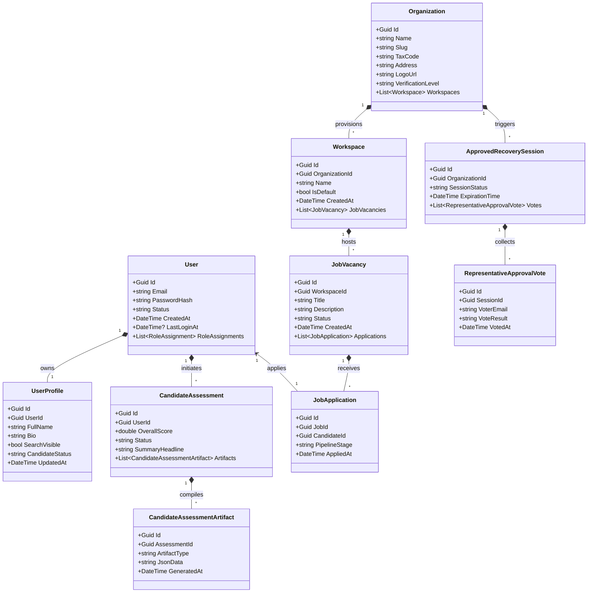
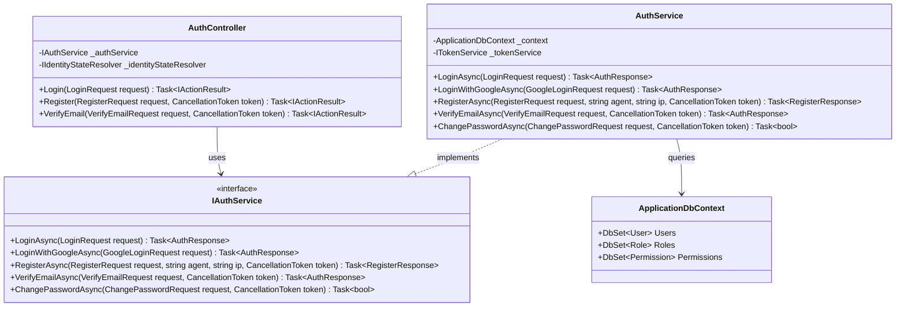
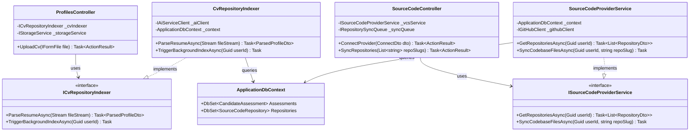
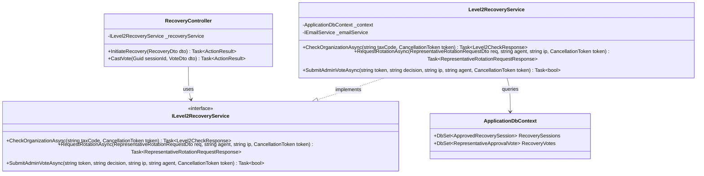

# 3.3 Class Diagrams & Object-Oriented Design

This document details the object-oriented class structure of the CVerify system, mapping core domain entities, services, controllers, and their dependencies on the C4 class level.

---

## 3.3.1 Overview

CVerify's backend engine (`CVerify.Core`) is built using clean architecture principles structured into domain modules. Controllers act as input boundary interfaces (Application layer), delegating business logic execution to scoped domain services (Domain layer), which interact with database entities and models using Entity Framework Core `ApplicationDbContext` configurations (Infrastructure layer).

---

## 3.3.2 Overall Domain Class Diagram

The following diagram illustrates the relationship between key platform domain objects:

---

## 3.3.3 Feature Class Diagrams

### Subsystem 1: Authentication & RBAC

### Subsystem 2: Code Analysis & CV Profiling

### Subsystem 3: Talent Discovery & Matching

```mermaid
classDiagram
    class TalentDiscoveryController {
        -IExplainableMatchService _matchService
        -ICandidateRankingCalculator _rankingCalc
        +GetMatchesForJob(Guid jobId) Task~ActionResult~
        +SearchTalentPool(string query) Task~ActionResult~
    }

    class IExplainableMatchService {
        <<interface>>
        +EvaluateMatchAsync(Guid jobVacancyId, Guid candidateId) Task~MatchingEvaluation~
    }

    class ExplainableMatchService {
        -ApplicationDbContext _context
        -ICandidateEvaluationService _evaluationService
        -IUnifiedMatchingEngine _matchingEngine
        +EvaluateMatchAsync(Guid jobVacancyId, Guid candidateId) Task~MatchingEvaluation~
    }

    class IUnifiedMatchingEngine {
        <<interface>>
        +EvaluateMatchAsync(CandidateCapabilityIntelligence candidate, UnifiedJobRequirement job, CancellationToken token) Task~UnifiedMatchResult~
    }

    class UnifiedMatchingEngine {
        +EvaluateMatchAsync(CandidateCapabilityIntelligence candidate, UnifiedJobRequirement job, CancellationToken token) Task~UnifiedMatchResult~
    }

    class ApplicationDbContext {
        +DbSet~JobVacancy~ JobVacancies
        +DbSet~JobApplication~ JobApplications
        +DbSet~MatchingEvaluation~ MatchingEvaluations
    }

    TalentDiscoveryController --> IExplainableMatchService : uses
    ExplainableMatchService ..|> IExplainableMatchService : implements
    ExplainableMatchService --> IUnifiedMatchingEngine : uses
    UnifiedMatchingEngine ..|> IUnifiedMatchingEngine : implements
    ExplainableMatchService --> ApplicationDbContext : queries
```

### Subsystem 4: Multi-sig Emergency Recovery

---

## 3.3.4 Class Specifications

### 1. AuthService
* **Class Name**: `AuthService`
* **Package**: `CVerify.Core.Modules.Auth.Services`
* **Layer**: Domain Layer
* **Responsibility**: Authenticate users, verify email registration links, and generate cryptographically secure JSON Web Tokens (JWT) for session management.

#### Attributes
| Name | Type | Visibility | Description |
| :--- | :--- | :--- | :--- |
| `_context` | `ApplicationDbContext` | Private | Database context reference used to query accounts. |
| `_tokenService` | `ITokenService` | Private | Handles generation and verification of JWT session and refresh tokens. |

#### Methods
| Method | Return Type | Description |
| :--- | :--- | :--- |
| `LoginAsync(LoginRequest request)` | `Task<AuthResponse?>` | Validates user password hashes and returns active JWT token keys. |
| `RegisterAsync(RegisterRequest request, string agent, string ip, CancellationToken token)` | `Task<RegisterResponse>` | Creates unverified user database records and triggers verification code outbox logs. |
| `VerifyEmailAsync(VerifyEmailRequest request, CancellationToken token)` | `Task<AuthResponse?>` | Validates email confirmation tokens; changes status to `Active` on success. |

#### Relationships
* **Interface**: Implements `IAuthService`.
* **Dependencies**: `ApplicationDbContext`, `ITokenService`.
* **Used By**: `AuthController`.
* **Design Pattern**: Dependency Injection.

---

### 2. ExplainableMatchService
* **Class Name**: `ExplainableMatchService`
* **Package**: `CVerify.Core.Modules.Intelligence.Services`
* **Layer**: Domain Layer
* **Responsibility**: Orchestrates matching pipelines, fetching candidate capability intelligence and delegating matching evaluations to the consolidated engine.

#### Attributes
| Name | Type | Visibility | Description |
| :--- | :--- | :--- | :--- |
| `_context` | `ApplicationDbContext` | Private | EF Core database access. |
| `_evaluationService` | `ICandidateEvaluationService` | Private | Retrieves verified candidate capability intelligence DTOs. |
| `_matchingEngine` | `IUnifiedMatchingEngine` | Private | Consolidated matching calculations engine. |

#### Methods
| Method | Return Type | Description |
| :--- | :--- | :--- |
| `EvaluateMatchAsync(Guid jobVacancyId, Guid candidateId)` | `Task<MatchingEvaluation>` | Fetches data, delegates calculations, and saves matching evaluations to DB. |

#### Relationships
* **Interface**: Implements `IExplainableMatchService`.
* **Dependencies**: `ApplicationDbContext`, `ICandidateEvaluationService`, `IUnifiedMatchingEngine`.
* **Used By**: `TalentDiscoveryController`.
* **Design Pattern**: Strategy Pattern.

---

### 3. Level2RecoveryService
* **Class Name**: `Level2RecoveryService`
* **Package**: `CVerify.Core.Modules.Recovery.Services`
* **Layer**: Domain Layer
* **Responsibility**: Coordinates disaster recovery requests, logs representative votes, and rotates company owner email details if recovery thresholds are met.

#### Attributes
| Name | Type | Visibility | Description |
| :--- | :--- | :--- | :--- |
| `_context` | `ApplicationDbContext` | Private | Database access for multi-sig records. |
| `_emailService` | `IEmailService` | Private | Delivers multi-sig recovery invitation links to representatives. |

#### Methods
| Method | Return Type | Description |
| :--- | :--- | :--- |
| `CheckOrganizationAsync(string taxCode, CancellationToken token)` | `Task<Level2CheckResponse>` | Validates target tax code existence and eligibility. |
| `RequestRotationAsync(RepresentativeRotationRequestDto req, string agent, string ip, CancellationToken token)` | `Task<RepresentativeRotationRequestResponse>` | Creates emergency rotation recovery request queues. |
| `SubmitAdminVoteAsync(string token, string decision, string ip, string agent, CancellationToken token)` | `Task<bool>` | Registers representative votes (Approve/Reject) and rotates credentials. |

#### Relationships
* **Interface**: Implements `ILevel2RecoveryService`.
* **Dependencies**: `ApplicationDbContext`, `IEmailService`.
* **Used By**: `RecoveryController`.
* **Design Pattern**: Mediator Pattern.
