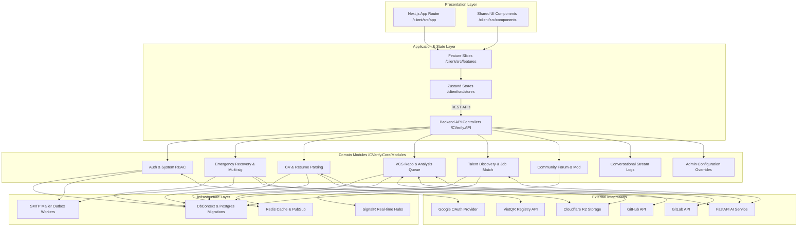
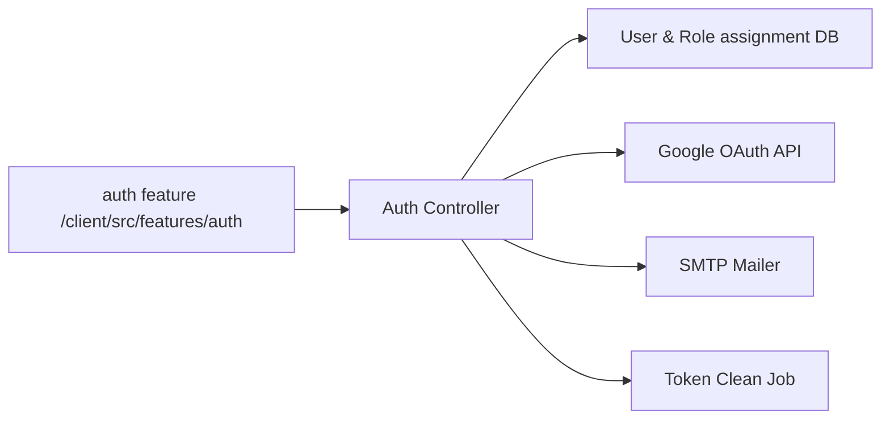
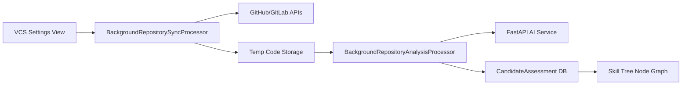
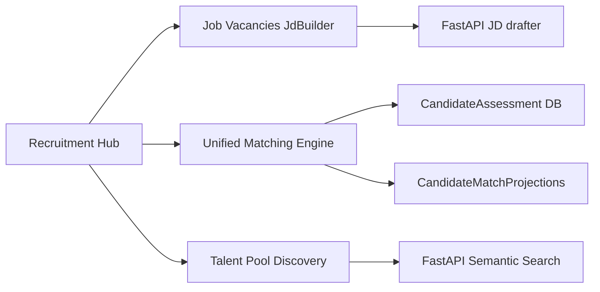
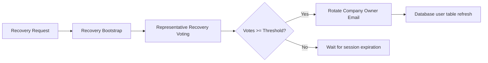

# 3.2 Code Packages

This section documents the package architecture, logical package modules, dependencies, naming conventions, and subsystem structures of the CVerify platform.

---

## 3.2.1 Architecture Overview

CVerify is designed as a hybrid **Modular Monolith** on the backend (.NET Core Web API) and a **Feature-Based App Router** system on the frontend (Next.js/React). The architecture is divided into logical layers:

1. **Presentation Layer**: Client-side page routes (`client/src/app`), shared UI layouts (`client/src/components`), and API request views.
2. **Application Layer**: Frontend feature slices (`client/src/features`), state managers (`client/src/stores`), and the backend route registries and middleware orchestrators (`CVerify.API` / `Program.cs`).
3. **Domain Layer**: The core business modules inside `CVerify.Core/Modules` containing aggregate roots, services, and repositories (Auth, Recovery, Profiles, SourceCode, Intelligence, Forum, Admin, AiChat).
4. **Infrastructure Layer**: Data persistence (`Modules/Shared` containing EF Core DbContext, migrations), cache layers (Redis cache & multiplexers), real-time notifications (SignalR Hubs), and SMTP email outbox processors.
5. **Shared Layer**: Frontend utilities (`client/src/lib`) and common DTO definitions (`client/src/types`).
6. **External Integration Layer**: Wrappers connecting external services (GitHub API, GitLab API, VietQR API, Cloudflare R2 bucket client, and the FastAPI AI Service).

---

## 3.2.2 Overall Package Diagram

The following diagram illustrates the dependencies between layers and logical modules within CVerify:

---

## 3.2.3 Subsystem Package Diagrams

### 1. Authentication Subsystem
Manages credentials validation, email verification links, Google OAuth redirects, and token lifecycle schedules.

### 2. Repository Analysis & Vetting Subsystem
Performs candidate repository discovery, schedules git downloads, streams code trees to the FastAPI service, and indexes capability skill tree nodes.

### 3. Talent Discovery & Recruitment Subsystem
Handles Job Description intake drafting, runs matching rankings, coordinates Kanban pipelines, and executes talent discovery queries.

### 4. Emergency Recovery Subsystem
Manages company reclaims and handles representative multi-sig consensus recovery approvals.

---

## 3.2.4 Package Descriptions

| No | Package | Layer | Path | Responsibility | Major Components | Dependencies | Used By | Notes |
| :--- | :--- | :--- | :--- | :--- | :--- | :--- | :--- | :--- |
| 01 | **App Router** | Presentation | `client/src/app` | Frontend route layouts, pages, and metadata definitions. | `page.tsx`, `layout.tsx` | Frontend Features | None | standard Next.js routing structure. |
| 02 | **Shared UI** | Presentation | `client/src/components` | Common UI controls, cards, modals, and spinners. | `ui/` directory | None | App Router, Features | Built with HeroUI controls. |
| 03 | **Frontend Features** | Application | `client/src/features` | Page slices containing page forms, specific views, and hooks. | `auth/`, `workspace/`, `recruitment/`, `forum/` | State Stores | App Router | Separates core logic from UI layouts. |
| 04 | **State Stores** | Application | `client/src/stores` | Zustand stores coordinating client-side state caches. | `use-candidate-assessment-store.ts`, `use-streaming-store.ts` | Shared Lib | Frontend Features | Hooks up real-time SSE stream events. |
| 05 | **Shared Lib** | Shared | `client/src/lib` | Configuration files and API fetch clients. | `api-client.ts`, `utils/` | Shared Types | State Stores, Features | Maps API bases and normalizes roles. |
| 06 | **Backend API** | Application | `CVerify.API` | Core entry controller routes, endpoint bindings, and middlewares. | `Program.cs`, HTTP routing handlers | Domain Modules, DbContext | Client Stores | Orchestrates modules bootstrapping. |
| 07 | **Auth Module** | Domain | `CVerify.Core/Modules/Auth` | User identity management, security tokens, and system RBAC checks. | `AuthService.cs`, `PermissionService.cs` | SharedDb, SMTPMailer | Backend API, Admin | Enforces secure password hashes. |
| 08 | **Recovery Module** | Domain | `CVerify.Core/Modules/Recovery` | Company ownership reclaims and representative multi-sig recovery. | `Level2RecoveryService.cs`, `ReclaimService.cs` | SharedDb, VietQR | Backend API, Admin | Handles representative rotation. |
| 09 | **Profiles Module** | Domain | `CVerify.Core/Modules/Profiles` | CV file processing, OCR parsing, and profile summaries indexing. | `CvIndexer.cs`, `ProfilesController.cs` | SharedDb, R2Storage | Backend API | Manages CV text extractors. |
| 10 | **SourceCode Module** | Domain | `CVerify.Core/Modules/SourceCode` | VCS OAuth mappings, repository synchronizations, and analysis queues. | `BackgroundRepositorySyncProcessor.cs` | SharedDb, GitHubAPI, GitLabAPI | Backend API | Asynchronous file downloads. |
| 11 | **Intelligence Module** | Domain | `CVerify.Core/Modules/Intelligence` | Sourcing searches, job matching engines, and leaderboards ranking. | `UnifiedMatchingEngine.cs`, `TalentDiscoveryService.cs` | SharedDb, FastApiAI | Backend API, Recruiter | Feeds candidate fit projections. |
| 12 | **Forum Module** | Domain | `CVerify.Core/Modules/Forum` | Topics posting, category details, comments, and moderation flags. | `ForumService.cs`, `ModerationController.cs` | SharedDb | Backend API | Community discussion board. |
| 13 | **AiChat Module** | Domain | `CVerify.Core/Modules/AiChat` | Conversation logging and session streams. | `AiChatService.cs` | SharedDb, FastApiAI | Backend API | Tracks cost metrics. |
| 14 | **Admin Module** | Domain | `CVerify.Core/Modules/Admin` | User status audits and role override panels. | `AdminMemberService.cs` | SharedDb | Backend API | Overrides administrative permissions. |
| 15 | **Shared Db** | Infrastructure | `CVerify.Core/Modules/Shared` | Database context configuration and EF core migrations. | `ApplicationDbContext.cs`, migrations | Postgres SQL | Domain Modules | Implements audit logging interceptors. |
| 16 | **Redis Cache** | Infrastructure | `CVerify.Core/Modules/Shared/Cache` | Data caching and PubSub messaging broker. | Redis connection multiplexers | Redis Server | Domain Modules | Handles notification streaming. |
| 17 | **SMTP Mailer** | Infrastructure | `CVerify.Core/Modules/Shared/Mail` | Email delivery background workers. | `EmailOutboxBackgroundProcessor.cs` | SMTP SMTP Host | AuthModule, Recovery | Integrates transactional outbox. |

---

## 3.2.5 Package Naming Conventions

* **Frontend Packages**: 
  * Directories are structured in `kebab-case` format (e.g. `source-code-providers`, `user-dashboard-view.tsx`).
  * Features use `feature-first` folder structures (e.g. `/features/auth` contains hooks, components, and views for authentication).
* **Backend Packages**:
  * Namespace naming follows standard C# `PascalCase` convention (e.g. `CVerify.Core.Modules.SourceCode.Services`).
  * Business modules are grouped by domain namespaces under `CVerify.Core/Modules/` directories (e.g. `Modules/Auth`, `Modules/Intelligence`), separating controllers, models, and service interfaces.

---

## 3.2.6 Class/File Naming Conventions

### Frontend Conventions
* **Components**: PascalCase (e.g., `JdIntakeWizard.tsx`, `CandidateAssessmentEmptyState.tsx`).
* **Routes**: kebab-case (Next.js directory standards: `/recruitment/pipeline/page.tsx`).
* **Hooks**: camelCase starting with `use` (e.g., `useAuth.ts`, `useWorkspaceStore.ts`).
* **Types / Interfaces**: PascalCase (e.g., `CandidateReadinessDto`, `Profile.types.ts`).
* **Utilities**: camelCase (e.g., `auth-utils.ts`, `api-client.ts`).
* **Stores**: camelCase (e.g., `use-candidate-assessment-store.ts`).

### Backend Conventions
* **Controllers**: PascalCase suffixed with `Controller` (e.g., `ProfilesController.cs`, `ModerationController.cs`).
* **Services**: PascalCase implements interface `IService` (e.g., `Level2RecoveryService` implements `ILevel2RecoveryService`).
* **Entities / Models**: PascalCase matching database tables (e.g., `JobVacancy.cs`, `ApprovedRecoverySession.cs`).
* **DTOs**: PascalCase suffixed with `Dto` (e.g., `CandidateReadinessDto.cs`).
* **Background Jobs**: PascalCase suffixed with `Processor` or `Job` (e.g., `EmailOutboxBackgroundProcessor.cs`, `TokenCleanupBackgroundJob.cs`).
* **Exceptions**: PascalCase suffixed with `Exception` (e.g., `ValidationException.cs`).

---

## 3.2.7 Dependency Analysis

* **Coupling Profiles**: 
  * The backend domain modules communicate using the shared persistence layers (`ApplicationDbContext`) and outbox messages. Direct service dependencies between modules are restricted; inter-module actions are executed by dispatching outbox events.
  * The frontend uses the unified `useStreamingStore` and `useAssessment` providers to coordinate real-time sync steps, reducing page coupling.
* **Shared Modules load**: `CVerify.Core/Modules/Shared` contains EF Core configurations, email outbox models, and SignalR hubs, making it a critical dependency. Any changes to files in this directory require rebuilding all domain modules.
* **Layer violations**: The dependency analysis shows clean separations. Low-level database entities do not leak directly into frontend layouts; they are filtered through DTOs (`client/src/types`) mapped on backend controllers.

---

## 3.2.8 Architecture Findings

1. **High Shared Module Coupling**: The `Modules/Shared` package acts as a shared infrastructure layer. It contains migrations, database context mappings, and outbox handlers, creating a potential failure point.
2. **Missing Repository Interfaces separation**: Several domain modules (such as `Profiles` and `Forum`) invoke the Entity Framework `DbContext` directly inside service classes instead of mapping query actions to dedicated Repository classes, making unit testing difficult.
3. **No Frontend Route Guards isolation**: Route restrictions are verified inside page layouts and components (`WorkspaceAccessGuard` in layout). As route complexity grows, managing permissions across multiple layout trees becomes error-prone.

---

## 3.2.9 Improvement Suggestions

1. **Shared Package Splitting**: Split `Modules/Shared` into smaller, focused infrastructure packages (e.g., `Shared.Database`, `Shared.Messaging`, `Shared.Mailer`) to minimize module compilation impact.
2. **Extract Repository Abstractions**: Implement the repository pattern across `Profiles` and `Forum` domains to abstract database query operations and simplify mocking in unit tests.
3. **Frontend Middleware Guards**: Move route authorization checks to a centralized Next.js `middleware.ts` file, validating permissions against path prefix rules before rendering page layouts.
