# System Context Diagram (Level 0) - C4 Model

This document describes the high-level system context (Level 0) for the **CVerify** platform, outlining the system boundary, external actors, third-party system integrations, and the major business data flows.

---

## 1. Overview

### Purpose of the System
CVerify is an AI-powered verified developer credentials and enterprise talent discovery platform. It validates a developer's code contribution metrics, syntax maturity, and code authenticity from connected repositories (GitHub, GitLab), indexes CV/resumes, and computes a verified **Trust Index** score. This allows recruiters to source vetted, high-integrity developers and automate matching with Job Descriptions (JDs) using AI.

### System Scope
* **Developer Portal**: Connects VCS providers, parses CVs, tracks repository analyses, displays skill tree nodes, and reviews calculated trust indices.
* **Talent Portal**: Onboards verified companies, drafts job descriptions with AI, schedules candidate interviews, manages recruitment Kanban pipelines, and discovers candidates using semantic talent search.
* **Admin Portal**: Manages system roles, platform audit logs, user statuses, reclamation claims, and executes Level 2 Emergency Recoveries.
* **AI Analysis Pipeline**: Asynchronously syncs repositories, executes code hygiene checks, flags plagiarized code, attributes contributions, and builds matching projections.

### System Boundary
* **Inside System Boundary (CVerify Platform Boundary)**:
  * **CVerify Next.js Frontend Web Application (Client)**: User interface for candidates, recruiters, and administrators.
  * **CVerify .NET Web API (Backend Engine)**: ASP.NET Core core Web API handling business logic and REST endpoints.
  * **CVerify Background Processing Workers**: .NET Hosted Services running background jobs (e.g., repository sync queues, mail queues).
  * **CVerify AI Service (FastAPI Engine)**: Python FastAPI service managing AST parsing, clone detection, and LLM prompt orchestration.
  * **PostgreSQL Relational Database**: Persistent database storing core business domain models.
  * **Redis Cache & Message Broker**: Caching layer and queue distribution hub.
* **Outside System Boundary (External Actors & Systems)**:
  * **Human Actors**: Guests, Candidates, Recruiters, Hiring Managers, Organization Admins, Representatives, and Super Admins.
  * **Google OAuth**: Third-party authentication provider.
  * **GitHub & GitLab APIs**: External Version Control System (VCS) hosting providers.
  * **Cloudflare R2 Object Storage**: S3-compatible cloud storage bucket.
  * **Anthropic Claude API**: External LLM provider powering semantic talent profiling, CV parsing, and JD matching.
  * **SMTP Email Service**: External mail server for transactions and alerts.
  * **VietQR / National Business Registry API**: External registry for tax code validation.

---

## 2. Audit Methodology

To ensure architectural accuracy, the system context was verified through a complete audit of the codebase:
1. **Configuration & Dependency Scan**: Checked `appsettings.json`, `.env` configurations, and backend NuGet package references (`CVerify.API.csproj`) to identify active outbound integrations (e.g. AWS S3 SDK for Cloudflare R2, Google Auth, MailKit for SMTP, and the VietQR registry client).
2. **Actor & Role Validation**: Cross-referenced `PermissionSeeder.cs`, `RoleSeeder.cs`, and DB schema definitions to confirm the 7 user roles and their associated business capabilities.
3. **AI Service Architecture Audit**: Evaluated the connection between `CVerify.Core` (.NET Web API) and `CVerify.AI` (Python FastAPI service). The audit confirmed that the FastAPI service is an internal product component rather than a third-party external system. The true external system dependency is **Anthropic Claude API**, which is called by the FastAPI engine using the configured environment secret `ANTHROPIC_API_KEY`.
4. **Stripe Integration Check**: Identified billing permissions (`billing:invoice:view`) and sandbox frontend pages, but confirmed there are no active backend NuGet integrations or live endpoints. Stripe was excluded from the context diagram as a result.

---

## 3. External Actors

The following actors represent the human users who interact directly with the CVerify platform:

| Actor | Description | Responsibilities | Entry Points & Goals | Major Interactions |
| :--- | :--- | :--- | :--- | :--- |
| **Guest** | Unauthenticated public visitor. | Browse public elements, research jobs, read forums. | Landing page (`/`), signup paths; Goal is to register or explore public data. | Search public jobs, view developer rankings, lookup tax code registries. |
| **Candidate** | Authenticated developer seeking vetting. | Connect code repository accounts, upload CV, review verified skill tree. | Developer Dashboard (`/user`); Goal is to verify credentials and apply for jobs. | Links GitHub/GitLab, runs repo analysis, takes assessments, participates in forums. |
| **Recruiter** | Organization HR member. | Post job descriptions, match candidates, manage Kanban pipeline, schedule bookings. | Recruitment Dashboard (`/recruitment`); Goal is to source and hire candidates. | Creates JDs, triggers AI candidate matching, schedules interviews, manages Kanban cards. |
| **Hiring Manager** | Scoped workspace department manager. | Manage job vacancies and pipelines for department workspaces. | Workspace Dashboard (`/dashboard`); Goal is to onboard and evaluate team developers. | Reviews JDs, updates workspace members, triggers matches within workspace. |
| **Organization Admin** | Primary organization owner. | Manage company profile details, billing plans, custom roles, employee directories. | Business Hub (`/business`); Goal is to maintain organization compliance and security. | Submits VietQR verification, invites employees, edits custom permission matrices, initiates recovery. |
| **Representative** | Trusted company contact. | Vote on organization recovery claims or representative rotations. | Email recovery link; Goal is to resolve lockouts through multi-sig consensus. | Reviews recovery session plans, casts Approve/Reject votes. |
| **Super Admin** | Root platform administrator. | Manage system roles, verify reclaims, monitor health, moderate forums. | Admin Console (`/admin`); Goal is to maintain platform security and moderation. | Suspends users, resolves claims, audits logs, overrides emergency recoveries. |

---

## 4. External Systems

These represent third-party APIs and cloud platforms that CVerify relies on to deliver its core services:

* **Google OAuth**: Third-party authentication provider. CVerify validates JWT identity tokens returned from Google's redirect flow to provide passwordless registration and login.
* **GitHub API / GitLab API**: External Version Control System (VCS) hosting providers. CVerify queries repository catalogs and downloads code files using the candidate's OAuth access token.
* **Cloudflare R2 Object Storage**: S3-compatible cloud storage bucket. Used to host candidate CV PDFs, uploaded organization verification certificates, and company logos. Signed URLs are used to render assets.
* **Anthropic Claude API**: External LLM engine called asynchronously by CVerify's AI service. Used to execute semantic code assessments, parse resume text, flag plagiarism risks, and compute candidate-to-JD match percentages.
* **SMTP Email Service**: External mail server accessed via .NET MailKit integration. Transports verification links, OTP tokens, representative invitations, and recovery alerts.
* **VietQR / National Business Registry API**: Vietnamese business tax database client. Used to automatically verify corporate tax codes and pull registered legal company names and office addresses.

---

## 5. Major Business Capabilities

The capabilities of the CVerify platform are grouped as follows:
* **Authentication**: Multi-factor authentication (2FA), passwordless Google login, custom role assignment, and security session management.
* **Profile Management**: CV parsing, experience indexing, and skill-tree visual projections.
* **Organization Management**: Tenant separation, workspace partitioning, and role-based access control (RBAC).
* **Recruitment**: Posting vacancies, drafting Job Descriptions with AI, and managing recruitment Kanban pipelines.
* **Talent Intelligence**: Matching candidates to JDs, calculating fit scores, and providing semantic candidate search.
* **Repository Analysis**: Syncing connected Git repositories, running AST-based syntax metrics, blaming authorship, and calculating trust scores.
* **AI Interview**: Generating technical screening blue-prints, grading candidate submissions, and identifying capability signals.
* **Verification**: Corporate document uploads, company level-2 verification, and VietQR tax checks.
* **Messaging**: Direct messaging chat rooms between candidates and recruiters.
* **Forum**: Collaborative community categories, topics, and comment replies.
* **Notifications**: Event-driven email deliveries and real-time in-app alerts.

---

## 6. Mermaid Context Diagram

The following C4 Level 0 Context Diagram displays the boundaries and interactions between actors, the CVerify platform, and external integrations:

```mermaid
flowchart TB
    %% Styling Classes
    classDef actorStyle fill:#2e3440,stroke:#88c0d0,stroke-width:2px,color:#d8dee9;
    classDef systemStyle fill:#3b4252,stroke:#81a1c1,stroke-width:2px,color:#d8dee9;
    classDef coreStyle fill:#1e222a,stroke:#a3be8c,stroke-width:3px,color:#eceff4,font-weight:bold;

    %% Subgraphs
    subgraph Actors [External Actors]
        Guest[Guest / Visitor]
        Candidate[Candidate / Developer]
        Recruiter[Recruiter / HR]
        HM[Hiring Manager]
        OrgAdmin[Organization Admin]
        Rep[Representative]
        SysAdmin[Super Admin]
    end

    subgraph Boundary [CVerify Platform Boundary]
        CVerify[CVerify Platform Engine]
    end

    subgraph External [External Systems]
        Google[Google OAuth]
        VCS[VCS Platforms - GitHub/GitLab]
        R2[Cloudflare R2 Object Storage]
        Claude[Anthropic Claude API]
        SMTP[SMTP Email Service]
        VietQR[VietQR Registry API]
    end

    %% Apply Styles
    class Guest,Candidate,Recruiter,HM,OrgAdmin,Rep,SysAdmin actorStyle;
    class Google,VCS,R2,Claude,SMTP,VietQR systemStyle;
    class CVerify coreStyle;
    style Boundary fill:#242933,stroke:#4c566a,stroke-width:2px,stroke-dasharray: 5 5;
    style Actors fill:#2f343f,stroke:#4c566a,stroke-width:1px;
    style External fill:#2f343f,stroke:#4c566a,stroke-width:1px;

    %% Actor to Core Interactions
    Guest -->|Browse JDs & Register| CVerify
    Candidate -->|Profile, Link Repos, Forums| CVerify
    Recruiter -->|Manage JDs, Search & Match| CVerify
    HM -->|Configure Workspaces| CVerify
    OrgAdmin -->|Org Settings & Recovery| CVerify
    Rep -->|Submit Recovery Votes| CVerify
    SysAdmin -->|Moderate & Audit Platform| CVerify

    %% Core to External Systems
    CVerify <-->|Validate Identity JWTs| Google
    CVerify <-->|Sync Repos & Commit Logs| VCS
    CVerify <-->|Store CVs & Business Docs| R2
    CVerify <-->|Assess Candidates & Parse CVs| Claude
    CVerify -->|Send Alerts & Reset Invites| SMTP
    CVerify -->|Verify Tax Code Metadata| VietQR
```

---

## 7. Design Decisions

* **AI Service Boundary Shift**: Moved the custom-built Python FastAPI microservice (`CVerify.AI`) inside CVerify's system boundary. The actual external dependency is the third-party **Anthropic Claude API** called by the FastAPI service. This represents the actual deployment and ownership structure.
* **Exclusion of Stripe API**: Although the codebase holds permissions and placeholders for Stripe subscriptions, the backend does not integrate any Stripe libraries. To prevent diagram bloat and keep the architecture realistic, Stripe is excluded until backend integration begins.
* **Layout Optimization**: Adopted a top-down layout (`TB` flow) where actors sit above the core system, and external integrations sit below. This separates actor-driven requests from system-driven integrations and eliminates line-crossing clutter.
* **High-Level Capability Grouping**: Grouped features into 11 main capabilities instead of displaying individual routes/actions, improving onboarding readability.
* **C4 Level 0 Adherence**: Excluded low-level databases, controllers, and specific services, ensuring the diagram remains focused purely on system context and boundaries.

---

## 8. Assumptions

* **SMTP Reliability**: SMTP operates with background queue workers (`EmailOutboxBackgroundProcessor`). If SMTP is briefly down, notifications are in-app and emails are queued for retrying rather than throwing immediate exceptions.
* **VietQR Service availability**: VietQR is treated as optional. If the API is unreachable, the system allows the user to manually input organization address and legal name values during company setup.
* **OAuth Token Lifespans**: Candidates' connected VCS access tokens are assumed to be long-lived or refreshed silently. If a token is invalidated, repository syncing transitions to a "Requires Authorization" state until re-linked.
* **Claude API Rate Limits**: The AI Service handles Claude's API rate limits and token windows by executing queueing policies, status polling, and retry mechanisms inside background workers.
