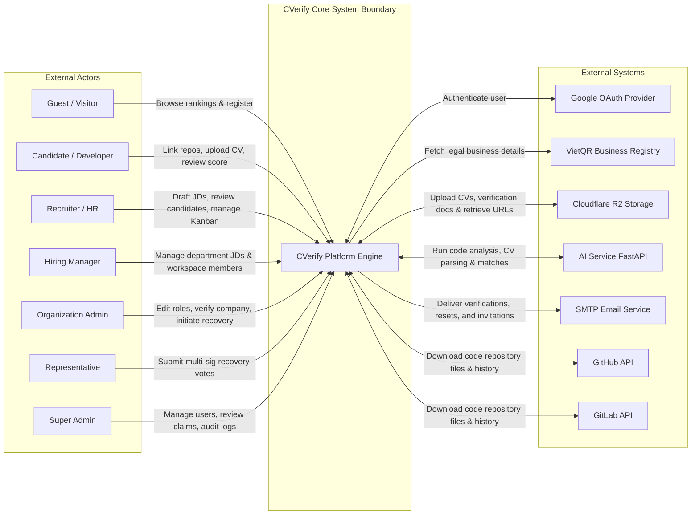

# System Context Diagram (Level 0) - C4 Model

This document describes the high-level system context (Level 0) for the **CVerify** platform, outlining the system boundary, external actors, third-party system integrations, and the major business data flows.

---

## 1. Overview

### Purpose of the System
CVerify is an AI-powered verified developer credentials and enterprise talent discovery platform. It validates a developer's code contribution metrics, syntax maturity, and code authenticity from connected repositories (GitHub, GitLab), index CV/resumes, and computes a verified **Trust Index** score. This allows recruiters to source vetted, high-integrity developers and automate matching with Job Descriptions (JDs) using AI.

### System Scope
* **Developer Portal**: Connects VCS providers, parses CVs, tracks repository analyses, displays skill tree nodes, and reviews calculated trust indices.
* **Talent Portal**: Onboards verified companies, drafts job descriptions with AI, schedules candidate interviews, manages recruitment Kanban pipelines, and discover candidates using semantic talent search.
* **Admin Portal**: Manages system roles, platform audit logs, user statuses, reclamation claims, and executes Level 2 Emergency Recoveries.
* **AI Analysis Pipeline**: Asynchronously syncs repositories, executes code hygiene checks, flags plagiarized code, attributes contributions, and builds matching projections.

### System Boundary
* **Inside System Boundary**: 
  * CVerify Next.js Frontend Web Application (Client)
  * CVerify .NET ASP.NET Core Core Web API (Backend Engine)
  * Background Processing Workers (.NET Hosted Services)
  * PostgreSQL Relational Database
  * Redis Cache and Message Broker
* **Outside System Boundary**:
  * Human Actors (Guests, Candidates, Recruiters, Hiring Managers, Company Admins, Super Admins, Representatives)
  * External Identity & Auth Providers (Google OAuth)
  * External Code Providers (GitHub API, GitLab API)
  * External Business registries (VietQR / National Business Registry API)
  * External Cloud Storage providers (Cloudflare R2 Object Storage)
  * External AI Services (FastAPI AI Assessment Engine)
  * External Notification providers (SMTP Mail Delivery)

---

## 2. Actors

| Actor | Description | Responsibilities | Entry Points & Goals | Major Interactions |
| :--- | :--- | :--- | :--- | :--- |
| **Guest** | Unauthenticated public visitor. | Browse public elements, research jobs, read forums, accept team invites. | Landing page (`/`), signup paths; Goal is to register or explore public data. | Search jobs, view rankings, lookup public profiles, register account. |
| **Candidate** (Developer) | Authenticated developer seeking vetting. | Connect code repository accounts, upload CV, review verified skill tree and trust score. | Developer Dashboard (`/user`); Goal is to verify credentials and apply for jobs. | Links GitHub/GitLab, runs repo analysis, queries AI chat, participates in forums. |
| **Recruiter** (HR Manager) | Organization HR member. | Post job descriptions, match candidates, manage Kanban pipeline, schedule bookings. | Recruitment Dashboard (`/recruitment`); Goal is to source and hire candidates. | Creates JDs, triggers matching, schedules interviews, manages Kanban cards. |
| **Hiring Manager** (Workspace Manager) | Scoped workspace administrator. | Manage job vacancies and pipelines for specific department workspaces. | Workspace Dashboard (`/dashboard`); Goal is to onboard and evaluate team developers. | Reviews JDs, updates workspace members, triggers matches within workspace. |
| **Organization Admin** (Company Owner) | Primary organization owner. | Manage company profile details, billing plans, custom roles, employee directories. | Business Hub (`/business`); Goal is to maintain organization compliance and security. | Submits VietQR verification, invites employees, edits custom permission matrices, initiates recovery. |
| **Super Admin** (System Admin) | Root platform administrator. | Manage system roles, verify reclaims, monitor health, moderate forums. | Admin Console (`/admin`); Goal is to maintain platform security and moderation. | Suspends users, resolves claims, audits logs, overrides emergency recoveries. |
| **Representative** | Trusted company contact. | Vote on organization recovery claims or representative rotations. | Email recovery link; Goal is to resolve lockouts through multi-sig consensus. | Reviews recovery session plans, casts Approve/Reject votes. |

---

## 3. External Systems

### Google OAuth
* **Description**: Third-party authentication provider.
* **Purpose**: Provide passwordless registration and Google account validation.
* **Communication Method**: HTTPS OAuth 2.0 redirect flow; CVerify validates JWT identity tokens returned from Google.
* **Data Exchanged**: Client sends Google authorization code; receives user's email address, profile picture URL, and full name.

### VietQR / National Business Registry API
* **Description**: Third-party public Vietnamese business registry database client.
* **Purpose**: Query national tax registries to auto-populate company address and legal names during company onboarding.
* **Communication Method**: Outbound HTTP requests from CVerify .NET Client to `api.vietqr.io`.
* **Data Exchanged**: CVerify sends tax code; VietQR returns legal company name and registered office address.

### Cloudflare R2 Object Storage
* **Description**: S3-compatible cloud storage bucket.
* **Purpose**: Host candidate CV PDFs, uploaded organization verification certificates, and company logos.
* **Communication Method**: HTTPS requests signed using AWS Signature Version 4.
* **Data Exchanged**: CVerify uploads file streams; receives signed URLs to read and render assets safely on the frontend.

### AI Service (FastAPI Engine)
* **Description**: Python FastAPI microservice housing LLMs and code processing scripts.
* **Purpose**: Run semantic code analysis, parse resumes, check code plagiarism risks, and calculate candidate-to-JD match percentages.
* **Communication Method**: Outbound HTTP/HTTPS REST calls from CVerify Web API (with long timeouts for streaming results).
* **Data Exchanged**: CVerify sends repository directories, raw CV text, or job descriptions; AI Service returns parsed profiles, capability matrices, and match rationales.

### SMTP Email Service
* **Description**: Simple Mail Transfer Protocol mail server.
* **Purpose**: Deliver verification links, password reset links, representative invitations, and recovery alerts.
* **Communication Method**: SMTP transport from .NET MailKit integration.
* **Data Exchanged**: CVerify sends recipient email, subject, and HTML templates; Email Service routes message to the recipient's inbox.

### GitHub API / GitLab API
* **Description**: External Version Control System (VCS) hosting providers.
* **Purpose**: Retrieve candidate repository files, branch logs, and commit histories.
* **Communication Method**: HTTPS REST requests authenticated via Candidate's OAuth Access Token.
* **Data Exchanged**: CVerify queries repository catalogs and downloads code file contents for analysis.

---

## 4. Data Flows

### Inbound Business Flows (Entering System Boundary)
* **User Login**: Guest → Login Request (Email/Password or Google Token) → CVerify validates credentials and returns HTTP-only Session Cookie.
* **Submit CV**: Candidate → Upload PDF file → CVerify saves PDF to Cloudflare R2, extracts text, sends to AI Service, and returns parsed resume details.
* **Connect VCS**: Candidate → Connect GitHub Account → CVerify receives OAuth token, queries GitHub API for repository directories, and syncs repository files.
* **Draft Job Description**: Recruiter → Input parameters (Role title, target experience) → CVerify requests AI Service to draft JD and return structured skill taxonomies.
* **Calculate Candidate Match**: Recruiter → Run Match Command → CVerify queries Candidate Projections, executes AI match algorithms, and returns sorted lists of matching candidates.
* **Cast Recovery Vote**: Representative → Cast Vote (Approve/Reject) → CVerify logs vote and executes recovery action if multi-sig threshold is met.
* **Submit Reclamation Claim**: Organization Admin → Tax Code reclamation files → CVerify saves documents to Cloudflare R2 and flags status as `RECLAIM_PENDING`.

### Outbound Business Flows (Leaving System Boundary)
* **Verify Tax Code**: CVerify → Tax Code lookup query → VietQR API returns company registration details.
* **Analyze Repository**: CVerify Background Worker → Repository files & commit histories → AI Service returns code authenticity, plagiarism warnings, and capability scores.
* **Send Verification Email**: CVerify SMTP Outbox Worker → verification link email template → SMTP Email Service routes to user.
* **Download Repository Files**: CVerify Background Worker → OAuth token query → GitHub/GitLab API returns repository files.

---

## 5. Mermaid Context Diagram

---

## 6. Assumptions

* **SMTP Reliability**: It is assumed that the SMTP Email Service operates with a local or cloud queue, preventing CVerify from losing notifications during temporary SMTP outages. In-app notifications serve as the fallback display.
* **VietQR Service availability**: VietQR API is treated as optional. If the API is unreachable, the system assumes the user can manually input organization address and legal name values during company setup.
* **OAuth Token Lifespans**: Candidates' connected VCS access tokens are assumed to be long-lived or refreshed silently. If a token is invalidated, the system assumes repository syncing will transition to a "Requires Authorization" state until re-linked.
* **AI Service Queue Limits**: It is assumed the AI Service is scaled to process multiple analysis runs simultaneously. CVerify handles potential timeouts by implementing background queues and status polling to prevent HTTP connection drops on the frontend.
