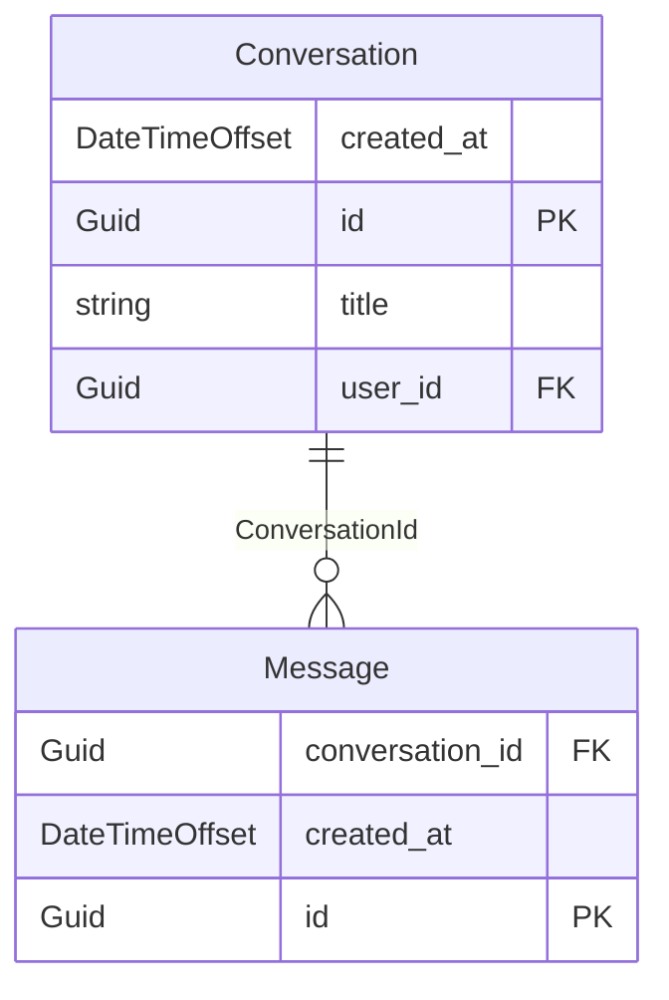

# Entity Relationship Diagram (ERD) (Modular)

This document serves as the canonical reference for the database schema, domain boundaries, and data integrity details of the CVerify platform. The system is written in C# (.NET Core) using Entity Framework Core with a PostgreSQL database, featuring a greenfield platform layer for pipelines and a modular domain monolith structure for business capabilities.

---

## 1. Overview

CVerify's database architecture contains two major parts:
1. **Platform Orchestration Subsystem**: Core pipelines, orchestration jobs, analysis tasks, and an AI artifact registry. These are declared in SQL (`schema_init.sql`) and managed outside the typical ORM context for performance and asynchronous resilience.
2. **Modular Business Domain Monolith**: The main application domain managed by Entity Framework Core, structured into logical modules under the `Modules/` directory. It uses PostgreSQL schemas with Citext (case-insensitive text) and Pgcrypto extensions.

---

## 2. Audit Methodology

The database model was audited using the following codebase sources:
- **EF Core Snapshot**: The `ApplicationDbContextModelSnapshot.cs` snapshot containing mapping specifications for 151 entities, properties, backing database columns, keys, and relational behaviors.
- **Source Code Entity & Enum Definitions**: Inspected class properties, custom C# attributes, and enums under `Modules/*/Entities` and `Modules/Shared/Domain/Enums`.
- **Database Initialization Script**: Inspected `schema_init.sql` for the platform orchestration and artifact registry tables.
- **C# Service Code & Repositories**: Cross-referenced dependencies to determine the business meaning of logical/polymorphic relationships not enforced at the database level.

---

## 3. Domain Breakdown

The system is divided into 9 logical domains. Below is the mapping of namespaces to these domains:

| Domain Name | Namespace/Pattern | Key Entities | Business Purpose |
| :--- | :--- | :--- | :--- |
| **Identity & Access Management (IAM)** | `Modules.Auth`, `Shared.User`, roles | `User`, `Role`, `Permission`, tokens | User accounts, auth states, API key mappings, and RBAC / permission mapping. |
| **Organizations & Workspaces** | `Shared.Organization`, `Workspace` | `Organization`, `Workspace`, members | Tenant boundaries, organizational memberships, and active collaborative spaces. |
| **Candidate Profiles** | `Modules.Profiles` | `UserProfile`, experiences, project entries | The candidate's CV/profile, education history, work experience, and repo contributions. |
| **Talent Intelligence & Verification** | `Shared.Domain` intelligence structures | `CandidateAssessment`, capability nodes | AI evaluation results, strength/weakness analysis, trust calculations, and capability score matrices. |
| **Recruitment & Jobs** | `Shared.Domain` vacancy structures | `JobVacancy`, `JobApplication`, requirements | Job vacancy lifecycle, recruitment pipelines, requirements snapshots, and match projections. |
| **Source Code Intelligence** | `Modules.SourceCode` | `SourceCodeRepository`, analysis execution | Linked Git repositories, analysis reports, AST task executions, and code classification. |
| **Forum Module** | `Modules.Forum` | `ForumTopic`, `ForumReply`, categories, votes | Community forums, moderation queues, tag definitions, bookmarks, and user reputation metrics. |
| **Audit, Notifications & Messaging** | `Shared.Domain` event logging | `AuditLog`, `ActivityEvent`, `InAppNotification` | Core logging (compliance audit), user notifications, and streaming session analytics. |
| **Platform Orchestration & AI Subsystem** | `Pipelines`, `AiStreaming` | `PipelineJob`, `ArtifactRegistryEntry`, streaming sessions | System job/task pipelines, LLM prompt deployments, and real-time AI token streaming logs. |

---

## 4. Entity Catalog

This catalog lists the 151 entities in the database, their purpose, primary key, audit fields, soft-delete status, and enum usages.

### 4.1 Identity & Access Management (IAM) Entities

#### AuthProvider (Table: `auth_providers`)

- **Purpose**: Represents authprovider in the identity & access management (iam) module.
- **Primary Key**: `Id`
- **Soft Delete**: Yes (`deleted_at` column)
- **Audit Fields**: `created_at`
- **Enum Usages**: None

| Column Name | Property Name | Data Type | Nullable | Max Length | Notes |
| :--- | :--- | :--- | :--- | :--- | :--- |
| `created_at` | `CreatedAt` | `DateTimeOffset` | Yes | - | - |
| `deleted_at` | `DeletedAt` | `DateTimeOffset?` | Yes | - | - |
| `encrypted_access_token` | `EncryptedAccessToken` | `string` | Yes | 1000 | - |
| `encrypted_refresh_token` | `EncryptedRefreshToken` | `string` | Yes | 1000 | - |
| `expires_at` | `ExpiresAt` | `DateTimeOffset?` | Yes | - | - |
| `granted_scopes` | `GrantedScopes` | `string` | Yes | 500 | - |
| `id` | `Id` | `Guid` | Yes | - | PRIMARY KEY |
| `last_provider_sync_at` | `LastProviderSyncAt` | `DateTimeOffset?` | Yes | - | - |
| `last_scope_validation_at` | `LastScopeValidationAt` | `DateTimeOffset?` | Yes | - | - |
| `last_successful_refresh_at` | `LastSuccessfulRefreshAt` | `DateTimeOffset?` | Yes | - | - |
| `provider_account_id` | `ProviderAccountId` | `string` | Yes | 100 | - |
| `provider_avatar_url` | `ProviderAvatarUrl` | `string` | Yes | 500 | - |
| `provider_display_name` | `ProviderDisplayName` | `string` | Yes | 255 | - |
| `provider_key` | `ProviderKey` | `string` | No | 255 | - |
| `provider_name` | `ProviderName` | `string` | No | 50 | - |
| `provider_profile_url` | `ProviderProfileUrl` | `string` | Yes | 500 | - |
| `provider_username` | `ProviderUsername` | `string` | Yes | 255 | - |
| `refresh_failure_count` | `RefreshFailureCount` | `int` | Yes | - | - |
| `scope_validation_status` | `ScopeValidationStatus` | `int` | Yes | - | - |
| `sync_error` | `SyncError` | `string` | Yes | - | - |
| `sync_status` | `SyncStatus` | `string` | No | 50 | - |
| `token_updated_at` | `TokenUpdatedAt` | `DateTimeOffset?` | Yes | - | - |
| `user_id` | `UserId` | `Guid` | Yes | - | FOREIGN KEY -> User |

**Indexes & Constraints**:
- UNIQUE Index `idx_auth_providers_key_active` on (`ProviderName`, `ProviderKey`)
- UNIQUE Index `idx_auth_providers_user_type_lookup` on (`UserId`, `ProviderName`)

#### OrganizationCredential (Table: `organization_credentials`)

- **Purpose**: Represents organizationcredential in the identity & access management (iam) module.
- **Primary Key**: `OrganizationId`
- **Soft Delete**: Yes (`deleted_at` column)
- **Audit Fields**: `created_at, updated_at`
- **Enum Usages**: None

| Column Name | Property Name | Data Type | Nullable | Max Length | Notes |
| :--- | :--- | :--- | :--- | :--- | :--- |
| `created_at` | `CreatedAt` | `DateTimeOffset` | Yes | - | - |
| `deleted_at` | `DeletedAt` | `DateTimeOffset?` | Yes | - | - |
| `failed_login_attempts` | `FailedLoginAttempts` | `int` | Yes | - | - |
| `lockout_end` | `LockoutEnd` | `DateTimeOffset?` | Yes | - | - |
| `organization_id` | `OrganizationId` | `Guid` | Yes | - | PRIMARY KEY, FOREIGN KEY -> Organization |
| `password_hash` | `PasswordHash` | `string` | No | - | - |
| `updated_at` | `UpdatedAt` | `DateTimeOffset` | Yes | - | - |
| `username` | `Username` | `string` | No | 100 | - |

**Indexes & Constraints**:
- UNIQUE Index `idx_organization_credentials_username_active` on (`Username`)

#### OtpVerification (Table: `otp_verifications`)

- **Purpose**: Represents otpverification in the identity & access management (iam) module.
- **Primary Key**: `Id`
- **Soft Delete**: No
- **Audit Fields**: `created_at`
- **Enum Usages**: None

| Column Name | Property Name | Data Type | Nullable | Max Length | Notes |
| :--- | :--- | :--- | :--- | :--- | :--- |
| `attempts` | `Attempts` | `int` | Yes | - | - |
| `challenge_id` | `ChallengeId` | `Guid` | Yes | - | - |
| `consumed_at` | `ConsumedAt` | `DateTimeOffset?` | Yes | - | - |
| `cooldown_until` | `CooldownUntil` | `DateTimeOffset?` | Yes | - | - |
| `created_at` | `CreatedAt` | `DateTimeOffset` | Yes | - | - |
| `email` | `Email` | `string` | No | 255 | - |
| `expires_at` | `ExpiresAt` | `DateTimeOffset` | Yes | - | - |
| `id` | `Id` | `Guid` | Yes | - | PRIMARY KEY |
| `invalidated_at` | `InvalidatedAt` | `DateTimeOffset?` | Yes | - | - |
| `last_attempt_at` | `LastAttemptAt` | `DateTimeOffset?` | Yes | - | - |
| `last_resent_at` | `LastResentAt` | `DateTimeOffset?` | Yes | - | - |
| `last_sent_at` | `LastSentAt` | `DateTimeOffset?` | Yes | - | - |
| `otp_hash` | `OtpHash` | `string` | No | 255 | - |
| `purpose` | `Purpose` | `string` | No | 100 | - |
| `resend_count` | `ResendCount` | `int` | Yes | - | - |
| `status` | `Status` | `int` | Yes | - | - |

**Indexes & Constraints**:
- Index `idx_otp_verifications_challenge_id` on (`ChallengeId`)
- Index `idx_otp_verifications_email` on (`Email`)

#### PendingAuthProvider (Table: `pending_auth_providers`)

- **Purpose**: Represents pendingauthprovider in the identity & access management (iam) module.
- **Primary Key**: `Id`
- **Soft Delete**: No
- **Audit Fields**: `created_at`
- **Enum Usages**: None

| Column Name | Property Name | Data Type | Nullable | Max Length | Notes |
| :--- | :--- | :--- | :--- | :--- | :--- |
| `created_at` | `CreatedAt` | `DateTimeOffset` | Yes | - | - |
| `encrypted_access_token` | `EncryptedAccessToken` | `string` | No | 1000 | - |
| `encrypted_refresh_token` | `EncryptedRefreshToken` | `string` | Yes | 1000 | - |
| `expires_at` | `ExpiresAt` | `DateTimeOffset` | Yes | - | - |
| `id` | `Id` | `Guid` | Yes | - | PRIMARY KEY |
| `provider_account_id` | `ProviderAccountId` | `string` | Yes | 100 | - |
| `provider_avatar_url` | `ProviderAvatarUrl` | `string` | Yes | 500 | - |
| `provider_display_name` | `ProviderDisplayName` | `string` | Yes | 255 | - |
| `provider_key` | `ProviderKey` | `string` | No | 255 | - |
| `provider_name` | `ProviderName` | `string` | No | 50 | - |
| `provider_profile_url` | `ProviderProfileUrl` | `string` | Yes | 500 | - |
| `provider_username` | `ProviderUsername` | `string` | Yes | 255 | - |
| `user_id` | `UserId` | `Guid` | Yes | - | FOREIGN KEY -> User |

**Indexes & Constraints**:
- Index `idx_pending_auth_providers_expiry` on (`ExpiresAt`)
- Index `ix_pending_auth_providers_user_id` on (`UserId`)

#### RefreshToken (Table: `refresh_tokens`)

- **Purpose**: Represents refreshtoken in the identity & access management (iam) module.
- **Primary Key**: `Id`
- **Soft Delete**: No
- **Audit Fields**: `created_at`
- **Enum Usages**: None

| Column Name | Property Name | Data Type | Nullable | Max Length | Notes |
| :--- | :--- | :--- | :--- | :--- | :--- |
| `created_at` | `CreatedAt` | `DateTimeOffset` | Yes | - | - |
| `expires_at` | `ExpiresAt` | `DateTimeOffset` | Yes | - | - |
| `id` | `Id` | `Guid` | Yes | - | PRIMARY KEY |
| `ip_address` | `IpAddress` | `string` | Yes | 45 | - |
| `organization_id` | `OrganizationId` | `Guid?` | Yes | - | FOREIGN KEY -> Organization |
| `remember_me` | `RememberMe` | `bool` | Yes | - | - |
| `replaced_by_token` | `ReplacedByToken` | `string` | Yes | 255 | - |
| `replaced_by_token_id` | `ReplacedByTokenId` | `Guid?` | Yes | - | - |
| `revoked_at` | `RevokedAt` | `DateTimeOffset?` | Yes | - | - |
| `session_id` | `SessionId` | `Guid` | Yes | - | - |
| `token` | `Token` | `string` | No | 255 | - |
| `user_agent` | `UserAgent` | `string` | Yes | 500 | - |
| `user_id` | `UserId` | `Guid?` | Yes | - | FOREIGN KEY -> User |

**Indexes & Constraints**:
- Index `idx_refresh_tokens_expires_at` on (`ExpiresAt`)
- Index `idx_refresh_tokens_organization_id` on (`OrganizationId`)
- Index `idx_refresh_tokens_session_id` on (`SessionId`)
- Index `idx_refresh_tokens_user_id` on (`UserId`)

#### ResetPasswordToken (Table: `reset_password_tokens`)

- **Purpose**: Represents resetpasswordtoken in the identity & access management (iam) module.
- **Primary Key**: `Id`
- **Soft Delete**: No
- **Audit Fields**: `created_at`
- **Enum Usages**: None

| Column Name | Property Name | Data Type | Nullable | Max Length | Notes |
| :--- | :--- | :--- | :--- | :--- | :--- |
| `consumed_at` | `ConsumedAt` | `DateTimeOffset?` | Yes | - | - |
| `created_at` | `CreatedAt` | `DateTimeOffset` | Yes | - | - |
| `expires_at` | `ExpiresAt` | `DateTimeOffset` | Yes | - | - |
| `id` | `Id` | `Guid` | Yes | - | PRIMARY KEY |
| `token_hash` | `TokenHash` | `string` | No | 255 | - |
| `user_id` | `UserId` | `Guid` | Yes | - | FOREIGN KEY -> User |
| `xmin` | `Version` | `uint` | Yes | - | - |

**Indexes & Constraints**:
- Index `idx_reset_password_tokens_active` on (`TokenHash`)
- Index `idx_reset_password_tokens_user_id` on (`UserId`)

#### VerificationLink (Table: `verification_links`)

- **Purpose**: Represents verificationrelational link in the identity & access management (iam) module.
- **Primary Key**: `Id`
- **Soft Delete**: Yes (`deleted_at` column)
- **Audit Fields**: `created_at`
- **Enum Usages**: None

| Column Name | Property Name | Data Type | Nullable | Max Length | Notes |
| :--- | :--- | :--- | :--- | :--- | :--- |
| `company_name` | `CompanyName` | `string` | Yes | 255 | - |
| `consumed_at` | `ConsumedAt` | `DateTimeOffset?` | Yes | - | - |
| `consumed_by_ip` | `ConsumedByIp` | `string` | Yes | 45 | - |
| `consumed_by_user_agent` | `ConsumedByUserAgent` | `string` | Yes | 500 | - |
| `created_at` | `CreatedAt` | `DateTimeOffset` | Yes | - | - |
| `deleted_at` | `DeletedAt` | `DateTimeOffset?` | Yes | - | - |
| `email` | `Email` | `string` | No | 255 | - |
| `expires_at` | `ExpiresAt` | `DateTimeOffset` | Yes | - | - |
| `id` | `Id` | `Guid` | Yes | - | PRIMARY KEY |
| `organization_id` | `OrganizationId` | `Guid?` | Yes | - | FOREIGN KEY -> Organization |
| `purpose` | `Purpose` | `string` | No | 100 | - |
| `tax_code` | `TaxCode` | `string` | Yes | 50 | - |
| `token_hash` | `TokenHash` | `string` | No | 255 | - |
| `user_id` | `UserId` | `Guid?` | Yes | - | FOREIGN KEY -> User |

**Indexes & Constraints**:
- Index `ix_verification_links_organization_id` on (`OrganizationId`)
- Index `idx_verification_links_active` on (`TokenHash`)
- Index `ix_verification_links_user_id` on (`UserId`)

#### VerificationToken (Table: `verification_tokens`)

- **Purpose**: Represents verificationtoken in the identity & access management (iam) module.
- **Primary Key**: `Id`
- **Soft Delete**: No
- **Audit Fields**: `created_at`
- **Enum Usages**: None

| Column Name | Property Name | Data Type | Nullable | Max Length | Notes |
| :--- | :--- | :--- | :--- | :--- | :--- |
| `consumed_at` | `ConsumedAt` | `DateTimeOffset?` | Yes | - | - |
| `created_at` | `CreatedAt` | `DateTimeOffset` | Yes | - | - |
| `expires_at` | `ExpiresAt` | `DateTimeOffset` | Yes | - | - |
| `id` | `Id` | `Guid` | Yes | - | PRIMARY KEY |
| `token_hash` | `TokenHash` | `string` | No | 255 | - |
| `user_id` | `UserId` | `Guid` | Yes | - | FOREIGN KEY -> User |
| `xmin` | `Version` | `uint` | Yes | - | - |

**Indexes & Constraints**:
- Index `idx_verification_tokens_active` on (`TokenHash`)
- Index `idx_verification_tokens_user_id` on (`UserId`)

#### Permission (Table: `permissions`)

- **Purpose**: Represents permission in the identity & access management (iam) module.
- **Primary Key**: `Id`
- **Soft Delete**: No
- **Audit Fields**: `created_at, updated_at`
- **Enum Usages**: None

| Column Name | Property Name | Data Type | Nullable | Max Length | Notes |
| :--- | :--- | :--- | :--- | :--- | :--- |
| `created_at` | `CreatedAt` | `DateTimeOffset` | Yes | - | - |
| `description` | `Description` | `string` | Yes | - | - |
| `display_name` | `DisplayName` | `string` | No | 150 | - |
| `id` | `Id` | `Guid` | Yes | - | PRIMARY KEY |
| `is_system` | `IsSystem` | `bool` | Yes | - | - |
| `module` | `Module` | `string` | No | 50 | - |
| `name` | `Name` | `string` | No | 150 | - |
| `updated_at` | `UpdatedAt` | `DateTimeOffset` | Yes | - | - |

**Indexes & Constraints**:
- UNIQUE Index `ix_permissions_name` on (`Name`)
- Index `Unnamed Index` on (`Name`)
- Index `Unnamed Index` on (`Name`)

#### Role (Table: `roles`)

- **Purpose**: Represents role in the identity & access management (iam) module.
- **Primary Key**: `Id`
- **Soft Delete**: Yes (`deleted_at` column)
- **Audit Fields**: `created_at, updated_at`
- **Enum Usages**: None

| Column Name | Property Name | Data Type | Nullable | Max Length | Notes |
| :--- | :--- | :--- | :--- | :--- | :--- |
| `created_at` | `CreatedAt` | `DateTimeOffset` | Yes | - | - |
| `deleted_at` | `DeletedAt` | `DateTimeOffset?` | Yes | - | - |
| `description` | `Description` | `string` | Yes | - | - |
| `display_name` | `DisplayName` | `string` | No | 100 | - |
| `domain` | `Domain` | `string` | No | 30 | - |
| `id` | `Id` | `Guid` | Yes | - | PRIMARY KEY |
| `is_active` | `IsActive` | `bool` | Yes | - | - |
| `is_system` | `IsSystem` | `bool` | Yes | - | - |
| `name` | `Name` | `string` | No | 50 | - |
| `parent_role_id` | `ParentRoleId` | `Guid?` | Yes | - | FOREIGN KEY -> Role |
| `tenant_id` | `TenantId` | `Guid?` | Yes | - | - |
| `updated_at` | `UpdatedAt` | `DateTimeOffset` | Yes | - | - |
| `xmin` | `Version` | `uint` | Yes | - | - |

**Indexes & Constraints**:
- UNIQUE Index `ix_roles_name` on (`Name`)
- Index `ix_roles_parent_role_id` on (`ParentRoleId`)
- UNIQUE Index `idx_roles_tenant_id_name` on (`TenantId`, `Name`)

#### RoleAssignment (Table: `role_assignments`)

- **Purpose**: Represents roleassignment in the identity & access management (iam) module.
- **Primary Key**: `Id`
- **Soft Delete**: No
- **Audit Fields**: `None`
- **Enum Usages**: None

| Column Name | Property Name | Data Type | Nullable | Max Length | Notes |
| :--- | :--- | :--- | :--- | :--- | :--- |
| `assigned_at` | `AssignedAt` | `DateTimeOffset` | Yes | - | - |
| `id` | `Id` | `Guid` | Yes | - | PRIMARY KEY |
| `role_id` | `RoleId` | `Guid` | Yes | - | FOREIGN KEY -> Role |
| `scope_id` | `ScopeId` | `Guid` | Yes | - | - |
| `scope_type` | `ScopeType` | `string` | No | 30 | - |
| `user_id` | `UserId` | `Guid` | Yes | - | FOREIGN KEY -> User |

**Indexes & Constraints**:
- Index `ix_role_assignments_role_id` on (`RoleId`)
- UNIQUE Index `idx_role_assignments_unique` on (`UserId`, `RoleId`, `ScopeType`, `ScopeId`)

#### User (Table: `users`)

- **Purpose**: Represents user in the identity & access management (iam) module.
- **Primary Key**: `Id`
- **Soft Delete**: Yes (`deleted_at` column)
- **Audit Fields**: `created_at, updated_at`
- **Enum Usages**: `Status` (UserStatus)

| Column Name | Property Name | Data Type | Nullable | Max Length | Notes |
| :--- | :--- | :--- | :--- | :--- | :--- |
| `avatar_source` | `AvatarSource` | `int` | Yes | - | - |
| `avatar_url` | `AvatarUrl` | `string` | Yes | - | - |
| `created_at` | `CreatedAt` | `DateTimeOffset` | Yes | - | - |
| `deleted_at` | `DeletedAt` | `DateTimeOffset?` | Yes | - | - |
| `email` | `Email` | `string` | No | - | - |
| `email_verified_at` | `EmailVerifiedAt` | `DateTimeOffset?` | Yes | - | - |
| `failed_attempts` | `FailedAttempts` | `int` | Yes | - | - |
| `full_name` | `FullName` | `string` | No | 255 | - |
| `id` | `Id` | `Guid` | Yes | - | PRIMARY KEY |
| `is_legal_hold` | `IsLegalHold` | `bool` | Yes | - | - |
| `last_failed_at` | `LastFailedAt` | `DateTimeOffset?` | Yes | - | - |
| `last_login_at` | `LastLoginAt` | `DateTimeOffset?` | Yes | - | - |
| `last_login_ip` | `LastLoginIp` | `IPAddress` | Yes | - | - |
| `last_username_change_at` | `LastUsernameChangeAt` | `DateTimeOffset?` | Yes | - | - |
| `linked_emails` | `LinkedEmails` | `string` | No | - | - |
| `lock_until` | `LockUntil` | `DateTimeOffset?` | Yes | - | - |
| `password_changed_at` | `PasswordChangedAt` | `DateTimeOffset?` | Yes | - | - |
| `password_hash` | `PasswordHash` | `string` | Yes | - | - |
| `session_version` | `SessionVersion` | `int` | Yes | - | - |
| `status` | `Status` | `UserStatus` | Yes | - | - |
| `updated_at` | `UpdatedAt` | `DateTimeOffset` | Yes | - | - |
| `username` | `Username` | `string` | Yes | 32 | - |
| `version` | `Version` | `long` | Yes | - | - |

**Indexes & Constraints**:
- UNIQUE Index `ix_users_email` on (`Email`)
- Index `idx_users_active` on (`Status`)
- UNIQUE Index `ix_users_username` on (`Username`)

#### UserFollower (Table: `user_followers`)

- **Purpose**: Represents userfollower in the identity & access management (iam) module.
- **Primary Key**: `FollowerId, FolloweeId`
- **Soft Delete**: No
- **Audit Fields**: `None`
- **Enum Usages**: None

| Column Name | Property Name | Data Type | Nullable | Max Length | Notes |
| :--- | :--- | :--- | :--- | :--- | :--- |
| `followed_at` | `FollowedAt` | `DateTimeOffset` | Yes | - | - |
| `followee_id` | `FolloweeId` | `Guid` | Yes | - | PRIMARY KEY, FOREIGN KEY -> User |
| `follower_id` | `FollowerId` | `Guid` | Yes | - | PRIMARY KEY, FOREIGN KEY -> User |

**Indexes & Constraints**:
- Index `ix_user_followers_followee_id` on (`FolloweeId`)

#### role_permissions (Table: `role_permissions`)

- **Purpose**: Represents role_permissions in the identity & access management (iam) module.
- **Primary Key**: `permission_id, role_id`
- **Soft Delete**: No
- **Audit Fields**: `None`
- **Enum Usages**: None

| Column Name | Property Name | Data Type | Nullable | Max Length | Notes |
| :--- | :--- | :--- | :--- | :--- | :--- |
| `assigned_at` | `assigned_at` | `DateTimeOffset` | Yes | - | - |
| `permission_id` | `permission_id` | `Guid` | Yes | - | PRIMARY KEY, FOREIGN KEY -> Permission |
| `role_id` | `role_id` | `Guid` | Yes | - | PRIMARY KEY, FOREIGN KEY -> Role |

**Indexes & Constraints**:
- Index `ix_role_permissions_role_id` on (`role_id`)

#### user_roles (Table: `user_roles`)

- **Purpose**: Represents user_roles in the identity & access management (iam) module.
- **Primary Key**: `role_id, user_id`
- **Soft Delete**: No
- **Audit Fields**: `None`
- **Enum Usages**: None

| Column Name | Property Name | Data Type | Nullable | Max Length | Notes |
| :--- | :--- | :--- | :--- | :--- | :--- |
| `assigned_at` | `assigned_at` | `DateTimeOffset` | Yes | - | - |
| `role_id` | `role_id` | `Guid` | Yes | - | PRIMARY KEY, FOREIGN KEY -> Role |
| `user_id` | `user_id` | `Guid` | Yes | - | PRIMARY KEY, FOREIGN KEY -> User |

**Indexes & Constraints**:
- Index `ix_user_roles_user_id` on (`user_id`)

### 4.2 Organizations & Workspaces Entities

#### Organization (Table: `organizations`)

- **Purpose**: Represents organization in the organizations & workspaces module.
- **Primary Key**: `Id`
- **Soft Delete**: Yes (`deleted_at` column)
- **Audit Fields**: `created_at, updated_at`
- **Enum Usages**: None

| Column Name | Property Name | Data Type | Nullable | Max Length | Notes |
| :--- | :--- | :--- | :--- | :--- | :--- |
| `banner_url` | `BannerUrl` | `string` | Yes | 2048 | - |
| `branch_count` | `BranchCount` | `int` | Yes | - | - |
| `city` | `City` | `string` | Yes | - | - |
| `company_size` | `CompanySize` | `string` | Yes | - | - |
| `company_type` | `CompanyType` | `string` | Yes | - | - |
| `contact_email` | `ContactEmail` | `string` | Yes | - | - |
| `contact_name` | `ContactName` | `string` | Yes | - | - |
| `contact_phone` | `ContactPhone` | `string` | Yes | - | - |
| `core_values` | `CoreValues` | `string` | Yes | - | - |
| `created_at` | `CreatedAt` | `DateTimeOffset` | Yes | - | - |
| `deleted_at` | `DeletedAt` | `DateTimeOffset?` | Yes | - | - |
| `description` | `Description` | `string` | Yes | - | - |
| `detail_address` | `DetailAddress` | `string` | Yes | - | - |
| `email` | `Email` | `string` | No | 255 | - |
| `facebook_url` | `FacebookUrl` | `string` | Yes | - | - |
| `follower_count` | `FollowerCount` | `int` | Yes | - | - |
| `founded` | `Founded` | `string` | Yes | - | - |
| `google_maps_embed_url` | `GoogleMapsEmbedUrl` | `string` | Yes | - | - |
| `id` | `Id` | `Guid` | Yes | - | PRIMARY KEY |
| `initial_admin_assigned_at` | `InitialAdminAssignedAt` | `DateTimeOffset?` | Yes | - | - |
| `is_verified` | `IsVerified` | `bool` | Yes | - | - |
| `linkedin_url` | `LinkedinUrl` | `string` | Yes | - | - |
| `logo_url` | `LogoUrl` | `string` | Yes | 2048 | - |
| `mission` | `Mission` | `string` | Yes | - | - |
| `name` | `Name` | `string` | No | 255 | - |
| `recovery_authority` | `RecoveryAuthority` | `string` | Yes | 255 | - |
| `registration_number` | `RegistrationNumber` | `string` | Yes | 50 | - |
| `representative_email` | `RepresentativeEmail` | `string` | Yes | 255 | - |
| `representative_identity` | `RepresentativeIdentity` | `string` | Yes | 255 | - |
| `representative_name` | `RepresentativeName` | `string` | Yes | 255 | - |
| `representative_phone` | `RepresentativePhone` | `string` | Yes | 50 | - |
| `status` | `Status` | `string` | No | 50 | - |
| `tax_code` | `TaxCode` | `string` | No | 50 | - |
| `twitter_url` | `TwitterUrl` | `string` | Yes | - | - |
| `updated_at` | `UpdatedAt` | `DateTimeOffset` | Yes | - | - |
| `username` | `Username` | `string` | No | 100 | - |
| `verification_level` | `VerificationLevel` | `int` | Yes | - | - |
| `vision` | `Vision` | `string` | Yes | - | - |
| `website` | `Website` | `string` | Yes | - | - |

**Indexes & Constraints**:
- UNIQUE Index `idx_organizations_tax_code_active` on (`TaxCode`)
- UNIQUE Index `idx_organizations_username_active` on (`Username`)

#### OrganizationAuthority (Table: `organization_authorities`)

- **Purpose**: Represents organizationauthority in the organizations & workspaces module.
- **Primary Key**: `Id`
- **Soft Delete**: No
- **Audit Fields**: `None`
- **Enum Usages**: None

| Column Name | Property Name | Data Type | Nullable | Max Length | Notes |
| :--- | :--- | :--- | :--- | :--- | :--- |
| `id` | `Id` | `Guid` | Yes | - | PRIMARY KEY |
| `joined_at` | `JoinedAt` | `DateTimeOffset` | Yes | - | - |
| `organization_id` | `OrganizationId` | `Guid` | Yes | - | FOREIGN KEY -> Organization |
| `role` | `Role` | `string` | No | 50 | - |
| `user_id` | `UserId` | `Guid` | Yes | - | FOREIGN KEY -> User |

**Indexes & Constraints**:
- Index `ix_organization_authorities_organization_id` on (`OrganizationId`)
- Index `ix_organization_authorities_user_id` on (`UserId`)

#### OrganizationFollower (Table: `organization_followers`)

- **Purpose**: Represents organizationfollower in the organizations & workspaces module.
- **Primary Key**: `UserId, OrganizationId`
- **Soft Delete**: No
- **Audit Fields**: `None`
- **Enum Usages**: None

| Column Name | Property Name | Data Type | Nullable | Max Length | Notes |
| :--- | :--- | :--- | :--- | :--- | :--- |
| `followed_at` | `FollowedAt` | `DateTimeOffset` | Yes | - | - |
| `organization_id` | `OrganizationId` | `Guid` | Yes | - | PRIMARY KEY, FOREIGN KEY -> Organization |
| `user_id` | `UserId` | `Guid` | Yes | - | PRIMARY KEY |

**Indexes & Constraints**:
- Index `ix_organization_followers_organization_id` on (`OrganizationId`)

#### OrganizationInvitation (Table: `organization_invitations`)

- **Purpose**: Represents organizationinvitation in the organizations & workspaces module.
- **Primary Key**: `Id`
- **Soft Delete**: No
- **Audit Fields**: `created_at`
- **Enum Usages**: None

| Column Name | Property Name | Data Type | Nullable | Max Length | Notes |
| :--- | :--- | :--- | :--- | :--- | :--- |
| `accepted_at` | `AcceptedAt` | `DateTimeOffset?` | Yes | - | - |
| `consumed_by_user_id` | `ConsumedByUserId` | `Guid?` | Yes | - | FOREIGN KEY -> User |
| `created_at` | `CreatedAt` | `DateTimeOffset` | Yes | - | - |
| `declined_at` | `DeclinedAt` | `DateTimeOffset?` | Yes | - | - |
| `declined_reason` | `DeclinedReason` | `string` | Yes | 500 | - |
| `discovery_notified_at` | `DiscoveryNotifiedAt` | `DateTimeOffset?` | Yes | - | - |
| `expires_at` | `ExpiresAt` | `DateTimeOffset` | Yes | - | - |
| `id` | `Id` | `Guid` | Yes | - | PRIMARY KEY |
| `invited_by_user_id` | `InvitedByUserId` | `Guid?` | Yes | - | FOREIGN KEY -> User |
| `invitee_email` | `InviteeEmail` | `string` | No | 255 | - |
| `organization_id` | `OrganizationId` | `Guid` | Yes | - | FOREIGN KEY -> Organization |
| `status` | `Status` | `string` | No | 30 | - |
| `token_hash` | `TokenHash` | `string` | No | 64 | - |

**Indexes & Constraints**:
- Index `ix_organization_invitations_consumed_by_user_id` on (`ConsumedByUserId`)
- Index `ix_organization_invitations_invited_by_user_id` on (`InvitedByUserId`)
- Index `ix_organization_invitations_organization_id` on (`OrganizationId`)
- UNIQUE Index `idx_org_invitations_token_hash` on (`TokenHash`)
- Index `idx_org_invitations_email_status` on (`InviteeEmail`, `Status`)

#### OrganizationInvitationRole (Table: `organization_invitation_roles`)

- **Purpose**: Represents organizationinvitationrole in the organizations & workspaces module.
- **Primary Key**: `Id`
- **Soft Delete**: No
- **Audit Fields**: `None`
- **Enum Usages**: None

| Column Name | Property Name | Data Type | Nullable | Max Length | Notes |
| :--- | :--- | :--- | :--- | :--- | :--- |
| `id` | `Id` | `Guid` | Yes | - | PRIMARY KEY |
| `invitation_id` | `InvitationId` | `Guid` | Yes | - | FOREIGN KEY -> OrganizationInvitation |
| `role_id` | `RoleId` | `Guid` | Yes | - | FOREIGN KEY -> Role |
| `scope_id` | `ScopeId` | `Guid` | Yes | - | - |
| `scope_type` | `ScopeType` | `string` | No | 30 | - |

**Indexes & Constraints**:
- Index `idx_org_invitation_roles_invite` on (`InvitationId`)
- Index `ix_organization_invitation_roles_role_id` on (`RoleId`)

#### OrganizationMembership (Table: `organization_memberships`)

- **Purpose**: Represents organizationmembership in the organizations & workspaces module.
- **Primary Key**: `Id`
- **Soft Delete**: No
- **Audit Fields**: `None`
- **Enum Usages**: None

| Column Name | Property Name | Data Type | Nullable | Max Length | Notes |
| :--- | :--- | :--- | :--- | :--- | :--- |
| `id` | `Id` | `Guid` | Yes | - | PRIMARY KEY |
| `joined_at` | `JoinedAt` | `DateTimeOffset` | Yes | - | - |
| `organization_id` | `OrganizationId` | `Guid` | Yes | - | FOREIGN KEY -> Organization |
| `role` | `Role` | `string` | No | 50 | - |
| `status` | `Status` | `string` | No | 50 | - |
| `user_id` | `UserId` | `Guid` | Yes | - | FOREIGN KEY -> User |

**Indexes & Constraints**:
- Index `ix_organization_memberships_user_id` on (`UserId`)
- UNIQUE Index `ix_organization_memberships_organization_id_user_id` on (`OrganizationId`, `UserId`)

#### OrganizationVerification (Table: `organization_verifications`)

- **Purpose**: Represents organizationverification in the organizations & workspaces module.
- **Primary Key**: `Id`
- **Soft Delete**: No
- **Audit Fields**: `None`
- **Enum Usages**: None

| Column Name | Property Name | Data Type | Nullable | Max Length | Notes |
| :--- | :--- | :--- | :--- | :--- | :--- |
| `id` | `Id` | `Guid` | Yes | - | PRIMARY KEY |
| `is_verified` | `IsVerified` | `bool` | Yes | - | - |
| `metadata` | `Metadata` | `string` | Yes | - | - |
| `organization_id` | `OrganizationId` | `Guid` | Yes | - | FOREIGN KEY -> Organization |
| `verification_type` | `VerificationType` | `string` | No | 50 | - |
| `verified_at` | `VerifiedAt` | `DateTimeOffset?` | Yes | - | - |
| `verified_by` | `VerifiedBy` | `string` | Yes | 100 | - |
| `verified_value` | `VerifiedValue` | `string` | Yes | 255 | - |

**Indexes & Constraints**:
- Index `idx_organization_verifications_org_id` on (`OrganizationId`)

#### PendingOrganizationOwnership (Table: `pending_organization_ownerships`)

- **Purpose**: Represents pendingorganizationownership in the organizations & workspaces module.
- **Primary Key**: `Id`
- **Soft Delete**: No
- **Audit Fields**: `created_at`
- **Enum Usages**: None

| Column Name | Property Name | Data Type | Nullable | Max Length | Notes |
| :--- | :--- | :--- | :--- | :--- | :--- |
| `consumed_at` | `ConsumedAt` | `DateTimeOffset?` | Yes | - | - |
| `consumed_by_user_id` | `ConsumedByUserId` | `Guid?` | Yes | - | FOREIGN KEY -> User |
| `created_at` | `CreatedAt` | `DateTimeOffset` | Yes | - | - |
| `discovery_notified_at` | `DiscoveryNotifiedAt` | `DateTimeOffset?` | Yes | - | - |
| `expires_at` | `ExpiresAt` | `DateTimeOffset` | Yes | - | - |
| `id` | `Id` | `Guid` | Yes | - | PRIMARY KEY |
| `organization_id` | `OrganizationId` | `Guid` | Yes | - | FOREIGN KEY -> Organization |
| `owner_email` | `OwnerEmail` | `string` | No | 255 | - |

**Indexes & Constraints**:
- Index `ix_pending_organization_ownerships_consumed_by_user_id` on (`ConsumedByUserId`)
- UNIQUE Index `idx_pending_org_ownership_unique` on (`OrganizationId`, `OwnerEmail`)

#### Workspace (Table: `workspaces`)

- **Purpose**: Represents workspace in the organizations & workspaces module.
- **Primary Key**: `Id`
- **Soft Delete**: Yes (`deleted_at` column)
- **Audit Fields**: `created_at, updated_at`
- **Enum Usages**: None

| Column Name | Property Name | Data Type | Nullable | Max Length | Notes |
| :--- | :--- | :--- | :--- | :--- | :--- |
| `branding` | `Branding` | `string` | Yes | - | - |
| `created_at` | `CreatedAt` | `DateTimeOffset` | Yes | - | - |
| `deleted_at` | `DeletedAt` | `DateTimeOffset?` | Yes | - | - |
| `description` | `Description` | `string` | Yes | 1000 | - |
| `display_name` | `DisplayName` | `string` | No | 255 | - |
| `id` | `Id` | `Guid` | Yes | - | PRIMARY KEY |
| `organization_id` | `OrganizationId` | `Guid` | Yes | - | FOREIGN KEY -> Organization |
| `owner_id` | `OwnerId` | `Guid` | Yes | - | FOREIGN KEY -> User |
| `slug` | `Slug` | `string` | No | 100 | - |
| `status` | `Status` | `string` | No | 50 | - |
| `updated_at` | `UpdatedAt` | `DateTimeOffset` | Yes | - | - |

**Indexes & Constraints**:
- Index `ix_workspaces_organization_id` on (`OrganizationId`)
- Index `ix_workspaces_owner_id` on (`OwnerId`)
- UNIQUE Index `idx_workspaces_slug_active` on (`Slug`)

#### WorkspaceArchiveSnapshot (Table: `workspace_archive_snapshots`)

- **Purpose**: Represents workspacearchivesnapshot in the organizations & workspaces module.
- **Primary Key**: `Id`
- **Soft Delete**: No
- **Audit Fields**: `created_at`
- **Enum Usages**: None

| Column Name | Property Name | Data Type | Nullable | Max Length | Notes |
| :--- | :--- | :--- | :--- | :--- | :--- |
| `archived_by` | `ArchivedBy` | `string` | No | 100 | - |
| `created_at` | `CreatedAt` | `DateTimeOffset` | Yes | - | - |
| `id` | `Id` | `Guid` | Yes | - | PRIMARY KEY |
| `organization_id` | `OrganizationId` | `Guid` | Yes | - | - |
| `snapshot_data_json` | `SnapshotDataJson` | `string` | No | - | - |
| `workspace_id` | `WorkspaceId` | `Guid` | Yes | - | FOREIGN KEY -> Workspace |

**Indexes & Constraints**:
- Index `ix_workspace_archive_snapshots_workspace_id` on (`WorkspaceId`)

#### WorkspaceMember (Table: `workspace_members`)

- **Purpose**: Represents workspacemember in the organizations & workspaces module.
- **Primary Key**: `Id`
- **Soft Delete**: No
- **Audit Fields**: `None`
- **Enum Usages**: None

| Column Name | Property Name | Data Type | Nullable | Max Length | Notes |
| :--- | :--- | :--- | :--- | :--- | :--- |
| `id` | `Id` | `Guid` | Yes | - | PRIMARY KEY |
| `joined_at` | `JoinedAt` | `DateTimeOffset` | Yes | - | - |
| `role` | `Role` | `string` | No | 50 | - |
| `user_id` | `UserId` | `Guid` | Yes | - | FOREIGN KEY -> User |
| `workspace_id` | `WorkspaceId` | `Guid` | Yes | - | FOREIGN KEY -> Workspace |

**Indexes & Constraints**:
- Index `ix_workspace_members_user_id` on (`UserId`)
- UNIQUE Index `ix_workspace_members_workspace_id_user_id` on (`WorkspaceId`, `UserId`)

#### WorkspacePost (Table: `workspace_posts`)

- **Purpose**: Represents workspacepost in the organizations & workspaces module.
- **Primary Key**: `Id`
- **Soft Delete**: No
- **Audit Fields**: `created_at, updated_at`
- **Enum Usages**: None

| Column Name | Property Name | Data Type | Nullable | Max Length | Notes |
| :--- | :--- | :--- | :--- | :--- | :--- |
| `category` | `Category` | `string` | No | 100 | - |
| `content` | `Content` | `string` | No | - | - |
| `created_at` | `CreatedAt` | `DateTimeOffset` | Yes | - | - |
| `created_by_user_id` | `CreatedByUserId` | `Guid` | Yes | - | FOREIGN KEY -> User |
| `id` | `Id` | `Guid` | Yes | - | PRIMARY KEY |
| `likes` | `Likes` | `int` | Yes | - | - |
| `organization_id` | `OrganizationId` | `Guid` | Yes | - | FOREIGN KEY -> Organization |
| `shares_count` | `SharesCount` | `int` | Yes | - | - |
| `updated_at` | `UpdatedAt` | `DateTimeOffset` | Yes | - | - |

**Indexes & Constraints**:
- Index `ix_workspace_posts_created_by_user_id` on (`CreatedByUserId`)
- Index `ix_workspace_posts_organization_id` on (`OrganizationId`)

### 4.3 Candidate Profiles Entities

#### AcademicAchievement (Table: `academic_achievements`)

- **Purpose**: Represents academicachievement in the candidate profiles module.
- **Primary Key**: `Id`
- **Soft Delete**: Yes (`deleted_at` column)
- **Audit Fields**: `created_at, updated_at`
- **Enum Usages**: None

| Column Name | Property Name | Data Type | Nullable | Max Length | Notes |
| :--- | :--- | :--- | :--- | :--- | :--- |
| `created_at` | `CreatedAt` | `DateTimeOffset` | Yes | - | - |
| `credential_url` | `CredentialUrl` | `string` | Yes | 255 | - |
| `deleted_at` | `DeletedAt` | `DateTimeOffset?` | Yes | - | - |
| `description` | `Description` | `string` | No | 2000 | - |
| `display_order` | `DisplayOrder` | `int` | Yes | - | - |
| `id` | `Id` | `Guid` | Yes | - | PRIMARY KEY |
| `issue_date` | `IssueDate` | `DateTimeOffset` | Yes | - | - |
| `issuer` | `Issuer` | `string` | No | 255 | - |
| `title` | `Title` | `string` | No | 255 | - |
| `updated_at` | `UpdatedAt` | `DateTimeOffset` | Yes | - | - |
| `user_id` | `UserId` | `Guid` | Yes | - | FOREIGN KEY -> User |

**Indexes & Constraints**:
- Index `idx_academic_achievements_user_id` on (`UserId`)

#### AiInferredPreference (Table: `ai_inferred_preferences`)

- **Purpose**: Represents aiinferredpreference in the candidate profiles module.
- **Primary Key**: `UserId`
- **Soft Delete**: Yes (`deleted_at` column)
- **Audit Fields**: `created_at, updated_at`
- **Enum Usages**: None

| Column Name | Property Name | Data Type | Nullable | Max Length | Notes |
| :--- | :--- | :--- | :--- | :--- | :--- |
| `confidence_score` | `ConfidenceScore` | `decimal` | Yes | - | - |
| `created_at` | `CreatedAt` | `DateTimeOffset` | Yes | - | - |
| `deleted_at` | `DeletedAt` | `DateTimeOffset?` | Yes | - | - |
| `inferred_primary_role` | `InferredPrimaryRole` | `string` | Yes | 100 | - |
| `inferred_salary_currency` | `InferredSalaryCurrency` | `string` | Yes | 10 | - |
| `inferred_salary_max` | `InferredSalaryMax` | `decimal?` | Yes | - | - |
| `inferred_salary_min` | `InferredSalaryMin` | `decimal?` | Yes | - | - |
| `inferred_seniority` | `InferredSeniority` | `string` | Yes | 50 | - |
| `last_analyzed_at` | `LastAnalyzedAt` | `DateTimeOffset` | Yes | - | - |
| `synthesis_rationale` | `SynthesisRationale` | `string` | Yes | - | - |
| `updated_at` | `UpdatedAt` | `DateTimeOffset` | Yes | - | - |
| `user_id` | `UserId` | `Guid` | Yes | - | PRIMARY KEY, FOREIGN KEY -> User |
| `version` | `Version` | `long` | Yes | - | - |

**Indexes & Constraints**:
- Index `ix_ai_inferred_preferences_inferred_skills` on (`InferredSkills`)
- Index `Unnamed Index` on (`InferredSkills`)

#### CandidateAssessment (Table: `candidate_assessments`)

- **Purpose**: Represents candidateassessment in the candidate profiles module.
- **Primary Key**: `Id`
- **Soft Delete**: No
- **Audit Fields**: `created_at_utc`
- **Enum Usages**: None

| Column Name | Property Name | Data Type | Nullable | Max Length | Notes |
| :--- | :--- | :--- | :--- | :--- | :--- |
| `assessment_schema_version` | `AssessmentSchemaVersion` | `string` | No | 20 | - |
| `calculation_mode` | `CalculationMode` | `string` | Yes | 50 | - |
| `career_level` | `CareerLevel` | `string` | Yes | 20 | - |
| `career_level_label` | `CareerLevelLabel` | `string` | Yes | 50 | - |
| `clone_risk_classification` | `CloneRiskClassification` | `string` | Yes | 50 | - |
| `completed_at_utc` | `CompletedAtUtc` | `DateTimeOffset?` | Yes | - | - |
| `created_at_utc` | `CreatedAtUtc` | `DateTimeOffset` | Yes | - | - |
| `cv_id` | `CvId` | `Guid?` | Yes | - | - |
| `evidence_completeness` | `EvidenceCompleteness` | `string` | Yes | 50 | - |
| `execution_strength` | `ExecutionStrength` | `double` | Yes | - | - |
| `failed_stage` | `FailedStage` | `string` | Yes | 100 | - |
| `failure_reason` | `FailureReason` | `string` | Yes | - | - |
| `id` | `Id` | `Guid` | Yes | - | PRIMARY KEY |
| `input_feature_set_hash` | `InputFeatureSetHash` | `string` | Yes | 100 | - |
| `last_assessment_at` | `LastAssessmentAt` | `DateTimeOffset?` | Yes | - | - |
| `last_profile_update_at` | `LastProfileUpdateAt` | `DateTimeOffset` | Yes | - | - |
| `last_repository_analysis_at` | `LastRepositoryAnalysisAt` | `DateTimeOffset` | Yes | - | - |
| `leadership_potential` | `LeadershipPotential` | `double` | Yes | - | - |
| `model_version` | `ModelVersion` | `string` | Yes | 100 | - |
| `overall_score` | `OverallScore` | `double` | Yes | - | - |
| `pipeline_version` | `PipelineVersion` | `string` | No | 20 | - |
| `primary_tendency` | `PrimaryTendency` | `string` | Yes | 50 | - |
| `primary_working_style` | `PrimaryWorkingStyle` | `string` | Yes | 50 | - |
| `professional_bio` | `ProfessionalBio` | `string` | Yes | 1000 | - |
| `prompt_version` | `PromptVersion` | `string` | Yes | 50 | - |
| `status` | `Status` | `string` | No | 50 | - |
| `summary_headline` | `SummaryHeadline` | `string` | Yes | 500 | - |
| `summary_paragraph` | `SummaryParagraph` | `string` | Yes | 2000 | - |
| `technical_breadth` | `TechnicalBreadth` | `double` | Yes | - | - |
| `technical_depth` | `TechnicalDepth` | `double` | Yes | - | - |
| `trust_level` | `TrustLevel` | `double` | Yes | - | - |
| `user_id` | `UserId` | `Guid` | Yes | - | FOREIGN KEY -> User |
| `version` | `Version` | `int` | Yes | - | - |

**Indexes & Constraints**:
- Index `idx_candidate_assessments_user_id` on (`UserId`)
- UNIQUE Index `ux_candidate_assessments_user_version` on (`UserId`, `Version`)

#### CandidateAssessmentArtifact (Table: `candidate_assessment_artifacts`)

- **Purpose**: Represents candidateassessmentartifact in the candidate profiles module.
- **Primary Key**: `Id`
- **Soft Delete**: No
- **Audit Fields**: `created_at_utc`
- **Enum Usages**: None

| Column Name | Property Name | Data Type | Nullable | Max Length | Notes |
| :--- | :--- | :--- | :--- | :--- | :--- |
| `artifact_type` | `ArtifactType` | `string` | No | 100 | - |
| `assessment_id` | `AssessmentId` | `Guid` | Yes | - | FOREIGN KEY -> CandidateAssessment |
| `created_at_utc` | `CreatedAtUtc` | `DateTimeOffset` | Yes | - | - |
| `id` | `Id` | `Guid` | Yes | - | PRIMARY KEY |
| `json_data` | `JsonData` | `string` | No | - | - |

**Indexes & Constraints**:
- Index `idx_candidate_assessment_artifacts_assessment_id` on (`AssessmentId`)
- UNIQUE Index `ux_candidate_assessment_artifacts_type` on (`AssessmentId`, `ArtifactType`)

#### CandidateBestFitRole (Table: `candidate_best_fit_roles`)

- **Purpose**: Represents candidatebestfitrole in the candidate profiles module.
- **Primary Key**: `Id`
- **Soft Delete**: No
- **Audit Fields**: `None`
- **Enum Usages**: None

| Column Name | Property Name | Data Type | Nullable | Max Length | Notes |
| :--- | :--- | :--- | :--- | :--- | :--- |
| `candidate_assessment_id` | `CandidateAssessmentId` | `Guid` | Yes | - | FOREIGN KEY -> CandidateAssessment |
| `confidence` | `Confidence` | `double` | Yes | - | - |
| `engine_metadata` | `EngineMetadata` | `string` | Yes | - | - |
| `evidence` | `Evidence` | `string` | Yes | - | - |
| `id` | `Id` | `Guid` | Yes | - | PRIMARY KEY |
| `match_score` | `MatchScore` | `double` | Yes | - | - |
| `matching_engine_version` | `MatchingEngineVersion` | `string` | No | 20 | - |
| `rank` | `Rank` | `int` | Yes | - | - |
| `role_title` | `RoleTitle` | `string` | No | 100 | - |

**Indexes & Constraints**:
- Index `ix_candidate_best_fit_roles_candidate_assessment_id` on (`CandidateAssessmentId`)

#### CandidateDomainProfile (Table: `candidate_domain_profiles`)

- **Purpose**: Represents candidatedomainprofile in the candidate profiles module.
- **Primary Key**: `Id`
- **Soft Delete**: No
- **Audit Fields**: `None`
- **Enum Usages**: None

| Column Name | Property Name | Data Type | Nullable | Max Length | Notes |
| :--- | :--- | :--- | :--- | :--- | :--- |
| `candidate_assessment_id` | `CandidateAssessmentId` | `Guid` | Yes | - | FOREIGN KEY -> CandidateAssessment |
| `confidence` | `Confidence` | `double` | Yes | - | - |
| `domain_name` | `DomainName` | `string` | No | 100 | - |
| `id` | `Id` | `Guid` | Yes | - | PRIMARY KEY |
| `score` | `Score` | `double` | Yes | - | - |
| `seniority` | `Seniority` | `string` | No | 50 | - |
| `supporting_evidence` | `SupportingEvidence` | `string` | Yes | - | - |

**Indexes & Constraints**:
- Index `ix_candidate_domain_profiles_candidate_assessment_id` on (`CandidateAssessmentId`)

#### CandidateIntelligenceSignal (Table: `candidate_intelligence_signals`)

- **Purpose**: Represents candidateintelligencesignal in the candidate profiles module.
- **Primary Key**: `Id`
- **Soft Delete**: No
- **Audit Fields**: `last_updated_utc`
- **Enum Usages**: None

| Column Name | Property Name | Data Type | Nullable | Max Length | Notes |
| :--- | :--- | :--- | :--- | :--- | :--- |
| `candidate_assessment_id` | `CandidateAssessmentId` | `Guid` | Yes | - | FOREIGN KEY -> CandidateAssessment |
| `complexity_signal` | `ComplexitySignal` | `double` | Yes | - | - |
| `consistency_signal` | `ConsistencySignal` | `double` | Yes | - | - |
| `delivery_signal` | `DeliverySignal` | `double` | Yes | - | - |
| `engineering_maturity_signal` | `EngineeringMaturitySignal` | `double` | Yes | - | - |
| `id` | `Id` | `Guid` | Yes | - | PRIMARY KEY |
| `last_updated_utc` | `LastUpdatedUtc` | `DateTimeOffset` | Yes | - | - |
| `leadership_signal` | `LeadershipSignal` | `double` | Yes | - | - |
| `ownership_signal` | `OwnershipSignal` | `double` | Yes | - | - |
| `problem_solving_signal` | `ProblemSolvingSignal` | `double` | Yes | - | - |
| `scope_signal` | `ScopeSignal` | `double` | Yes | - | - |

**Indexes & Constraints**:
- Index `ix_candidate_intelligence_signals_candidate_assessment_id` on (`CandidateAssessmentId`)

#### CandidateSkill (Table: `candidate_skills`)

- **Purpose**: Represents candidateskill in the candidate profiles module.
- **Primary Key**: `Id`
- **Soft Delete**: No
- **Audit Fields**: `None`
- **Enum Usages**: None

| Column Name | Property Name | Data Type | Nullable | Max Length | Notes |
| :--- | :--- | :--- | :--- | :--- | :--- |
| `candidate_assessment_id` | `CandidateAssessmentId` | `Guid` | Yes | - | FOREIGN KEY -> CandidateAssessment |
| `confidence` | `Confidence` | `double` | Yes | - | - |
| `evidence_sources` | `EvidenceSources` | `string` | Yes | - | - |
| `id` | `Id` | `Guid` | Yes | - | PRIMARY KEY |
| `level` | `Level` | `string` | No | 50 | - |
| `score` | `Score` | `double` | Yes | - | - |
| `skill_name` | `SkillName` | `string` | No | 100 | - |

**Indexes & Constraints**:
- Index `ix_candidate_skills_candidate_assessment_id` on (`CandidateAssessmentId`)

#### CandidateSkillTreeNode (Table: `candidate_skill_tree_nodes`)

- **Purpose**: Represents candidateskilltreenode in the candidate profiles module.
- **Primary Key**: `Id`
- **Soft Delete**: No
- **Audit Fields**: `None`
- **Enum Usages**: None

| Column Name | Property Name | Data Type | Nullable | Max Length | Notes |
| :--- | :--- | :--- | :--- | :--- | :--- |
| `candidate_assessment_id` | `CandidateAssessmentId` | `Guid` | Yes | - | FOREIGN KEY -> CandidateAssessment |
| `category` | `Category` | `string` | No | 100 | - |
| `confidence_score` | `ConfidenceScore` | `double` | Yes | - | - |
| `display_name` | `DisplayName` | `string` | No | 100 | - |
| `estimated_experience_months` | `EstimatedExperienceMonths` | `double` | Yes | - | - |
| `id` | `Id` | `Guid` | Yes | - | PRIMARY KEY |
| `parent_id` | `ParentId` | `Guid?` | Yes | - | FOREIGN KEY -> CandidateSkillTreeNode |
| `proficiency_level` | `ProficiencyLevel` | `string` | No | 50 | - |
| `supporting_evidence` | `SupportingEvidence` | `string` | Yes | - | - |

**Indexes & Constraints**:
- Index `ix_candidate_skill_tree_nodes_candidate_assessment_id` on (`CandidateAssessmentId`)
- Index `ix_candidate_skill_tree_nodes_parent_id` on (`ParentId`)

#### CandidateStrengthWeakness (Table: `candidate_strengths_weaknesses`)

- **Purpose**: Represents candidatestrengthweakness in the candidate profiles module.
- **Primary Key**: `Id`
- **Soft Delete**: No
- **Audit Fields**: `None`
- **Enum Usages**: None

| Column Name | Property Name | Data Type | Nullable | Max Length | Notes |
| :--- | :--- | :--- | :--- | :--- | :--- |
| `candidate_assessment_id` | `CandidateAssessmentId` | `Guid` | Yes | - | FOREIGN KEY -> CandidateAssessment |
| `description` | `Description` | `string` | No | 1000 | - |
| `evidence` | `Evidence` | `string` | Yes | - | - |
| `finding_type` | `FindingType` | `string` | No | 20 | - |
| `id` | `Id` | `Guid` | Yes | - | PRIMARY KEY |
| `topic` | `Topic` | `string` | No | 150 | - |

**Indexes & Constraints**:
- Index `ix_candidate_strengths_weaknesses_candidate_assessment_id` on (`CandidateAssessmentId`)

#### CareerPreference (Table: `career_preferences`)

- **Purpose**: Represents careerpreference in the candidate profiles module.
- **Primary Key**: `UserId`
- **Soft Delete**: Yes (`deleted_at` column)
- **Audit Fields**: `created_at, updated_at`
- **Enum Usages**: None

| Column Name | Property Name | Data Type | Nullable | Max Length | Notes |
| :--- | :--- | :--- | :--- | :--- | :--- |
| `available_for_hire` | `AvailableForHire` | `bool` | Yes | - | - |
| `created_at` | `CreatedAt` | `DateTimeOffset` | Yes | - | - |
| `deleted_at` | `DeletedAt` | `DateTimeOffset?` | Yes | - | - |
| `expected_salary_currency` | `ExpectedSalaryCurrency` | `string` | Yes | 10 | - |
| `expected_salary_max` | `ExpectedSalaryMax` | `decimal?` | Yes | - | - |
| `expected_salary_min` | `ExpectedSalaryMin` | `decimal?` | Yes | - | - |
| `expected_salary_negotiable` | `ExpectedSalaryNegotiable` | `bool` | Yes | - | - |
| `expected_salary_type` | `ExpectedSalaryType` | `string` | Yes | 20 | - |
| `is_expected_salary_visible` | `IsExpectedSalaryVisible` | `bool` | Yes | - | - |
| `job_title_preferences` | `JobTitlePreferences` | `string` | Yes | 255 | - |
| `leadership_track` | `LeadershipTrack` | `string` | No | - | - |
| `open_to_relocation` | `OpenToRelocation` | `bool` | Yes | - | - |
| `open_to_work_status` | `OpenToWorkStatus` | `string` | No | 20 | - |
| `preferred_language` | `PreferredLanguage` | `string` | No | 10 | - |
| `remote_preference` | `RemotePreference` | `string` | Yes | 20 | - |
| `salary_expectations` | `SalaryExpectations` | `decimal?` | Yes | - | - |
| `updated_at` | `UpdatedAt` | `DateTimeOffset` | Yes | - | - |
| `user_id` | `UserId` | `Guid` | Yes | - | PRIMARY KEY, FOREIGN KEY -> User |
| `version` | `Version` | `long` | Yes | - | - |
| `work_preference_notes` | `WorkPreferenceNotes` | `string` | Yes | - | - |

**Indexes & Constraints**:
- Index `ix_career_preferences_desired_job_positions` on (`DesiredJobPositions`)
- Index `Unnamed Index` on (`DesiredJobPositions`)
- Index `ix_career_preferences_target_skills` on (`TargetSkills`)
- Index `Unnamed Index` on (`TargetSkills`)

#### CvRepositoryMapping (Table: `cv_repository_mappings`)

- **Purpose**: Represents cvrepositorymapping in the candidate profiles module.
- **Primary Key**: `Id`
- **Soft Delete**: No
- **Audit Fields**: `None`
- **Enum Usages**: None

| Column Name | Property Name | Data Type | Nullable | Max Length | Notes |
| :--- | :--- | :--- | :--- | :--- | :--- |
| `id` | `Id` | `Guid` | Yes | - | PRIMARY KEY |
| `indexed_at_utc` | `IndexedAtUtc` | `DateTimeOffset` | Yes | - | - |
| `reference_entity_id` | `ReferenceEntityId` | `Guid?` | Yes | - | - |
| `reference_source` | `ReferenceSource` | `string` | No | 50 | - |
| `source_code_repository_id` | `SourceCodeRepositoryId` | `Guid` | Yes | - | FOREIGN KEY -> SourceCodeRepository |
| `user_id` | `UserId` | `Guid` | Yes | - | - |

**Indexes & Constraints**:
- Index `idx_cv_repository_mappings_repo_id` on (`SourceCodeRepositoryId`)
- Index `idx_cv_repository_mappings_user_id` on (`UserId`)

#### EducationEntry (Table: `education_entries`)

- **Purpose**: Represents educationentry data in the candidate profiles module.
- **Primary Key**: `Id`
- **Soft Delete**: Yes (`deleted_at` column)
- **Audit Fields**: `created_at, updated_at`
- **Enum Usages**: None

| Column Name | Property Name | Data Type | Nullable | Max Length | Notes |
| :--- | :--- | :--- | :--- | :--- | :--- |
| `created_at` | `CreatedAt` | `DateTimeOffset` | Yes | - | - |
| `degree` | `Degree` | `string` | Yes | 255 | - |
| `deleted_at` | `DeletedAt` | `DateTimeOffset?` | Yes | - | - |
| `description` | `Description` | `string` | Yes | - | - |
| `display_order` | `DisplayOrder` | `int` | Yes | - | - |
| `end_date` | `EndDate` | `DateTimeOffset?` | Yes | - | - |
| `gpa` | `GPA` | `decimal?` | Yes | - | - |
| `gpa_scale` | `GPAScale` | `decimal?` | Yes | - | - |
| `id` | `Id` | `Guid` | Yes | - | PRIMARY KEY |
| `is_currently_studying` | `IsCurrentlyStudying` | `bool` | Yes | - | - |
| `label` | `Label` | `string` | No | 255 | - |
| `major` | `Major` | `string` | Yes | 255 | - |
| `school_name` | `SchoolName` | `string` | No | 255 | - |
| `start_date` | `StartDate` | `DateTimeOffset?` | Yes | - | - |
| `updated_at` | `UpdatedAt` | `DateTimeOffset` | Yes | - | - |
| `user_id` | `UserId` | `Guid` | Yes | - | FOREIGN KEY -> User |

**Indexes & Constraints**:
- Index `idx_education_entries_user_id` on (`UserId`)

#### ProfileAttachment (Table: `profile_attachments`)

- **Purpose**: Represents profileattachment in the candidate profiles module.
- **Primary Key**: `Id`
- **Soft Delete**: Yes (`deleted_at` column)
- **Audit Fields**: `created_at, updated_at`
- **Enum Usages**: None

| Column Name | Property Name | Data Type | Nullable | Max Length | Notes |
| :--- | :--- | :--- | :--- | :--- | :--- |
| `created_at` | `CreatedAt` | `DateTimeOffset` | Yes | - | - |
| `deleted_at` | `DeletedAt` | `DateTimeOffset?` | Yes | - | - |
| `entity_id` | `EntityId` | `Guid?` | Yes | - | - |
| `entity_type` | `EntityType` | `string` | No | 50 | - |
| `file_name` | `FileName` | `string` | No | 255 | - |
| `file_path` | `FilePath` | `string` | No | 500 | - |
| `file_size` | `FileSize` | `long` | Yes | - | - |
| `file_type` | `FileType` | `string` | No | 100 | - |
| `id` | `Id` | `Guid` | Yes | - | PRIMARY KEY |
| `updated_at` | `UpdatedAt` | `DateTimeOffset` | Yes | - | - |
| `user_id` | `UserId` | `Guid` | Yes | - | FOREIGN KEY -> User |

**Indexes & Constraints**:
- Index `idx_profile_attachments_user_id` on (`UserId`)
- Index `idx_profile_attachments_entity` on (`EntityType`, `EntityId`)

#### ProjectContribution (Table: `project_contributions`)

- **Purpose**: Represents projectcontribution in the candidate profiles module.
- **Primary Key**: `Id`
- **Soft Delete**: No
- **Audit Fields**: `created_at`
- **Enum Usages**: None

| Column Name | Property Name | Data Type | Nullable | Max Length | Notes |
| :--- | :--- | :--- | :--- | :--- | :--- |
| `content` | `Content` | `string` | No | 1000 | - |
| `created_at` | `CreatedAt` | `DateTimeOffset` | Yes | - | - |
| `id` | `Id` | `Guid` | Yes | - | PRIMARY KEY |
| `project_entry_id` | `ProjectEntryId` | `Guid` | Yes | - | FOREIGN KEY -> ProjectEntry |

**Indexes & Constraints**:
- Index `idx_project_contributions_project_id` on (`ProjectEntryId`)

#### ProjectEntry (Table: `project_entries`)

- **Purpose**: Represents projectentry data in the candidate profiles module.
- **Primary Key**: `Id`
- **Soft Delete**: Yes (`deleted_at` column)
- **Audit Fields**: `created_at, updated_at`
- **Enum Usages**: None

| Column Name | Property Name | Data Type | Nullable | Max Length | Notes |
| :--- | :--- | :--- | :--- | :--- | :--- |
| `created_at` | `CreatedAt` | `DateTimeOffset` | Yes | - | - |
| `deleted_at` | `DeletedAt` | `DateTimeOffset?` | Yes | - | - |
| `description` | `Description` | `string` | No | 2000 | - |
| `display_order` | `DisplayOrder` | `int` | Yes | - | - |
| `end_date` | `EndDate` | `DateTimeOffset?` | Yes | - | - |
| `id` | `Id` | `Guid` | Yes | - | PRIMARY KEY |
| `is_currently_working` | `IsCurrentlyWorking` | `bool` | Yes | - | - |
| `name` | `Name` | `string` | No | 255 | - |
| `role` | `Role` | `string` | Yes | 255 | - |
| `start_date` | `StartDate` | `DateTimeOffset?` | Yes | - | - |
| `updated_at` | `UpdatedAt` | `DateTimeOffset` | Yes | - | - |
| `user_id` | `UserId` | `Guid` | Yes | - | FOREIGN KEY -> User |
| `verification_level` | `VerificationLevel` | `int` | Yes | - | - |
| `verification_metadata_json` | `VerificationMetadataJson` | `string` | Yes | - | - |
| `verification_status` | `VerificationStatus` | `int` | Yes | - | - |
| `verified_at` | `VerifiedAt` | `DateTimeOffset?` | Yes | - | - |

**Indexes & Constraints**:
- Index `idx_project_entries_user_id` on (`UserId`)

#### ProjectRepositoryLink (Table: `project_repository_links`)

- **Purpose**: Represents projectrepositoryrelational link in the candidate profiles module.
- **Primary Key**: `Id`
- **Soft Delete**: No
- **Audit Fields**: `None`
- **Enum Usages**: None

| Column Name | Property Name | Data Type | Nullable | Max Length | Notes |
| :--- | :--- | :--- | :--- | :--- | :--- |
| `id` | `Id` | `Guid` | Yes | - | PRIMARY KEY |
| `linked_at` | `LinkedAt` | `DateTimeOffset` | Yes | - | - |
| `project_entry_id` | `ProjectEntryId` | `Guid` | Yes | - | FOREIGN KEY -> ProjectEntry |
| `source_code_repository_id` | `SourceCodeRepositoryId` | `Guid` | Yes | - | FOREIGN KEY -> SourceCodeRepository |

**Indexes & Constraints**:
- Index `ix_project_repository_links_source_code_repository_id` on (`SourceCodeRepositoryId`)
- UNIQUE Index `idx_project_repo_links_unique` on (`ProjectEntryId`, `SourceCodeRepositoryId`)

#### ProjectTechnology (Table: `project_technologies`)

- **Purpose**: Represents projecttechnology in the candidate profiles module.
- **Primary Key**: `Id`
- **Soft Delete**: No
- **Audit Fields**: `created_at`
- **Enum Usages**: None

| Column Name | Property Name | Data Type | Nullable | Max Length | Notes |
| :--- | :--- | :--- | :--- | :--- | :--- |
| `created_at` | `CreatedAt` | `DateTimeOffset` | Yes | - | - |
| `id` | `Id` | `Guid` | Yes | - | PRIMARY KEY |
| `name` | `Name` | `string` | No | 100 | - |
| `project_entry_id` | `ProjectEntryId` | `Guid` | Yes | - | FOREIGN KEY -> ProjectEntry |

**Indexes & Constraints**:
- Index `idx_project_technologies_project_id` on (`ProjectEntryId`)

#### RepositoryAssessment (Table: `repository_assessments`)

- **Purpose**: Represents repositoryassessment in the candidate profiles module.
- **Primary Key**: `Id`
- **Soft Delete**: No
- **Audit Fields**: `created_at_utc`
- **Enum Usages**: None

| Column Name | Property Name | Data Type | Nullable | Max Length | Notes |
| :--- | :--- | :--- | :--- | :--- | :--- |
| `analysis_job_id` | `AnalysisJobId` | `Guid` | Yes | - | - |
| `assessment_schema_version` | `AssessmentSchemaVersion` | `string` | Yes | 20 | - |
| `commit_sha` | `CommitSha` | `string` | No | 100 | - |
| `completed_at_utc` | `CompletedAtUtc` | `DateTimeOffset?` | Yes | - | - |
| `created_at_utc` | `CreatedAtUtc` | `DateTimeOffset` | Yes | - | - |
| `id` | `Id` | `Guid` | Yes | - | PRIMARY KEY |
| `json_data` | `JsonData` | `string` | Yes | - | - |
| `model_version` | `ModelVersion` | `string` | Yes | 100 | - |
| `overall_score` | `OverallScore` | `double` | Yes | - | - |
| `patterns` | `Patterns` | `string` | Yes | - | - |
| `pipeline_version` | `PipelineVersion` | `string` | Yes | 20 | - |
| `prompt_version` | `PromptVersion` | `string` | Yes | 50 | - |
| `quality_metrics` | `QualityMetrics` | `string` | Yes | - | - |
| `repository_id` | `RepositoryId` | `Guid` | Yes | - | - |
| `status` | `Status` | `string` | No | 30 | - |
| `tech_stack` | `TechStack` | `string` | Yes | - | - |

**Indexes & Constraints**:
- Index `idx_repository_assessments_job_id` on (`AnalysisJobId`)
- Index `idx_repository_assessments_repo_id` on (`RepositoryId`)
- Index `ux_repository_assessments_repo_sha` on (`RepositoryId`, `CommitSha`)

#### RepositoryCapability (Table: `repository_capabilities`)

- **Purpose**: Represents repositorycapability in the candidate profiles module.
- **Primary Key**: `Id`
- **Soft Delete**: No
- **Audit Fields**: `None`
- **Enum Usages**: None

| Column Name | Property Name | Data Type | Nullable | Max Length | Notes |
| :--- | :--- | :--- | :--- | :--- | :--- |
| `analysis_version` | `AnalysisVersion` | `string` | No | 20 | - |
| `assessment_version` | `AssessmentVersion` | `string` | No | 20 | - |
| `category` | `Category` | `string` | No | 50 | - |
| `confidence` | `Confidence` | `double` | Yes | - | - |
| `difficulty_score` | `DifficultyScore` | `double` | Yes | - | - |
| `evidence_json` | `EvidenceJson` | `string` | Yes | - | - |
| `id` | `Id` | `Guid` | Yes | - | PRIMARY KEY |
| `maturity` | `Maturity` | `string` | No | 30 | - |
| `model_version` | `ModelVersion` | `string` | No | 100 | - |
| `name` | `Name` | `string` | No | 100 | - |
| `prompt_version` | `PromptVersion` | `string` | No | 50 | - |
| `repository_assessment_id` | `RepositoryAssessmentId` | `Guid` | Yes | - | - |
| `score` | `Score` | `double` | Yes | - | - |

**Indexes & Constraints**:
- Index `idx_repository_capabilities_assessment_id` on (`RepositoryAssessmentId`)
- UNIQUE Index `ux_repository_capabilities_assessment_id_name` on (`RepositoryAssessmentId`, `Name`)

#### RepositoryDomain (Table: `repository_domains`)

- **Purpose**: Represents repositorydomain in the candidate profiles module.
- **Primary Key**: `Id`
- **Soft Delete**: No
- **Audit Fields**: `None`
- **Enum Usages**: None

| Column Name | Property Name | Data Type | Nullable | Max Length | Notes |
| :--- | :--- | :--- | :--- | :--- | :--- |
| `analysis_version` | `AnalysisVersion` | `string` | No | 20 | - |
| `assessment_version` | `AssessmentVersion` | `string` | No | 20 | - |
| `confidence` | `Confidence` | `double` | Yes | - | - |
| `domain_name` | `DomainName` | `string` | No | 100 | - |
| `evidence_count` | `EvidenceCount` | `int` | Yes | - | - |
| `id` | `Id` | `Guid` | Yes | - | PRIMARY KEY |
| `model_version` | `ModelVersion` | `string` | No | 100 | - |
| `prompt_version` | `PromptVersion` | `string` | No | 50 | - |
| `repository_assessment_id` | `RepositoryAssessmentId` | `Guid` | Yes | - | - |
| `supporting_signals` | `SupportingSignals` | `string` | Yes | - | - |
| `weight` | `Weight` | `double` | Yes | - | - |

**Indexes & Constraints**:
- Index `idx_repository_domains_assessment_id` on (`RepositoryAssessmentId`)
- UNIQUE Index `ux_repository_domains_assessment_id_domain` on (`RepositoryAssessmentId`, `DomainName`)

#### RepositoryIntelligenceSignal (Table: `repository_intelligence_signals`)

- **Purpose**: Represents repositoryintelligencesignal in the candidate profiles module.
- **Primary Key**: `Id`
- **Soft Delete**: No
- **Audit Fields**: `last_updated_utc`
- **Enum Usages**: None

| Column Name | Property Name | Data Type | Nullable | Max Length | Notes |
| :--- | :--- | :--- | :--- | :--- | :--- |
| `analysis_version` | `AnalysisVersion` | `string` | No | 20 | - |
| `assessment_version` | `AssessmentVersion` | `string` | No | 20 | - |
| `complexity_signal` | `ComplexitySignal` | `double` | Yes | - | - |
| `consistency_signal` | `ConsistencySignal` | `double` | Yes | - | - |
| `id` | `Id` | `Guid` | Yes | - | PRIMARY KEY |
| `last_updated_utc` | `LastUpdatedUtc` | `DateTimeOffset` | Yes | - | - |
| `leadership_signal` | `LeadershipSignal` | `double` | Yes | - | - |
| `model_version` | `ModelVersion` | `string` | No | 100 | - |
| `ownership_signal` | `OwnershipSignal` | `double` | Yes | - | - |
| `prompt_version` | `PromptVersion` | `string` | No | 50 | - |
| `repository_assessment_id` | `RepositoryAssessmentId` | `Guid` | Yes | - | - |
| `scope_signal` | `ScopeSignal` | `double` | Yes | - | - |

**Indexes & Constraints**:
- UNIQUE Index `ux_repository_intelligence_signals_assessment_id` on (`RepositoryAssessmentId`)

#### RepositorySkillAttribution (Table: `repository_skill_attributions`)

- **Purpose**: Represents repositoryskillattribution in the candidate profiles module.
- **Primary Key**: `Id`
- **Soft Delete**: No
- **Audit Fields**: `None`
- **Enum Usages**: None

| Column Name | Property Name | Data Type | Nullable | Max Length | Notes |
| :--- | :--- | :--- | :--- | :--- | :--- |
| `analysis_version` | `AnalysisVersion` | `string` | No | 20 | - |
| `assessment_version` | `AssessmentVersion` | `string` | No | 20 | - |
| `confidence` | `Confidence` | `double` | Yes | - | - |
| `contribution_weight` | `ContributionWeight` | `double` | Yes | - | - |
| `id` | `Id` | `Guid` | Yes | - | PRIMARY KEY |
| `model_version` | `ModelVersion` | `string` | No | 100 | - |
| `prompt_version` | `PromptVersion` | `string` | No | 50 | - |
| `repository_assessment_id` | `RepositoryAssessmentId` | `Guid` | Yes | - | - |
| `skill_name` | `SkillName` | `string` | No | 100 | - |
| `verification_level` | `VerificationLevel` | `string` | No | 30 | - |

**Indexes & Constraints**:
- Index `idx_repository_skill_attributions_assessment_id` on (`RepositoryAssessmentId`)
- UNIQUE Index `ux_repository_skill_attributions_assessment_id_skill` on (`RepositoryAssessmentId`, `SkillName`)

#### UserProfile (Table: `user_profiles`)

- **Purpose**: Represents userprofile in the candidate profiles module.
- **Primary Key**: `UserId`
- **Soft Delete**: Yes (`deleted_at` column)
- **Audit Fields**: `created_at, updated_at`
- **Enum Usages**: None

| Column Name | Property Name | Data Type | Nullable | Max Length | Notes |
| :--- | :--- | :--- | :--- | :--- | :--- |
| `ai_suggestions_json` | `AiSuggestionsJson` | `string` | Yes | - | - |
| `ai_talent_discovery` | `AiTalentDiscovery` | `string` | No | 20 | - |
| `bio` | `Bio` | `string` | Yes | 1000 | - |
| `birth_date` | `BirthDate` | `DateTimeOffset?` | Yes | - | - |
| `company` | `Company` | `string` | Yes | 50 | - |
| `created_at` | `CreatedAt` | `DateTimeOffset` | Yes | - | - |
| `custom_pronouns` | `CustomPronouns` | `string` | Yes | 30 | - |
| `deleted_at` | `DeletedAt` | `DateTimeOffset?` | Yes | - | - |
| `headline` | `Headline` | `string` | Yes | 50 | - |
| `last_profile_update_at` | `LastProfileUpdateAt` | `DateTimeOffset` | Yes | - | - |
| `location` | `Location` | `string` | Yes | 50 | - |
| `phone_number` | `PhoneNumber` | `string` | Yes | 15 | - |
| `profile_visibility` | `ProfileVisibility` | `string` | No | 20 | - |
| `pronouns` | `Pronouns` | `string` | Yes | 20 | - |
| `public_email` | `PublicEmail` | `string` | Yes | 255 | - |
| `recruiter_visibility` | `RecruiterVisibility` | `bool` | Yes | - | - |
| `updated_at` | `UpdatedAt` | `DateTimeOffset` | Yes | - | - |
| `user_id` | `UserId` | `Guid` | Yes | - | PRIMARY KEY, FOREIGN KEY -> User |
| `username` | `Username` | `string` | Yes | 32 | - |
| `version` | `Version` | `long` | Yes | - | - |

**Indexes & Constraints**:
- UNIQUE Index `idx_user_profiles_username_active` on (`Username`)

#### UserSkill (Table: `user_skills`)

- **Purpose**: Represents userskill in the candidate profiles module.
- **Primary Key**: `Id`
- **Soft Delete**: No
- **Audit Fields**: `created_at`
- **Enum Usages**: None

| Column Name | Property Name | Data Type | Nullable | Max Length | Notes |
| :--- | :--- | :--- | :--- | :--- | :--- |
| `created_at` | `CreatedAt` | `DateTimeOffset` | Yes | - | - |
| `id` | `Id` | `Guid` | Yes | - | PRIMARY KEY |
| `skill` | `Skill` | `string` | No | 100 | - |
| `user_id` | `UserId` | `Guid` | Yes | - | FOREIGN KEY -> User |

**Indexes & Constraints**:
- Index `idx_user_skills_name` on (`Skill`)
- Index `idx_user_skills_user_id` on (`UserId`)

#### WorkExperienceAchievement (Table: `work_experience_achievements`)

- **Purpose**: Represents workexperienceachievement in the candidate profiles module.
- **Primary Key**: `Id`
- **Soft Delete**: No
- **Audit Fields**: `created_at, updated_at`
- **Enum Usages**: None

| Column Name | Property Name | Data Type | Nullable | Max Length | Notes |
| :--- | :--- | :--- | :--- | :--- | :--- |
| `created_at` | `CreatedAt` | `DateTimeOffset` | Yes | - | - |
| `description` | `Description` | `string` | No | 2000 | - |
| `id` | `Id` | `Guid` | Yes | - | PRIMARY KEY |
| `title` | `Title` | `string` | No | 255 | - |
| `updated_at` | `UpdatedAt` | `DateTimeOffset` | Yes | - | - |
| `work_experience_id` | `WorkExperienceId` | `Guid` | Yes | - | FOREIGN KEY -> WorkExperienceEntry |

**Indexes & Constraints**:
- Index `idx_work_experience_achievements_entry` on (`WorkExperienceId`)

#### WorkExperienceEntry (Table: `work_experience_entries`)

- **Purpose**: Represents workexperienceentry data in the candidate profiles module.
- **Primary Key**: `Id`
- **Soft Delete**: Yes (`deleted_at` column)
- **Audit Fields**: `created_at, updated_at`
- **Enum Usages**: None

| Column Name | Property Name | Data Type | Nullable | Max Length | Notes |
| :--- | :--- | :--- | :--- | :--- | :--- |
| `company` | `Company` | `string` | No | 255 | - |
| `created_at` | `CreatedAt` | `DateTimeOffset` | Yes | - | - |
| `deleted_at` | `DeletedAt` | `DateTimeOffset?` | Yes | - | - |
| `description` | `Description` | `string` | No | 2000 | - |
| `display_order` | `DisplayOrder` | `int` | Yes | - | - |
| `employment_type` | `EmploymentType` | `int` | Yes | - | - |
| `end_date` | `EndDate` | `DateTimeOffset?` | Yes | - | - |
| `experience_category` | `ExperienceCategory` | `int` | Yes | - | - |
| `id` | `Id` | `Guid` | Yes | - | PRIMARY KEY |
| `is_currently_working` | `IsCurrentlyWorking` | `bool` | Yes | - | - |
| `is_leadership` | `IsLeadership` | `bool` | Yes | - | - |
| `job_title` | `JobTitle` | `string` | No | 255 | - |
| `location` | `Location` | `string` | Yes | 255 | - |
| `start_date` | `StartDate` | `DateTimeOffset` | Yes | - | - |
| `updated_at` | `UpdatedAt` | `DateTimeOffset` | Yes | - | - |
| `user_id` | `UserId` | `Guid` | Yes | - | FOREIGN KEY -> User |

**Indexes & Constraints**:
- Index `idx_work_experience_entries_user_id` on (`UserId`)

#### WorkExperienceLink (Table: `work_experience_links`)

- **Purpose**: Represents workexperiencerelational link in the candidate profiles module.
- **Primary Key**: `Id`
- **Soft Delete**: No
- **Audit Fields**: `created_at`
- **Enum Usages**: None

| Column Name | Property Name | Data Type | Nullable | Max Length | Notes |
| :--- | :--- | :--- | :--- | :--- | :--- |
| `created_at` | `CreatedAt` | `DateTimeOffset` | Yes | - | - |
| `id` | `Id` | `Guid` | Yes | - | PRIMARY KEY |
| `link_type` | `LinkType` | `int` | Yes | - | - |
| `url` | `Url` | `string` | No | 500 | - |
| `work_experience_id` | `WorkExperienceId` | `Guid` | Yes | - | FOREIGN KEY -> WorkExperienceEntry |

**Indexes & Constraints**:
- Index `idx_work_experience_links_entry` on (`WorkExperienceId`)

#### WorkExperienceTechnology (Table: `work_experience_technologies`)

- **Purpose**: Represents workexperiencetechnology in the candidate profiles module.
- **Primary Key**: `Id`
- **Soft Delete**: No
- **Audit Fields**: `created_at`
- **Enum Usages**: None

| Column Name | Property Name | Data Type | Nullable | Max Length | Notes |
| :--- | :--- | :--- | :--- | :--- | :--- |
| `created_at` | `CreatedAt` | `DateTimeOffset` | Yes | - | - |
| `id` | `Id` | `Guid` | Yes | - | PRIMARY KEY |
| `name` | `Name` | `string` | No | 100 | - |
| `work_experience_id` | `WorkExperienceId` | `Guid` | Yes | - | FOREIGN KEY -> WorkExperienceEntry |

**Indexes & Constraints**:
- Index `idx_work_experience_technologies_entry` on (`WorkExperienceId`)

### 4.4 Talent Intelligence & Verification Entities

#### CandidateCapability (Table: `candidate_capabilities`)

- **Purpose**: Represents candidatecapability in the talent intelligence & verification module.
- **Primary Key**: `Id`
- **Soft Delete**: No
- **Audit Fields**: `created_at, updated_at`
- **Enum Usages**: None

| Column Name | Property Name | Data Type | Nullable | Max Length | Notes |
| :--- | :--- | :--- | :--- | :--- | :--- |
| `candidate_id` | `CandidateId` | `Guid` | Yes | - | FOREIGN KEY -> User |
| `capability_node_id` | `CapabilityNodeId` | `Guid` | Yes | - | FOREIGN KEY -> CapabilityNode |
| `created_at` | `CreatedAt` | `DateTimeOffset` | Yes | - | - |
| `id` | `Id` | `Guid` | Yes | - | PRIMARY KEY |
| `updated_at` | `UpdatedAt` | `DateTimeOffset` | Yes | - | - |

**Indexes & Constraints**:
- Index `ix_candidate_capabilities_capability_node_id` on (`CapabilityNodeId`)
- UNIQUE Index `ix_candidate_capabilities_candidate_id_capability_node_id` on (`CandidateId`, `CapabilityNodeId`)

#### CandidateCapabilityEvidence (Table: `candidate_capability_evidences`)

- **Purpose**: Represents candidatecapabilityevidence in the talent intelligence & verification module.
- **Primary Key**: `CandidateCapabilityId, EvidenceArtifactId`
- **Soft Delete**: No
- **Audit Fields**: `None`
- **Enum Usages**: None

| Column Name | Property Name | Data Type | Nullable | Max Length | Notes |
| :--- | :--- | :--- | :--- | :--- | :--- |
| `added_at` | `AddedAt` | `DateTimeOffset` | Yes | - | - |
| `candidate_capability_id` | `CandidateCapabilityId` | `Guid` | Yes | - | PRIMARY KEY, FOREIGN KEY -> CandidateCapability |
| `evidence_artifact_id` | `EvidenceArtifactId` | `Guid` | Yes | - | PRIMARY KEY, FOREIGN KEY -> EvidenceArtifact |

**Indexes & Constraints**:
- Index `ix_candidate_capability_evidences_evidence_artifact_id` on (`EvidenceArtifactId`)

#### CandidateCapabilityHistory (Table: `candidate_capability_histories`)

- **Purpose**: Represents candidatecapabilityhistory in the talent intelligence & verification module.
- **Primary Key**: `Id`
- **Soft Delete**: No
- **Audit Fields**: `None`
- **Enum Usages**: None

| Column Name | Property Name | Data Type | Nullable | Max Length | Notes |
| :--- | :--- | :--- | :--- | :--- | :--- |
| `candidate_capability_id` | `CandidateCapabilityId` | `Guid` | Yes | - | FOREIGN KEY -> CandidateCapability |
| `id` | `Id` | `Guid` | Yes | - | PRIMARY KEY |
| `proficiency_score` | `ProficiencyScore` | `double` | Yes | - | - |
| `recorded_at` | `RecordedAt` | `DateTimeOffset` | Yes | - | - |

**Indexes & Constraints**:
- Index `ix_candidate_capability_histories_candidate_capability_id_reco` on (`CandidateCapabilityId`, `RecordedAt`)

#### CandidateCapabilityProjection (Table: `candidate_capability_projections`)

- **Purpose**: Represents candidatecapabilityprojection in the talent intelligence & verification module.
- **Primary Key**: `CandidateId`
- **Soft Delete**: No
- **Audit Fields**: `None`
- **Enum Usages**: None

| Column Name | Property Name | Data Type | Nullable | Max Length | Notes |
| :--- | :--- | :--- | :--- | :--- | :--- |
| `candidate_id` | `CandidateId` | `Guid` | Yes | - | PRIMARY KEY, FOREIGN KEY -> User |
| `capabilities_json` | `CapabilitiesJson` | `string` | No | - | - |
| `projected_at` | `ProjectedAt` | `DateTimeOffset` | Yes | - | - |

#### CandidateCapabilityScore (Table: `candidate_capability_scores`)

- **Purpose**: Represents candidatecapabilityscore in the talent intelligence & verification module.
- **Primary Key**: `CandidateCapabilityId`
- **Soft Delete**: No
- **Audit Fields**: `None`
- **Enum Usages**: None

| Column Name | Property Name | Data Type | Nullable | Max Length | Notes |
| :--- | :--- | :--- | :--- | :--- | :--- |
| `calculated_at` | `CalculatedAt` | `DateTimeOffset` | Yes | - | - |
| `candidate_capability_id` | `CandidateCapabilityId` | `Guid` | Yes | - | PRIMARY KEY, FOREIGN KEY -> CandidateCapability |
| `expertise_level` | `ExpertiseLevel` | `string` | No | 50 | - |
| `proficiency_score` | `ProficiencyScore` | `double` | Yes | - | - |
| `recency_index` | `RecencyIndex` | `double` | Yes | - | - |

#### CandidateEvaluationSnapshot (Table: `candidate_evaluation_snapshots`)

- **Purpose**: Represents candidateevaluationsnapshot in the talent intelligence & verification module.
- **Primary Key**: `CandidateId`
- **Soft Delete**: No
- **Audit Fields**: `None`
- **Enum Usages**: None

| Column Name | Property Name | Data Type | Nullable | Max Length | Notes |
| :--- | :--- | :--- | :--- | :--- | :--- |
| `candidate_id` | `CandidateId` | `Guid` | Yes | - | PRIMARY KEY, FOREIGN KEY -> User |
| `evaluated_at` | `EvaluatedAt` | `DateTimeOffset` | Yes | - | - |
| `evidence_trust_score` | `EvidenceTrustScore` | `double` | Yes | - | - |
| `identity_trust_score` | `IdentityTrustScore` | `double` | Yes | - | - |
| `profile_completeness` | `ProfileCompleteness` | `double` | Yes | - | - |
| `verification_state` | `VerificationState` | `string` | No | 50 | - |

#### CandidateMatchProjection (Table: `candidate_match_projections`)

- **Purpose**: Represents candidatematchprojection in the talent intelligence & verification module.
- **Primary Key**: `CandidateId`
- **Soft Delete**: No
- **Audit Fields**: `None`
- **Enum Usages**: None

| Column Name | Property Name | Data Type | Nullable | Max Length | Notes |
| :--- | :--- | :--- | :--- | :--- | :--- |
| `candidate_id` | `CandidateId` | `Guid` | Yes | - | PRIMARY KEY, FOREIGN KEY -> User |
| `last_projected_at` | `LastProjectedAt` | `DateTimeOffset` | Yes | - | - |
| `profile_summary` | `ProfileSummary` | `string` | Yes | 1000 | - |

#### CandidateRankingProjection (Table: `candidate_ranking_projections`)

- **Purpose**: Represents candidaterankingprojection in the talent intelligence & verification module.
- **Primary Key**: `CandidateId`
- **Soft Delete**: No
- **Audit Fields**: `None`
- **Enum Usages**: None

| Column Name | Property Name | Data Type | Nullable | Max Length | Notes |
| :--- | :--- | :--- | :--- | :--- | :--- |
| `ai_score` | `AiScore` | `double` | Yes | - | - |
| `available_for_hire` | `AvailableForHire` | `bool` | Yes | - | - |
| `avatar_url` | `AvatarUrl` | `string` | Yes | 1000 | - |
| `bio` | `Bio` | `string` | Yes | 500 | - |
| `candidate_id` | `CandidateId` | `Guid` | Yes | - | PRIMARY KEY, FOREIGN KEY -> User |
| `career_level_label` | `CareerLevelLabel` | `string` | Yes | 50 | - |
| `composite_score` | `CompositeScore` | `double` | Yes | - | - |
| `evidence_trust_score` | `EvidenceTrustScore` | `double` | Yes | - | - |
| `followers_count` | `FollowersCount` | `int` | Yes | - | - |
| `following_count` | `FollowingCount` | `int` | Yes | - | - |
| `full_name` | `FullName` | `string` | No | 255 | - |
| `global_rank_position` | `GlobalRankPosition` | `int` | Yes | - | - |
| `headline` | `Headline` | `string` | Yes | 255 | - |
| `last_updated_at` | `LastUpdatedAt` | `DateTimeOffset` | Yes | - | - |
| `location` | `Location` | `string` | Yes | 100 | - |
| `open_to_work_status` | `OpenToWorkStatus` | `string` | No | 20 | - |
| `previous_global_rank_position` | `PreviousGlobalRankPosition` | `int` | Yes | - | - |
| `primary_domain` | `PrimaryDomain` | `string` | Yes | 100 | - |
| `profile_completeness` | `ProfileCompleteness` | `double` | Yes | - | - |
| `top_capabilities_json` | `TopCapabilitiesJson` | `string` | Yes | - | - |
| `total_forks_count` | `TotalForksCount` | `int` | Yes | - | - |
| `total_stars_count` | `TotalStarsCount` | `int` | Yes | - | - |
| `trust_score` | `TrustScore` | `double` | Yes | - | - |
| `username` | `Username` | `string` | Yes | 32 | - |
| `verified_contribution_count` | `VerifiedContributionCount` | `int` | Yes | - | - |
| `verified_repo_count` | `VerifiedRepoCount` | `int` | Yes | - | - |

#### CandidateSearchProfile (Table: `candidate_search_profiles`)

- **Purpose**: Represents candidatesearchprofile in the talent intelligence & verification module.
- **Primary Key**: `CandidateId`
- **Soft Delete**: No
- **Audit Fields**: `None`
- **Enum Usages**: None

| Column Name | Property Name | Data Type | Nullable | Max Length | Notes |
| :--- | :--- | :--- | :--- | :--- | :--- |
| `candidate_id` | `CandidateId` | `Guid` | Yes | - | PRIMARY KEY, FOREIGN KEY -> User |
| `capabilities_json` | `CapabilitiesJson` | `string` | No | - | - |
| `full_name` | `FullName` | `string` | No | 255 | - |
| `headline` | `Headline` | `string` | Yes | 255 | - |
| `last_projected_at` | `LastProjectedAt` | `DateTimeOffset` | Yes | - | - |
| `location` | `Location` | `string` | Yes | 100 | - |
| `trust_score` | `TrustScore` | `int` | Yes | - | - |
| `trust_tier` | `TrustTier` | `string` | No | 30 | - |

#### CandidateTrustProjection (Table: `candidate_trust_projections`)

- **Purpose**: Represents candidatetrustprojection in the talent intelligence & verification module.
- **Primary Key**: `CandidateId`
- **Soft Delete**: No
- **Audit Fields**: `None`
- **Enum Usages**: None

| Column Name | Property Name | Data Type | Nullable | Max Length | Notes |
| :--- | :--- | :--- | :--- | :--- | :--- |
| `aggregate_score` | `AggregateScore` | `int` | Yes | - | - |
| `candidate_id` | `CandidateId` | `Guid` | Yes | - | PRIMARY KEY, FOREIGN KEY -> User |
| `last_updated_at` | `LastUpdatedAt` | `DateTimeOffset` | Yes | - | - |
| `trust_profile_id` | `TrustProfileId` | `Guid` | Yes | - | FOREIGN KEY -> TrustProfile |
| `trust_tier` | `TrustTier` | `string` | No | 30 | - |

**Indexes & Constraints**:
- Index `ix_candidate_trust_projections_trust_profile_id` on (`TrustProfileId`)

#### CapabilityAlias (Table: `capability_aliases`)

- **Purpose**: Represents capabilityalias in the talent intelligence & verification module.
- **Primary Key**: `AliasName`
- **Soft Delete**: No
- **Audit Fields**: `None`
- **Enum Usages**: None

| Column Name | Property Name | Data Type | Nullable | Max Length | Notes |
| :--- | :--- | :--- | :--- | :--- | :--- |
| `alias_name` | `AliasName` | `string` | Yes | 100 | PRIMARY KEY |
| `canonical_id` | `CanonicalId` | `string` | No | 100 | FOREIGN KEY -> CapabilityRegistry |

**Indexes & Constraints**:
- Index `ix_capability_aliases_canonical_id` on (`CanonicalId`)

#### CapabilityCatalogItem (Table: `capability_catalog_items`)

- **Purpose**: Represents capabilitycatalogitem in the talent intelligence & verification module.
- **Primary Key**: `CapabilityId`
- **Soft Delete**: No
- **Audit Fields**: `created_at, updated_at`
- **Enum Usages**: None

| Column Name | Property Name | Data Type | Nullable | Max Length | Notes |
| :--- | :--- | :--- | :--- | :--- | :--- |
| `capability_id` | `CapabilityId` | `string` | Yes | 100 | PRIMARY KEY |
| `category` | `Category` | `string` | No | 100 | - |
| `created_at` | `CreatedAt` | `DateTimeOffset` | Yes | - | - |
| `description` | `Description` | `string` | No | 1000 | - |
| `display_name` | `DisplayName` | `string` | No | 255 | - |
| `is_custom` | `IsCustom` | `bool` | Yes | - | - |
| `status` | `Status` | `string` | No | 20 | - |
| `updated_at` | `UpdatedAt` | `DateTimeOffset` | Yes | - | - |
| `workspace_id` | `WorkspaceId` | `Guid?` | Yes | - | FOREIGN KEY -> Workspace |

**Indexes & Constraints**:
- Index `ix_capability_catalog_items_workspace_id` on (`WorkspaceId`)

#### CapabilityEdge (Table: `capability_edges`)

- **Purpose**: Represents capabilityedge in the talent intelligence & verification module.
- **Primary Key**: `SourceNodeId, TargetNodeId, RelationshipType`
- **Soft Delete**: No
- **Audit Fields**: `None`
- **Enum Usages**: None

| Column Name | Property Name | Data Type | Nullable | Max Length | Notes |
| :--- | :--- | :--- | :--- | :--- | :--- |
| `relationship_type` | `RelationshipType` | `string` | Yes | 50 | PRIMARY KEY |
| `source_node_id` | `SourceNodeId` | `Guid` | Yes | - | PRIMARY KEY, FOREIGN KEY -> CapabilityNode |
| `target_node_id` | `TargetNodeId` | `Guid` | Yes | - | PRIMARY KEY, FOREIGN KEY -> CapabilityNode |
| `weight` | `Weight` | `double` | Yes | - | - |

**Indexes & Constraints**:
- Index `ix_capability_edges_target_node_id` on (`TargetNodeId`)

#### CapabilityHierarchy (Table: `capability_hierarchies`)

- **Purpose**: Represents capabilityhierarchy in the talent intelligence & verification module.
- **Primary Key**: `ParentId, ChildId`
- **Soft Delete**: No
- **Audit Fields**: `None`
- **Enum Usages**: None

| Column Name | Property Name | Data Type | Nullable | Max Length | Notes |
| :--- | :--- | :--- | :--- | :--- | :--- |
| `child_id` | `ChildId` | `string` | Yes | - | PRIMARY KEY, FOREIGN KEY -> CapabilityRegistry |
| `parent_id` | `ParentId` | `string` | Yes | - | PRIMARY KEY, FOREIGN KEY -> CapabilityRegistry |

**Indexes & Constraints**:
- Index `ix_capability_hierarchies_child_id` on (`ChildId`)

#### CapabilityNode (Table: `capability_nodes`)

- **Purpose**: Represents capabilitynode in the talent intelligence & verification module.
- **Primary Key**: `Id`
- **Soft Delete**: No
- **Audit Fields**: `created_at`
- **Enum Usages**: None

| Column Name | Property Name | Data Type | Nullable | Max Length | Notes |
| :--- | :--- | :--- | :--- | :--- | :--- |
| `category` | `Category` | `string` | No | 50 | - |
| `created_at` | `CreatedAt` | `DateTimeOffset` | Yes | - | - |
| `description` | `Description` | `string` | Yes | 1000 | - |
| `id` | `Id` | `Guid` | Yes | - | PRIMARY KEY |
| `name` | `Name` | `string` | No | 150 | - |
| `slug` | `Slug` | `string` | No | 150 | - |

**Indexes & Constraints**:
- UNIQUE Index `ix_capability_nodes_slug` on (`Slug`)

#### CapabilityRegistry (Table: `capability_registries`)

- **Purpose**: Represents capabilityregistry in the talent intelligence & verification module.
- **Primary Key**: `CapabilityId`
- **Soft Delete**: No
- **Audit Fields**: `created_at, updated_at`
- **Enum Usages**: None

| Column Name | Property Name | Data Type | Nullable | Max Length | Notes |
| :--- | :--- | :--- | :--- | :--- | :--- |
| `capability_id` | `CapabilityId` | `string` | Yes | 100 | PRIMARY KEY |
| `capability_version` | `CapabilityVersion` | `string` | No | 20 | - |
| `category` | `Category` | `string` | No | 100 | - |
| `created_at` | `CreatedAt` | `DateTimeOffset` | Yes | - | - |
| `deprecated_by_id` | `DeprecatedById` | `string` | Yes | 100 | FOREIGN KEY -> CapabilityRegistry |
| `description` | `Description` | `string` | No | 1000 | - |
| `display_name` | `DisplayName` | `string` | No | 255 | - |
| `effective_date` | `EffectiveDate` | `DateTimeOffset` | Yes | - | - |
| `migration_mappings` | `MigrationMappings` | `string` | Yes | - | - |
| `status` | `Status` | `string` | No | 30 | - |
| `taxonomy_version` | `TaxonomyVersion` | `string` | No | 50 | - |
| `updated_at` | `UpdatedAt` | `DateTimeOffset` | Yes | - | - |

**Indexes & Constraints**:
- Index `ix_capability_registries_deprecated_by_id` on (`DeprecatedById`)
- Index `ix_capability_registries_status` on (`Status`)
- Index `ix_capability_registries_taxonomy_version` on (`TaxonomyVersion`)

#### EvaluationRubric (Table: `evaluation_rubrics`)

- **Purpose**: Represents evaluationrubric in the talent intelligence & verification module.
- **Primary Key**: `Id`
- **Soft Delete**: No
- **Audit Fields**: `created_at`
- **Enum Usages**: None

| Column Name | Property Name | Data Type | Nullable | Max Length | Notes |
| :--- | :--- | :--- | :--- | :--- | :--- |
| `capability_weights` | `CapabilityWeights` | `string` | Yes | - | - |
| `created_at` | `CreatedAt` | `DateTimeOffset` | Yes | - | - |
| `evidence_requirements` | `EvidenceRequirements` | `string` | Yes | - | - |
| `hiring_requirement_id` | `HiringRequirementId` | `Guid` | Yes | - | FOREIGN KEY -> HiringRequirement |
| `id` | `Id` | `Guid` | Yes | - | PRIMARY KEY |
| `scoring_rules` | `ScoringRules` | `string` | Yes | - | - |

**Indexes & Constraints**:
- Index `idx_evaluation_rubrics_hr_id` on (`HiringRequirementId`)

#### EvaluationRubricSnapshot (Table: `evaluation_rubric_snapshots`)

- **Purpose**: Represents evaluationrubricsnapshot in the talent intelligence & verification module.
- **Primary Key**: `RequirementSnapshotId`
- **Soft Delete**: No
- **Audit Fields**: `None`
- **Enum Usages**: None

| Column Name | Property Name | Data Type | Nullable | Max Length | Notes |
| :--- | :--- | :--- | :--- | :--- | :--- |
| `capability_weights` | `CapabilityWeights` | `string` | Yes | - | - |
| `evidence_requirements` | `EvidenceRequirements` | `string` | Yes | - | - |
| `requirement_snapshot_id` | `RequirementSnapshotId` | `Guid` | Yes | - | PRIMARY KEY, FOREIGN KEY -> RequirementSnapshot |
| `scoring_rules` | `ScoringRules` | `string` | Yes | - | - |
| `snapshotted_at` | `SnapshottedAt` | `DateTimeOffset` | Yes | - | - |

#### EvidenceArtifact (Table: `evidence_artifacts`)

- **Purpose**: Represents evidenceartifact in the talent intelligence & verification module.
- **Primary Key**: `Id`
- **Soft Delete**: No
- **Audit Fields**: `created_at`
- **Enum Usages**: None

| Column Name | Property Name | Data Type | Nullable | Max Length | Notes |
| :--- | :--- | :--- | :--- | :--- | :--- |
| `artifact_type` | `ArtifactType` | `string` | No | 50 | - |
| `created_at` | `CreatedAt` | `DateTimeOffset` | Yes | - | - |
| `cryptographic_signature` | `CryptographicSignature` | `string` | Yes | 512 | - |
| `external_identifier` | `ExternalIdentifier` | `string` | No | 500 | - |
| `id` | `Id` | `Guid` | Yes | - | PRIMARY KEY |
| `payload` | `Payload` | `string` | No | - | - |
| `source_id` | `SourceId` | `Guid` | Yes | - | FOREIGN KEY -> EvidenceSource |

**Indexes & Constraints**:
- Index `ix_evidence_artifacts_source_id_external_identifier` on (`SourceId`, `ExternalIdentifier`)

#### EvidenceClaim (Table: `evidence_claims`)

- **Purpose**: Represents evidenceclaim in the talent intelligence & verification module.
- **Primary Key**: `Id`
- **Soft Delete**: No
- **Audit Fields**: `created_at`
- **Enum Usages**: None

| Column Name | Property Name | Data Type | Nullable | Max Length | Notes |
| :--- | :--- | :--- | :--- | :--- | :--- |
| `assertion_type` | `AssertionType` | `string` | No | 50 | - |
| `candidate_id` | `CandidateId` | `Guid` | Yes | - | FOREIGN KEY -> User |
| `confidence_score` | `ConfidenceScore` | `double` | Yes | - | - |
| `created_at` | `CreatedAt` | `DateTimeOffset` | Yes | - | - |
| `evidence_artifact_id` | `EvidenceArtifactId` | `Guid` | Yes | - | FOREIGN KEY -> EvidenceArtifact |
| `id` | `Id` | `Guid` | Yes | - | PRIMARY KEY |

**Indexes & Constraints**:
- Index `ix_evidence_claims_evidence_artifact_id` on (`EvidenceArtifactId`)
- UNIQUE Index `ix_evidence_claims_candidate_id_evidence_artifact_id` on (`CandidateId`, `EvidenceArtifactId`)

#### EvidenceSignal (Table: `evidence_signals`)

- **Purpose**: Represents evidencesignal in the talent intelligence & verification module.
- **Primary Key**: `Id`
- **Soft Delete**: No
- **Audit Fields**: `None`
- **Enum Usages**: None

| Column Name | Property Name | Data Type | Nullable | Max Length | Notes |
| :--- | :--- | :--- | :--- | :--- | :--- |
| `expected_metric` | `ExpectedMetric` | `string` | No | 255 | - |
| `id` | `Id` | `Guid` | Yes | - | PRIMARY KEY |
| `metadata` | `Metadata` | `string` | Yes | - | - |
| `rationale` | `Rationale` | `string` | Yes | 1000 | - |
| `requirement_capability_id` | `RequirementCapabilityId` | `Guid` | Yes | - | FOREIGN KEY -> RequirementCapability |
| `signal_type` | `SignalType` | `string` | No | 100 | - |

**Indexes & Constraints**:
- Index `idx_evidence_signals_cap_id` on (`RequirementCapabilityId`)

#### EvidenceSource (Table: `evidence_sources`)

- **Purpose**: Represents evidencesource in the talent intelligence & verification module.
- **Primary Key**: `Id`
- **Soft Delete**: No
- **Audit Fields**: `created_at`
- **Enum Usages**: None

| Column Name | Property Name | Data Type | Nullable | Max Length | Notes |
| :--- | :--- | :--- | :--- | :--- | :--- |
| `connection_config` | `ConnectionConfig` | `string` | Yes | - | - |
| `created_at` | `CreatedAt` | `DateTimeOffset` | Yes | - | - |
| `id` | `Id` | `Guid` | Yes | - | PRIMARY KEY |
| `is_active` | `IsActive` | `bool` | Yes | - | - |
| `name` | `Name` | `string` | No | 150 | - |
| `provider_type` | `ProviderType` | `string` | No | 50 | - |

#### EvidenceVerification (Table: `evidence_verifications`)

- **Purpose**: Represents evidenceverification in the talent intelligence & verification module.
- **Primary Key**: `Id`
- **Soft Delete**: No
- **Audit Fields**: `created_at`
- **Enum Usages**: None

| Column Name | Property Name | Data Type | Nullable | Max Length | Notes |
| :--- | :--- | :--- | :--- | :--- | :--- |
| `created_at` | `CreatedAt` | `DateTimeOffset` | Yes | - | - |
| `evidence_claim_id` | `EvidenceClaimId` | `Guid` | Yes | - | FOREIGN KEY -> EvidenceClaim |
| `expires_at` | `ExpiresAt` | `DateTimeOffset?` | Yes | - | - |
| `id` | `Id` | `Guid` | Yes | - | PRIMARY KEY |
| `status` | `Status` | `string` | No | 30 | - |
| `verification_log` | `VerificationLog` | `string` | Yes | - | - |
| `verification_type` | `VerificationType` | `string` | No | 50 | - |
| `verified_at` | `VerifiedAt` | `DateTimeOffset?` | Yes | - | - |

**Indexes & Constraints**:
- Index `ix_evidence_verifications_evidence_claim_id` on (`EvidenceClaimId`)

#### MatchingEvaluation (Table: `matching_evaluations`)

- **Purpose**: Represents matchingevaluation in the talent intelligence & verification module.
- **Primary Key**: `Id`
- **Soft Delete**: No
- **Audit Fields**: `created_at, updated_at`
- **Enum Usages**: None

| Column Name | Property Name | Data Type | Nullable | Max Length | Notes |
| :--- | :--- | :--- | :--- | :--- | :--- |
| `aggregate_score` | `AggregateScore` | `int` | Yes | - | - |
| `candidate_id` | `CandidateId` | `Guid` | Yes | - | FOREIGN KEY -> User |
| `confidence_level` | `ConfidenceLevel` | `string` | No | 30 | - |
| `created_at` | `CreatedAt` | `DateTimeOffset` | Yes | - | - |
| `id` | `Id` | `Guid` | Yes | - | PRIMARY KEY |
| `job_vacancy_id` | `JobVacancyId` | `Guid` | Yes | - | FOREIGN KEY -> JobVacancy |
| `updated_at` | `UpdatedAt` | `DateTimeOffset` | Yes | - | - |

**Indexes & Constraints**:
- Index `ix_matching_evaluations_candidate_id` on (`CandidateId`)
- UNIQUE Index `ix_matching_evaluations_job_vacancy_id_candidate_id` on (`JobVacancyId`, `CandidateId`)

#### RequirementCapability (Table: `requirement_capabilities`)

- **Purpose**: Represents requirementcapability in the talent intelligence & verification module.
- **Primary Key**: `Id`
- **Soft Delete**: No
- **Audit Fields**: `created_at`
- **Enum Usages**: None

| Column Name | Property Name | Data Type | Nullable | Max Length | Notes |
| :--- | :--- | :--- | :--- | :--- | :--- |
| `capability_id` | `CapabilityId` | `string` | No | 100 | - |
| `category` | `Category` | `string` | No | 100 | - |
| `created_at` | `CreatedAt` | `DateTimeOffset` | Yes | - | - |
| `expected_proficiency` | `ExpectedProficiency` | `int` | Yes | - | - |
| `hiring_requirement_id` | `HiringRequirementId` | `Guid` | Yes | - | FOREIGN KEY -> HiringRequirement |
| `id` | `Id` | `Guid` | Yes | - | PRIMARY KEY |
| `name` | `Name` | `string` | No | 255 | - |
| `ownership_level` | `OwnershipLevel` | `string` | No | - | - |
| `priority` | `Priority` | `string` | No | - | - |

**Indexes & Constraints**:
- Index `idx_requirement_capabilities_hr_id` on (`HiringRequirementId`)

#### TrustCalculation (Table: `trust_calculations`)

- **Purpose**: Represents trustcalculation in the talent intelligence & verification module.
- **Primary Key**: `Id`
- **Soft Delete**: No
- **Audit Fields**: `None`
- **Enum Usages**: None

| Column Name | Property Name | Data Type | Nullable | Max Length | Notes |
| :--- | :--- | :--- | :--- | :--- | :--- |
| `aggregate_score` | `AggregateScore` | `int` | Yes | - | - |
| `calculated_at` | `CalculatedAt` | `DateTimeOffset` | Yes | - | - |
| `calculation_details` | `CalculationDetails` | `string` | No | - | - |
| `id` | `Id` | `Guid` | Yes | - | PRIMARY KEY |
| `trust_profile_id` | `TrustProfileId` | `Guid` | Yes | - | FOREIGN KEY -> TrustProfile |

**Indexes & Constraints**:
- Index `ix_trust_calculations_trust_profile_id` on (`TrustProfileId`)

#### TrustComponent (Table: `trust_components`)

- **Purpose**: Represents trustcomponent in the talent intelligence & verification module.
- **Primary Key**: `Id`
- **Soft Delete**: No
- **Audit Fields**: `updated_at`
- **Enum Usages**: None

| Column Name | Property Name | Data Type | Nullable | Max Length | Notes |
| :--- | :--- | :--- | :--- | :--- | :--- |
| `component_name` | `ComponentName` | `string` | No | 100 | - |
| `component_score` | `ComponentScore` | `int` | Yes | - | - |
| `explanation_metadata` | `ExplanationMetadata` | `string` | Yes | - | - |
| `id` | `Id` | `Guid` | Yes | - | PRIMARY KEY |
| `trust_profile_id` | `TrustProfileId` | `Guid` | Yes | - | FOREIGN KEY -> TrustProfile |
| `updated_at` | `UpdatedAt` | `DateTimeOffset` | Yes | - | - |
| `weight` | `Weight` | `double` | Yes | - | - |

**Indexes & Constraints**:
- Index `ix_trust_components_trust_profile_id` on (`TrustProfileId`)

#### TrustProfile (Table: `trust_profiles`)

- **Purpose**: Represents trustprofile in the talent intelligence & verification module.
- **Primary Key**: `Id`
- **Soft Delete**: No
- **Audit Fields**: `None`
- **Enum Usages**: None

| Column Name | Property Name | Data Type | Nullable | Max Length | Notes |
| :--- | :--- | :--- | :--- | :--- | :--- |
| `id` | `Id` | `Guid` | Yes | - | PRIMARY KEY |
| `recalculated_at` | `RecalculatedAt` | `DateTimeOffset` | Yes | - | - |
| `target_entity_id` | `TargetEntityId` | `Guid` | Yes | - | - |
| `target_type` | `TargetType` | `string` | No | 30 | - |

**Indexes & Constraints**:
- Index `ix_trust_profiles_target_entity_id_target_type` on (`TargetEntityId`, `TargetType`)

### 4.5 Recruitment & Jobs Entities

#### HiringRequirement (Table: `hiring_requirements`)

- **Purpose**: Represents hiringrequirement in the recruitment & jobs module.
- **Primary Key**: `Id`
- **Soft Delete**: No
- **Audit Fields**: `created_at, updated_at`
- **Enum Usages**: None

| Column Name | Property Name | Data Type | Nullable | Max Length | Notes |
| :--- | :--- | :--- | :--- | :--- | :--- |
| `auto_close_rule` | `AutoCloseRule` | `int` | Yes | - | - |
| `business_problem` | `BusinessProblem` | `string` | Yes | 2000 | - |
| `candidates_needed_count` | `CandidatesNeededCount` | `int?` | Yes | - | - |
| `city` | `City` | `string` | Yes | 100 | - |
| `created_at` | `CreatedAt` | `DateTimeOffset` | Yes | - | - |
| `currency` | `Currency` | `string` | Yes | 10 | - |
| `degree_requirement` | `DegreeRequirement` | `string` | Yes | 100 | - |
| `department` | `Department` | `string` | No | 100 | - |
| `employment_type` | `EmploymentType` | `string` | No | 50 | - |
| `end_date` | `EndDate` | `DateTimeOffset?` | Yes | - | - |
| `headcount` | `Headcount` | `int` | Yes | - | - |
| `hiring_reason` | `HiringReason` | `string` | Yes | 100 | - |
| `id` | `Id` | `Guid` | Yes | - | PRIMARY KEY |
| `is_manually_closed` | `IsManuallyClosed` | `bool` | Yes | - | - |
| `is_salary_negotiable` | `IsSalaryNegotiable` | `bool` | Yes | - | - |
| `organization_id` | `OrganizationId` | `Guid` | Yes | - | FOREIGN KEY -> Organization |
| `salary_max` | `SalaryMax` | `decimal?` | Yes | - | - |
| `salary_min` | `SalaryMin` | `decimal?` | Yes | - | - |
| `salary_period` | `SalaryPeriod` | `int` | Yes | - | - |
| `seniority` | `Seniority` | `string` | No | 50 | - |
| `start_date` | `StartDate` | `DateTimeOffset?` | Yes | - | - |
| `status` | `Status` | `string` | No | 20 | - |
| `timezone_range` | `TimezoneRange` | `string` | Yes | 100 | - |
| `title` | `Title` | `string` | No | 255 | - |
| `updated_at` | `UpdatedAt` | `DateTimeOffset` | Yes | - | - |
| `version` | `Version` | `int` | Yes | - | - |
| `workplace_type` | `WorkplaceType` | `string` | No | 50 | - |
| `workspace_id` | `WorkspaceId` | `Guid` | Yes | - | FOREIGN KEY -> Workspace |

**Indexes & Constraints**:
- Index `idx_hiring_requirements_org_id` on (`OrganizationId`)
- Index `idx_hiring_requirements_workspace_id` on (`WorkspaceId`)

#### InterviewBlueprint (Table: `interview_blueprints`)

- **Purpose**: Represents interviewblueprint in the recruitment & jobs module.
- **Primary Key**: `Id`
- **Soft Delete**: No
- **Audit Fields**: `created_at`
- **Enum Usages**: None

| Column Name | Property Name | Data Type | Nullable | Max Length | Notes |
| :--- | :--- | :--- | :--- | :--- | :--- |
| `capability_questions` | `CapabilityQuestions` | `string` | Yes | - | - |
| `created_at` | `CreatedAt` | `DateTimeOffset` | Yes | - | - |
| `dimensions` | `Dimensions` | `string` | Yes | - | - |
| `hiring_requirement_id` | `HiringRequirementId` | `Guid` | Yes | - | FOREIGN KEY -> HiringRequirement |
| `id` | `Id` | `Guid` | Yes | - | PRIMARY KEY |

**Indexes & Constraints**:
- Index `idx_interview_blueprints_hr_id` on (`HiringRequirementId`)

#### InterviewBlueprintSnapshot (Table: `interview_blueprint_snapshots`)

- **Purpose**: Represents interviewblueprintsnapshot in the recruitment & jobs module.
- **Primary Key**: `RequirementSnapshotId`
- **Soft Delete**: No
- **Audit Fields**: `None`
- **Enum Usages**: None

| Column Name | Property Name | Data Type | Nullable | Max Length | Notes |
| :--- | :--- | :--- | :--- | :--- | :--- |
| `capability_questions` | `CapabilityQuestions` | `string` | Yes | - | - |
| `dimensions` | `Dimensions` | `string` | Yes | - | - |
| `requirement_snapshot_id` | `RequirementSnapshotId` | `Guid` | Yes | - | PRIMARY KEY, FOREIGN KEY -> RequirementSnapshot |
| `snapshotted_at` | `SnapshottedAt` | `DateTimeOffset` | Yes | - | - |

#### JobApplication (Table: `job_applications`)

- **Purpose**: Represents jobapplication in the recruitment & jobs module.
- **Primary Key**: `Id`
- **Soft Delete**: No
- **Audit Fields**: `created_at, updated_at`
- **Enum Usages**: None

| Column Name | Property Name | Data Type | Nullable | Max Length | Notes |
| :--- | :--- | :--- | :--- | :--- | :--- |
| `candidate_id` | `CandidateId` | `Guid` | Yes | - | FOREIGN KEY -> User |
| `created_at` | `CreatedAt` | `DateTimeOffset` | Yes | - | - |
| `eligibility_snapshot_json` | `EligibilitySnapshotJson` | `string` | Yes | - | - |
| `gaps_snapshot_json` | `GapsSnapshotJson` | `string` | Yes | - | - |
| `id` | `Id` | `Guid` | Yes | - | PRIMARY KEY |
| `job_vacancy_id` | `JobVacancyId` | `Guid` | Yes | - | FOREIGN KEY -> JobVacancy |
| `status` | `Status` | `string` | No | 50 | - |
| `updated_at` | `UpdatedAt` | `DateTimeOffset` | Yes | - | - |

**Indexes & Constraints**:
- Index `ix_job_applications_candidate_id` on (`CandidateId`)
- UNIQUE Index `ix_job_applications_job_vacancy_id_candidate_id` on (`JobVacancyId`, `CandidateId`)

#### JobInteraction (Table: `job_interactions`)

- **Purpose**: Represents jobinteraction in the recruitment & jobs module.
- **Primary Key**: `Id`
- **Soft Delete**: No
- **Audit Fields**: `None`
- **Enum Usages**: None

| Column Name | Property Name | Data Type | Nullable | Max Length | Notes |
| :--- | :--- | :--- | :--- | :--- | :--- |
| `id` | `Id` | `Guid` | Yes | - | PRIMARY KEY |
| `interaction_at` | `InteractionAt` | `DateTimeOffset` | Yes | - | - |
| `interaction_type` | `InteractionType` | `string` | No | 30 | - |
| `job_vacancy_id` | `JobVacancyId` | `Guid` | Yes | - | FOREIGN KEY -> JobVacancy |
| `user_id` | `UserId` | `Guid` | Yes | - | FOREIGN KEY -> User |

**Indexes & Constraints**:
- Index `ix_job_interactions_job_vacancy_id` on (`JobVacancyId`)
- Index `ix_job_interactions_user_id_interaction_type` on (`UserId`, `InteractionType`)
- UNIQUE Index `ix_job_interactions_user_id_job_vacancy_id_interaction_type` on (`UserId`, `JobVacancyId`, `InteractionType`)

#### JobVacancy (Table: `job_vacancies`)

- **Purpose**: Represents jobvacancy in the recruitment & jobs module.
- **Primary Key**: `Id`
- **Soft Delete**: No
- **Audit Fields**: `created_at, updated_at`
- **Enum Usages**: None

| Column Name | Property Name | Data Type | Nullable | Max Length | Notes |
| :--- | :--- | :--- | :--- | :--- | :--- |
| `acquisition_strategy` | `AcquisitionStrategy` | `string` | No | 50 | - |
| `category` | `Category` | `string` | No | 200 | - |
| `city` | `City` | `string` | No | 100 | - |
| `cover_url` | `CoverUrl` | `string` | No | 2048 | - |
| `created_at` | `CreatedAt` | `DateTimeOffset` | Yes | - | - |
| `degree` | `Degree` | `string` | No | 100 | - |
| `department` | `Department` | `string` | No | 100 | - |
| `discovery_profile_json` | `DiscoveryProfileJson` | `string` | Yes | - | - |
| `experience` | `Experience` | `string` | No | 100 | - |
| `gender` | `Gender` | `string` | No | 50 | - |
| `headcount` | `Headcount` | `int` | Yes | - | - |
| `hiring_requirement_id` | `HiringRequirementId` | `Guid?` | Yes | - | FOREIGN KEY -> HiringRequirement |
| `id` | `Id` | `Guid` | Yes | - | PRIMARY KEY |
| `is_active` | `IsActive` | `bool` | Yes | - | - |
| `metadata` | `Metadata` | `string` | Yes | - | - |
| `organization_id` | `OrganizationId` | `Guid` | Yes | - | FOREIGN KEY -> Organization |
| `requirement_snapshot_id` | `RequirementSnapshotId` | `Guid?` | Yes | - | FOREIGN KEY -> RequirementSnapshot |
| `salary` | `Salary` | `string` | No | 100 | - |
| `salary_min_max` | `SalaryMinMax` | `string` | No | 100 | - |
| `status` | `Status` | `string` | No | 50 | - |
| `title` | `Title` | `string` | No | 255 | - |
| `type` | `Type` | `string` | No | 50 | - |
| `updated_at` | `UpdatedAt` | `DateTimeOffset` | Yes | - | - |
| `workplace_type` | `WorkplaceType` | `string` | No | 50 | - |

**Indexes & Constraints**:
- Index `ix_job_vacancies_hiring_requirement_id` on (`HiringRequirementId`)
- Index `ix_job_vacancies_organization_id` on (`OrganizationId`)
- Index `ix_job_vacancies_requirement_snapshot_id` on (`RequirementSnapshotId`)
- Index `idx_job_vacancies_published_active` on (`Status`, `IsActive`)

#### RequirementArtifact (Table: `requirement_artifacts`)

- **Purpose**: Represents requirementartifact in the recruitment & jobs module.
- **Primary Key**: `Id`
- **Soft Delete**: No
- **Audit Fields**: `created_at, updated_at`
- **Enum Usages**: None

| Column Name | Property Name | Data Type | Nullable | Max Length | Notes |
| :--- | :--- | :--- | :--- | :--- | :--- |
| `artifact_type` | `ArtifactType` | `string` | No | 100 | - |
| `created_at` | `CreatedAt` | `DateTimeOffset` | Yes | - | - |
| `generation_metadata_json` | `GenerationMetadataJson` | `string` | Yes | - | - |
| `generation_timestamp` | `GenerationTimestamp` | `DateTimeOffset?` | Yes | - | - |
| `hiring_requirement_id` | `HiringRequirementId` | `Guid` | Yes | - | FOREIGN KEY -> HiringRequirement |
| `id` | `Id` | `Guid` | Yes | - | PRIMARY KEY |
| `markdown_content` | `MarkdownContent` | `string` | No | - | - |
| `model_info` | `ModelInfo` | `string` | Yes | 100 | - |
| `prompt_hash` | `PromptHash` | `string` | Yes | 100 | - |
| `prompt_template_id` | `PromptTemplateId` | `string` | Yes | 100 | - |
| `prompt_version` | `PromptVersion` | `string` | Yes | 50 | - |
| `regeneration_history_json` | `RegenerationHistoryJson` | `string` | Yes | - | - |
| `status` | `Status` | `string` | No | 50 | - |
| `structured_content_json` | `StructuredContentJson` | `string` | Yes | - | - |
| `updated_at` | `UpdatedAt` | `DateTimeOffset` | Yes | - | - |

**Indexes & Constraints**:
- Index `ix_requirement_artifacts_hiring_requirement_id` on (`HiringRequirementId`)

#### RequirementArtifactSnapshot (Table: `requirement_artifact_snapshots`)

- **Purpose**: Represents requirementartifactsnapshot in the recruitment & jobs module.
- **Primary Key**: `Id`
- **Soft Delete**: No
- **Audit Fields**: `None`
- **Enum Usages**: None

| Column Name | Property Name | Data Type | Nullable | Max Length | Notes |
| :--- | :--- | :--- | :--- | :--- | :--- |
| `artifact_type` | `ArtifactType` | `string` | No | 100 | - |
| `id` | `Id` | `Guid` | Yes | - | PRIMARY KEY |
| `markdown_content` | `MarkdownContent` | `string` | No | - | - |
| `requirement_snapshot_id` | `RequirementSnapshotId` | `Guid` | Yes | - | FOREIGN KEY -> RequirementSnapshot |
| `snapshotted_at` | `SnapshottedAt` | `DateTimeOffset` | Yes | - | - |
| `structured_content_json` | `StructuredContentJson` | `string` | Yes | - | - |

**Indexes & Constraints**:
- Index `ix_requirement_artifact_snapshots_requirement_snapshot_id` on (`RequirementSnapshotId`)

#### RequirementSnapshot (Table: `requirement_snapshots`)

- **Purpose**: Represents requirementsnapshot in the recruitment & jobs module.
- **Primary Key**: `Id`
- **Soft Delete**: No
- **Audit Fields**: `None`
- **Enum Usages**: None

| Column Name | Property Name | Data Type | Nullable | Max Length | Notes |
| :--- | :--- | :--- | :--- | :--- | :--- |
| `auto_close_rule` | `AutoCloseRule` | `int` | Yes | - | - |
| `business_outcomes_json` | `BusinessOutcomesJson` | `string` | Yes | - | - |
| `business_problem` | `BusinessProblem` | `string` | Yes | 2000 | - |
| `candidates_needed_count` | `CandidatesNeededCount` | `int?` | Yes | - | - |
| `capabilities_json` | `CapabilitiesJson` | `string` | Yes | - | - |
| `city` | `City` | `string` | Yes | 100 | - |
| `currency` | `Currency` | `string` | Yes | 10 | - |
| `degree_requirement` | `DegreeRequirement` | `string` | Yes | 100 | - |
| `department` | `Department` | `string` | No | 100 | - |
| `employment_type` | `EmploymentType` | `string` | No | 50 | - |
| `end_date` | `EndDate` | `DateTimeOffset?` | Yes | - | - |
| `headcount` | `Headcount` | `int` | Yes | - | - |
| `hiring_reason` | `HiringReason` | `string` | Yes | 100 | - |
| `hiring_requirement_id` | `HiringRequirementId` | `Guid` | Yes | - | FOREIGN KEY -> HiringRequirement |
| `id` | `Id` | `Guid` | Yes | - | PRIMARY KEY |
| `is_manually_closed` | `IsManuallyClosed` | `bool` | Yes | - | - |
| `is_salary_negotiable` | `IsSalaryNegotiable` | `bool` | Yes | - | - |
| `responsibilities_json` | `ResponsibilitiesJson` | `string` | Yes | - | - |
| `salary_max` | `SalaryMax` | `decimal?` | Yes | - | - |
| `salary_min` | `SalaryMin` | `decimal?` | Yes | - | - |
| `salary_period` | `SalaryPeriod` | `int` | Yes | - | - |
| `seniority` | `Seniority` | `string` | No | 50 | - |
| `snapshotted_at` | `SnapshottedAt` | `DateTimeOffset` | Yes | - | - |
| `start_date` | `StartDate` | `DateTimeOffset?` | Yes | - | - |
| `technology_requirements_json` | `TechnologyRequirementsJson` | `string` | Yes | - | - |
| `timezone_range` | `TimezoneRange` | `string` | Yes | 100 | - |
| `title` | `Title` | `string` | No | 255 | - |
| `version` | `Version` | `int` | Yes | - | - |
| `workplace_type` | `WorkplaceType` | `string` | No | 50 | - |

**Indexes & Constraints**:
- Index `idx_requirement_snapshots_hr_id` on (`HiringRequirementId`)

#### RequirementVectorSnapshot (Table: `requirement_vector_snapshots`)

- **Purpose**: Represents requirementvectorsnapshot in the recruitment & jobs module.
- **Primary Key**: `RequirementSnapshotId`
- **Soft Delete**: No
- **Audit Fields**: `None`
- **Enum Usages**: None

| Column Name | Property Name | Data Type | Nullable | Max Length | Notes |
| :--- | :--- | :--- | :--- | :--- | :--- |
| `dimension` | `Dimension` | `int` | Yes | - | - |
| `requirement_snapshot_id` | `RequirementSnapshotId` | `Guid` | Yes | - | PRIMARY KEY, FOREIGN KEY -> RequirementSnapshot |
| `snapshotted_at` | `SnapshottedAt` | `DateTimeOffset` | Yes | - | - |

#### Responsibility (Table: `responsibilities`)

- **Purpose**: Represents responsibility in the recruitment & jobs module.
- **Primary Key**: `Id`
- **Soft Delete**: No
- **Audit Fields**: `created_at`
- **Enum Usages**: None

| Column Name | Property Name | Data Type | Nullable | Max Length | Notes |
| :--- | :--- | :--- | :--- | :--- | :--- |
| `created_at` | `CreatedAt` | `DateTimeOffset` | Yes | - | - |
| `hiring_requirement_id` | `HiringRequirementId` | `Guid` | Yes | - | FOREIGN KEY -> HiringRequirement |
| `id` | `Id` | `Guid` | Yes | - | PRIMARY KEY |
| `is_leadership` | `IsLeadership` | `bool` | Yes | - | - |
| `ownership_level` | `OwnershipLevel` | `string` | No | - | - |
| `priority` | `Priority` | `string` | No | - | - |
| `text` | `Text` | `string` | No | 1000 | - |

**Indexes & Constraints**:
- Index `idx_responsibilities_hr_id` on (`HiringRequirementId`)

#### TechnologyRequirement (Table: `technology_requirements`)

- **Purpose**: Represents technologyrequirement in the recruitment & jobs module.
- **Primary Key**: `Id`
- **Soft Delete**: No
- **Audit Fields**: `created_at`
- **Enum Usages**: None

| Column Name | Property Name | Data Type | Nullable | Max Length | Notes |
| :--- | :--- | :--- | :--- | :--- | :--- |
| `created_at` | `CreatedAt` | `DateTimeOffset` | Yes | - | - |
| `hiring_requirement_id` | `HiringRequirementId` | `Guid` | Yes | - | FOREIGN KEY -> HiringRequirement |
| `id` | `Id` | `Guid` | Yes | - | PRIMARY KEY |
| `name` | `Name` | `string` | No | 100 | - |
| `priority` | `Priority` | `string` | No | - | - |
| `sfia_level` | `SfiaLevel` | `int` | Yes | - | - |

**Indexes & Constraints**:
- Index `idx_technology_requirements_hr_id` on (`HiringRequirementId`)

#### PipelineJob (Table: `pipeline_jobs`)

- **Purpose**: Represents pipelinejob in the recruitment & jobs module.
- **Primary Key**: `Id`
- **Soft Delete**: No
- **Audit Fields**: `created_at_utc`
- **Enum Usages**: None

| Column Name | Property Name | Data Type | Nullable | Max Length | Notes |
| :--- | :--- | :--- | :--- | :--- | :--- |
| `completed_at` | `CompletedAt` | `DateTimeOffset?` | Yes | - | - |
| `created_at_utc` | `CreatedAtUtc` | `DateTimeOffset` | Yes | - | - |
| `cumulative_cost_usd` | `CumulativeCostUsd` | `decimal` | Yes | - | - |
| `error_message` | `ErrorMessage` | `string` | Yes | 2000 | - |
| `id` | `Id` | `Guid` | Yes | - | PRIMARY KEY |
| `last_updated_at_utc` | `LastUpdatedAtUtc` | `DateTimeOffset` | Yes | - | - |
| `max_budget_usd` | `MaxBudgetUsd` | `decimal` | Yes | - | - |
| `pipeline_type` | `PipelineType` | `string` | No | 50 | - |
| `progress` | `Progress` | `decimal` | Yes | - | - |
| `reference_id` | `ReferenceId` | `Guid` | Yes | - | - |
| `retry_count` | `RetryCount` | `int` | Yes | - | - |
| `started_at` | `StartedAt` | `DateTimeOffset?` | Yes | - | - |
| `status` | `Status` | `string` | No | 30 | - |

### 4.6 Source Code Intelligence Entities

#### AnalysisExecution (Table: `analysis_executions`)

- **Purpose**: Represents analysisexecution in the source code intelligence module.
- **Primary Key**: `Id`
- **Soft Delete**: No
- **Audit Fields**: `created_at_utc`
- **Enum Usages**: None

| Column Name | Property Name | Data Type | Nullable | Max Length | Notes |
| :--- | :--- | :--- | :--- | :--- | :--- |
| `cached_tokens` | `CachedTokens` | `int` | Yes | - | - |
| `completion_tokens` | `CompletionTokens` | `int` | Yes | - | - |
| `created_at_utc` | `CreatedAtUtc` | `DateTimeOffset` | Yes | - | - |
| `duration_ms` | `DurationMs` | `long` | Yes | - | - |
| `estimated_cost_usd` | `EstimatedCostUsd` | `decimal` | Yes | - | - |
| `execution_type` | `ExecutionType` | `string` | No | 50 | - |
| `id` | `Id` | `Guid` | Yes | - | PRIMARY KEY |
| `job_id` | `JobId` | `Guid` | Yes | - | FOREIGN KEY -> AnalysisJob |
| `model` | `Model` | `string` | No | 100 | - |
| `prompt_tokens` | `PromptTokens` | `int` | Yes | - | - |
| `provider` | `Provider` | `string` | No | 50 | - |
| `task_id` | `TaskId` | `Guid` | Yes | - | FOREIGN KEY -> AnalysisTask |
| `total_tokens` | `TotalTokens` | `int` | Yes | - | - |
| `user_id` | `UserId` | `Guid` | Yes | - | FOREIGN KEY -> User |

**Indexes & Constraints**:
- Index `idx_analysis_executions_job_id` on (`JobId`)
- Index `idx_analysis_executions_task_id` on (`TaskId`)
- Index `idx_analysis_executions_user_id` on (`UserId`)

#### AnalysisJob (Table: `analysis_jobs`)

- **Purpose**: Represents analysisjob in the source code intelligence module.
- **Primary Key**: `Id`
- **Soft Delete**: No
- **Audit Fields**: `created_at_utc, last_updated_utc`
- **Enum Usages**: None

| Column Name | Property Name | Data Type | Nullable | Max Length | Notes |
| :--- | :--- | :--- | :--- | :--- | :--- |
| `commit_sha` | `CommitSha` | `string` | Yes | 100 | - |
| `completed_at` | `CompletedAt` | `DateTimeOffset?` | Yes | - | - |
| `created_at_utc` | `CreatedAtUtc` | `DateTimeOffset` | Yes | - | - |
| `current_step` | `CurrentStep` | `string` | Yes | 100 | - |
| `error_message` | `ErrorMessage` | `string` | Yes | 2000 | - |
| `id` | `Id` | `Guid` | Yes | - | PRIMARY KEY |
| `last_updated_utc` | `LastUpdatedUtc` | `DateTimeOffset` | Yes | - | - |
| `progress` | `Progress` | `double` | Yes | - | - |
| `repository_id` | `RepositoryId` | `Guid` | Yes | - | FOREIGN KEY -> SourceCodeRepository |
| `started_at` | `StartedAt` | `DateTimeOffset?` | Yes | - | - |
| `status` | `Status` | `string` | No | 50 | - |
| `user_id` | `UserId` | `Guid` | Yes | - | FOREIGN KEY -> User |

**Indexes & Constraints**:
- Index `idx_analysis_jobs_repository_id` on (`RepositoryId`)
- Index `idx_analysis_jobs_user_id` on (`UserId`)

#### AnalysisJobEvent (Table: `analysis_job_events`)

- **Purpose**: Represents analysisjobevent in the source code intelligence module.
- **Primary Key**: `Id`
- **Soft Delete**: No
- **Audit Fields**: `created_at_utc`
- **Enum Usages**: None

| Column Name | Property Name | Data Type | Nullable | Max Length | Notes |
| :--- | :--- | :--- | :--- | :--- | :--- |
| `created_at_utc` | `CreatedAtUtc` | `DateTimeOffset` | Yes | - | - |
| `id` | `Id` | `Guid` | Yes | - | PRIMARY KEY |
| `job_id` | `JobId` | `Guid` | Yes | - | FOREIGN KEY -> AnalysisJob |
| `message` | `Message` | `string` | No | 2000 | - |
| `progress` | `Progress` | `double` | Yes | - | - |
| `step` | `Step` | `string` | No | 100 | - |

**Indexes & Constraints**:
- Index `idx_analysis_job_events_job_id` on (`JobId`)

#### AnalysisReport (Table: `analysis_reports`)

- **Purpose**: Represents analysisreport in the source code intelligence module.
- **Primary Key**: `Id`
- **Soft Delete**: No
- **Audit Fields**: `created_at_utc`
- **Enum Usages**: None

| Column Name | Property Name | Data Type | Nullable | Max Length | Notes |
| :--- | :--- | :--- | :--- | :--- | :--- |
| `created_at_utc` | `CreatedAtUtc` | `DateTimeOffset` | Yes | - | - |
| `id` | `Id` | `Guid` | Yes | - | PRIMARY KEY |
| `job_id` | `JobId` | `Guid` | Yes | - | FOREIGN KEY -> AnalysisJob |
| `report_data` | `ReportData` | `string` | No | - | - |
| `repository_id` | `RepositoryId` | `Guid` | Yes | - | FOREIGN KEY -> SourceCodeRepository |

**Indexes & Constraints**:
- UNIQUE Index `idx_analysis_reports_job_id` on (`JobId`)
- Index `idx_analysis_reports_repository_id` on (`RepositoryId`)

#### AnalysisTask (Table: `analysis_tasks`)

- **Purpose**: Represents analysistask in the source code intelligence module.
- **Primary Key**: `Id`
- **Soft Delete**: No
- **Audit Fields**: `created_at_utc, last_updated_utc`
- **Enum Usages**: None

| Column Name | Property Name | Data Type | Nullable | Max Length | Notes |
| :--- | :--- | :--- | :--- | :--- | :--- |
| `cache_read_tokens` | `CacheReadTokens` | `int?` | Yes | - | - |
| `cache_write_tokens` | `CacheWriteTokens` | `int?` | Yes | - | - |
| `completed_at` | `CompletedAt` | `DateTimeOffset?` | Yes | - | - |
| `completion_tokens` | `CompletionTokens` | `int?` | Yes | - | - |
| `created_at_utc` | `CreatedAtUtc` | `DateTimeOffset` | Yes | - | - |
| `duration_ms` | `DurationMs` | `long?` | Yes | - | - |
| `error_message` | `ErrorMessage` | `string` | Yes | 2000 | - |
| `estimated_cost_usd` | `EstimatedCostUsd` | `decimal?` | Yes | - | - |
| `id` | `Id` | `Guid` | Yes | - | PRIMARY KEY |
| `job_id` | `JobId` | `Guid` | Yes | - | FOREIGN KEY -> AnalysisJob |
| `last_updated_utc` | `LastUpdatedUtc` | `DateTimeOffset` | Yes | - | - |
| `metadata` | `Metadata` | `string` | Yes | - | - |
| `model_name` | `ModelName` | `string` | Yes | 100 | - |
| `progress` | `Progress` | `double` | Yes | - | - |
| `prompt_tokens` | `PromptTokens` | `int?` | Yes | - | - |
| `retry_count` | `RetryCount` | `int` | Yes | - | - |
| `started_at` | `StartedAt` | `DateTimeOffset?` | Yes | - | - |
| `status` | `Status` | `string` | No | 50 | - |
| `task_type` | `TaskType` | `string` | No | 50 | - |

**Indexes & Constraints**:
- Index `idx_analysis_tasks_job_id` on (`JobId`)
- UNIQUE Index `idx_analysis_tasks_job_id_task_type` on (`JobId`, `TaskType`)

#### AnalysisTaskEvent (Table: `analysis_task_events`)

- **Purpose**: Represents analysistaskevent in the source code intelligence module.
- **Primary Key**: `Id`
- **Soft Delete**: No
- **Audit Fields**: `None`
- **Enum Usages**: None

| Column Name | Property Name | Data Type | Nullable | Max Length | Notes |
| :--- | :--- | :--- | :--- | :--- | :--- |
| `event_type` | `EventType` | `string` | No | 50 | - |
| `id` | `Id` | `Guid` | Yes | - | PRIMARY KEY |
| `level` | `Level` | `string` | No | 20 | - |
| `message` | `Message` | `string` | No | 2000 | - |
| `metadata` | `Metadata` | `string` | Yes | - | - |
| `task_id` | `TaskId` | `Guid` | Yes | - | FOREIGN KEY -> AnalysisTask |
| `timestamp` | `Timestamp` | `DateTimeOffset` | Yes | - | - |

**Indexes & Constraints**:
- Index `idx_analysis_task_events_task_id` on (`TaskId`)

#### AnalysisTaskResult (Table: `analysis_task_results`)

- **Purpose**: Represents analysistaskresult in the source code intelligence module.
- **Primary Key**: `TaskId`
- **Soft Delete**: No
- **Audit Fields**: `created_at_utc`
- **Enum Usages**: None

| Column Name | Property Name | Data Type | Nullable | Max Length | Notes |
| :--- | :--- | :--- | :--- | :--- | :--- |
| `created_at_utc` | `CreatedAtUtc` | `DateTimeOffset` | Yes | - | - |
| `result_data` | `ResultData` | `string` | No | - | - |
| `schema_version` | `SchemaVersion` | `string` | No | 50 | - |
| `task_id` | `TaskId` | `Guid` | Yes | - | PRIMARY KEY, FOREIGN KEY -> AnalysisTask |

#### ExternalOrganization (Table: `external_organizations`)

- **Purpose**: Represents externalorganization in the source code intelligence module.
- **Primary Key**: `Id`
- **Soft Delete**: No
- **Audit Fields**: `None`
- **Enum Usages**: None

| Column Name | Property Name | Data Type | Nullable | Max Length | Notes |
| :--- | :--- | :--- | :--- | :--- | :--- |
| `auth_provider_id` | `AuthProviderId` | `Guid` | Yes | - | FOREIGN KEY -> AuthProvider |
| `avatar_url` | `AvatarUrl` | `string` | Yes | 1000 | - |
| `description` | `Description` | `string` | Yes | 2000 | - |
| `external_id` | `ExternalId` | `string` | No | 255 | - |
| `html_url` | `HtmlUrl` | `string` | Yes | 1000 | - |
| `id` | `Id` | `Guid` | Yes | - | PRIMARY KEY |
| `is_active` | `IsActive` | `bool` | Yes | - | - |
| `last_synced_at` | `LastSyncedAt` | `DateTimeOffset` | Yes | - | - |
| `login` | `Login` | `string` | No | 255 | - |
| `name` | `Name` | `string` | No | 255 | - |
| `type` | `Type` | `string` | No | 50 | - |

**Indexes & Constraints**:
- UNIQUE Index `idx_external_organizations_provider_external_active` on (`AuthProviderId`, `ExternalId`)

#### SourceCodeRepository (Table: `source_code_repositories`)

- **Purpose**: Represents sourcecoderepository in the source code intelligence module.
- **Primary Key**: `Id`
- **Soft Delete**: No
- **Audit Fields**: `created_at_utc, last_updated_utc`
- **Enum Usages**: None

| Column Name | Property Name | Data Type | Nullable | Max Length | Notes |
| :--- | :--- | :--- | :--- | :--- | :--- |
| `archived_externally` | `ArchivedExternally` | `bool` | Yes | - | - |
| `auth_provider_id` | `AuthProviderId` | `Guid` | Yes | - | FOREIGN KEY -> AuthProvider |
| `authenticity_type` | `AuthenticityType` | `string` | Yes | 255 | - |
| `classification` | `Classification` | `string` | Yes | 255 | - |
| `created_at_utc` | `CreatedAtUtc` | `DateTimeOffset` | Yes | - | - |
| `custom_settings_json` | `CustomSettingsJson` | `string` | Yes | - | - |
| `default_branch` | `DefaultBranch` | `string` | Yes | 100 | - |
| `description` | `Description` | `string` | Yes | 1000 | - |
| `external_organization_id` | `ExternalOrganizationId` | `Guid?` | Yes | - | FOREIGN KEY -> ExternalOrganization |
| `external_repository_id` | `ExternalRepositoryId` | `string` | No | 255 | - |
| `forks_count` | `ForksCount` | `int` | Yes | - | - |
| `html_url` | `HtmlUrl` | `string` | Yes | 1000 | - |
| `id` | `Id` | `Guid` | Yes | - | PRIMARY KEY |
| `is_accessible` | `IsAccessible` | `bool` | Yes | - | - |
| `is_enabled` | `IsEnabled` | `bool` | Yes | - | - |
| `is_private` | `IsPrivate` | `bool` | Yes | - | - |
| `is_verified` | `IsVerified` | `bool` | Yes | - | - |
| `last_commit_at` | `LastCommitAt` | `DateTimeOffset?` | Yes | - | - |
| `last_seen_at` | `LastSeenAt` | `DateTimeOffset` | Yes | - | - |
| `last_synced_at` | `LastSyncedAt` | `DateTimeOffset` | Yes | - | - |
| `last_updated_utc` | `LastUpdatedUtc` | `DateTimeOffset` | Yes | - | - |
| `latest_analysis_completed_at_utc` | `LatestAnalysisCompletedAtUtc` | `DateTimeOffset?` | Yes | - | - |
| `latest_analysis_status` | `LatestAnalysisStatus` | `string` | No | 50 | - |
| `latest_risk_factors_json` | `LatestRiskFactorsJson` | `string` | Yes | - | - |
| `latest_risk_level` | `LatestRiskLevel` | `string` | No | 50 | - |
| `latest_risk_score` | `LatestRiskScore` | `double` | Yes | - | - |
| `name` | `Name` | `string` | No | 255 | - |
| `open_issues_count` | `OpenIssuesCount` | `int` | Yes | - | - |
| `owner` | `Owner` | `string` | No | 255 | - |
| `owner_login` | `OwnerLogin` | `string` | No | 255 | - |
| `owner_type` | `OwnerType` | `string` | No | 50 | - |
| `primary_language` | `PrimaryLanguage` | `string` | Yes | 100 | - |
| `stars_count` | `StarsCount` | `int` | Yes | - | - |
| `trust_score` | `TrustScore` | `double` | Yes | - | - |
| `watchers_count` | `WatchersCount` | `int` | Yes | - | - |

**Indexes & Constraints**:
- Index `ix_source_code_repositories_external_organization_id` on (`ExternalOrganizationId`)
- UNIQUE Index `idx_source_code_repositories_external_active` on (`AuthProviderId`, `ExternalRepositoryId`)

### 4.7 Forum Module Entities

#### ForumBadge (Table: `forum_badges`)

- **Purpose**: Represents forumbadge in the forum module module.
- **Primary Key**: `Id`
- **Soft Delete**: No
- **Audit Fields**: `created_at`
- **Enum Usages**: None

| Column Name | Property Name | Data Type | Nullable | Max Length | Notes |
| :--- | :--- | :--- | :--- | :--- | :--- |
| `created_at` | `CreatedAt` | `DateTimeOffset` | Yes | - | - |
| `criteria_code` | `CriteriaCode` | `string` | No | 100 | - |
| `description` | `Description` | `string` | No | 500 | - |
| `icon_name` | `IconName` | `string` | No | 50 | - |
| `id` | `Id` | `Guid` | Yes | - | PRIMARY KEY |
| `name` | `Name` | `string` | No | 100 | - |

#### ForumBookmark (Table: `forum_bookmarks`)

- **Purpose**: Represents forumbookmark in the forum module module.
- **Primary Key**: `TopicId, UserId`
- **Soft Delete**: No
- **Audit Fields**: `created_at`
- **Enum Usages**: None

| Column Name | Property Name | Data Type | Nullable | Max Length | Notes |
| :--- | :--- | :--- | :--- | :--- | :--- |
| `created_at` | `CreatedAt` | `DateTimeOffset` | Yes | - | - |
| `topic_id` | `TopicId` | `Guid` | Yes | - | PRIMARY KEY, FOREIGN KEY -> ForumTopic |
| `user_id` | `UserId` | `Guid` | Yes | - | PRIMARY KEY, FOREIGN KEY -> User |

**Indexes & Constraints**:
- Index `ix_forum_bookmarks_user_id` on (`UserId`)

#### ForumCategory (Table: `forum_categories`)

- **Purpose**: Represents forumcategory in the forum module module.
- **Primary Key**: `Id`
- **Soft Delete**: Yes (`deleted_at` column)
- **Audit Fields**: `created_at, updated_at`
- **Enum Usages**: None

| Column Name | Property Name | Data Type | Nullable | Max Length | Notes |
| :--- | :--- | :--- | :--- | :--- | :--- |
| `created_at` | `CreatedAt` | `DateTimeOffset` | Yes | - | - |
| `deleted_at` | `DeletedAt` | `DateTimeOffset?` | Yes | - | - |
| `description` | `Description` | `string` | Yes | 500 | - |
| `display_order` | `DisplayOrder` | `int` | Yes | - | - |
| `icon_name` | `IconName` | `string` | Yes | 50 | - |
| `id` | `Id` | `Guid` | Yes | - | PRIMARY KEY |
| `is_archived` | `IsArchived` | `bool` | Yes | - | - |
| `is_private` | `IsPrivate` | `bool` | Yes | - | - |
| `name` | `Name` | `string` | No | 100 | - |
| `organization_id` | `OrganizationId` | `Guid?` | Yes | - | FOREIGN KEY -> Organization |
| `required_role` | `RequiredRole` | `string` | Yes | 50 | - |
| `slug` | `Slug` | `string` | No | 100 | - |
| `updated_at` | `UpdatedAt` | `DateTimeOffset` | Yes | - | - |

**Indexes & Constraints**:
- Index `ix_forum_categories_organization_id` on (`OrganizationId`)

#### ForumCategoryModerator (Table: `forum_category_moderators`)

- **Purpose**: Represents forumcategorymoderator in the forum module module.
- **Primary Key**: `CategoryId, UserId`
- **Soft Delete**: No
- **Audit Fields**: `None`
- **Enum Usages**: None

| Column Name | Property Name | Data Type | Nullable | Max Length | Notes |
| :--- | :--- | :--- | :--- | :--- | :--- |
| `assigned_at` | `AssignedAt` | `DateTimeOffset` | Yes | - | - |
| `category_id` | `CategoryId` | `Guid` | Yes | - | PRIMARY KEY, FOREIGN KEY -> ForumCategory |
| `user_id` | `UserId` | `Guid` | Yes | - | PRIMARY KEY, FOREIGN KEY -> User |

**Indexes & Constraints**:
- Index `ix_forum_category_moderators_user_id` on (`UserId`)

#### ForumFollow (Table: `forum_follows`)

- **Purpose**: Represents forumfollow in the forum module module.
- **Primary Key**: `TopicId, UserId`
- **Soft Delete**: No
- **Audit Fields**: `created_at`
- **Enum Usages**: None

| Column Name | Property Name | Data Type | Nullable | Max Length | Notes |
| :--- | :--- | :--- | :--- | :--- | :--- |
| `created_at` | `CreatedAt` | `DateTimeOffset` | Yes | - | - |
| `topic_id` | `TopicId` | `Guid` | Yes | - | PRIMARY KEY, FOREIGN KEY -> ForumTopic |
| `user_id` | `UserId` | `Guid` | Yes | - | PRIMARY KEY, FOREIGN KEY -> User |

**Indexes & Constraints**:
- Index `ix_forum_follows_user_id` on (`UserId`)

#### ForumModerationLog (Table: `forum_moderation_logs`)

- **Purpose**: Represents forummoderationlog in the forum module module.
- **Primary Key**: `Id`
- **Soft Delete**: No
- **Audit Fields**: `created_at`
- **Enum Usages**: None

| Column Name | Property Name | Data Type | Nullable | Max Length | Notes |
| :--- | :--- | :--- | :--- | :--- | :--- |
| `action` | `Action` | `string` | No | 50 | - |
| `created_at` | `CreatedAt` | `DateTimeOffset` | Yes | - | - |
| `id` | `Id` | `Guid` | Yes | - | PRIMARY KEY |
| `moderator_id` | `ModeratorId` | `Guid` | Yes | - | FOREIGN KEY -> User |
| `reason` | `Reason` | `string` | Yes | 500 | - |
| `target_id` | `TargetId` | `Guid` | Yes | - | - |
| `target_type` | `TargetType` | `string` | No | 50 | - |

**Indexes & Constraints**:
- Index `ix_forum_moderation_logs_moderator_id` on (`ModeratorId`)

#### ForumReaction (Table: `forum_reactions`)

- **Purpose**: Represents forumreaction in the forum module module.
- **Primary Key**: `Id`
- **Soft Delete**: No
- **Audit Fields**: `created_at`
- **Enum Usages**: None

| Column Name | Property Name | Data Type | Nullable | Max Length | Notes |
| :--- | :--- | :--- | :--- | :--- | :--- |
| `created_at` | `CreatedAt` | `DateTimeOffset` | Yes | - | - |
| `id` | `Id` | `Guid` | Yes | - | PRIMARY KEY |
| `reaction_type` | `ReactionType` | `string` | No | 50 | - |
| `reply_id` | `ReplyId` | `Guid?` | Yes | - | FOREIGN KEY -> ForumReply |
| `topic_id` | `TopicId` | `Guid?` | Yes | - | FOREIGN KEY -> ForumTopic |
| `user_id` | `UserId` | `Guid` | Yes | - | FOREIGN KEY -> User |

**Indexes & Constraints**:
- Index `ix_forum_reactions_reply_id` on (`ReplyId`)
- Index `ix_forum_reactions_topic_id` on (`TopicId`)
- Index `ix_forum_reactions_user_id` on (`UserId`)

#### ForumReply (Table: `forum_replies`)

- **Purpose**: Represents forumreply in the forum module module.
- **Primary Key**: `Id`
- **Soft Delete**: Yes (`deleted_at` column)
- **Audit Fields**: `created_at, updated_at`
- **Enum Usages**: None

| Column Name | Property Name | Data Type | Nullable | Max Length | Notes |
| :--- | :--- | :--- | :--- | :--- | :--- |
| `author_id` | `AuthorId` | `Guid` | Yes | - | FOREIGN KEY -> User |
| `content` | `Content` | `string` | No | - | - |
| `created_at` | `CreatedAt` | `DateTimeOffset` | Yes | - | - |
| `deleted_at` | `DeletedAt` | `DateTimeOffset?` | Yes | - | - |
| `id` | `Id` | `Guid` | Yes | - | PRIMARY KEY |
| `is_accepted_solution` | `IsAcceptedSolution` | `bool` | Yes | - | - |
| `parent_reply_id` | `ParentReplyId` | `Guid?` | Yes | - | FOREIGN KEY -> ForumReply |
| `quote_text` | `QuoteText` | `string` | Yes | 2000 | - |
| `score` | `Score` | `int` | Yes | - | - |
| `topic_id` | `TopicId` | `Guid` | Yes | - | FOREIGN KEY -> ForumTopic |
| `updated_at` | `UpdatedAt` | `DateTimeOffset` | Yes | - | - |

**Indexes & Constraints**:
- Index `ix_forum_replies_author_id` on (`AuthorId`)
- Index `ix_forum_replies_parent_reply_id` on (`ParentReplyId`)
- Index `ix_forum_replies_topic_id_parent_reply_id_created_at` on (`TopicId`, `ParentReplyId`, `CreatedAt`)

#### ForumReplyHistory (Table: `forum_reply_histories`)

- **Purpose**: Represents forumreplyhistory in the forum module module.
- **Primary Key**: `Id`
- **Soft Delete**: No
- **Audit Fields**: `None`
- **Enum Usages**: None

| Column Name | Property Name | Data Type | Nullable | Max Length | Notes |
| :--- | :--- | :--- | :--- | :--- | :--- |
| `content` | `Content` | `string` | No | - | - |
| `edited_at` | `EditedAt` | `DateTimeOffset` | Yes | - | - |
| `edited_by_id` | `EditedById` | `Guid` | Yes | - | FOREIGN KEY -> User |
| `id` | `Id` | `Guid` | Yes | - | PRIMARY KEY |
| `reply_id` | `ReplyId` | `Guid` | Yes | - | FOREIGN KEY -> ForumReply |

**Indexes & Constraints**:
- Index `ix_forum_reply_histories_edited_by_id` on (`EditedById`)
- Index `ix_forum_reply_histories_reply_id` on (`ReplyId`)

#### ForumReport (Table: `forum_reports`)

- **Purpose**: Represents forumreport in the forum module module.
- **Primary Key**: `Id`
- **Soft Delete**: No
- **Audit Fields**: `created_at`
- **Enum Usages**: None

| Column Name | Property Name | Data Type | Nullable | Max Length | Notes |
| :--- | :--- | :--- | :--- | :--- | :--- |
| `created_at` | `CreatedAt` | `DateTimeOffset` | Yes | - | - |
| `id` | `Id` | `Guid` | Yes | - | PRIMARY KEY |
| `reason` | `Reason` | `string` | No | 500 | - |
| `reply_id` | `ReplyId` | `Guid?` | Yes | - | FOREIGN KEY -> ForumReply |
| `reported_user_id` | `ReportedUserId` | `Guid?` | Yes | - | FOREIGN KEY -> User |
| `reporter_user_id` | `ReporterUserId` | `Guid` | Yes | - | FOREIGN KEY -> User |
| `resolution_notes` | `ResolutionNotes` | `string` | Yes | 1000 | - |
| `resolved_at` | `ResolvedAt` | `DateTimeOffset?` | Yes | - | - |
| `resolved_by_id` | `ResolvedById` | `Guid?` | Yes | - | FOREIGN KEY -> User |
| `status` | `Status` | `string` | No | 30 | - |
| `topic_id` | `TopicId` | `Guid?` | Yes | - | FOREIGN KEY -> ForumTopic |

**Indexes & Constraints**:
- Index `ix_forum_reports_reply_id` on (`ReplyId`)
- Index `ix_forum_reports_reported_user_id` on (`ReportedUserId`)
- Index `ix_forum_reports_reporter_user_id` on (`ReporterUserId`)
- Index `ix_forum_reports_resolved_by_id` on (`ResolvedById`)
- Index `ix_forum_reports_topic_id` on (`TopicId`)

#### ForumReputation (Table: `forum_reputations`)

- **Purpose**: Represents forumreputation in the forum module module.
- **Primary Key**: `UserId`
- **Soft Delete**: No
- **Audit Fields**: `updated_at`
- **Enum Usages**: None

| Column Name | Property Name | Data Type | Nullable | Max Length | Notes |
| :--- | :--- | :--- | :--- | :--- | :--- |
| `points` | `Points` | `int` | Yes | - | - |
| `updated_at` | `UpdatedAt` | `DateTimeOffset` | Yes | - | - |
| `user_id` | `UserId` | `Guid` | Yes | - | PRIMARY KEY, FOREIGN KEY -> User |

#### ForumTag (Table: `forum_tags`)

- **Purpose**: Represents forumtag in the forum module module.
- **Primary Key**: `Id`
- **Soft Delete**: No
- **Audit Fields**: `created_at`
- **Enum Usages**: None

| Column Name | Property Name | Data Type | Nullable | Max Length | Notes |
| :--- | :--- | :--- | :--- | :--- | :--- |
| `created_at` | `CreatedAt` | `DateTimeOffset` | Yes | - | - |
| `id` | `Id` | `Guid` | Yes | - | PRIMARY KEY |
| `is_archived` | `IsArchived` | `bool` | Yes | - | - |
| `name` | `Name` | `string` | No | 50 | - |
| `slug` | `Slug` | `string` | No | 50 | - |

**Indexes & Constraints**:
- UNIQUE Index `ix_forum_tags_name` on (`Name`)
- UNIQUE Index `ix_forum_tags_slug` on (`Slug`)

#### ForumTopic (Table: `forum_topics`)

- **Purpose**: Represents forumtopic in the forum module module.
- **Primary Key**: `Id`
- **Soft Delete**: Yes (`deleted_at` column)
- **Audit Fields**: `created_at, updated_at`
- **Enum Usages**: None

| Column Name | Property Name | Data Type | Nullable | Max Length | Notes |
| :--- | :--- | :--- | :--- | :--- | :--- |
| `ai_excerpt` | `AiExcerpt` | `string` | Yes | - | - |
| `author_id` | `AuthorId` | `Guid` | Yes | - | FOREIGN KEY -> User |
| `category_id` | `CategoryId` | `Guid` | Yes | - | FOREIGN KEY -> ForumCategory |
| `content` | `Content` | `string` | No | - | - |
| `created_at` | `CreatedAt` | `DateTimeOffset` | Yes | - | - |
| `deleted_at` | `DeletedAt` | `DateTimeOffset?` | Yes | - | - |
| `id` | `Id` | `Guid` | Yes | - | PRIMARY KEY |
| `is_archived` | `IsArchived` | `bool` | Yes | - | - |
| `is_featured` | `IsFeatured` | `bool` | Yes | - | - |
| `is_locked` | `IsLocked` | `bool` | Yes | - | - |
| `is_pending_review` | `IsPendingReview` | `bool` | Yes | - | - |
| `is_pinned` | `IsPinned` | `bool` | Yes | - | - |
| `is_solved` | `IsSolved` | `bool` | Yes | - | - |
| `last_activity_at` | `LastActivityAt` | `DateTimeOffset` | Yes | - | - |
| `organization_id` | `OrganizationId` | `Guid?` | Yes | - | FOREIGN KEY -> Organization |
| `reply_count` | `ReplyCount` | `int` | Yes | - | - |
| `score` | `Score` | `int` | Yes | - | - |
| `slug` | `Slug` | `string` | No | 255 | - |
| `title` | `Title` | `string` | No | 255 | - |
| `updated_at` | `UpdatedAt` | `DateTimeOffset` | Yes | - | - |
| `view_count` | `ViewCount` | `int` | Yes | - | - |

**Indexes & Constraints**:
- Index `ix_forum_topics_author_id` on (`AuthorId`)
- UNIQUE Index `ix_forum_topics_slug` on (`Slug`)
- Index `ix_forum_topics_organization_id_created_at` on (`OrganizationId`, `CreatedAt`)
- Index `ix_forum_topics_category_id_is_pinned_created_at` on (`CategoryId`, `IsPinned`, `CreatedAt`)

#### ForumTopicHistory (Table: `forum_topic_histories`)

- **Purpose**: Represents forumtopichistory in the forum module module.
- **Primary Key**: `Id`
- **Soft Delete**: No
- **Audit Fields**: `None`
- **Enum Usages**: None

| Column Name | Property Name | Data Type | Nullable | Max Length | Notes |
| :--- | :--- | :--- | :--- | :--- | :--- |
| `content` | `Content` | `string` | No | - | - |
| `edited_at` | `EditedAt` | `DateTimeOffset` | Yes | - | - |
| `edited_by_id` | `EditedById` | `Guid` | Yes | - | FOREIGN KEY -> User |
| `id` | `Id` | `Guid` | Yes | - | PRIMARY KEY |
| `title` | `Title` | `string` | No | 255 | - |
| `topic_id` | `TopicId` | `Guid` | Yes | - | FOREIGN KEY -> ForumTopic |

**Indexes & Constraints**:
- Index `ix_forum_topic_histories_edited_by_id` on (`EditedById`)
- Index `ix_forum_topic_histories_topic_id` on (`TopicId`)

#### ForumTopicTag (Table: `forum_topic_tags`)

- **Purpose**: Represents forumtopictag in the forum module module.
- **Primary Key**: `TopicId, TagId`
- **Soft Delete**: No
- **Audit Fields**: `None`
- **Enum Usages**: None

| Column Name | Property Name | Data Type | Nullable | Max Length | Notes |
| :--- | :--- | :--- | :--- | :--- | :--- |
| `tag_id` | `TagId` | `Guid` | Yes | - | PRIMARY KEY, FOREIGN KEY -> ForumTag |
| `topic_id` | `TopicId` | `Guid` | Yes | - | PRIMARY KEY, FOREIGN KEY -> ForumTopic |

**Indexes & Constraints**:
- Index `ix_forum_topic_tags_tag_id` on (`TagId`)

#### ForumUserBadge (Table: `forum_user_badges`)

- **Purpose**: Represents forumuserbadge in the forum module module.
- **Primary Key**: `UserId, BadgeId`
- **Soft Delete**: No
- **Audit Fields**: `None`
- **Enum Usages**: None

| Column Name | Property Name | Data Type | Nullable | Max Length | Notes |
| :--- | :--- | :--- | :--- | :--- | :--- |
| `awarded_at` | `AwardedAt` | `DateTimeOffset` | Yes | - | - |
| `badge_id` | `BadgeId` | `Guid` | Yes | - | PRIMARY KEY, FOREIGN KEY -> ForumBadge |
| `user_id` | `UserId` | `Guid` | Yes | - | PRIMARY KEY, FOREIGN KEY -> User |

**Indexes & Constraints**:
- Index `ix_forum_user_badges_badge_id` on (`BadgeId`)

#### ForumVote (Table: `forum_votes`)

- **Purpose**: Represents forumvote in the forum module module.
- **Primary Key**: `Id`
- **Soft Delete**: No
- **Audit Fields**: `created_at`
- **Enum Usages**: None

| Column Name | Property Name | Data Type | Nullable | Max Length | Notes |
| :--- | :--- | :--- | :--- | :--- | :--- |
| `created_at` | `CreatedAt` | `DateTimeOffset` | Yes | - | - |
| `id` | `Id` | `Guid` | Yes | - | PRIMARY KEY |
| `reply_id` | `ReplyId` | `Guid?` | Yes | - | FOREIGN KEY -> ForumReply |
| `topic_id` | `TopicId` | `Guid?` | Yes | - | FOREIGN KEY -> ForumTopic |
| `user_id` | `UserId` | `Guid` | Yes | - | FOREIGN KEY -> User |
| `vote_type` | `VoteType` | `string` | No | 20 | - |

**Indexes & Constraints**:
- Index `ix_forum_votes_reply_id` on (`ReplyId`)
- Index `ix_forum_votes_topic_id` on (`TopicId`)
- Index `ix_forum_votes_user_id` on (`UserId`)

### 4.8 Audit, Notifications & Messaging Entities

#### ActivityEvent (Table: `activity_events`)

- **Purpose**: Represents activityevent in the audit, notifications & messaging module.
- **Primary Key**: `Id`
- **Soft Delete**: No
- **Audit Fields**: `created_at`
- **Enum Usages**: None

| Column Name | Property Name | Data Type | Nullable | Max Length | Notes |
| :--- | :--- | :--- | :--- | :--- | :--- |
| `actor_user_id` | `ActorUserId` | `Guid?` | Yes | - | FOREIGN KEY -> User |
| `causation_id` | `CausationId` | `Guid?` | Yes | - | - |
| `correlation_id` | `CorrelationId` | `Guid` | Yes | - | - |
| `created_at` | `CreatedAt` | `DateTimeOffset` | Yes | - | - |
| `event_type` | `EventType` | `string` | No | 100 | - |
| `id` | `Id` | `Guid` | Yes | - | PRIMARY KEY |
| `is_projected` | `IsProjected` | `bool` | Yes | - | - |
| `organization_id` | `OrganizationId` | `Guid?` | Yes | - | FOREIGN KEY -> Organization |
| `payload_json` | `PayloadJson` | `string` | Yes | - | - |
| `resource_id` | `ResourceId` | `Guid?` | Yes | - | - |
| `resource_type` | `ResourceType` | `string` | No | 50 | - |
| `visibility` | `Visibility` | `string` | No | 30 | - |

**Indexes & Constraints**:
- Index `ix_activity_events_actor_user_id` on (`ActorUserId`)
- Index `idx_activity_events_correlation` on (`CorrelationId`)
- Index `idx_activity_events_org_created` on (`OrganizationId`, `CreatedAt`)

#### AuditLog (Table: `audit_logs`)

- **Purpose**: Represents auditlog in the audit, notifications & messaging module.
- **Primary Key**: `Id`
- **Soft Delete**: No
- **Audit Fields**: `created_at`
- **Enum Usages**: None

| Column Name | Property Name | Data Type | Nullable | Max Length | Notes |
| :--- | :--- | :--- | :--- | :--- | :--- |
| `actor_user_id` | `ActorUserId` | `Guid?` | Yes | - | FOREIGN KEY -> User |
| `anonymized_actor_hash` | `AnonymizedActorHash` | `string` | Yes | 64 | - |
| `created_at` | `CreatedAt` | `DateTimeOffset` | Yes | - | - |
| `description` | `Description` | `string` | No | - | - |
| `details_json` | `DetailsJson` | `string` | Yes | - | - |
| `event_type` | `EventType` | `string` | No | 100 | - |
| `id` | `Id` | `Guid` | Yes | - | PRIMARY KEY |
| `ip_address` | `IpAddress` | `string` | Yes | 45 | - |
| `new_state_json` | `NewStateJson` | `string` | Yes | - | - |
| `old_state_json` | `OldStateJson` | `string` | Yes | - | - |
| `organization_id` | `OrganizationId` | `Guid?` | Yes | - | FOREIGN KEY -> Organization |
| `scope_id` | `ScopeId` | `Guid?` | Yes | - | - |
| `scope_type` | `ScopeType` | `string` | Yes | 30 | - |
| `target_role_name` | `TargetRoleName` | `string` | Yes | 50 | - |
| `target_user_id` | `TargetUserId` | `Guid?` | Yes | - | FOREIGN KEY -> User |
| `user_agent` | `UserAgent` | `string` | Yes | 500 | - |
| `user_id` | `UserId` | `Guid?` | Yes | - | FOREIGN KEY -> User |

**Indexes & Constraints**:
- Index `idx_audit_logs_actor_user_id` on (`ActorUserId`)
- Index `idx_audit_logs_organization_id` on (`OrganizationId`)
- Index `idx_audit_logs_target_user_id` on (`TargetUserId`)
- Index `idx_audit_logs_user_id` on (`UserId`)

#### InAppNotification (Table: `in_app_notifications`)

- **Purpose**: Represents inappnotification in the audit, notifications & messaging module.
- **Primary Key**: `Id`
- **Soft Delete**: Yes (`deleted_at` column)
- **Audit Fields**: `created_at`
- **Enum Usages**: None

| Column Name | Property Name | Data Type | Nullable | Max Length | Notes |
| :--- | :--- | :--- | :--- | :--- | :--- |
| `activity_event_id` | `ActivityEventId` | `Guid?` | Yes | - | FOREIGN KEY -> ActivityEvent |
| `aggregate_key` | `AggregateKey` | `string` | Yes | 255 | - |
| `created_at` | `CreatedAt` | `DateTimeOffset` | Yes | - | - |
| `deleted_at` | `DeletedAt` | `DateTimeOffset?` | Yes | - | - |
| `id` | `Id` | `Guid` | Yes | - | PRIMARY KEY |
| `is_aggregated` | `IsAggregated` | `bool` | Yes | - | - |
| `is_read` | `IsRead` | `bool` | Yes | - | - |
| `notification_type` | `NotificationType` | `string` | No | 100 | - |
| `payload_json` | `PayloadJson` | `string` | Yes | - | - |
| `read_at` | `ReadAt` | `DateTimeOffset?` | Yes | - | - |
| `resource_id` | `ResourceId` | `Guid?` | Yes | - | - |
| `resource_type` | `ResourceType` | `string` | No | 50 | - |
| `user_id` | `UserId` | `Guid` | Yes | - | FOREIGN KEY -> User |

**Indexes & Constraints**:
- Index `ix_in_app_notifications_activity_event_id` on (`ActivityEventId`)
- Index `idx_in_app_notifications_user_id` on (`UserId`)
- Index `idx_in_app_notifications_aggregate` on (`UserId`, `AggregateKey`)
- Index `idx_in_app_notifications_user_unread` on (`UserId`, `IsRead`)

#### NotificationPreference (Table: `notification_preferences`)

- **Purpose**: Represents notificationpreference in the audit, notifications & messaging module.
- **Primary Key**: `Id`
- **Soft Delete**: No
- **Audit Fields**: `updated_at`
- **Enum Usages**: None

| Column Name | Property Name | Data Type | Nullable | Max Length | Notes |
| :--- | :--- | :--- | :--- | :--- | :--- |
| `channel` | `Channel` | `string` | No | 20 | - |
| `id` | `Id` | `Guid` | Yes | - | PRIMARY KEY |
| `is_enabled` | `IsEnabled` | `bool` | Yes | - | - |
| `notification_type` | `NotificationType` | `string` | No | 100 | - |
| `updated_at` | `UpdatedAt` | `DateTimeOffset` | Yes | - | - |
| `user_id` | `UserId` | `Guid` | Yes | - | FOREIGN KEY -> User |

**Indexes & Constraints**:
- UNIQUE Index `idx_user_notification_prefs` on (`UserId`, `NotificationType`, `Channel`)

#### OutboxMessage (Table: `outbox_messages`)

- **Purpose**: Represents outboxmessage in the audit, notifications & messaging module.
- **Primary Key**: `Id`
- **Soft Delete**: No
- **Audit Fields**: `created_at`
- **Enum Usages**: None

| Column Name | Property Name | Data Type | Nullable | Max Length | Notes |
| :--- | :--- | :--- | :--- | :--- | :--- |
| `created_at` | `CreatedAt` | `DateTimeOffset` | Yes | - | - |
| `error` | `Error` | `string` | Yes | - | - |
| `id` | `Id` | `Guid` | Yes | - | PRIMARY KEY |
| `payload` | `Payload` | `string` | No | - | - |
| `processed_at` | `ProcessedAt` | `DateTimeOffset?` | Yes | - | - |
| `type` | `Type` | `string` | No | 100 | - |

**Indexes & Constraints**:
- Index `idx_outbox_messages_pending` on (`CreatedAt`)

### 4.9 Platform Orchestration & AI Subsystem Entities

#### AiStreamingLog (Table: `ai_streaming_logs`)

- **Purpose**: Represents aistreaminglog in the platform orchestration & ai subsystem module.
- **Primary Key**: `Id`
- **Soft Delete**: No
- **Audit Fields**: `None`
- **Enum Usages**: None

| Column Name | Property Name | Data Type | Nullable | Max Length | Notes |
| :--- | :--- | :--- | :--- | :--- | :--- |
| `component` | `Component` | `string` | Yes | 100 | - |
| `id` | `Id` | `Guid` | Yes | - | PRIMARY KEY |
| `log_level` | `LogLevel` | `string` | No | 20 | - |
| `message` | `Message` | `string` | No | - | - |
| `session_id` | `SessionId` | `Guid` | Yes | - | FOREIGN KEY -> AiStreamingSession |
| `stage_id` | `StageId` | `string` | Yes | 100 | - |
| `timestamp` | `Timestamp` | `DateTimeOffset` | Yes | - | - |

**Indexes & Constraints**:
- Index `ix_ai_streaming_logs_session_id` on (`SessionId`)

#### AiStreamingMetric (Table: `ai_streaming_metrics`)

- **Purpose**: Represents aistreamingmetric in the platform orchestration & ai subsystem module.
- **Primary Key**: `Id`
- **Soft Delete**: No
- **Audit Fields**: `None`
- **Enum Usages**: None

| Column Name | Property Name | Data Type | Nullable | Max Length | Notes |
| :--- | :--- | :--- | :--- | :--- | :--- |
| `id` | `Id` | `Guid` | Yes | - | PRIMARY KEY |
| `metric_name` | `MetricName` | `string` | No | 100 | - |
| `metric_value` | `MetricValue` | `double` | Yes | - | - |
| `session_id` | `SessionId` | `Guid` | Yes | - | FOREIGN KEY -> AiStreamingSession |
| `stage_id` | `StageId` | `string` | Yes | 100 | - |
| `timestamp` | `Timestamp` | `DateTimeOffset` | Yes | - | - |

**Indexes & Constraints**:
- Index `ix_ai_streaming_metrics_session_id` on (`SessionId`)

#### AiStreamingSession (Table: `ai_streaming_sessions`)

- **Purpose**: Represents aistreamingsession in the platform orchestration & ai subsystem module.
- **Primary Key**: `Id`
- **Soft Delete**: No
- **Audit Fields**: `created_at_utc, last_updated_utc`
- **Enum Usages**: None

| Column Name | Property Name | Data Type | Nullable | Max Length | Notes |
| :--- | :--- | :--- | :--- | :--- | :--- |
| `completed_at` | `CompletedAt` | `DateTimeOffset?` | Yes | - | - |
| `created_at_utc` | `CreatedAtUtc` | `DateTimeOffset` | Yes | - | - |
| `current_step` | `CurrentStep` | `string` | Yes | 100 | - |
| `error_message` | `ErrorMessage` | `string` | Yes | 2000 | - |
| `expected_outputs` | `ExpectedOutputs` | `string` | Yes | - | - |
| `id` | `Id` | `Guid` | Yes | - | PRIMARY KEY |
| `last_updated_utc` | `LastUpdatedUtc` | `DateTimeOffset` | Yes | - | - |
| `model_name` | `ModelName` | `string` | Yes | 100 | - |
| `pipeline_id` | `PipelineId` | `string` | No | 100 | - |
| `pipeline_version` | `PipelineVersion` | `string` | No | 50 | - |
| `progress` | `Progress` | `double` | Yes | - | - |
| `provider` | `Provider` | `string` | Yes | 100 | - |
| `started_at` | `StartedAt` | `DateTimeOffset?` | Yes | - | - |
| `status` | `Status` | `string` | No | 50 | - |
| `summary_data` | `SummaryData` | `string` | Yes | - | - |
| `total_cost_usd` | `TotalCostUsd` | `decimal?` | Yes | - | - |
| `total_input_tokens` | `TotalInputTokens` | `int?` | Yes | - | - |
| `total_output_tokens` | `TotalOutputTokens` | `int?` | Yes | - | - |
| `user_id` | `UserId` | `Guid?` | Yes | - | FOREIGN KEY -> User |
| `workspace_id` | `WorkspaceId` | `Guid?` | Yes | - | FOREIGN KEY -> Workspace |

**Indexes & Constraints**:
- Index `ix_ai_streaming_sessions_user_id` on (`UserId`)
- Index `ix_ai_streaming_sessions_workspace_id` on (`WorkspaceId`)

#### AiStreamingStage (Table: `ai_streaming_stages`)

- **Purpose**: Represents aistreamingstage in the platform orchestration & ai subsystem module.
- **Primary Key**: `Id`
- **Soft Delete**: No
- **Audit Fields**: `None`
- **Enum Usages**: None

| Column Name | Property Name | Data Type | Nullable | Max Length | Notes |
| :--- | :--- | :--- | :--- | :--- | :--- |
| `completed_at` | `CompletedAt` | `DateTimeOffset?` | Yes | - | - |
| `description` | `Description` | `string` | Yes | 1000 | - |
| `details` | `Details` | `string` | Yes | - | - |
| `duration_ms` | `DurationMs` | `long?` | Yes | - | - |
| `id` | `Id` | `Guid` | Yes | - | PRIMARY KEY |
| `parent_stage_id` | `ParentStageId` | `string` | Yes | 100 | - |
| `progress` | `Progress` | `double` | Yes | - | - |
| `retry_count` | `RetryCount` | `int` | Yes | - | - |
| `session_id` | `SessionId` | `Guid` | Yes | - | FOREIGN KEY -> AiStreamingSession |
| `stage_id` | `StageId` | `string` | No | 100 | - |
| `stage_name` | `StageName` | `string` | No | 200 | - |
| `started_at` | `StartedAt` | `DateTimeOffset?` | Yes | - | - |
| `status` | `Status` | `string` | No | 50 | - |

**Indexes & Constraints**:
- Index `ix_ai_streaming_stages_session_id` on (`SessionId`)

#### BusinessOutcome (Table: `business_outcomes`)

- **Purpose**: Represents businessoutcome in the platform orchestration & ai subsystem module.
- **Primary Key**: `Id`
- **Soft Delete**: No
- **Audit Fields**: `created_at`
- **Enum Usages**: None

| Column Name | Property Name | Data Type | Nullable | Max Length | Notes |
| :--- | :--- | :--- | :--- | :--- | :--- |
| `created_at` | `CreatedAt` | `DateTimeOffset` | Yes | - | - |
| `hiring_requirement_id` | `HiringRequirementId` | `Guid` | Yes | - | FOREIGN KEY -> HiringRequirement |
| `id` | `Id` | `Guid` | Yes | - | PRIMARY KEY |
| `text` | `Text` | `string` | No | 1000 | - |

**Indexes & Constraints**:
- Index `idx_business_outcomes_hr_id` on (`HiringRequirementId`)

#### CandidateDiscoveryRun (Table: `candidate_discovery_runs`)

- **Purpose**: Represents candidatediscoveryrun in the platform orchestration & ai subsystem module.
- **Primary Key**: `Id`
- **Soft Delete**: No
- **Audit Fields**: `None`
- **Enum Usages**: None

| Column Name | Property Name | Data Type | Nullable | Max Length | Notes |
| :--- | :--- | :--- | :--- | :--- | :--- |
| `candidates_found_count` | `CandidatesFoundCount` | `int` | Yes | - | - |
| `completed_at` | `CompletedAt` | `DateTimeOffset?` | Yes | - | - |
| `error_message` | `ErrorMessage` | `string` | Yes | - | - |
| `hiring_requirement_id` | `HiringRequirementId` | `Guid` | Yes | - | FOREIGN KEY -> HiringRequirement |
| `id` | `Id` | `Guid` | Yes | - | PRIMARY KEY |
| `match_quality_summary` | `MatchQualitySummary` | `string` | Yes | 500 | - |
| `raw_results_json` | `RawResultsJson` | `string` | Yes | - | - |
| `started_at` | `StartedAt` | `DateTimeOffset` | Yes | - | - |
| `status` | `Status` | `int` | Yes | - | - |
| `triggered_by_id` | `TriggeredById` | `Guid?` | Yes | - | FOREIGN KEY -> User |

**Indexes & Constraints**:
- Index `idx_candidate_discovery_runs_requirement_id` on (`HiringRequirementId`)
- Index `idx_candidate_discovery_runs_triggered_by_id` on (`TriggeredById`)

#### MatchingExplanation (Table: `matching_explanations`)

- **Purpose**: Represents matchingexplanation in the platform orchestration & ai subsystem module.
- **Primary Key**: `Id`
- **Soft Delete**: No
- **Audit Fields**: `None`
- **Enum Usages**: None

| Column Name | Property Name | Data Type | Nullable | Max Length | Notes |
| :--- | :--- | :--- | :--- | :--- | :--- |
| `assertion_text` | `AssertionText` | `string` | No | - | - |
| `capability_node_id` | `CapabilityNodeId` | `Guid?` | Yes | - | FOREIGN KEY -> CapabilityNode |
| `explanation_type` | `ExplanationType` | `string` | No | 50 | - |
| `id` | `Id` | `Guid` | Yes | - | PRIMARY KEY |
| `matching_evaluation_id` | `MatchingEvaluationId` | `Guid` | Yes | - | FOREIGN KEY -> MatchingEvaluation |
| `supporting_artifact_id` | `SupportingArtifactId` | `Guid?` | Yes | - | FOREIGN KEY -> EvidenceArtifact |

**Indexes & Constraints**:
- Index `ix_matching_explanations_capability_node_id` on (`CapabilityNodeId`)
- Index `ix_matching_explanations_matching_evaluation_id` on (`MatchingEvaluationId`)
- Index `ix_matching_explanations_supporting_artifact_id` on (`SupportingArtifactId`)

#### MatchingFactor (Table: `matching_factors`)

- **Purpose**: Represents matchingfactor in the platform orchestration & ai subsystem module.
- **Primary Key**: `Id`
- **Soft Delete**: No
- **Audit Fields**: `None`
- **Enum Usages**: None

| Column Name | Property Name | Data Type | Nullable | Max Length | Notes |
| :--- | :--- | :--- | :--- | :--- | :--- |
| `factor_name` | `FactorName` | `string` | No | 100 | - |
| `factor_score` | `FactorScore` | `int` | Yes | - | - |
| `id` | `Id` | `Guid` | Yes | - | PRIMARY KEY |
| `matching_evaluation_id` | `MatchingEvaluationId` | `Guid` | Yes | - | FOREIGN KEY -> MatchingEvaluation |
| `weight` | `Weight` | `double` | Yes | - | - |

**Indexes & Constraints**:
- Index `ix_matching_factors_matching_evaluation_id` on (`MatchingEvaluationId`)

#### PromptDeployment (Table: `prompt_deployments`)

- **Purpose**: Represents promptdeployment in the platform orchestration & ai subsystem module.
- **Primary Key**: `PromptId`
- **Soft Delete**: No
- **Audit Fields**: `None`
- **Enum Usages**: None

| Column Name | Property Name | Data Type | Nullable | Max Length | Notes |
| :--- | :--- | :--- | :--- | :--- | :--- |
| `active_version` | `ActiveVersion` | `string` | No | 30 | - |
| `prompt_id` | `PromptId` | `string` | Yes | 50 | PRIMARY KEY |
| `sha256hash` | `Sha256Hash` | `string` | No | 64 | - |
| `updated_at_utc` | `UpdatedAtUtc` | `DateTimeOffset` | Yes | - | - |

#### ArtifactRegistryEntry (Table: `artifact_registry_entries`)

- **Purpose**: Represents artifactregistryentry data in the platform orchestration & ai subsystem module.
- **Primary Key**: `Id`
- **Soft Delete**: No
- **Audit Fields**: `created_at_utc`
- **Enum Usages**: None

| Column Name | Property Name | Data Type | Nullable | Max Length | Notes |
| :--- | :--- | :--- | :--- | :--- | :--- |
| `artifact_id` | `ArtifactId` | `string` | No | - | - |
| `checksum` | `Checksum` | `string` | No | - | - |
| `created_at_utc` | `CreatedAtUtc` | `DateTimeOffset` | Yes | - | - |
| `id` | `Id` | `Guid` | Yes | - | PRIMARY KEY |
| `job_id` | `JobId` | `Guid` | Yes | - | - |
| `metadata_json` | `MetadataJson` | `string` | No | - | - |
| `name` | `Name` | `string` | No | - | - |
| `storage_path` | `StoragePath` | `string` | No | - | - |

#### PipelineTask (Table: `pipeline_tasks`)

- **Purpose**: Represents pipelinetask in the platform orchestration & ai subsystem module.
- **Primary Key**: `Id`
- **Soft Delete**: No
- **Audit Fields**: `created_at_utc`
- **Enum Usages**: None

| Column Name | Property Name | Data Type | Nullable | Max Length | Notes |
| :--- | :--- | :--- | :--- | :--- | :--- |
| `completed_at` | `CompletedAt` | `DateTimeOffset?` | Yes | - | - |
| `cost_usd` | `CostUsd` | `decimal` | Yes | - | - |
| `created_at_utc` | `CreatedAtUtc` | `DateTimeOffset` | Yes | - | - |
| `error_details` | `ErrorDetails` | `string` | Yes | - | - |
| `id` | `Id` | `Guid` | Yes | - | PRIMARY KEY |
| `job_id` | `JobId` | `Guid` | Yes | - | FOREIGN KEY -> PipelineJob |
| `last_updated_at_utc` | `LastUpdatedAtUtc` | `DateTimeOffset` | Yes | - | - |
| `lease_expires_at` | `LeaseExpiresAt` | `DateTimeOffset?` | Yes | - | - |
| `retry_count` | `RetryCount` | `int` | Yes | - | - |
| `started_at` | `StartedAt` | `DateTimeOffset?` | Yes | - | - |
| `status` | `Status` | `string` | No | 30 | - |
| `task_identifier` | `TaskIdentifier` | `string` | No | 50 | - |
| `task_name` | `TaskName` | `string` | No | 100 | - |
| `worker_id` | `WorkerId` | `string` | Yes | 100 | - |

**Indexes & Constraints**:
- Index `ix_pipeline_tasks_job_id` on (`JobId`)

### 4.10 AI Chat Entities

#### Conversation (Table: `conversations`)

- **Purpose**: Represents conversation in the ai chat module.
- **Primary Key**: `Id`
- **Soft Delete**: No
- **Audit Fields**: `created_at, updated_at`
- **Enum Usages**: None

| Column Name | Property Name | Data Type | Nullable | Max Length | Notes |
| :--- | :--- | :--- | :--- | :--- | :--- |
| `created_at` | `CreatedAt` | `DateTimeOffset` | Yes | - | - |
| `id` | `Id` | `Guid` | Yes | - | PRIMARY KEY |
| `title` | `Title` | `string` | No | 255 | - |
| `updated_at` | `UpdatedAt` | `DateTimeOffset` | Yes | - | - |
| `user_id` | `UserId` | `Guid` | Yes | - | FOREIGN KEY -> User |

**Indexes & Constraints**:
- Index `idx_conversations_user_id` on (`UserId`)

#### Message (Table: `messages`)

- **Purpose**: Represents message in the ai chat module.
- **Primary Key**: `Id`
- **Soft Delete**: No
- **Audit Fields**: `created_at`
- **Enum Usages**: None

| Column Name | Property Name | Data Type | Nullable | Max Length | Notes |
| :--- | :--- | :--- | :--- | :--- | :--- |
| `content` | `Content` | `string` | No | - | - |
| `conversation_id` | `ConversationId` | `Guid` | Yes | - | FOREIGN KEY -> Conversation |
| `created_at` | `CreatedAt` | `DateTimeOffset` | Yes | - | - |
| `id` | `Id` | `Guid` | Yes | - | PRIMARY KEY |
| `role` | `Role` | `string` | No | - | - |
| `streaming_state` | `StreamingState` | `string` | No | - | - |

**Indexes & Constraints**:
- Index `idx_messages_conversation_id_created_at` on (`ConversationId`, `CreatedAt`)

### 4.11 Organization Recovery Entities

#### ApprovedRecoverySession (Table: `approved_recovery_sessions`)

- **Purpose**: Represents approvedrecoverysession in the organization recovery module.
- **Primary Key**: `Id`
- **Soft Delete**: No
- **Audit Fields**: `created_at`
- **Enum Usages**: None

| Column Name | Property Name | Data Type | Nullable | Max Length | Notes |
| :--- | :--- | :--- | :--- | :--- | :--- |
| `approved_by` | `ApprovedBy` | `string` | No | 100 | - |
| `approved_representative` | `ApprovedRepresentative` | `string` | No | 255 | - |
| `created_at` | `CreatedAt` | `DateTimeOffset` | Yes | - | - |
| `expires_at` | `ExpiresAt` | `DateTimeOffset` | Yes | - | - |
| `id` | `Id` | `Guid` | Yes | - | PRIMARY KEY |
| `is_consumed` | `IsConsumed` | `bool` | Yes | - | - |
| `organization_id` | `OrganizationId` | `Guid` | Yes | - | FOREIGN KEY -> Organization |
| `recovery_token_hash` | `RecoveryTokenHash` | `string` | No | 255 | - |
| `revoked_at` | `RevokedAt` | `DateTimeOffset?` | Yes | - | - |
| `suggested_strategy` | `SuggestedStrategy` | `string` | No | 50 | - |
| `used_at` | `UsedAt` | `DateTimeOffset?` | Yes | - | - |
| `used_by_device` | `UsedByDevice` | `string` | Yes | 500 | - |
| `used_by_ip` | `UsedByIp` | `string` | Yes | 45 | - |
| `verified_recovery_email` | `VerifiedRecoveryEmail` | `string` | No | 255 | - |

**Indexes & Constraints**:
- Index `ix_approved_recovery_sessions_organization_id` on (`OrganizationId`)
- UNIQUE Index `ix_approved_recovery_sessions_recovery_token_hash` on (`RecoveryTokenHash`)

#### OrganizationRecoveryClaim (Table: `organization_recovery_claims`)

- **Purpose**: Represents organizationrecoveryclaim in the organization recovery module.
- **Primary Key**: `Id`
- **Soft Delete**: No
- **Audit Fields**: `created_at, updated_at`
- **Enum Usages**: None

| Column Name | Property Name | Data Type | Nullable | Max Length | Notes |
| :--- | :--- | :--- | :--- | :--- | :--- |
| `created_at` | `CreatedAt` | `DateTimeOffset` | Yes | - | - |
| `document_ocr_metadata` | `DocumentOcrMetadata` | `string` | Yes | - | - |
| `document_suspicious_metadata` | `DocumentSuspiciousMetadata` | `string` | Yes | - | - |
| `documents` | `Documents` | `string` | No | - | - |
| `historical_claim_flags` | `HistoricalClaimFlags` | `string` | Yes | - | - |
| `id` | `Id` | `Guid` | Yes | - | PRIMARY KEY |
| `ip_device_flags` | `IpDeviceFlags` | `string` | Yes | - | - |
| `organization_id` | `OrganizationId` | `Guid` | Yes | - | FOREIGN KEY -> Organization |
| `phone_number` | `PhoneNumber` | `string` | No | 50 | - |
| `recovery_email` | `RecoveryEmail` | `string` | No | 255 | - |
| `rejection_reason` | `RejectionReason` | `string` | Yes | - | - |
| `representative_full_name` | `RepresentativeFullName` | `string` | No | 255 | - |
| `representative_position` | `RepresentativePosition` | `string` | No | 255 | - |
| `reviewed_at` | `ReviewedAt` | `DateTimeOffset?` | Yes | - | - |
| `reviewed_by` | `ReviewedBy` | `string` | Yes | 100 | - |
| `risk_level` | `RiskLevel` | `string` | No | 50 | - |
| `risk_score` | `RiskScore` | `int` | Yes | - | - |
| `second_reviewer_by` | `SecondReviewerBy` | `string` | Yes | 100 | - |
| `status` | `Status` | `string` | No | 50 | - |
| `suggested_recovery_strategy` | `SuggestedRecoveryStrategy` | `string` | No | 50 | - |
| `updated_at` | `UpdatedAt` | `DateTimeOffset` | Yes | - | - |
| `workspace_activity_flags` | `WorkspaceActivityFlags` | `string` | Yes | - | - |

**Indexes & Constraints**:
- Index `ix_organization_recovery_claims_organization_id` on (`OrganizationId`)

#### RecoveryExecutionLock (Table: `recovery_execution_locks`)

- **Purpose**: Represents recoveryexecutionlock in the organization recovery module.
- **Primary Key**: `Id`
- **Soft Delete**: No
- **Audit Fields**: `None`
- **Enum Usages**: None

| Column Name | Property Name | Data Type | Nullable | Max Length | Notes |
| :--- | :--- | :--- | :--- | :--- | :--- |
| `acquired_at` | `AcquiredAt` | `DateTimeOffset` | Yes | - | - |
| `completed_at` | `CompletedAt` | `DateTimeOffset?` | Yes | - | - |
| `id` | `Id` | `Guid` | Yes | - | PRIMARY KEY |
| `recovery_session_id` | `RecoverySessionId` | `Guid` | Yes | - | FOREIGN KEY -> ApprovedRecoverySession |
| `status` | `Status` | `string` | No | 50 | - |

**Indexes & Constraints**:
- Index `ix_recovery_execution_locks_recovery_session_id` on (`RecoverySessionId`)

#### RecoveryToken (Table: `recovery_tokens`)

- **Purpose**: Represents recoverytoken in the organization recovery module.
- **Primary Key**: `Id`
- **Soft Delete**: No
- **Audit Fields**: `created_at`
- **Enum Usages**: None

| Column Name | Property Name | Data Type | Nullable | Max Length | Notes |
| :--- | :--- | :--- | :--- | :--- | :--- |
| `consumed_at` | `ConsumedAt` | `DateTimeOffset?` | Yes | - | - |
| `created_at` | `CreatedAt` | `DateTimeOffset` | Yes | - | - |
| `expires_at` | `ExpiresAt` | `DateTimeOffset` | Yes | - | - |
| `id` | `Id` | `Guid` | Yes | - | PRIMARY KEY |
| `metadata_json` | `MetadataJson` | `string` | Yes | - | - |
| `organization_id` | `OrganizationId` | `Guid?` | Yes | - | FOREIGN KEY -> Organization |
| `purpose` | `Purpose` | `string` | No | 100 | - |
| `revoked_at` | `RevokedAt` | `DateTimeOffset?` | Yes | - | - |
| `token_hash` | `TokenHash` | `string` | No | 255 | - |
| `token_type` | `TokenType` | `int` | Yes | - | - |
| `user_id` | `UserId` | `Guid?` | Yes | - | FOREIGN KEY -> User |
| `xmin` | `Version` | `uint` | Yes | - | - |

**Indexes & Constraints**:
- Index `idx_recovery_tokens_organization_id` on (`OrganizationId`)
- Index `idx_recovery_tokens_active` on (`TokenHash`)
- Index `idx_recovery_tokens_user_id` on (`UserId`)

#### RepresentativeApprovalVote (Table: `representative_approval_votes`)

- **Purpose**: Represents representativeapprovalvote in the organization recovery module.
- **Primary Key**: `Id`
- **Soft Delete**: No
- **Audit Fields**: `None`
- **Enum Usages**: None

| Column Name | Property Name | Data Type | Nullable | Max Length | Notes |
| :--- | :--- | :--- | :--- | :--- | :--- |
| `approver_role` | `ApproverRole` | `string` | No | 50 | - |
| `approver_user_id` | `ApproverUserId` | `Guid` | Yes | - | FOREIGN KEY -> User |
| `decision` | `Decision` | `string` | No | 50 | - |
| `id` | `Id` | `Guid` | Yes | - | PRIMARY KEY |
| `request_id` | `RequestId` | `Guid` | Yes | - | FOREIGN KEY -> RepresentativeRotationRequest |
| `timestamp` | `Timestamp` | `DateTimeOffset` | Yes | - | - |

**Indexes & Constraints**:
- Index `ix_representative_approval_votes_approver_user_id` on (`ApproverUserId`)
- Index `ix_representative_approval_votes_request_id` on (`RequestId`)

#### RepresentativeAuthorityHistory (Table: `representative_authority_histories`)

- **Purpose**: Represents representativeauthorityhistory in the organization recovery module.
- **Primary Key**: `Id`
- **Soft Delete**: No
- **Audit Fields**: `None`
- **Enum Usages**: None

| Column Name | Property Name | Data Type | Nullable | Max Length | Notes |
| :--- | :--- | :--- | :--- | :--- | :--- |
| `effective_at` | `EffectiveAt` | `DateTimeOffset` | Yes | - | - |
| `id` | `Id` | `Guid` | Yes | - | PRIMARY KEY |
| `new_representative` | `NewRepresentative` | `string` | No | 255 | - |
| `organization_id` | `OrganizationId` | `Guid` | Yes | - | FOREIGN KEY -> Organization |
| `previous_representative` | `PreviousRepresentative` | `string` | Yes | 255 | - |
| `rotated_by` | `RotatedBy` | `string` | No | 255 | - |
| `support_reviewer` | `SupportReviewer` | `string` | No | 255 | - |

**Indexes & Constraints**:
- Index `ix_representative_authority_histories_organization_id` on (`OrganizationId`)

#### RepresentativeRotationRequest (Table: `representative_rotation_requests`)

- **Purpose**: Represents representativerotationrequest in the organization recovery module.
- **Primary Key**: `Id`
- **Soft Delete**: No
- **Audit Fields**: `created_at`
- **Enum Usages**: None

| Column Name | Property Name | Data Type | Nullable | Max Length | Notes |
| :--- | :--- | :--- | :--- | :--- | :--- |
| `admin_approval_status` | `AdminApprovalStatus` | `string` | No | 50 | - |
| `created_at` | `CreatedAt` | `DateTimeOffset` | Yes | - | - |
| `current_representative` | `CurrentRepresentative` | `string` | Yes | 255 | - |
| `expires_at` | `ExpiresAt` | `DateTimeOffset` | Yes | - | - |
| `final_decision` | `FinalDecision` | `string` | No | 50 | - |
| `id` | `Id` | `Guid` | Yes | - | PRIMARY KEY |
| `optional_supporting_message` | `OptionalSupportingMessage` | `string` | Yes | - | - |
| `organization_id` | `OrganizationId` | `Guid` | Yes | - | FOREIGN KEY -> Organization |
| `reason` | `Reason` | `string` | No | - | - |
| `requested_email` | `RequestedEmail` | `string` | No | 255 | - |
| `requested_phone` | `RequestedPhone` | `string` | No | 50 | - |
| `requested_representative` | `RequestedRepresentative` | `string` | No | 255 | - |
| `support_approval_status` | `SupportApprovalStatus` | `string` | No | 50 | - |
| `verification_call_notes` | `VerificationCallNotes` | `string` | Yes | - | - |
| `verification_call_status` | `VerificationCallStatus` | `string` | No | 50 | - |

**Indexes & Constraints**:
- Index `ix_representative_rotation_requests_organization_id` on (`OrganizationId`)

### 4.12 Administration Entities

#### AdminInvitation (Table: `admin_invitations`)

- **Purpose**: Represents admininvitation in the administration module.
- **Primary Key**: `Id`
- **Soft Delete**: No
- **Audit Fields**: `created_at`
- **Enum Usages**: None

| Column Name | Property Name | Data Type | Nullable | Max Length | Notes |
| :--- | :--- | :--- | :--- | :--- | :--- |
| `accepted_at` | `AcceptedAt` | `DateTimeOffset?` | Yes | - | - |
| `consumed_by_user_id` | `ConsumedByUserId` | `Guid?` | Yes | - | FOREIGN KEY -> User |
| `created_at` | `CreatedAt` | `DateTimeOffset` | Yes | - | - |
| `expires_at` | `ExpiresAt` | `DateTimeOffset` | Yes | - | - |
| `id` | `Id` | `Guid` | Yes | - | PRIMARY KEY |
| `invited_by_user_id` | `InvitedByUserId` | `Guid?` | Yes | - | FOREIGN KEY -> User |
| `invitee_email` | `InviteeEmail` | `string` | No | 255 | - |
| `status` | `Status` | `string` | No | 30 | - |
| `token_hash` | `TokenHash` | `string` | No | 64 | - |

**Indexes & Constraints**:
- Index `ix_admin_invitations_consumed_by_user_id` on (`ConsumedByUserId`)
- Index `ix_admin_invitations_invited_by_user_id` on (`InvitedByUserId`)
- UNIQUE Index `idx_admin_invitations_token_hash` on (`TokenHash`)

#### AdminInvitationRole (Table: `admin_invitation_roles`)

- **Purpose**: Represents admininvitationrole in the administration module.
- **Primary Key**: `Id`
- **Soft Delete**: No
- **Audit Fields**: `None`
- **Enum Usages**: None

| Column Name | Property Name | Data Type | Nullable | Max Length | Notes |
| :--- | :--- | :--- | :--- | :--- | :--- |
| `id` | `Id` | `Guid` | Yes | - | PRIMARY KEY |
| `invitation_id` | `InvitationId` | `Guid` | Yes | - | FOREIGN KEY -> AdminInvitation |
| `role_id` | `RoleId` | `Guid` | Yes | - | FOREIGN KEY -> Role |

**Indexes & Constraints**:
- Index `ix_admin_invitation_roles_invitation_id` on (`InvitationId`)
- Index `ix_admin_invitation_roles_role_id` on (`RoleId`)

#### AdminMember (Table: `admin_members`)

- **Purpose**: Represents adminmember in the administration module.
- **Primary Key**: `Id`
- **Soft Delete**: No
- **Audit Fields**: `updated_at`
- **Enum Usages**: None

| Column Name | Property Name | Data Type | Nullable | Max Length | Notes |
| :--- | :--- | :--- | :--- | :--- | :--- |
| `assigned_by_user_id` | `AssignedByUserId` | `Guid?` | Yes | - | FOREIGN KEY -> User |
| `id` | `Id` | `Guid` | Yes | - | PRIMARY KEY |
| `joined_at` | `JoinedAt` | `DateTimeOffset` | Yes | - | - |
| `session_version` | `SessionVersion` | `int` | Yes | - | - |
| `status` | `Status` | `string` | No | 50 | - |
| `updated_at` | `UpdatedAt` | `DateTimeOffset` | Yes | - | - |
| `user_id` | `UserId` | `Guid` | Yes | - | FOREIGN KEY -> User |

**Indexes & Constraints**:
- Index `ix_admin_members_assigned_by_user_id` on (`AssignedByUserId`)
- Index `ix_admin_members_user_id` on (`UserId`)

---

## 5. Relationship Explanations

The CVerify schema has 200 explicit relationships configured in EF Core. Below is a detailed breakdown of core business relationships, their cardinalities, cascade behaviors, and ownership rules:

| Source Entity (Dependent) | Target Entity (Parent) | Foreign Key | Optional/Required | On Delete Behavior | Business Context |
| :--- | :--- | :--- | :--- | :--- | :--- |
| `AcademicAchievement` | `User` | `UserId` | Required | `Cascade` | Links academicachievement to its parent user. |
| `ActivityEvent` | `Organization` | `OrganizationId` | Optional | `Cascade` | Links activityevent to its parent organization. |
| `ActivityEvent` | `User` | `ActorUserId` | Optional | `SetNull` | Links activityevent to its parent user. |
| `AdminInvitation` | `User` | `ConsumedByUserId` | Optional | `SetNull` | Links admininvitation to its parent user. |
| `AdminInvitation` | `User` | `InvitedByUserId` | Optional | `SetNull` | Links admininvitation to its parent user. |
| `AdminInvitationRole` | `AdminInvitation` | `InvitationId` | Required | `Cascade` | Links admininvitationrole to its parent admininvitation. |
| `AdminInvitationRole` | `Role` | `RoleId` | Required | `Cascade` | Links admininvitationrole to its parent role. |
| `AdminMember` | `User` | `AssignedByUserId` | Optional | `SetNull` | Links adminmember to its parent user. |
| `AdminMember` | `User` | `UserId` | Required | `Cascade` | Links adminmember to its parent user. |
| `AiInferredPreference` | `User` | `CVerify.API.Modules.Profiles.Entities.AiInferredPreference, UserId` | Required | `Cascade` | Links aiinferredpreference to its parent user. |
| `AiStreamingLog` | `AiStreamingSession` | `SessionId` | Required | `Cascade` | Links aistreaminglog to its parent aistreamingsession. |
| `AiStreamingMetric` | `AiStreamingSession` | `SessionId` | Required | `Cascade` | Links aistreamingmetric to its parent aistreamingsession. |
| `AiStreamingSession` | `User` | `UserId` | Optional | `Restrict` | Links aistreamingsession to its parent user. |
| `AiStreamingSession` | `Workspace` | `WorkspaceId` | Optional | `Restrict` | Links aistreamingsession to its parent workspace. |
| `AiStreamingStage` | `AiStreamingSession` | `SessionId` | Required | `Cascade` | Links aistreamingstage to its parent aistreamingsession. |
| `AnalysisExecution` | `AnalysisJob` | `JobId` | Required | `Cascade` | Links analysisexecution to its parent analysisjob. |
| `AnalysisExecution` | `AnalysisTask` | `TaskId` | Required | `Cascade` | Links analysisexecution to its parent analysistask. |
| `AnalysisExecution` | `User` | `UserId` | Required | `Cascade` | Links analysisexecution to its parent user. |
| `AnalysisJob` | `SourceCodeRepository` | `RepositoryId` | Required | `Cascade` | Links analysisjob to its parent sourcecoderepository. |
| `AnalysisJob` | `User` | `UserId` | Required | `Cascade` | Links analysisjob to its parent user. |
| `AnalysisJobEvent` | `AnalysisJob` | `JobId` | Required | `Cascade` | Links analysisjobevent to its parent analysisjob. |
| `AnalysisReport` | `AnalysisJob` | `CVerify.API.Modules.SourceCode.Entities.AnalysisReport, JobId` | Required | `Cascade` | Links analysisreport to its parent analysisjob. |
| `AnalysisReport` | `SourceCodeRepository` | `RepositoryId` | Required | `Cascade` | Links analysisreport to its parent sourcecoderepository. |
| `AnalysisTask` | `AnalysisJob` | `JobId` | Required | `Cascade` | Links analysistask to its parent analysisjob. |
| `AnalysisTaskEvent` | `AnalysisTask` | `TaskId` | Required | `Cascade` | Links analysistaskevent to its parent analysistask. |
| `AnalysisTaskResult` | `AnalysisTask` | `CVerify.API.Modules.SourceCode.Entities.AnalysisTaskResult, TaskId` | Required | `Cascade` | Links analysistaskresult to its parent analysistask. |
| `ApprovedRecoverySession` | `Organization` | `OrganizationId` | Required | `Cascade` | Links approvedrecoverysession to its parent organization. |
| `AuditLog` | `Organization` | `OrganizationId` | Optional | `Cascade` | Links auditlog to its parent organization. |
| `AuditLog` | `User` | `ActorUserId` | Optional | `SetNull` | Links auditlog to its parent user. |
| `AuditLog` | `User` | `TargetUserId` | Optional | `SetNull` | Links auditlog to its parent user. |
| `AuditLog` | `User` | `UserId` | Optional | `SetNull` | Links auditlog to its parent user. |
| `AuthProvider` | `User` | `UserId` | Required | `Cascade` | Links authprovider to its parent user. |
| `BusinessOutcome` | `HiringRequirement` | `HiringRequirementId` | Required | `Cascade` | Links businessoutcome to its parent hiringrequirement. |
| `CandidateAssessment` | `User` | `UserId` | Required | `Cascade` | Stores historical AI-generated assessments for a candidate. |
| `CandidateAssessmentArtifact` | `CandidateAssessment` | `AssessmentId` | Required | `Cascade` | Links candidateassessmentartifact to its parent candidateassessment. |
| `CandidateBestFitRole` | `CandidateAssessment` | `CandidateAssessmentId` | Required | `Cascade` | Links candidatebestfitrole to its parent candidateassessment. |
| `CandidateCapability` | `CapabilityNode` | `CapabilityNodeId` | Required | `Cascade` | Links candidatecapability to its parent capabilitynode. |
| `CandidateCapability` | `User` | `CandidateId` | Required | `Cascade` | Links candidatecapability to its parent user. |
| `CandidateCapabilityEvidence` | `CandidateCapability` | `CandidateCapabilityId` | Required | `Cascade` | Links candidatecapabilityevidence to its parent candidatecapability. |
| `CandidateCapabilityEvidence` | `EvidenceArtifact` | `EvidenceArtifactId` | Required | `Cascade` | Links candidatecapabilityevidence to its parent evidenceartifact. |
| `CandidateCapabilityHistory` | `CandidateCapability` | `CandidateCapabilityId` | Required | `Cascade` | Links candidatecapabilityhistory to its parent candidatecapability. |
| `CandidateCapabilityProjection` | `User` | `CVerify.API.Modules.Shared.Domain.Entities.CandidateCapabilityProjection, CandidateId` | Required | `Cascade` | Links candidatecapabilityprojection to its parent user. |
| `CandidateCapabilityScore` | `CandidateCapability` | `CVerify.API.Modules.Shared.Domain.Entities.CandidateCapabilityScore, CandidateCapabilityId` | Required | `Cascade` | Links candidatecapabilityscore to its parent candidatecapability. |
| `CandidateDiscoveryRun` | `HiringRequirement` | `HiringRequirementId` | Required | `Cascade` | Links candidatediscoveryrun to its parent hiringrequirement. |
| `CandidateDiscoveryRun` | `User` | `TriggeredById` | Optional | `SetNull` | Links candidatediscoveryrun to its parent user. |
| `CandidateDomainProfile` | `CandidateAssessment` | `CandidateAssessmentId` | Required | `Cascade` | Links candidatedomainprofile to its parent candidateassessment. |
| `CandidateEvaluationSnapshot` | `User` | `CVerify.API.Modules.Shared.Domain.Entities.CandidateEvaluationSnapshot, CandidateId` | Required | `Cascade` | Links candidateevaluationsnapshot to its parent user. |
| `CandidateIntelligenceSignal` | `CandidateAssessment` | `CandidateAssessmentId` | Required | `Cascade` | Links candidateintelligencesignal to its parent candidateassessment. |
| `CandidateMatchProjection` | `User` | `CVerify.API.Modules.Shared.Domain.Entities.CandidateMatchProjection, CandidateId` | Required | `Cascade` | Links candidatematchprojection to its parent user. |
| `CandidateRankingProjection` | `User` | `CVerify.API.Modules.Shared.Domain.Entities.CandidateRankingProjection, CandidateId` | Required | `Cascade` | Links candidaterankingprojection to its parent user. |
| `CandidateSearchProfile` | `User` | `CVerify.API.Modules.Shared.Domain.Entities.CandidateSearchProfile, CandidateId` | Required | `Cascade` | Links candidatesearchprofile to its parent user. |
| `CandidateSkill` | `CandidateAssessment` | `CandidateAssessmentId` | Required | `Cascade` | Links candidateskill to its parent candidateassessment. |
| `CandidateSkillTreeNode` | `CandidateAssessment` | `CandidateAssessmentId` | Required | `Cascade` | Links candidateskilltreenode to its parent candidateassessment. |
| `CandidateSkillTreeNode` | `CandidateSkillTreeNode` | `ParentId` | Optional | `Restrict` | Links candidateskilltreenode to its parent candidateskilltreenode. |
| `CandidateStrengthWeakness` | `CandidateAssessment` | `CandidateAssessmentId` | Required | `Cascade` | Links candidatestrengthweakness to its parent candidateassessment. |
| `CandidateTrustProjection` | `TrustProfile` | `TrustProfileId` | Required | `Cascade` | Links candidatetrustprojection to its parent trustprofile. |
| `CandidateTrustProjection` | `User` | `CVerify.API.Modules.Shared.Domain.Entities.CandidateTrustProjection, CandidateId` | Required | `Cascade` | Links candidatetrustprojection to its parent user. |
| `CapabilityAlias` | `CapabilityRegistry` | `CanonicalId` | Required | `Cascade` | Links capabilityalias to its parent capabilityregistry. |
| `CapabilityCatalogItem` | `Workspace` | `WorkspaceId` | Optional | `Restrict` | Links capabilitycatalogitem to its parent workspace. |
| `CapabilityEdge` | `CapabilityNode` | `SourceNodeId` | Required | `Cascade` | Links capabilityedge to its parent capabilitynode. |
| `CapabilityEdge` | `CapabilityNode` | `TargetNodeId` | Required | `Cascade` | Links capabilityedge to its parent capabilitynode. |
| `CapabilityHierarchy` | `CapabilityRegistry` | `ChildId` | Required | `Cascade` | Links capabilityhierarchy to its parent capabilityregistry. |
| `CapabilityHierarchy` | `CapabilityRegistry` | `ParentId` | Required | `Cascade` | Links capabilityhierarchy to its parent capabilityregistry. |
| `CapabilityRegistry` | `CapabilityRegistry` | `DeprecatedById` | Optional | `SetNull` | Links capabilityregistry to its parent capabilityregistry. |
| `CareerPreference` | `User` | `CVerify.API.Modules.Profiles.Entities.CareerPreference, UserId` | Required | `Cascade` | Links careerpreference to its parent user. |
| `Conversation` | `User` | `UserId` | Required | `Cascade` | Links conversation to its parent user. |
| `CvRepositoryMapping` | `SourceCodeRepository` | `SourceCodeRepositoryId` | Required | `Cascade` | Links cvrepositorymapping to its parent sourcecoderepository. |
| `EducationEntry` | `User` | `UserId` | Required | `Cascade` | Links educationentry to its parent user. |
| `EvaluationRubric` | `HiringRequirement` | `HiringRequirementId` | Required | `Cascade` | Links evaluationrubric to its parent hiringrequirement. |
| `EvaluationRubricSnapshot` | `RequirementSnapshot` | `CVerify.API.Modules.Shared.Domain.Entities.EvaluationRubricSnapshot, RequirementSnapshotId` | Required | `Cascade` | Links evaluationrubricsnapshot to its parent requirementsnapshot. |
| `EvidenceArtifact` | `EvidenceSource` | `SourceId` | Required | `Cascade` | Links evidenceartifact to its parent evidencesource. |
| `EvidenceClaim` | `EvidenceArtifact` | `EvidenceArtifactId` | Required | `Cascade` | Links evidenceclaim to its parent evidenceartifact. |
| `EvidenceClaim` | `User` | `CandidateId` | Required | `Cascade` | Links evidenceclaim to its parent user. |
| `EvidenceSignal` | `RequirementCapability` | `RequirementCapabilityId` | Required | `Cascade` | Links evidencesignal to its parent requirementcapability. |
| `EvidenceVerification` | `EvidenceClaim` | `EvidenceClaimId` | Required | `Cascade` | Links evidenceverification to its parent evidenceclaim. |
| `ExternalOrganization` | `AuthProvider` | `AuthProviderId` | Required | `Cascade` | Links externalorganization to its parent authprovider. |
| `ForumBookmark` | `ForumTopic` | `TopicId` | Required | `Cascade` | Links forumbookmark to its parent forumtopic. |
| `ForumBookmark` | `User` | `UserId` | Required | `Cascade` | Links forumbookmark to its parent user. |
| `ForumCategory` | `Organization` | `OrganizationId` | Optional | `Restrict` | Links forumcategory to its parent organization. |
| `ForumCategoryModerator` | `ForumCategory` | `CategoryId` | Required | `Cascade` | Links forumcategorymoderator to its parent forumcategory. |
| `ForumCategoryModerator` | `User` | `UserId` | Required | `Cascade` | Links forumcategorymoderator to its parent user. |
| `ForumFollow` | `ForumTopic` | `TopicId` | Required | `Cascade` | Links forumfollow to its parent forumtopic. |
| `ForumFollow` | `User` | `UserId` | Required | `Cascade` | Links forumfollow to its parent user. |
| `ForumModerationLog` | `User` | `ModeratorId` | Required | `Cascade` | Links forummoderationlog to its parent user. |
| `ForumReaction` | `ForumReply` | `ReplyId` | Optional | `Cascade` | Links forumreaction to its parent forumreply. |
| `ForumReaction` | `ForumTopic` | `TopicId` | Optional | `Cascade` | Links forumreaction to its parent forumtopic. |
| `ForumReaction` | `User` | `UserId` | Required | `Cascade` | Links forumreaction to its parent user. |
| `ForumReply` | `ForumReply` | `ParentReplyId` | Optional | `Restrict` | Links forumreply to its parent forumreply. |
| `ForumReply` | `ForumTopic` | `TopicId` | Required | `Cascade` | Links forumreply to its parent forumtopic. |
| `ForumReply` | `User` | `AuthorId` | Required | `Cascade` | Links forumreply to its parent user. |
| `ForumReplyHistory` | `ForumReply` | `ReplyId` | Required | `Cascade` | Links forumreplyhistory to its parent forumreply. |
| `ForumReplyHistory` | `User` | `EditedById` | Required | `Cascade` | Links forumreplyhistory to its parent user. |
| `ForumReport` | `ForumReply` | `ReplyId` | Optional | `Restrict` | Links forumreport to its parent forumreply. |
| `ForumReport` | `ForumTopic` | `TopicId` | Optional | `Restrict` | Links forumreport to its parent forumtopic. |
| `ForumReport` | `User` | `ReportedUserId` | Optional | `Restrict` | Links forumreport to its parent user. |
| `ForumReport` | `User` | `ReporterUserId` | Required | `Cascade` | Links forumreport to its parent user. |
| `ForumReport` | `User` | `ResolvedById` | Optional | `Restrict` | Links forumreport to its parent user. |
| `ForumReputation` | `User` | `UserId` | Required | `Cascade` | Links forumreputation to its parent user. |
| `ForumTopic` | `ForumCategory` | `CategoryId` | Required | `Cascade` | Links forumtopic to its parent forumcategory. |
| `ForumTopic` | `Organization` | `OrganizationId` | Optional | `Restrict` | Links forumtopic to its parent organization. |
| `ForumTopic` | `User` | `AuthorId` | Required | `Cascade` | Links forumtopic to its parent user. |
| `ForumTopicHistory` | `ForumTopic` | `TopicId` | Required | `Cascade` | Links forumtopichistory to its parent forumtopic. |
| `ForumTopicHistory` | `User` | `EditedById` | Required | `Cascade` | Links forumtopichistory to its parent user. |
| `ForumTopicTag` | `ForumTag` | `TagId` | Required | `Cascade` | Links forumtopictag to its parent forumtag. |
| `ForumTopicTag` | `ForumTopic` | `TopicId` | Required | `Cascade` | Links forumtopictag to its parent forumtopic. |
| `ForumUserBadge` | `ForumBadge` | `BadgeId` | Required | `Cascade` | Links forumuserbadge to its parent forumbadge. |
| `ForumUserBadge` | `User` | `UserId` | Required | `Cascade` | Links forumuserbadge to its parent user. |
| `ForumVote` | `ForumReply` | `ReplyId` | Optional | `Cascade` | Links forumvote to its parent forumreply. |
| `ForumVote` | `ForumTopic` | `TopicId` | Optional | `Cascade` | Links forumvote to its parent forumtopic. |
| `ForumVote` | `User` | `UserId` | Required | `Cascade` | Links forumvote to its parent user. |
| `HiringRequirement` | `Organization` | `OrganizationId` | Required | `Cascade` | Links hiringrequirement to its parent organization. |
| `HiringRequirement` | `Workspace` | `WorkspaceId` | Required | `Cascade` | Links hiringrequirement to its parent workspace. |
| `InAppNotification` | `ActivityEvent` | `ActivityEventId` | Optional | `SetNull` | Links inappnotification to its parent activityevent. |
| `InAppNotification` | `User` | `UserId` | Required | `Cascade` | Links inappnotification to its parent user. |
| `InterviewBlueprint` | `HiringRequirement` | `HiringRequirementId` | Required | `Cascade` | Links interviewblueprint to its parent hiringrequirement. |
| `InterviewBlueprintSnapshot` | `RequirementSnapshot` | `CVerify.API.Modules.Shared.Domain.Entities.InterviewBlueprintSnapshot, RequirementSnapshotId` | Required | `Cascade` | Links interviewblueprintsnapshot to its parent requirementsnapshot. |
| `JobApplication` | `JobVacancy` | `JobVacancyId` | Required | `Cascade` | Links candidates to job vacancies they have applied for. |
| `JobApplication` | `User` | `CandidateId` | Required | `Cascade` | Links candidates to job vacancies they have applied for. |
| `JobInteraction` | `JobVacancy` | `JobVacancyId` | Required | `Cascade` | Links jobinteraction to its parent jobvacancy. |
| `JobInteraction` | `User` | `UserId` | Required | `Cascade` | Links jobinteraction to its parent user. |
| `JobVacancy` | `HiringRequirement` | `HiringRequirementId` | Optional | `Cascade` | Links jobvacancy to its parent hiringrequirement. |
| `JobVacancy` | `Organization` | `OrganizationId` | Required | `Cascade` | Links jobvacancy to its parent organization. |
| `JobVacancy` | `RequirementSnapshot` | `RequirementSnapshotId` | Optional | `SetNull` | Links jobvacancy to its parent requirementsnapshot. |
| `MatchingEvaluation` | `JobVacancy` | `JobVacancyId` | Required | `Cascade` | Links matchingevaluation to its parent jobvacancy. |
| `MatchingEvaluation` | `User` | `CandidateId` | Required | `Cascade` | Links matchingevaluation to its parent user. |
| `MatchingExplanation` | `CapabilityNode` | `CapabilityNodeId` | Optional | `Restrict` | Links matchingexplanation to its parent capabilitynode. |
| `MatchingExplanation` | `EvidenceArtifact` | `SupportingArtifactId` | Optional | `Restrict` | Links matchingexplanation to its parent evidenceartifact. |
| `MatchingExplanation` | `MatchingEvaluation` | `MatchingEvaluationId` | Required | `Cascade` | Links matchingexplanation to its parent matchingevaluation. |
| `MatchingFactor` | `MatchingEvaluation` | `MatchingEvaluationId` | Required | `Cascade` | Links matchingfactor to its parent matchingevaluation. |
| `Message` | `Conversation` | `ConversationId` | Required | `Cascade` | Links message to its parent conversation. |
| `NotificationPreference` | `User` | `UserId` | Required | `Cascade` | Links notificationpreference to its parent user. |
| `OrganizationAuthority` | `Organization` | `OrganizationId` | Required | `Cascade` | Links organizationauthority to its parent organization. |
| `OrganizationAuthority` | `User` | `UserId` | Required | `Cascade` | Links organizationauthority to its parent user. |
| `OrganizationCredential` | `Organization` | `OrganizationId` | Required | `Restrict` | Links organizationcredential to its parent organization. |
| `OrganizationFollower` | `Organization` | `OrganizationId` | Required | `Cascade` | Links organizationfollower to its parent organization. |
| `OrganizationInvitation` | `Organization` | `OrganizationId` | Required | `Cascade` | Links organizationinvitation to its parent organization. |
| `OrganizationInvitation` | `User` | `ConsumedByUserId` | Optional | `SetNull` | Links organizationinvitation to its parent user. |
| `OrganizationInvitation` | `User` | `InvitedByUserId` | Optional | `SetNull` | Links organizationinvitation to its parent user. |
| `OrganizationInvitationRole` | `OrganizationInvitation` | `InvitationId` | Required | `Cascade` | Links organizationinvitationrole to its parent organizationinvitation. |
| `OrganizationInvitationRole` | `Role` | `RoleId` | Required | `Cascade` | Links organizationinvitationrole to its parent role. |
| `OrganizationMembership` | `Organization` | `OrganizationId` | Required | `Cascade` | Junction table mapping users to tenant organizations. |
| `OrganizationMembership` | `User` | `UserId` | Required | `Cascade` | Junction table mapping users to tenant organizations. |
| `OrganizationRecoveryClaim` | `Organization` | `OrganizationId` | Required | `Cascade` | Links organizationrecoveryclaim to its parent organization. |
| `OrganizationVerification` | `Organization` | `OrganizationId` | Required | `Cascade` | Links organizationverification to its parent organization. |
| `PendingAuthProvider` | `User` | `UserId` | Required | `Cascade` | Links pendingauthprovider to its parent user. |
| `PendingOrganizationOwnership` | `Organization` | `OrganizationId` | Required | `Cascade` | Links pendingorganizationownership to its parent organization. |
| `PendingOrganizationOwnership` | `User` | `ConsumedByUserId` | Optional | `SetNull` | Links pendingorganizationownership to its parent user. |
| `PipelineTask` | `PipelineJob` | `JobId` | Required | `Cascade` | Links pipelinetask to its parent pipelinejob. |
| `ProfileAttachment` | `User` | `UserId` | Required | `Cascade` | Links profileattachment to its parent user. |
| `ProjectContribution` | `ProjectEntry` | `ProjectEntryId` | Required | `Cascade` | Links projectcontribution to its parent projectentry. |
| `ProjectEntry` | `User` | `UserId` | Required | `Cascade` | Links projectentry to its parent user. |
| `ProjectRepositoryLink` | `ProjectEntry` | `ProjectEntryId` | Required | `Cascade` | Links projectrepositorylink to its parent projectentry. |
| `ProjectRepositoryLink` | `SourceCodeRepository` | `SourceCodeRepositoryId` | Required | `Cascade` | Links projectrepositorylink to its parent sourcecoderepository. |
| `ProjectTechnology` | `ProjectEntry` | `ProjectEntryId` | Required | `Cascade` | Links projecttechnology to its parent projectentry. |
| `RecoveryExecutionLock` | `ApprovedRecoverySession` | `RecoverySessionId` | Required | `Cascade` | Links recoveryexecutionlock to its parent approvedrecoverysession. |
| `RecoveryToken` | `Organization` | `OrganizationId` | Optional | `Cascade` | Links recoverytoken to its parent organization. |
| `RecoveryToken` | `User` | `UserId` | Optional | `Cascade` | Links recoverytoken to its parent user. |
| `RefreshToken` | `Organization` | `OrganizationId` | Optional | `Cascade` | Links refreshtoken to its parent organization. |
| `RefreshToken` | `User` | `UserId` | Optional | `Cascade` | Links refreshtoken to its parent user. |
| `RepresentativeApprovalVote` | `RepresentativeRotationRequest` | `RequestId` | Required | `Cascade` | Links representativeapprovalvote to its parent representativerotationrequest. |
| `RepresentativeApprovalVote` | `User` | `ApproverUserId` | Required | `Cascade` | Links representativeapprovalvote to its parent user. |
| `RepresentativeAuthorityHistory` | `Organization` | `OrganizationId` | Required | `Cascade` | Links representativeauthorityhistory to its parent organization. |
| `RepresentativeRotationRequest` | `Organization` | `OrganizationId` | Required | `Cascade` | Links representativerotationrequest to its parent organization. |
| `RequirementArtifact` | `HiringRequirement` | `HiringRequirementId` | Required | `Cascade` | Links requirementartifact to its parent hiringrequirement. |
| `RequirementArtifactSnapshot` | `RequirementSnapshot` | `RequirementSnapshotId` | Required | `Cascade` | Links requirementartifactsnapshot to its parent requirementsnapshot. |
| `RequirementCapability` | `HiringRequirement` | `HiringRequirementId` | Required | `Cascade` | Links requirementcapability to its parent hiringrequirement. |
| `RequirementSnapshot` | `HiringRequirement` | `HiringRequirementId` | Required | `Cascade` | Links requirementsnapshot to its parent hiringrequirement. |
| `RequirementVectorSnapshot` | `RequirementSnapshot` | `CVerify.API.Modules.Shared.Domain.Entities.RequirementVectorSnapshot, RequirementSnapshotId` | Required | `Cascade` | Links requirementvectorsnapshot to its parent requirementsnapshot. |
| `ResetPasswordToken` | `User` | `UserId` | Required | `Cascade` | Links resetpasswordtoken to its parent user. |
| `Responsibility` | `HiringRequirement` | `HiringRequirementId` | Required | `Cascade` | Links responsibility to its parent hiringrequirement. |
| `Role` | `Role` | `ParentRoleId` | Optional | `Restrict` | Links role to its parent role. |
| `RoleAssignment` | `Role` | `RoleId` | Required | `Cascade` | Links roleassignment to its parent role. |
| `RoleAssignment` | `User` | `UserId` | Required | `Cascade` | Links roleassignment to its parent user. |
| `SourceCodeRepository` | `AuthProvider` | `AuthProviderId` | Required | `Cascade` | Links sourcecoderepository to its parent authprovider. |
| `SourceCodeRepository` | `ExternalOrganization` | `ExternalOrganizationId` | Optional | `SetNull` | Links sourcecoderepository to its parent externalorganization. |
| `TechnologyRequirement` | `HiringRequirement` | `HiringRequirementId` | Required | `Cascade` | Links technologyrequirement to its parent hiringrequirement. |
| `TrustCalculation` | `TrustProfile` | `TrustProfileId` | Required | `Cascade` | Links trustcalculation to its parent trustprofile. |
| `TrustComponent` | `TrustProfile` | `TrustProfileId` | Required | `Cascade` | Links trustcomponent to its parent trustprofile. |
| `UserFollower` | `User` | `FolloweeId` | Required | `Cascade` | Self-referencing relationship mapping followers and followees. |
| `UserFollower` | `User` | `FollowerId` | Required | `Cascade` | Self-referencing relationship mapping followers and followees. |
| `UserProfile` | `User` | `CVerify.API.Modules.Profiles.Entities.UserProfile, UserId` | Required | `Cascade` | Links userprofile to its parent user. |
| `UserSkill` | `User` | `UserId` | Required | `Cascade` | Links userskill to its parent user. |
| `VerificationLink` | `Organization` | `OrganizationId` | Optional | `Restrict` | Links verificationlink to its parent organization. |
| `VerificationLink` | `User` | `UserId` | Optional | `Restrict` | Links verificationlink to its parent user. |
| `VerificationToken` | `User` | `UserId` | Required | `Cascade` | Links verificationtoken to its parent user. |
| `WorkExperienceAchievement` | `WorkExperienceEntry` | `WorkExperienceId` | Required | `Cascade` | Links workexperienceachievement to its parent workexperienceentry. |
| `WorkExperienceEntry` | `User` | `UserId` | Required | `Cascade` | Links workexperienceentry to its parent user. |
| `WorkExperienceLink` | `WorkExperienceEntry` | `WorkExperienceId` | Required | `Cascade` | Links workexperiencelink to its parent workexperienceentry. |
| `WorkExperienceTechnology` | `WorkExperienceEntry` | `WorkExperienceId` | Required | `Cascade` | Links workexperiencetechnology to its parent workexperienceentry. |
| `Workspace` | `Organization` | `OrganizationId` | Required | `Cascade` | Links workspace to its parent organization. |
| `Workspace` | `User` | `OwnerId` | Required | `Cascade` | Links workspace to its parent user. |
| `WorkspaceArchiveSnapshot` | `Workspace` | `WorkspaceId` | Required | `Cascade` | Links workspacearchivesnapshot to its parent workspace. |
| `WorkspaceMember` | `User` | `UserId` | Required | `Cascade` | Junction table mapping users to workspaces. |
| `WorkspaceMember` | `Workspace` | `WorkspaceId` | Required | `Cascade` | Junction table mapping users to workspaces. |
| `WorkspacePost` | `Organization` | `OrganizationId` | Required | `Cascade` | Links workspacepost to its parent organization. |
| `WorkspacePost` | `User` | `CreatedByUserId` | Required | `Cascade` | Links workspacepost to its parent user. |
| `role_permissions` | `Permission` | `permission_id` | Required | `Cascade` | Links role_permissions to its parent permission. |
| `role_permissions` | `Role` | `role_id` | Required | `Cascade` | Links role_permissions to its parent role. |
| `user_roles` | `Role` | `role_id` | Required | `Cascade` | Links user_roles to its parent role. |
| `user_roles` | `User` | `user_id` | Required | `Cascade` | Links user_roles to its parent user. |

---

## 6. Complete Mermaid ERD

Because a single database diagram with all 151 entities is too large to render and read, the system ERD is divided below into **modular sub-ERDs** representing each domain. Relationships are strictly limited to the domain boundaries (with `show_external=False`) for maximum clarity.

### 6.1 Identity & Access Management (IAM) ERD

```mermaid
erDiagram
    AuthProvider {
        DateTimeOffset created_at 
        DateTimeOffset? deleted_at 
        Guid id PK
        string provider_display_name 
        string provider_name 
        string provider_username 
        int scope_validation_status 
        string sync_status 
        Guid user_id FK
    }
    OrganizationCredential {
        DateTimeOffset created_at 
        DateTimeOffset? deleted_at 
        Guid organization_id PK,FK
        string username 
    }
    OtpVerification {
        DateTimeOffset created_at 
        string email 
        Guid id PK
        int status 
    }
    PendingAuthProvider {
        DateTimeOffset created_at 
        Guid id PK
        string provider_display_name 
        string provider_name 
        string provider_username 
        Guid user_id FK
    }
    RefreshToken {
        DateTimeOffset created_at 
        Guid id PK
        Guid? organization_id FK
        Guid? user_id FK
    }
    ResetPasswordToken {
        DateTimeOffset created_at 
        Guid id PK
        Guid user_id FK
    }
    VerificationLink {
        string company_name 
        DateTimeOffset created_at 
        DateTimeOffset? deleted_at 
        string email 
        Guid id PK
        Guid? organization_id FK
        Guid? user_id FK
    }
    VerificationToken {
        DateTimeOffset created_at 
        Guid id PK
        Guid user_id FK
    }
    Permission {
        DateTimeOffset created_at 
        string display_name 
        Guid id PK
        string name 
    }
    Role {
        DateTimeOffset created_at 
        DateTimeOffset? deleted_at 
        string display_name 
        Guid id PK
        string name 
        Guid? parent_role_id FK
    }
    RoleAssignment {
        Guid id PK
        Guid role_id FK
        string scope_type 
        Guid user_id FK
    }
    User {
        DateTimeOffset created_at 
        DateTimeOffset? deleted_at 
        string email 
        DateTimeOffset? email_verified_at 
        string full_name 
        Guid id PK
        DateTimeOffset? last_username_change_at 
        string linked_emails 
        UserStatus status 
        string username 
    }
    UserFollower {
        Guid followee_id PK,FK
        Guid follower_id PK,FK
    }
    role_permissions {
        Guid permission_id PK,FK
        Guid role_id PK,FK
    }
    user_roles {
        Guid role_id PK,FK
        Guid user_id PK,FK
    }
    User ||--o{ AuthProvider : "UserId"
    User ||--o{ PendingAuthProvider : "UserId"
    User |o--o{ RefreshToken : "UserId"
    User ||--o{ ResetPasswordToken : "UserId"
    User |o--o{ VerificationLink : "UserId"
    User ||--o{ VerificationToken : "UserId"
    Role |o--o{ Role : "ParentRoleId"
    Role ||--o{ RoleAssignment : "RoleId"
    User ||--o{ RoleAssignment : "UserId"
    User ||--o{ UserFollower : "FolloweeId"
    User ||--o{ UserFollower : "FollowerId"
    Permission ||--o{ role_permissions : "permission_id"
    Role ||--o{ role_permissions : "role_id"
    Role ||--o{ user_roles : "role_id"
    User ||--o{ user_roles : "user_id"
```

### 6.2 Organizations & Workspaces ERD

```mermaid
erDiagram
    Organization {
        string company_type 
        string contact_email 
        string contact_name 
        DateTimeOffset created_at 
        DateTimeOffset? deleted_at 
        string email 
        Guid id PK
        string name 
        string representative_email 
        string representative_name 
        string status 
        string username 
    }
    OrganizationAuthority {
        Guid id PK
        Guid organization_id FK
        Guid user_id FK
    }
    OrganizationFollower {
        Guid organization_id PK,FK
        Guid user_id PK
    }
    OrganizationInvitation {
        Guid? consumed_by_user_id FK
        DateTimeOffset created_at 
        Guid id PK
        Guid? invited_by_user_id FK
        string invitee_email 
        Guid organization_id FK
        string status 
    }
    OrganizationInvitationRole {
        Guid id PK
        Guid invitation_id FK
        Guid role_id FK
        string scope_type 
    }
    OrganizationMembership {
        Guid id PK
        Guid organization_id FK
        string status 
        Guid user_id FK
    }
    OrganizationVerification {
        Guid id PK
        Guid organization_id FK
        string verification_type 
    }
    PendingOrganizationOwnership {
        Guid? consumed_by_user_id FK
        DateTimeOffset created_at 
        Guid id PK
        Guid organization_id FK
        string owner_email 
    }
    Workspace {
        DateTimeOffset created_at 
        DateTimeOffset? deleted_at 
        string display_name 
        Guid id PK
        Guid organization_id FK
        Guid owner_id FK
        string status 
    }
    WorkspaceArchiveSnapshot {
        DateTimeOffset created_at 
        Guid id PK
        Guid workspace_id FK
    }
    WorkspaceMember {
        Guid id PK
        Guid user_id FK
        Guid workspace_id FK
    }
    WorkspacePost {
        DateTimeOffset created_at 
        Guid created_by_user_id FK
        Guid id PK
        Guid organization_id FK
    }
    Organization ||--o{ OrganizationAuthority : "OrganizationId"
    Organization ||--o{ OrganizationFollower : "OrganizationId"
    Organization ||--o{ OrganizationInvitation : "OrganizationId"
    OrganizationInvitation ||--o{ OrganizationInvitationRole : "InvitationId"
    Organization ||--o{ OrganizationMembership : "OrganizationId"
    Organization ||--o{ OrganizationVerification : "OrganizationId"
    Organization ||--o{ PendingOrganizationOwnership : "OrganizationId"
    Organization ||--o{ Workspace : "OrganizationId"
    Workspace ||--o{ WorkspaceArchiveSnapshot : "WorkspaceId"
    Workspace ||--o{ WorkspaceMember : "WorkspaceId"
    Organization ||--o{ WorkspacePost : "OrganizationId"
```

### 6.3 Candidate Profiles ERD

```mermaid
erDiagram
    AcademicAchievement {
        DateTimeOffset created_at 
        DateTimeOffset? deleted_at 
        Guid id PK
        string title 
        Guid user_id FK
    }
    AiInferredPreference {
        DateTimeOffset created_at 
        DateTimeOffset? deleted_at 
        Guid user_id PK,FK
    }
    CandidateAssessment {
        DateTimeOffset created_at_utc 
        Guid id PK
        string status 
        Guid user_id FK
    }
    CandidateAssessmentArtifact {
        string artifact_type 
        Guid assessment_id FK
        DateTimeOffset created_at_utc 
        Guid id PK
    }
    CandidateBestFitRole {
        Guid candidate_assessment_id FK
        Guid id PK
        string role_title 
    }
    CandidateDomainProfile {
        Guid candidate_assessment_id FK
        string domain_name 
        Guid id PK
    }
    CandidateIntelligenceSignal {
        Guid candidate_assessment_id FK
        Guid id PK
    }
    CandidateSkill {
        Guid candidate_assessment_id FK
        Guid id PK
        string skill_name 
    }
    CandidateSkillTreeNode {
        Guid candidate_assessment_id FK
        string display_name 
        Guid id PK
        Guid? parent_id FK
    }
    CandidateStrengthWeakness {
        Guid candidate_assessment_id FK
        string finding_type 
        Guid id PK
    }
    CareerPreference {
        DateTimeOffset created_at 
        DateTimeOffset? deleted_at 
        string expected_salary_type 
        string job_title_preferences 
        string open_to_work_status 
        Guid user_id PK,FK
    }
    CvRepositoryMapping {
        Guid id PK
        Guid source_code_repository_id FK
    }
    EducationEntry {
        DateTimeOffset created_at 
        DateTimeOffset? deleted_at 
        Guid id PK
        string school_name 
        Guid user_id FK
    }
    ProfileAttachment {
        DateTimeOffset created_at 
        DateTimeOffset? deleted_at 
        string entity_type 
        string file_name 
        string file_type 
        Guid id PK
        Guid user_id FK
    }
    ProjectContribution {
        DateTimeOffset created_at 
        Guid id PK
        Guid project_entry_id FK
    }
    ProjectEntry {
        DateTimeOffset created_at 
        DateTimeOffset? deleted_at 
        Guid id PK
        string name 
        Guid user_id FK
        int verification_status 
    }
    ProjectRepositoryLink {
        Guid id PK
        Guid project_entry_id FK
        Guid source_code_repository_id FK
    }
    ProjectTechnology {
        DateTimeOffset created_at 
        Guid id PK
        string name 
        Guid project_entry_id FK
    }
    RepositoryAssessment {
        DateTimeOffset created_at_utc 
        Guid id PK
        string status 
    }
    RepositoryCapability {
        Guid id PK
        string name 
    }
    RepositoryDomain {
        string domain_name 
        Guid id PK
    }
    RepositoryIntelligenceSignal {
        Guid id PK
    }
    RepositorySkillAttribution {
        Guid id PK
        string skill_name 
    }
    UserProfile {
        DateTimeOffset created_at 
        DateTimeOffset? deleted_at 
        string public_email 
        Guid user_id PK,FK
        string username 
    }
    UserSkill {
        DateTimeOffset created_at 
        Guid id PK
        Guid user_id FK
    }
    WorkExperienceAchievement {
        DateTimeOffset created_at 
        Guid id PK
        string title 
        Guid work_experience_id FK
    }
    WorkExperienceEntry {
        DateTimeOffset created_at 
        DateTimeOffset? deleted_at 
        int employment_type 
        Guid id PK
        string job_title 
        Guid user_id FK
    }
    WorkExperienceLink {
        DateTimeOffset created_at 
        Guid id PK
        int link_type 
        Guid work_experience_id FK
    }
    WorkExperienceTechnology {
        DateTimeOffset created_at 
        Guid id PK
        string name 
        Guid work_experience_id FK
    }
    CandidateAssessment ||--o{ CandidateAssessmentArtifact : "AssessmentId"
    CandidateAssessment ||--o{ CandidateBestFitRole : "CandidateAssessmentId"
    CandidateAssessment ||--o{ CandidateDomainProfile : "CandidateAssessmentId"
    CandidateAssessment ||--o{ CandidateIntelligenceSignal : "CandidateAssessmentId"
    CandidateAssessment ||--o{ CandidateSkill : "CandidateAssessmentId"
    CandidateAssessment ||--o{ CandidateSkillTreeNode : "CandidateAssessmentId"
    CandidateSkillTreeNode |o--o{ CandidateSkillTreeNode : "ParentId"
    CandidateAssessment ||--o{ CandidateStrengthWeakness : "CandidateAssessmentId"
    ProjectEntry ||--o{ ProjectContribution : "ProjectEntryId"
    ProjectEntry ||--o{ ProjectRepositoryLink : "ProjectEntryId"
    ProjectEntry ||--o{ ProjectTechnology : "ProjectEntryId"
    WorkExperienceEntry ||--o{ WorkExperienceAchievement : "WorkExperienceId"
    WorkExperienceEntry ||--o{ WorkExperienceLink : "WorkExperienceId"
    WorkExperienceEntry ||--o{ WorkExperienceTechnology : "WorkExperienceId"
```

### 6.4 Talent Intelligence & Verification ERD

```mermaid
erDiagram
    CandidateCapability {
        Guid candidate_id FK
        Guid capability_node_id FK
        DateTimeOffset created_at 
        Guid id PK
    }
    CandidateCapabilityEvidence {
        Guid candidate_capability_id PK,FK
        Guid evidence_artifact_id PK,FK
    }
    CandidateCapabilityHistory {
        Guid candidate_capability_id FK
        Guid id PK
    }
    CandidateCapabilityProjection {
        Guid candidate_id PK,FK
    }
    CandidateCapabilityScore {
        Guid candidate_capability_id PK,FK
    }
    CandidateEvaluationSnapshot {
        Guid candidate_id PK,FK
    }
    CandidateMatchProjection {
        Guid candidate_id PK,FK
    }
    CandidateRankingProjection {
        Guid candidate_id PK,FK
        string full_name 
        string open_to_work_status 
        string username 
    }
    CandidateSearchProfile {
        Guid candidate_id PK,FK
        string full_name 
    }
    CandidateTrustProjection {
        Guid candidate_id PK,FK
        Guid trust_profile_id FK
    }
    CapabilityAlias {
        string alias_name PK
        string canonical_id FK
    }
    CapabilityCatalogItem {
        string capability_id PK
        DateTimeOffset created_at 
        string display_name 
        string status 
        Guid? workspace_id FK
    }
    CapabilityEdge {
        string relationship_type PK
        Guid source_node_id PK,FK
        Guid target_node_id PK,FK
    }
    CapabilityHierarchy {
        string child_id PK,FK
        string parent_id PK,FK
    }
    CapabilityNode {
        DateTimeOffset created_at 
        Guid id PK
        string name 
    }
    CapabilityRegistry {
        string capability_id PK
        DateTimeOffset created_at 
        string deprecated_by_id FK
        string display_name 
        string status 
    }
    EvaluationRubric {
        DateTimeOffset created_at 
        Guid hiring_requirement_id FK
        Guid id PK
    }
    EvaluationRubricSnapshot {
        Guid requirement_snapshot_id PK,FK
    }
    EvidenceArtifact {
        string artifact_type 
        DateTimeOffset created_at 
        Guid id PK
        Guid source_id FK
    }
    EvidenceClaim {
        string assertion_type 
        Guid candidate_id FK
        DateTimeOffset created_at 
        Guid evidence_artifact_id FK
        Guid id PK
    }
    EvidenceSignal {
        Guid id PK
        Guid requirement_capability_id FK
        string signal_type 
    }
    EvidenceSource {
        DateTimeOffset created_at 
        Guid id PK
        string name 
        string provider_type 
    }
    EvidenceVerification {
        DateTimeOffset created_at 
        Guid evidence_claim_id FK
        Guid id PK
        string status 
        string verification_type 
    }
    MatchingEvaluation {
        Guid candidate_id FK
        DateTimeOffset created_at 
        Guid id PK
        Guid job_vacancy_id FK
    }
    RequirementCapability {
        DateTimeOffset created_at 
        Guid hiring_requirement_id FK
        Guid id PK
        string name 
    }
    TrustCalculation {
        Guid id PK
        Guid trust_profile_id FK
    }
    TrustComponent {
        string component_name 
        Guid id PK
        Guid trust_profile_id FK
    }
    TrustProfile {
        Guid id PK
        string target_type 
    }
    CapabilityNode ||--o{ CandidateCapability : "CapabilityNodeId"
    CandidateCapability ||--o{ CandidateCapabilityEvidence : "CandidateCapabilityId"
    EvidenceArtifact ||--o{ CandidateCapabilityEvidence : "EvidenceArtifactId"
    CandidateCapability ||--o{ CandidateCapabilityHistory : "CandidateCapabilityId"
    CandidateCapability ||--o| CandidateCapabilityScore : "CVerify.API.Modules.Shared.Domain.Entities.CandidateCapabilityScore, CandidateCapabilityId"
    TrustProfile ||--o{ CandidateTrustProjection : "TrustProfileId"
    CapabilityRegistry ||--o{ CapabilityAlias : "CanonicalId"
    CapabilityNode ||--o{ CapabilityEdge : "SourceNodeId"
    CapabilityNode ||--o{ CapabilityEdge : "TargetNodeId"
    CapabilityRegistry ||--o{ CapabilityHierarchy : "ChildId"
    CapabilityRegistry ||--o{ CapabilityHierarchy : "ParentId"
    CapabilityRegistry |o--o{ CapabilityRegistry : "DeprecatedById"
    EvidenceSource ||--o{ EvidenceArtifact : "SourceId"
    EvidenceArtifact ||--o{ EvidenceClaim : "EvidenceArtifactId"
    RequirementCapability ||--o{ EvidenceSignal : "RequirementCapabilityId"
    EvidenceClaim ||--o{ EvidenceVerification : "EvidenceClaimId"
    TrustProfile ||--o{ TrustCalculation : "TrustProfileId"
    TrustProfile ||--o{ TrustComponent : "TrustProfileId"
```

### 6.5 Recruitment & Jobs ERD

```mermaid
erDiagram
    HiringRequirement {
        DateTimeOffset created_at 
        string employment_type 
        Guid id PK
        Guid organization_id FK
        string status 
        string title 
        string workplace_type 
        Guid workspace_id FK
    }
    InterviewBlueprint {
        DateTimeOffset created_at 
        Guid hiring_requirement_id FK
        Guid id PK
    }
    InterviewBlueprintSnapshot {
        Guid requirement_snapshot_id PK,FK
    }
    JobApplication {
        Guid candidate_id FK
        DateTimeOffset created_at 
        Guid id PK
        Guid job_vacancy_id FK
        string status 
    }
    JobInteraction {
        Guid id PK
        string interaction_type 
        Guid job_vacancy_id FK
        Guid user_id FK
    }
    JobVacancy {
        DateTimeOffset created_at 
        Guid? hiring_requirement_id FK
        Guid id PK
        Guid organization_id FK
        Guid? requirement_snapshot_id FK
        string status 
        string title 
        string type 
        string workplace_type 
    }
    RequirementArtifact {
        string artifact_type 
        DateTimeOffset created_at 
        Guid hiring_requirement_id FK
        Guid id PK
        string status 
    }
    RequirementArtifactSnapshot {
        string artifact_type 
        Guid id PK
        Guid requirement_snapshot_id FK
    }
    RequirementSnapshot {
        string employment_type 
        Guid hiring_requirement_id FK
        Guid id PK
        string title 
        string workplace_type 
    }
    RequirementVectorSnapshot {
        Guid requirement_snapshot_id PK,FK
    }
    Responsibility {
        DateTimeOffset created_at 
        Guid hiring_requirement_id FK
        Guid id PK
    }
    TechnologyRequirement {
        DateTimeOffset created_at 
        Guid hiring_requirement_id FK
        Guid id PK
        string name 
    }
    PipelineJob {
        DateTimeOffset created_at_utc 
        Guid id PK
        string pipeline_type 
        string status 
    }
    HiringRequirement ||--o{ InterviewBlueprint : "HiringRequirementId"
    RequirementSnapshot ||--o| InterviewBlueprintSnapshot : "CVerify.API.Modules.Shared.Domain.Entities.InterviewBlueprintSnapshot, RequirementSnapshotId"
    JobVacancy ||--o{ JobApplication : "JobVacancyId"
    JobVacancy ||--o{ JobInteraction : "JobVacancyId"
    HiringRequirement |o--o{ JobVacancy : "HiringRequirementId"
    RequirementSnapshot |o--o{ JobVacancy : "RequirementSnapshotId"
    HiringRequirement ||--o{ RequirementArtifact : "HiringRequirementId"
    RequirementSnapshot ||--o{ RequirementArtifactSnapshot : "RequirementSnapshotId"
    HiringRequirement ||--o{ RequirementSnapshot : "HiringRequirementId"
    RequirementSnapshot ||--o| RequirementVectorSnapshot : "CVerify.API.Modules.Shared.Domain.Entities.RequirementVectorSnapshot, RequirementSnapshotId"
    HiringRequirement ||--o{ Responsibility : "HiringRequirementId"
    HiringRequirement ||--o{ TechnologyRequirement : "HiringRequirementId"
```

### 6.6 Source Code Intelligence ERD

```mermaid
erDiagram
    AnalysisExecution {
        DateTimeOffset created_at_utc 
        string execution_type 
        Guid id PK
        Guid job_id FK
        Guid task_id FK
        Guid user_id FK
    }
    AnalysisJob {
        DateTimeOffset created_at_utc 
        Guid id PK
        Guid repository_id FK
        string status 
        Guid user_id FK
    }
    AnalysisJobEvent {
        DateTimeOffset created_at_utc 
        Guid id PK
        Guid job_id FK
    }
    AnalysisReport {
        DateTimeOffset created_at_utc 
        Guid id PK
        Guid job_id FK
        Guid repository_id FK
    }
    AnalysisTask {
        DateTimeOffset created_at_utc 
        Guid id PK
        Guid job_id FK
        string model_name 
        string status 
        string task_type 
    }
    AnalysisTaskEvent {
        string event_type 
        Guid id PK
        Guid task_id FK
    }
    AnalysisTaskResult {
        DateTimeOffset created_at_utc 
        Guid task_id PK,FK
    }
    ExternalOrganization {
        Guid auth_provider_id FK
        Guid id PK
        string name 
        string type 
    }
    SourceCodeRepository {
        Guid auth_provider_id FK
        string authenticity_type 
        DateTimeOffset created_at_utc 
        Guid? external_organization_id FK
        Guid id PK
        string latest_analysis_status 
        string name 
        string owner_type 
    }
    AnalysisJob ||--o{ AnalysisExecution : "JobId"
    AnalysisTask ||--o{ AnalysisExecution : "TaskId"
    SourceCodeRepository ||--o{ AnalysisJob : "RepositoryId"
    AnalysisJob ||--o{ AnalysisJobEvent : "JobId"
    AnalysisJob ||--o| AnalysisReport : "CVerify.API.Modules.SourceCode.Entities.AnalysisReport, JobId"
    SourceCodeRepository ||--o{ AnalysisReport : "RepositoryId"
    AnalysisJob ||--o{ AnalysisTask : "JobId"
    AnalysisTask ||--o{ AnalysisTaskEvent : "TaskId"
    AnalysisTask ||--o| AnalysisTaskResult : "CVerify.API.Modules.SourceCode.Entities.AnalysisTaskResult, TaskId"
    ExternalOrganization |o--o{ SourceCodeRepository : "ExternalOrganizationId"
```

### 6.7 Forum Module ERD

```mermaid
erDiagram
    ForumBadge {
        DateTimeOffset created_at 
        string icon_name 
        Guid id PK
        string name 
    }
    ForumBookmark {
        DateTimeOffset created_at 
        Guid topic_id PK,FK
        Guid user_id PK,FK
    }
    ForumCategory {
        DateTimeOffset created_at 
        DateTimeOffset? deleted_at 
        string icon_name 
        Guid id PK
        string name 
        Guid? organization_id FK
    }
    ForumCategoryModerator {
        Guid category_id PK,FK
        Guid user_id PK,FK
    }
    ForumFollow {
        DateTimeOffset created_at 
        Guid topic_id PK,FK
        Guid user_id PK,FK
    }
    ForumModerationLog {
        DateTimeOffset created_at 
        Guid id PK
        Guid moderator_id FK
        string target_type 
    }
    ForumReaction {
        DateTimeOffset created_at 
        Guid id PK
        string reaction_type 
        Guid? reply_id FK
        Guid? topic_id FK
        Guid user_id FK
    }
    ForumReply {
        Guid author_id FK
        DateTimeOffset created_at 
        DateTimeOffset? deleted_at 
        Guid id PK
        Guid? parent_reply_id FK
        Guid topic_id FK
    }
    ForumReplyHistory {
        Guid edited_by_id FK
        Guid id PK
        Guid reply_id FK
    }
    ForumReport {
        DateTimeOffset created_at 
        Guid id PK
        Guid? reply_id FK
        Guid? reported_user_id FK
        Guid reporter_user_id FK
        Guid? resolved_by_id FK
        string status 
        Guid? topic_id FK
    }
    ForumReputation {
        Guid user_id PK,FK
    }
    ForumTag {
        DateTimeOffset created_at 
        Guid id PK
        string name 
    }
    ForumTopic {
        Guid author_id FK
        Guid category_id FK
        DateTimeOffset created_at 
        DateTimeOffset? deleted_at 
        Guid id PK
        Guid? organization_id FK
        string title 
    }
    ForumTopicHistory {
        Guid edited_by_id FK
        Guid id PK
        string title 
        Guid topic_id FK
    }
    ForumTopicTag {
        Guid tag_id PK,FK
        Guid topic_id PK,FK
    }
    ForumUserBadge {
        Guid badge_id PK,FK
        Guid user_id PK,FK
    }
    ForumVote {
        DateTimeOffset created_at 
        Guid id PK
        Guid? reply_id FK
        Guid? topic_id FK
        Guid user_id FK
        string vote_type 
    }
    ForumTopic ||--o{ ForumBookmark : "TopicId"
    ForumCategory ||--o{ ForumCategoryModerator : "CategoryId"
    ForumTopic ||--o{ ForumFollow : "TopicId"
    ForumReply |o--o{ ForumReaction : "ReplyId"
    ForumTopic |o--o{ ForumReaction : "TopicId"
    ForumReply |o--o{ ForumReply : "ParentReplyId"
    ForumTopic ||--o{ ForumReply : "TopicId"
    ForumReply ||--o{ ForumReplyHistory : "ReplyId"
    ForumReply |o--o{ ForumReport : "ReplyId"
    ForumTopic |o--o{ ForumReport : "TopicId"
    ForumCategory ||--o{ ForumTopic : "CategoryId"
    ForumTopic ||--o{ ForumTopicHistory : "TopicId"
    ForumTag ||--o{ ForumTopicTag : "TagId"
    ForumTopic ||--o{ ForumTopicTag : "TopicId"
    ForumBadge ||--o{ ForumUserBadge : "BadgeId"
    ForumReply |o--o{ ForumVote : "ReplyId"
    ForumTopic |o--o{ ForumVote : "TopicId"
```

### 6.8 Audit, Notifications & Messaging ERD

```mermaid
erDiagram
    ActivityEvent {
        Guid? actor_user_id FK
        DateTimeOffset created_at 
        string event_type 
        Guid id PK
        Guid? organization_id FK
        string resource_type 
    }
    AuditLog {
        Guid? actor_user_id FK
        DateTimeOffset created_at 
        string event_type 
        Guid id PK
        Guid? organization_id FK
        string scope_type 
        string target_role_name 
        Guid? target_user_id FK
        Guid? user_id FK
    }
    InAppNotification {
        Guid? activity_event_id FK
        DateTimeOffset created_at 
        DateTimeOffset? deleted_at 
        Guid id PK
        string notification_type 
        string resource_type 
        Guid user_id FK
    }
    NotificationPreference {
        Guid id PK
        string notification_type 
        Guid user_id FK
    }
    OutboxMessage {
        DateTimeOffset created_at 
        Guid id PK
        string type 
    }
    ActivityEvent |o--o{ InAppNotification : "ActivityEventId"
```

### 6.9 Platform Orchestration & AI Subsystem ERD

```mermaid
erDiagram
    AiStreamingLog {
        Guid id PK
        Guid session_id FK
    }
    AiStreamingMetric {
        Guid id PK
        string metric_name 
        Guid session_id FK
    }
    AiStreamingSession {
        DateTimeOffset created_at_utc 
        Guid id PK
        string model_name 
        string status 
        Guid? user_id FK
        Guid? workspace_id FK
    }
    AiStreamingStage {
        Guid id PK
        Guid session_id FK
        string stage_name 
        string status 
    }
    BusinessOutcome {
        DateTimeOffset created_at 
        Guid hiring_requirement_id FK
        Guid id PK
    }
    CandidateDiscoveryRun {
        Guid hiring_requirement_id FK
        Guid id PK
        int status 
        Guid? triggered_by_id FK
    }
    MatchingExplanation {
        Guid? capability_node_id FK
        string explanation_type 
        Guid id PK
        Guid matching_evaluation_id FK
        Guid? supporting_artifact_id FK
    }
    MatchingFactor {
        string factor_name 
        Guid id PK
        Guid matching_evaluation_id FK
    }
    PromptDeployment {
        string prompt_id PK
    }
    ArtifactRegistryEntry {
        DateTimeOffset created_at_utc 
        Guid id PK
        string name 
    }
    PipelineTask {
        DateTimeOffset created_at_utc 
        Guid id PK
        Guid job_id FK
        string status 
        string task_name 
    }
    AiStreamingSession ||--o{ AiStreamingLog : "SessionId"
    AiStreamingSession ||--o{ AiStreamingMetric : "SessionId"
    AiStreamingSession ||--o{ AiStreamingStage : "SessionId"
```

### 6.10 AI Chat ERD



### 6.11 Organization Recovery ERD

```mermaid
erDiagram
    ApprovedRecoverySession {
        DateTimeOffset created_at 
        Guid id PK
        Guid organization_id FK
        string verified_recovery_email 
    }
    OrganizationRecoveryClaim {
        DateTimeOffset created_at 
        Guid id PK
        Guid organization_id FK
        string recovery_email 
        string representative_full_name 
        string status 
    }
    RecoveryExecutionLock {
        Guid id PK
        Guid recovery_session_id FK
        string status 
    }
    RecoveryToken {
        DateTimeOffset created_at 
        Guid id PK
        Guid? organization_id FK
        int token_type 
        Guid? user_id FK
    }
    RepresentativeApprovalVote {
        Guid approver_user_id FK
        Guid id PK
        Guid request_id FK
    }
    RepresentativeAuthorityHistory {
        Guid id PK
        Guid organization_id FK
    }
    RepresentativeRotationRequest {
        string admin_approval_status 
        DateTimeOffset created_at 
        Guid id PK
        Guid organization_id FK
        string requested_email 
        string support_approval_status 
        string verification_call_status 
    }
    ApprovedRecoverySession ||--o{ RecoveryExecutionLock : "RecoverySessionId"
    RepresentativeRotationRequest ||--o{ RepresentativeApprovalVote : "RequestId"
```

### 6.12 Administration ERD

```mermaid
erDiagram
    AdminInvitation {
        Guid? consumed_by_user_id FK
        DateTimeOffset created_at 
        Guid id PK
        Guid? invited_by_user_id FK
        string invitee_email 
        string status 
    }
    AdminInvitationRole {
        Guid id PK
        Guid invitation_id FK
        Guid role_id FK
    }
    AdminMember {
        Guid? assigned_by_user_id FK
        Guid id PK
        string status 
        Guid user_id FK
    }
    AdminInvitation ||--o{ AdminInvitationRole : "InvitationId"
```

---

## 7. Data Integrity Observations

During the comprehensive audit of the database configurations, several structural and integrity patterns were identified:

### 7.1 Logical vs Database-Enforced Foreign Keys (Cross-Module Decoupling)
To prevent tight coupling between distinct business modules, several tables reference primary keys of other domains logically (by saving the UUID) without setting up physical foreign key constraints at the database level. For example:
- `CvRepositoryMapping.UserId` references `User.Id` logically but is not backed by an EF relationship. This decouples the Profile module from IAM.
- `RepositoryAssessment.RepositoryId` logically references `SourceCodeRepository.Id` across the Profiles and SourceCode boundaries.
- `CandidateAssessment.CvId` references a candidate's User ID logically (as the active CV) but has no formal constraint.

> [!WARNING]
> When using logical foreign keys, cascade deletes and updates must be explicitly managed at the Application layer in services (e.g. within handlers or services) to prevent orphaned rows in downstream modules.

### 7.2 Polymorphic Reference Fields
- `ProfileAttachment.EntityId` holds the UUID of the owning profile component (e.g., a specific `EducationEntry` or `WorkExperienceEntry`) depending on the attachment type.
- `ForumModerationLog.TargetId` points to `ForumTopic`, `ForumReply`, or `User` based on the log entry action type.
- `ActivityEvent.ResourceId` points to the subject of the activity stream event (e.g., job vacancies, applications).
Because these fields are polymorphic, standard SQL foreign key constraints cannot be defined on them. Data integrity is enforced via application validation.

### 7.3 Indexes on Foreign Key Columns
- **100% Index Coverage on Declared FKs**: The CVerify DbContext has explicit `.HasIndex()` declarations or combined unique indexes for all configured relations (e.g., `idx_conversations_user_id`, `idx_messages_conversation_id_created_at`), which ensures high performance.

---

## 8. Architectural Recommendations

Based on the data integrity and relationship analysis, we suggest the following optimizations for long-term scalability:

1. **Formalize Soft-Delete query filters across all entities**
   - While 19 entities (including `UserProfile`, `WorkExperienceEntry`, and `ForumTopic`) have `DeletedAt` columns, verify that global query filters (e.g., `HasQueryFilter(e => !e.DeletedAt.HasValue)`) are systematically defined on all entities that implement soft delete. This prevents accidental retrieval of deleted records in standard queries.
2. **Add indexes to logical foreign keys**
   - Ensure that logical reference columns like `CvRepositoryMapping.UserId` and `RepositoryAssessment.RepositoryId` are explicitly indexed in the database (even though they lack database-level FK constraints) to speed up application-level joins.
3. **Introduce a formal Outbox Pattern execution log**
   - The `OutboxMessage` table stores messages queueing for delivery. Ensure that index definitions cover `Status` and `CreatedAt` to avoid table scans as the mail outbox grows.
4. **Resolve Self-Referential Cascade constraints**
   - `ForumReply` has a self-reference `ParentReplyId` configured with `OnDelete: Restrict`. This is correct because cascading deletes on deep reply trees would exceed PostgreSQL stack limits. Continue managing recursive reply cleanup through application-level tree pruning or soft-delete propagates.
