# Entity Relationship Diagram (ERD) (Simplified)

This document provides a high-level, architecture-focused view of the database entities in the CVerify platform. CVerify is a modular domain monolith written in .NET Core (C#) using Entity Framework Core and PostgreSQL. 

While the full database contains 151 entities to support fine-grained pipeline orchestration, history tracking, and intermediate operations, this simplified ERD highlights only the **30 core business entities** and their primary relationships to facilitate architecture understanding and developer onboarding.

---

## 1. Scope of the Simplified ERD

The scope of this simplified diagram is to represent the primary business logic and domain aggregates of CVerify on a single page. It excludes low-level database join tables, session tokens, audit logs, and cache/projection tables, focusing instead on the entities that drive the core candidate verification, talent intelligence, and recruitment flows.

---

## 2. Selection Criteria for Included Entities

To prevent diagram clutter while retaining architectural accuracy, entities were selected based on three criteria:
1. **Aggregate Roots**: The root entities of major domain clusters that define transactional and security boundaries (e.g., `User`, `Organization`, `JobVacancy`, `Conversation`, `SourceCodeRepository`).
2. **Primary Business Entities**: Entities representing critical business concepts with a dedicated lifecycle and real-world analog (e.g., `UserProfile`, `JobApplication`, `ForumTopic`, `TrustProfile`).
3. **Key Cross-Domain Entities**: Join entities that carry rich business metadata and define interaction points across domains (e.g., `OrganizationMembership`, `WorkspaceMember`, `JobApplication`).

---

## 3. Core Business Domains

The 30 core entities are grouped into 7 logical business domains:
- **Identity & Access Management (IAM)**: Core authentication, user credentials, role-based access control (RBAC), and external provider accounts.
- **Organizations & Workspaces**: Tenant division, membership permissions, and active collaboration environments.
- **Candidate Profiles**: The candidate's CV/resume elements, including experience, education, projects, and skills.
- **Talent Intelligence & Verification**: AI assessment results, trust profiles, evidence claims, and verification records.
- **Recruitment & Jobs**: Jobs postings, vacancy specifications, and application pipelines.
- **Source Code Intelligence**: Linked Git repositories, AST analysis tasks, and report outputs.
- **Communication & Community**: Direct messaging chats and collaborative forum boards.

---

## 4. Simplified Mermaid ERD

Below is the simplified, single-page entity relationship diagram. It shows only the primary keys (PK), key foreign keys (FK), and vital status/type fields to maintain visual clarity.

```mermaid
erDiagram
    %% Identity & Access Management (IAM) Domain
    User {
        Guid id PK
        string email
        string fullName
        string status
    }
    Role {
        Guid id PK
        string name
        string domain
    }
    Permission {
        Guid id PK
        string name
    }
    AuthProvider {
        Guid id PK
        Guid userId FK
        string providerName
    }

    %% Organizations & Workspaces Domain
    Organization {
        Guid id PK
        string name
        string status
        bool isVerified
    }
    Workspace {
        Guid id PK
        Guid organizationId FK
        Guid ownerId FK
        string displayName
        string status
    }
    OrganizationMembership {
        Guid id PK
        Guid organizationId FK
        Guid userId FK
        string role
        string status
    }
    WorkspaceMember {
        Guid id PK
        Guid workspaceId FK
        Guid userId FK
        string role
    }

    %% Candidate Profiles Domain
    UserProfile {
        Guid userId PK,FK
        string username
        string profileVisibility
    }
    WorkExperienceEntry {
        Guid id PK
        Guid userId FK
        string jobTitle
        string company
    }
    EducationEntry {
        Guid id PK
        Guid userId FK
        string schoolName
        string degree
    }
    ProjectEntry {
        Guid id PK
        Guid userId FK
        string name
        string verificationStatus
    }
    UserSkill {
        Guid id PK
        Guid userId FK
        string skill
    }

    %% Talent Intelligence & Verification Domain
    CandidateAssessment {
        Guid id PK
        Guid userId FK
        double overallScore
        string status
    }
    TrustProfile {
        Guid id PK
        Guid targetEntityId
        string targetType
    }
    EvidenceClaim {
        Guid id PK
        Guid candidateId FK
        string assertionType
        double confidenceScore
    }
    EvidenceVerification {
        Guid id PK
        Guid evidenceClaimId FK
        string verificationType
        string status
    }
    EvidenceSignal {
        Guid id PK
        Guid requirementCapabilityId FK
        string signalType
    }

    %% Recruitment & Jobs Domain
    JobVacancy {
        Guid id PK
        Guid organizationId FK
        Guid hiringRequirementId FK
        string title
        string status
    }
    HiringRequirement {
        Guid id PK
        Guid organizationId FK
        Guid workspaceId FK
        string title
        string status
    }
    JobApplication {
        Guid id PK
        Guid jobVacancyId FK
        Guid candidateId FK
        string status
    }

    %% Source Code Intelligence Domain
    SourceCodeRepository {
        Guid id PK
        Guid authProviderId FK
        string name
        string latestAnalysisStatus
    }
    AnalysisJob {
        Guid id PK
        Guid repositoryId FK
        Guid userId FK
        string status
    }
    AnalysisReport {
        Guid id PK
        Guid jobId FK
        Guid repositoryId FK
    }

    %% Communication & Forum Domain
    Conversation {
        Guid id PK
        Guid userId FK
        string title
    }
    Message {
        Guid id PK
        Guid conversationId FK
    }
    ForumCategory {
        Guid id PK
        string name
    }
    ForumTopic {
        Guid id PK
        Guid categoryId FK
        Guid authorId FK
        string title
    }
    ForumReply {
        Guid id PK
        Guid topicId FK
        Guid authorId FK
    }

    %% Notifications Domain
    InAppNotification {
        Guid id PK
        Guid userId FK
        string title
        bool isRead
    }

    %% Relationships
    %% Identity -> Profiles & External Links
    User ||--|| UserProfile : has
    User ||--o{ AuthProvider : links
    User ||--o{ InAppNotification : receives

    %% RBAC (represented as standard logical relationships)
    User }o--o{ Role : holds
    Role }o--o{ Permission : grants

    %% Tenant boundaries
    User ||--o{ OrganizationMembership : holds
    Organization ||--o{ OrganizationMembership : manages
    Organization ||--o{ Workspace : operates
    Workspace ||--o{ WorkspaceMember : contains
    User ||--o{ WorkspaceMember : joins
    Workspace }o--o| User : owned_by

    %% Candidate Profile Components
    User ||--o{ WorkExperienceEntry : experienced_in
    User ||--o{ EducationEntry : educated_in
    User ||--o{ ProjectEntry : built
    User ||--o{ UserSkill : skilled_in

    %% Verification & Talent Intelligence
    User ||--o{ CandidateAssessment : evaluated_in
    User ||--o{ EvidenceClaim : asserts
    EvidenceClaim ||--o{ EvidenceVerification : verified_by
    User |o--o| TrustProfile : trust_polymorphic
    Organization |o--o| TrustProfile : trust_polymorphic

    %% Recruitment & Jobs
    Organization ||--o{ JobVacancy : posts
    Workspace ||--o{ HiringRequirement : defines
    JobVacancy }o--o| HiringRequirement : constrains
    JobVacancy ||--o{ JobApplication : receives
    User ||--o{ JobApplication : submits
    HiringRequirement ||--o{ EvidenceSignal : expects

    %% Source Code Analysis
    AuthProvider ||--o{ SourceCodeRepository : hosts
    SourceCodeRepository ||--o{ AnalysisJob : analyzed_by
    User ||--o{ AnalysisJob : triggers
    AnalysisJob ||--|| AnalysisReport : produces
    SourceCodeRepository ||--o{ AnalysisReport : results_in

    %% Communication (Direct Chat & Forums)
    User ||--o{ Conversation : participates
    Conversation ||--o{ Message : contains
    ForumCategory ||--o{ ForumTopic : contains
    User ||--o{ ForumTopic : authors
    ForumTopic ||--o{ ForumReply : contains
    User ||--o{ ForumReply : authors
```

---

## 5. Brief Explanation of Major Relationships

1. **User, UserProfile, and AuthProvider (Identity & Candidate Profile)**
   - Every account registered in CVerify has a core [User](file:///d:/Coding%20Space/Projects/CVerify/CVerify.Core/Modules/Shared/Domain/Entities/User.cs) identity.
   - A [UserProfile](file:///d:/Coding%20Space/Projects/CVerify/CVerify.Core/Modules/Profiles/Entities/UserProfile.cs) contains the public resume details (Bio, Location, social links) and has a strict **1-to-1** mapping to the User ID.
   - [AuthProviders](file:///d:/Coding%20Space/Projects/CVerify/CVerify.Core/Modules/Auth/Entities/AuthProvider.cs) manage OAuth credentials (e.g., GitHub, Google) linked to a User. A User can bind multiple social accounts.

2. **Organization, Workspace, and Memberships (Tenancy)**
   - Tenants in CVerify are structured under [Organizations](file:///d:/Coding%20Space/Projects/CVerify/CVerify.Core/Modules/Shared/Domain/Entities/Organization.cs) (e.g., hiring companies).
   - An Organization can set up multiple [Workspaces](file:///d:/Coding%20Space/Projects/CVerify/CVerify.Core/Modules/Shared/Domain/Entities/Workspace.cs) to partition project teams and job vacancy definitions.
   - Access control is managed via [OrganizationMembership](file:///d:/Coding%20Space/Projects/CVerify/CVerify.Core/Modules/Shared/Domain/Entities/OrganizationMembership.cs) and [WorkspaceMember](file:///d:/Coding%20Space/Projects/CVerify/CVerify.Core/Modules/Shared/Domain/Entities/WorkspaceMember.cs) entities, mapping users to specific tenant roles (OWNER, HR, MANAGER, MEMBER).

3. **JobVacancy, HiringRequirement, and JobApplication (Recruitment)**
   - An Organization posts [JobVacancies](file:///d:/Coding%20Space/Projects/CVerify/CVerify.Core/Modules/Shared/Domain/Entities/JobVacancy.cs) to recruit candidates.
   - A vacancy is bound to a [HiringRequirement](file:///d:/Coding%20Space/Projects/CVerify/CVerify.Core/Modules/Shared/Domain/Entities/HiringRequirement.cs) (defined in a Workspace), which outlines candidate profiles and required technical capabilities.
   - Candidates ([Users](file:///d:/Coding%20Space/Projects/CVerify/CVerify.Core/Modules/Shared/Domain/Entities/User.cs)) apply for a vacancy by generating a [JobApplication](file:///d:/Coding%20Space/Projects/CVerify/CVerify.Core/Modules/Shared/Domain/Entities/JobApplication.cs) record, which snapshots their eligibility and trust score.

4. **EvidenceClaim, EvidenceVerification, and TrustProfile (Verification & AI)**
   - CVerify's core value proposition revolves around trust. Candidates make [EvidenceClaims](file:///d:/Coding%20Space/Projects/CVerify/CVerify.Core/Modules/Shared/Domain/Entities/EvidenceClaim.cs) regarding their skills (e.g., "Worked position at Google" or "Authored specific code").
   - Each claim is audited by [EvidenceVerification](file:///d:/Coding%20Space/Projects/CVerify/CVerify.Core/Modules/Shared/Domain/Entities/EvidenceVerification.cs) processes (using GPG signing, DNS verification, or third-party KYC checks).
   - [TrustProfiles](file:///d:/Coding%20Space/Projects/CVerify/CVerify.Core/Modules/Shared/Domain/Entities/TrustProfile.cs) polymorphicly track aggregated trust metrics for Candidates, Recruiters, and Organizations, referencing them via logical target identifiers.

5. **SourceCodeRepository, AnalysisJob, and AnalysisReport (Source Code Intelligence)**
   - Candidates sync Git repositories ([SourceCodeRepositories](file:///d:/Coding%20Space/Projects/CVerify/CVerify.Core/Modules/SourceCode/Entities/SourceCodeRepository.cs)) via their AuthProvider (GitHub).
   - When a repository is verified, an [AnalysisJob](file:///d:/Coding%20Space/Projects/CVerify/CVerify.Core/Modules/SourceCode/Entities/AnalysisJob.cs) is scheduled to extract AST tokens, analyze authorship blame, and search for evidence signals.
   - The output is stored as an [AnalysisReport](file:///d:/Coding%20Space/Projects/CVerify/CVerify.Core/Modules/SourceCode/Entities/AnalysisReport.cs), which maps repository analysis statistics into the candidate profile.

6. **Conversation, Message, and Forums (Communication & Community)**
   - Users can participate in AI chat helper sessions, modeled as [Conversations](file:///d:/Coding%20Space/Projects/CVerify/CVerify.Core/Modules/AiChat/Entities/Conversation.cs).
   - Each [Message](file:///d:/Coding%20Space/Projects/CVerify/CVerify.Core/Modules/AiChat/Entities/Message.cs) in the chat is owned by a single Conversation, containing user prompts and AI assistant streaming replies.
   - For community engagement, [ForumCategories](file:///d:/Coding%20Space/Projects/CVerify/CVerify.Core/Modules/Forum/Entities/ForumEntities.cs) contain [ForumTopics](file:///d:/Coding%20Space/Projects/CVerify/CVerify.Core/Modules/Forum/Entities/ForumEntities.cs) (threads) written by users, which can be commented on via [ForumReplies](file:///d:/Coding%20Space/Projects/CVerify/CVerify.Core/Modules/Forum/Entities/ForumEntities.cs).

---

## 6. Omission Log: Intentionally Excluded Entities

To maintain high readability and focus on the architecture, the following 121 entities were excluded from the simplified ERD. Below is a summary of the categories omitted and why:

### 6.1 Junction & Intermediate Entities
- **Omitted Entities**: `RoleAssignment`, `user_roles`, `role_permissions`, `ForumTopicTag`.
- **Rationale**: These tables support many-to-many relationships in the database schema. While technically important for EF Core mappings, showing them adds duplicate visual lines. The relationships are instead represented directly as direct many-to-many links (e.g., `User }o--o{ Role`) in the diagram.

### 6.2 Token & Flow State Storage
- **Omitted Entities**: `RefreshToken`, `ResetPasswordToken`, `VerificationToken`, `RecoveryToken`, `OtpVerification`, `VerificationLink`, `PendingAuthProvider`, `OrganizationInvitation`, `OrganizationInvitationRole`, `PendingOrganizationOwnership`.
- **Rationale**: These entities are used for short-lived session, password-reset, email validation, or invitation lifecycles. They represent application transport concerns rather than persistent core business structures.

### 6.3 Fine-Grained Profile & Work Sub-components
- **Omitted Entities**: `AcademicAchievement`, `ProfileAttachment`, `ProjectContribution`, `ProjectTechnology`, `ProjectRepositoryLink`, `CvRepositoryMapping`, `WorkExperienceAchievement`, `WorkExperienceTechnology`, `WorkExperienceLink`, `CareerPreference`, `AiInferredPreference`.
- **Rationale**: These tables store additional leaf nodes of the main profile objects (e.g., specific tags, tech lists, or external URLs for projects/jobs). They can be conceptually collapsed into parent entities (`WorkExperienceEntry`, `ProjectEntry`, `UserProfile`) to simplify visual clutter.

### 6.4 Graph & Score Projections (Talent Graph)
- **Omitted Entities**: `CandidateAssessmentArtifact`, `CapabilityRegistry`, `CapabilityHierarchy`, `CapabilityAlias`, `CapabilityNode`, `CapabilityEdge`, `CandidateCapability`, `CandidateCapabilityEvidence`, `CandidateCapabilityScore`, `CandidateCapabilityHistory`, `EvidenceSource`, `EvidenceArtifact`, `TrustComponent`, `TrustCalculation`, `CandidateTrustProjection`, `CandidateRankingProjection`, `CandidateMatchProjection`, `CandidateEvaluationSnapshot`, `CandidateCapabilityProjection`, `MatchingFactor`, `MatchingExplanation`, `CandidateSkillTreeNode`, `CandidateBestFitRole`, `CandidateStrengthWeakness`, `CandidateIntelligenceSignal`, `CandidateDomainProfile`, `CandidateSkill`, `RepositoryAssessment`, `RepositoryCapability`, `RepositorySkillAttribution`, `RepositoryDomain`, `RepositoryIntelligenceSignal`, `BusinessOutcome`, `Responsibility`, `RequirementCapability`, `CapabilityCatalogItem`, `TechnologyRequirement`, `RequirementArtifact`, `RequirementSnapshot`, `EvaluationRubric`, `InterviewBlueprint`, `EvaluationRubricSnapshot`, `InterviewBlueprintSnapshot`, `RequirementArtifactSnapshot`, `RequirementVectorSnapshot`.
- **Rationale**: CVerify projects assessment scores and trust calculations into a graph representation using these tables. However, these are derived scores, vectors, and analysis logs. The core business process is fully described by `CandidateAssessment`, `TrustProfile`, `EvidenceClaim`, and `EvidenceVerification`.

### 6.5 Logs, Audits, and Telemetry
- **Omitted Entities**: `AuditLog`, `OutboxMessage`, `ActivityEvent`, `NotificationPreference`, `RepresentativeAuthorityHistory`, `ForumTopicHistory`, `ForumReplyHistory`, `ForumModerationLog`, `AnalysisJobEvent`, `AnalysisTaskEvent`, `AiStreamingLog`, `AiStreamingMetric`.
- **Rationale**: These entities capture transactional state changes, audit footprints, event logs, and moderation edits over time. They are operational and compliance concerns rather than core domain relationships.

### 6.6 Background Job & Platform Orchestration
- **Omitted Entities**: `PipelineJob`, `PipelineTask`, `PromptDeployment`, `ArtifactRegistryEntry`, `AiStreamingSession`, `AiStreamingStage`, `AnalysisTask`, `AnalysisTaskResult`, `AnalysisExecution`, `ExternalOrganization`.
- **Rationale**: Represents technical orchestration layers, LLM prompt deployments, and compiler execution status. These reside in the infrastructure and background processing pipelines, decoupled from the core business monolith domain.
