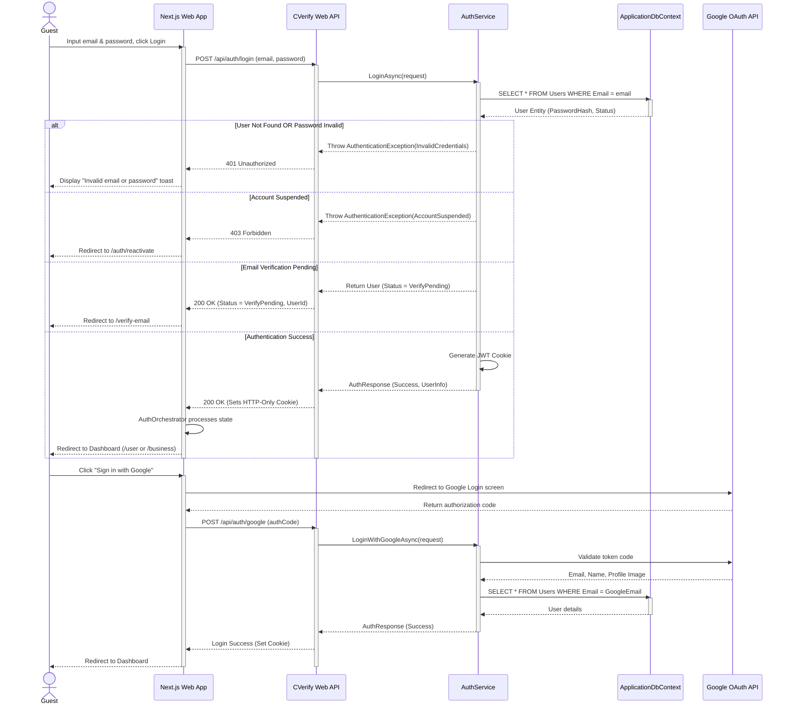
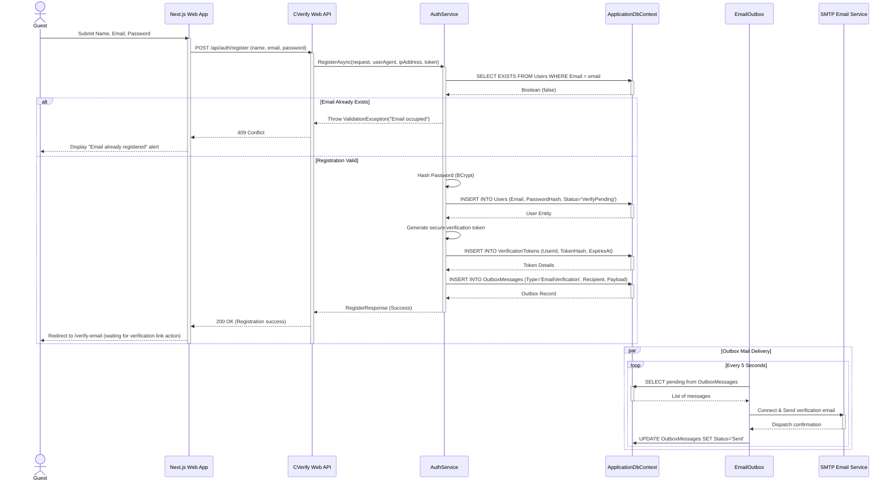
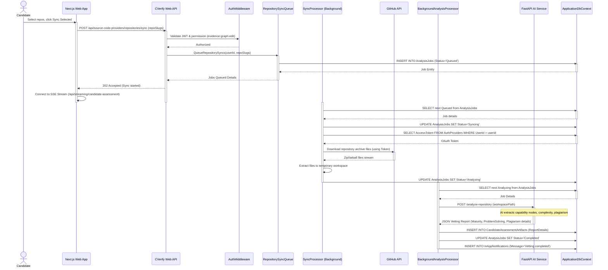
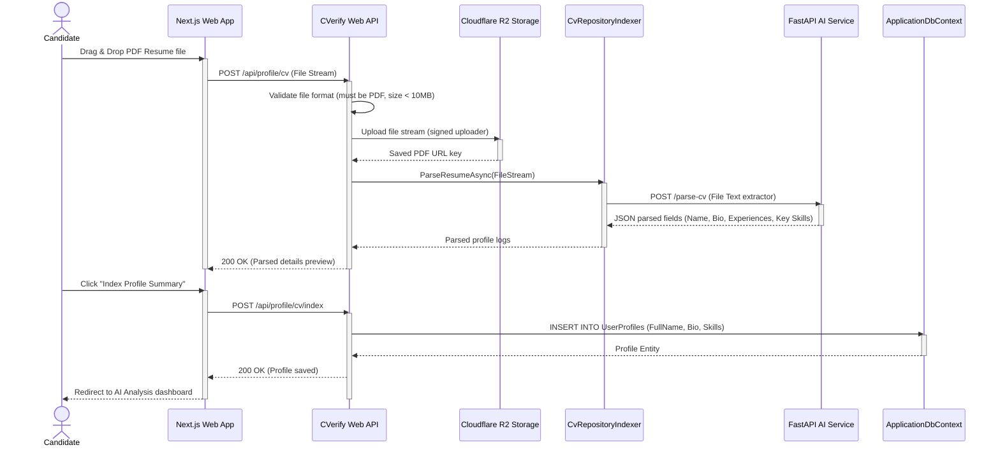
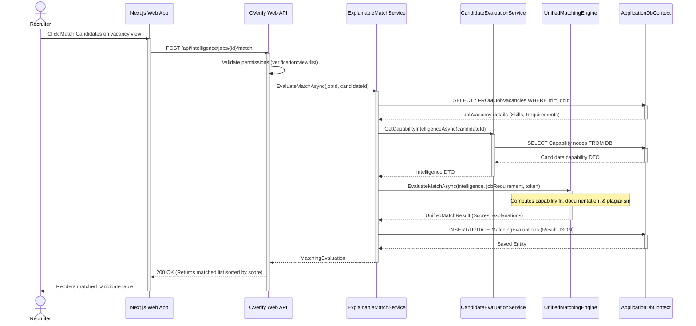
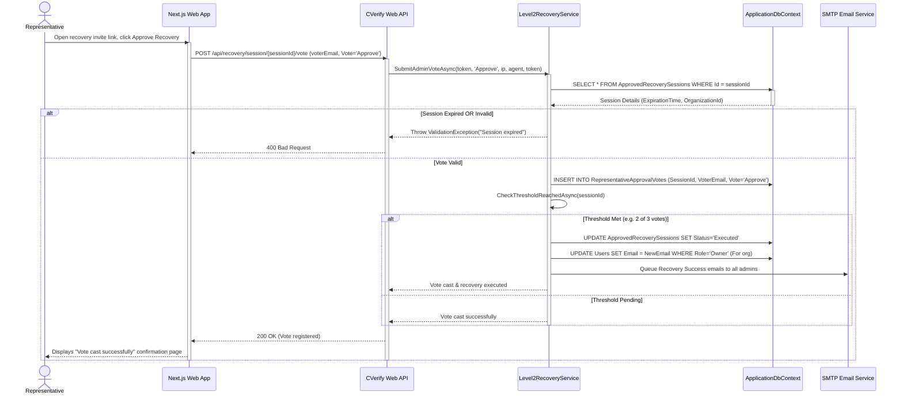

# Sequence Diagrams

This document contains runtime sequence diagrams detailing the interactions between users, the Next.js frontend, backend controllers, services, database contexts, and external systems.

---

## Overview

These sequence diagrams illustrate the runtime behavior of the CVerify platform. They document the authentication handshake, repository analysis pipelines, CV parsing, recruiter matching checks, and multi-sig representative voting recovery sessions.

---

## Authentication

### Login Flow

#### Feature Name: Login & Session Initiation

#### Purpose: Authenticate credentials, handle unverified states, and issue session cookies.

#### Trigger: Guest clicks the "Sign In" button on `/login`.

#### Preconditions: User account exists in database.

#### Sequence Diagram:

#### Alternative Flows:
* **Google registration**: If a Google account does not exist in the database, the system registers them, sets status to `Active`, and logs them in.

#### Error Flows:
* **Rate Limits**: IP address sending more than 5 login attempts per minute receives a 429 Too Many Requests response.

#### Postconditions:
* Authenticated user session registered in Redis cache.

#### Database Operations:
* `SELECT` from `users` (query email).
* `INSERT` into `audit_logs` (log authentication event).

#### APIs Invoked:
* `POST /api/auth/login` (Internal)
* `POST https://oauth2.googleapis.com/token` (External)

#### Security Checks:
* Password compared using Identity PasswordHasher.
* Origin checks verifying IP and User-Agent headers.

---

### Register Flow

#### Feature Name: User Account Registration

#### Purpose: Register user records and deliver email verification links.

#### Trigger: User submits registration form on `/continue-with-email`.

#### Preconditions: None.

#### Sequence Diagram:

#### Database Operations:
* `SELECT` from `users` (check email existence).
* `INSERT` into `users` (create user).
* `INSERT` into `verification_tokens` (store hashed validation token).
* `INSERT` into `outbox_messages` (queue email verification).

#### APIs Invoked:
* `POST /api/auth/register` (Internal)

#### Security Checks:
* Input validation verifying email syntax and password complexity rules.
* Redirect domain validation checking against trusted host list configurations.

---

## Repository Management

### Sync & Analysis Flow

#### Feature Name: Source Code Repository Sync & AI Vetting

#### Purpose: Download repository codebase files and run AI vetting diagnostics.

#### Trigger: Candidate checks repositories and clicks "Sync Selected" in `/settings/source-code-providers`.

#### Preconditions: Candidate's GitHub/GitLab OAuth token is linked.

#### Sequence Diagram:

#### Database Operations:
* `SELECT` from `auth_providers` (OAuth tokens).
* `INSERT` / `UPDATE` on `analysis_jobs`.
* `INSERT` into `candidate_assessment_artifacts`.

#### APIs Invoked:
* `POST /api/source-code-providers/repositories/sync` (Internal API)
* `GET https://api.github.com/repos/{owner}/{repo}/zipball` (External API)
* `POST {FastApiUrl}/analyze-repository` (External AI Service)

---

## AI Analysis

### Resume Vetting & Assessment Flow

#### Feature Name: Resume CV Parsing & Evaluation

#### Purpose: Upload PDF files, parse experience, and index candidate summaries.

#### Trigger: Candidate drops a PDF resume in the dropzone on `/cv`.

#### Preconditions: Candidate account verified.

#### Sequence Diagram:

#### Database Operations:
* `INSERT` / `UPDATE` on `user_profiles`.
* `INSERT` into `profile_attachments` (R2 URLs).

---

## Recruitment

### Candidate Match Sourcing Flow

#### Feature Name: Job JD Candidate Sourcing Match

#### Purpose: Analyze candidates eligibility matches for a Job vacancy.

#### Trigger: Recruiter clicks "Match Candidates" on `/recruitment/jd/[id]/review`.

#### Preconditions: JD exists and has extracted requirements.

#### Sequence Diagram:

---

## Emergency Recovery

### Multi-sig Representative Voting Flow

#### Feature Name: Multi-sig Representative Lockout Recovery Vote

#### Purpose: Cast representative votes to authorize owner email changes.

#### Trigger: Representative clicks vote option link on `/organization/recovery/vote`.

#### Preconditions: Active recovery session.

#### Sequence Diagram:

#### Database Operations:
* `SELECT` from `approved_recovery_sessions`.
* `INSERT` into `representative_approval_votes`.
* `UPDATE` on `approved_recovery_sessions`.
* `UPDATE` on `users` (owner email rotation).
