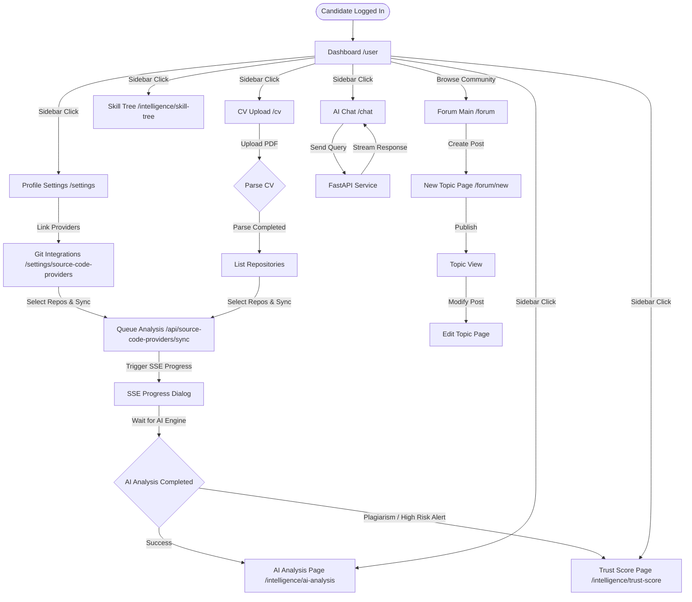

# Candidate / Developer Screen Flow Audit

## Actor Overview

* **Description**: A Candidate (also referred to as a Developer) represents an individual seeking validation of their technical capabilities and code authenticity. Candidates connect their code repositories and resumes to construct evidence graphs, calculate trust indices, and apply for verified vacancies.
* **Responsibilities**:
  * Authenticate, verify their email address, and customize profile information.
  * Connect external Git repositories (GitHub/GitLab OAuth linkage).
  * Upload resume/CV to trigger parsing and semantic indexing.
  * Run and track AI-based code evaluations to extract capability signals, strengths/weaknesses, and best-fit industry roles.
  * View their verified skill tree nodes and code authenticity metrics.
  * Browse the global public jobs board and apply for vacancies.
  * Interact with the AI Chat assistant to refine credentials and evaluate job matches.
  * Create, reply to, and edit topics on the developer forum.
* **Permissions**:
  * Role mapping: `USER`.
  * Permissions assigned in permission registry:
    * `evidence:graph:view` (Read technical profile graphs).
    * `evidence:graph:create` (Generate code evidence graphs).
    * `evidence:graph:edit` (Update owned developer profiles).
    * `evidence:collaborator:join` (Join peer review boards).
    * `evidence:collaborator:comment` (Comment on peer evidence graphs).
    * `ai:chat:use` (Ask AI query streams).
* **Accessible Modules**:
  * User Dashboard (`/user`)
  * AI Chat Assistant (`/chat`)
  * CV Upload and parser (`/cv`)
  * AI analysis results (`/intelligence/ai-analysis`)
  * Skill tree layout (`/intelligence/skill-tree`)
  * Trust score breakdown (`/intelligence/trust-score`)
  * Account settings (`/settings`)
  * Integrations page (`/settings/source-code-providers`)
  * Community Forum (create and edit topics `/forum/new` and `/forum/topic/[topicSlug]/edit`)
  * Public browse pages (Landing `/`, Jobs `/jobs`, Leaderboard `/ranking`, Forum Category `/forum/[categorySlug]`, Topic `/forum/topic/[topicSlug]`, public company workspace `/business/[organizationSlug]`)
* **Restricted Modules**:
  * Platform administrative panel (`/admin` and sub-routes).
  * Private business dashboards (`/business/[organizationSlug]/(private)/*` paths).
  * Direct CRUD operations on other users' profiles, organization setups, or system roles.

---

## Screen Inventory

### 1. Developer Dashboard Page
* **Route / URL**: `/user`
* **Entry Point**: Log in redirect, or sidebar "Dashboard" selection.
* **Purpose**: Overview of candidate profile information, current verification roles, sandbox widgets, and system activities.
* **Required Permission**: None (gated via layout `AuthGuard` check).
* **Components Involved**:
  * `UserDashboardView`
  * `Card`, `Button`, `PermissionGuard`
* **API Calls**: None (hydrated from `useAuth` session state).
* **Backend Services**: `IAuthService` (returns session details).
* **Database Entities**: `User`, `RoleAssignment`.
* **State Transitions**:
  * Toggles sandbox elements based on interactive permission changes.
* **Navigation Destinations**: `/cv`, `/settings/source-code-providers`, `/intelligence/trust-score`, `/chat`.
* **Preconditions**: Session cookie must be valid and email verified.
* **Postconditions**: None.
* **Error States**: Session timeout (Redirects to `/login`).
* **Empty States**: If no roles are loaded, displays general developer card.
* **Loading States**: None (instant hydration).
* **Success States**: View displays.

### 2. CV Upload Page
* **Route / URL**: `/cv`
* **Entry Point**: Sidebar "Resume & CV" link.
* **Purpose**: Upload PDF resume files, parse experience, and trigger indexers.
* **Required Permission**: `evidence:graph:create`.
* **Components Involved**: File drop zone, progress bar, parsed profile previews.
* **API Calls**:
  * `POST /api/profile/cv` (Uploads file stream, returns parsed text).
  * `POST /api/profile/cv/index` (Triggers background CV indexing task).
* **Backend Services**: `IStorageService` (R2 upload), `ICvRepositoryIndexer` (triggers parsing).
* **Database Entities**: `ProfileAttachment`, `User`, `CandidateAssessment`.
* **State Transitions**: 
  * File selection -> Uploading state -> Parsing state -> Success preview -> Triggers indexing progress stream.
* **Navigation Destinations**: `/intelligence/ai-analysis`.
* **Preconditions**: File must be a valid PDF smaller than 10MB.
* **Postconditions**: File successfully stored on R2 bucket and metadata registered.
* **Error States**:
  * Upload size limits exceeded (displays file too large toaster).
  * Parser timeout (shows retry parse button).
* **Empty States**: No CV uploaded yet (renders upload icon, drag-and-drop boundary box).
* **Loading States**: File upload progress bar.
* **Success States**: Lists parsed employment history blocks and enables "Index Repositories" CTA.

### 3. AI Analysis Report Page
* **Route / URL**: `/intelligence/ai-analysis`
* **Entry Point**: Sidebar "AI Analysis" link, or automatically redirected post CV/repo analysis.
* **Purpose**: Detailed report on candidate's executive summary, strengths, watchpoints, engineering maturity, bug-solving logs, and recommended industry roles.
* **Required Permission**: `evidence:graph:view`.
* **Components Involved**:
  * `AiAnalysisPage`
  * `CandidateAssessmentEmptyState`
* **API Calls**:
  * `GET /api/candidate/readiness` (via `useAssessment`).
  * `GET /api/candidate/assessments/latest` (fetches latest evaluation).
  * `GET /api/candidate/assessments/{id}/details` (fetches full artifacts details).
* **Backend Services**: `ICandidateAssessmentService`, `ICareerReadinessEngine`.
* **Database Entities**: `CandidateAssessment`, `CandidateAssessmentArtifact`, `CandidateBestFitRole`, `CandidateStrengthWeakness`.
* **State Transitions**: Hydrates layout if completed -> parses JSON payload in background store.
* **Navigation Destinations**: `/intelligence/trust-score`, `/intelligence/skill-tree`, `/chat`.
* **Preconditions**: Candidate must have completed at least one repository sync and evaluation pipeline.
* **Postconditions**: Details fetched and cached.
* **Error States**: Database connection error (shows reload warning).
* **Empty States**: No evaluations found (displays `CandidateAssessmentEmptyState` with a "Trigger Assessment Now" CTA button).
* **Loading States**: Spinning loading card while parsing reports.
* **Success States**: Renders Executive Headline and alignment grid tables.

### 4. Skill Tree Page
* **Route / URL**: `/intelligence/skill-tree`
* **Entry Point**: Sidebar "Skill Tree" link.
* **Purpose**: Interactive 2D graph visualizing the developer's core capability catalog nodes, verified by code commits.
* **Required Permission**: `evidence:graph:view`.
* **Components Involved**: Interactive canvas graph, skill details info sheet.
* **API Calls**: `GET /api/candidate/skill-tree` (resolves node links).
* **Backend Services**: `ISkillTreeValidationService`, `ITalentGraphBuilder`.
* **Database Entities**: `CandidateSkillTreeNode`, `CapabilityNode`.
* **State Transitions**: Clicking node expands side panel containing commit hashes and authenticity details.
* **Navigation Destinations**: `/[username]`.
* **Preconditions**: Code analysis has mapped repository technology.
* **Postconditions**: None.
* **Error States**: Graph loading failure (displays fallback list of skills).
* **Empty States**: Empty nodes list (shows "Connect a repository to map your skill tree" illustration).
* **Loading States**: Canvas loads loading skeleton indicator.
* **Success States**: Renders SVG nodes graph.

### 5. Code Authenticity / Trust Score Page
* **Route / URL**: `/intelligence/trust-score`
* **Entry Point**: Sidebar "Trust Index" link.
* **Purpose**: Analysis of code plagiarism, copied packages, contribution distribution, and git credentials verify metrics.
* **Required Permission**: `evidence:graph:view`.
* **Components Involved**: Radial score gauge, Plagiarism alerts card, Code volume chart.
* **API Calls**: `GET /api/candidate/trust-score` (Calculates trust factors).
* **Backend Services**: `ITrustEngineService`.
* **Database Entities**: `CandidateTrustProjection`, `TrustComponent`, `EvidenceClaim`.
* **State Transitions**: None.
* **Navigation Destinations**: `/settings/source-code-providers`.
* **Preconditions**: Evaluation pipeline completed.
* **Postconditions**: None.
* **Error States**: Plagiarism database unreachable (displays fallback warning).
* **Empty States**: Trust factors at zero (renders "No evaluations logged yet" badge).
* **Loading States**: Calculation details skeleton loaders.
* **Success States**: Displays radial chart showing final score (e.g. 94.2) and verified badges (e.g. Authenticity Verified).

### 6. Account Settings Page
* **Route / URL**: `/settings`
* **Entry Point**: Sidebar "Settings" link, or avatar menu settings link.
* **Purpose**: Customize bio, full name, profile visibility, and opt-in settings for recruitment search.
* **Required Permission**: None.
* **Components Involved**: Profile form, toggle switches.
* **API Calls**: `PUT /api/profile` (updates user details).
* **Backend Services**: `IProfileService`.
* **Database Entities**: `User`, `UserProfile`.
* **State Transitions**: Submitting values -> updates local authentication context store.
* **Navigation Destinations**: `/settings/source-code-providers`, `/[username]`.
* **Preconditions**: None.
* **Postconditions**: Details synced to database.
* **Error States**: Bio exceeds 500 characters limit.
* **Empty States**: None.
* **Loading States**: "Saving changes..." progress spinner.
* **Success States**: Success toast -> page updates profile details.

### 7. Integrations (Source Code Providers) Page
* **Route / URL**: `/settings/source-code-providers`
* **Entry Point**: Navigation link inside settings page.
* **Purpose**: Direct link to connect GitHub or GitLab profiles and sync repositories.
* **Required Permission**: `evidence:graph:edit`.
* **Components Involved**: Linkage status cards, repository checklist, synchronization status list.
* **API Calls**:
  * `GET /api/source-code-providers` (current OAuth connections).
  * `POST /api/source-code-providers/connect` (initiates OAuth redirect).
  * `GET /api/source-code-providers/repositories` (lists remote repos).
  * `POST /api/source-code-providers/repositories/sync` (syncs selected repos).
* **Backend Services**: `ISourceCodeProviderService`, `IRepositorySyncQueue`.
* **Database Entities**: `AuthProvider`, `SourceCodeRepository`, `AnalysisJob`.
* **State Transitions**: 
  * Connect -> triggers popup window -> Google/GitHub OAuth callback -> redirects back -> refreshes table.
  * Repository checkbox check -> triggers "Analyze Selected" -> starts real-time SSE progress dialog.
* **Navigation Destinations**: `/intelligence/ai-analysis`.
* **Preconditions**: Valid GitHub/GitLab account.
* **Postconditions**: Repository records saved, analysis jobs queued.
* **Error States**: OAuth authorization timeout (returns to page with error alert).
* **Empty States**: No repository connections logged (renders "Link your GitHub account" prompt).
* **Loading States**: Fetching repositories list skeletons.
* **Success States**: Repository status updates to "Queued / Syncing".

### 8. AI Chat Assistant Page
* **Route / URL**: `/chat`
* **Entry Point**: Sidebar "AI Chat" link.
* **Purpose**: Conversational workspace where developers can ask about their capability graph or simulate mock interviews.
* **Required Permission**: `ai:chat:use`.
* **Components Involved**: Messages thread viewport, message text field, prompt suggestions container.
* **API Calls**: `POST /api/aichat/stream` (handles SSE streams for AI responses).
* **Backend Services**: `IAiStreamingSessionService`, `IHttpClientFactory` (AI Service client).
* **Database Entities**: `AiStreamingSession`, `AiStreamingLog`.
* **State Transitions**: Typing query -> adds message to local list -> streams markdown response chunks -> appends to conversation.
* **Navigation Destinations**: `/intelligence/skill-tree`, `/jobs`.
* **Preconditions**: AI Service must be active and rate-limit permits.
* **Postconditions**: Log entry created for cost tracking.
* **Error States**: 
  * AI Service timeout (displays message "AI Assistant took too long, try again").
  * Rate limit (displays "Limit exceeded: 10 messages per minute").
* **Empty States**: Default chat view displaying template queries.
* **Loading States**: Blinking indicator while waiting for first SSE chunk.
* **Success States**: Smooth streaming text.

### 9. New Forum Topic Page
* **Route / URL**: `/forum/new`
* **Entry Point**: Click "New Topic" button on `/forum`.
* **Purpose**: Publish a new discussion post to community channels.
* **Required Permission**: `evidence:collaborator:comment`.
* **Components Involved**: Topic title field, Category selection menu, Markdown editor, Publish button.
* **API Calls**: `POST /api/forum/topics` (creates category topic).
* **Backend Services**: `IForumService`.
* **Database Entities**: `ForumTopic`, `ForumCategory`.
* **State Transitions**: None.
* **Navigation Destinations**: `/forum/topic/[topicSlug]`.
* **Preconditions**: Verified developer account.
* **Postconditions**: Topic created in the database.
* **Error States**: Title too short (Validation warning).
* **Empty States**: Blank editor form.
* **Loading States**: Publishing topic overlay.
* **Success States**: Redirects directly to new topic URL.

### 10. Edit Forum Topic Page
* **Route / URL**: `/forum/topic/[topicSlug]/edit`
* **Entry Point**: Click "Edit" link inside owned topic thread page.
* **Purpose**: Update topic contents.
* **Required Permission**: `evidence:graph:edit`.
* **Components Involved**: Markdown editor, Save button.
* **API Calls**: `PUT /api/forum/topic/{slug}` (applies edits).
* **Backend Services**: `IForumService`.
* **Database Entities**: `ForumTopic`.
* **State Transitions**: Saves draft -> applies modifications -> redirects to thread.
* **Navigation Destinations**: `/forum/topic/[topicSlug]`.
* **Preconditions**: Logged-in user must match topic author.
* **Postconditions**: Topic record updated.
* **Error States**: Edits fail due to post locks or moderation flag.
* **Empty States**: Pre-populated with existing topic content.
* **Loading States**: Updating topic spinner.
* **Success States**: Returns to the topic page.

---

## Navigation Flow

```
                     [Dashboard (/user)]
                       │
      ┌────────────────┼──────────────┬────────────────┐
      ▼                ▼              ▼                ▼
  [AI Chat]     [CV Upload]    [Integrations]    [Settings]
  (/chat)         (/cv)           (/settings/      (/settings)
                                  source-code)         │
                       │              │                ▼
                       ▼              ▼          [Public Profile]
               [AI Analysis] ◄────────┘            (/[username])
          (/intelligence/ai-analysis)
                       │
          ┌────────────┴────────────┐
          ▼                         ▼
    [Skill Tree]             [Trust Score]
  (/intelligence/          (/intelligence/
     skill-tree)              trust-score)
```

---

## Mermaid Diagram



---

## API Dependencies

* `PUT /api/profile` (updates user bio and visibility details)
* `POST /api/profile/cv` (uploads resume PDF and parses data)
* `POST /api/profile/cv/index` (indexes parsed resume into database)
* `GET /api/candidate/readiness` (returns evaluation status and logs)
* `GET /api/candidate/assessments/latest` (fetches latest calculated assessment report)
* `GET /api/candidate/assessments/{id}/details` (fetches detailed maturity/problem-solving reports)
* `POST /api/candidate/assessments/trigger` (requests background analysis of connected repos)
* `GET /api/candidate/skill-tree` (resolves node links for D3/canvas layout)
* `GET /api/candidate/trust-score` (returns plagiarism and credentials metrics)
* `GET /api/source-code-providers` (lists active VCS OAuth tokens)
* `POST /api/source-code-providers/connect` (starts OAuth flow)
* `GET /api/source-code-providers/repositories` (lists remote user codebases)
* `POST /api/source-code-providers/repositories/sync` (adds codebase to analysis queue)
* `POST /api/aichat/stream` (handles SSE streams for chat responses)
* `POST /api/forum/topics` (creates category discussion)
* `PUT /api/forum/topic/{slug}` (updates community post contents)

---

## Database Dependencies

* `users` & `user_profiles`: Store account data, bios, and search preferences.
* `auth_providers`: OAuth access credentials for GitHub/GitLab.
* `source_code_repositories`: Codebase metadata, sizes, sync timestamps.
* `analysis_jobs` & `analysis_tasks`: Pipelines execution queues.
* `candidate_assessments` & `candidate_assessment_artifacts`: Detailed evaluation data.
* `candidate_best_fit_roles`: Career trajectory recommendations.
* `candidate_strength_weaknesses`: Key engineering traits.
* `candidate_skill_tree_nodes` & `user_skills`: Link verified nodes.
* `candidate_trust_projections`: Feeds Trust Index.
* `ai_streaming_sessions` & `ai_streaming_logs`: Chat memory logs.
* `forum_topics`: Tracks candidate discussion posts.

---

## Edge Cases

* **Disconnected VCS Integrations**: Candidate has connected GitHub, but the OAuth token is revoked from GitHub Settings.
  * *Handling*: The sync action returns a 401 Unauthorized. The frontend intercepts this to display a "Re-authenticate Connection" action button.
* **Corrupted Resume Parsing**: PDF format utilizes custom layers or scanned image content that can't be parsed by OCR/Text extractors.
  * *Handling*: The backend returns an empty parsed details response. The frontend renders a warning banner and prompts the candidate to copy-paste their summary manually.
* **Evaluation Pipeline Interruption**: Navigating away from the dashboard during an active repository analysis.
  * *Handling*: The background process runs on the .NET host asynchronously. When the candidate returns to the dashboard, the store fetches `/api/candidate/assessments/latest` and automatically reconnects to the active SSE progress stream.

---

## Findings

* **Missing CV File Cleanups**: When a candidate uploads a new CV, the old file remains in the R2 bucket directory structure under their user ID. There is no background clean-up task or file replacement, causing R2 bucket storage creep.
* **Exposed Private Commits**: During repo sync, the backend indexes all commits including commit messages. If a private repository is sync'd and then the profile is set to `public`, private commit messages and author email details are visible to public visitors without scrubbing.
* **Lack of Chat Context Limit Enforcements**: The `aichat` controller saves all message logs to database without a hard count constraint. Large conversation histories cause database performance degradation and massive API token costs.

---

## Improvement Suggestions

* **Repository Garbage Collection**: Implement file replacements in `R2StorageService` when updating CV attachments.
* **Scrub Commit Signatures**: Ensure that when rendering public profiles, private email signatures and sensitive repository commit descriptions are sanitized.
* **Chat Log Windowing**: Enforce a token sliding-window check or message count limit on conversational logs to prevent cost leaks.
