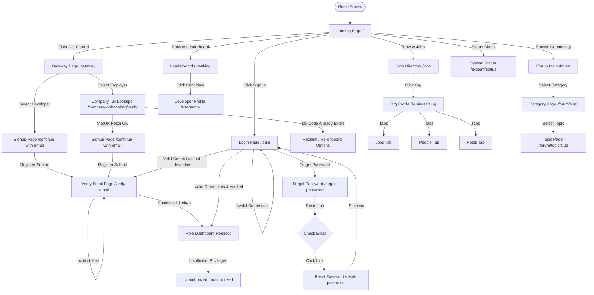

# Guest Screen Flow Audit

## Actor Overview

* **Description**: A Guest is any unauthenticated or anonymous visitor accessing the CVerify platform.
* **Responsibilities**: 
  * Discover platform features and services.
  * Search, browse, and filter public developer profiles, company profiles, job vacancies, and rankings.
  * Register a new account (Developer vs Company).
  * Read forum categories, topics, and replies.
  * Accept company invitations.
  * Perform password recovery and verification actions.
* **Permissions**:
  * No authenticated JWT bearer token.
  * Restricted to public endpoints (`GET` endpoints for public rankings, jobs, forums, profiles, and health checks).
* **Accessible Modules**:
  * Landing page (`/`)
  * Auth pages (`/login`, `/continue-with-email`, `/forgot-password`, `/reset-password`, `/gateway`, `/verify-email`)
  * Onboarding pages (`/company-onboarding/verify`, `/invitations/accept`)
  * Public job listings (`/jobs`)
  * Public rankings (`/ranking`, `/ranking/insights`)
  * Public forum categories & topics (`/forum`, `/forum/[categorySlug]`, `/forum/topic/[topicSlug]`)
  * Public organization pages (`/business/[organizationSlug]`, `/business/[organizationSlug]/jobs`, `/business/[organizationSlug]/people`, `/business/[organizationSlug]/posts`)
  * Public developer profiles (`/[username]`)
  * System health (`/system/status`)
  * Error page (`/unauthorized`)
* **Restricted Modules**:
  * System Admin panel (`/admin` and sub-routes).
  * Candidate dashboard (`/user` and sub-routes).
  * Private business dashboards (`/business/[organizationSlug]/(private)` and sub-routes).
  * Private workspaces and private talent pool.
  * AI chat assistant (`/chat`).
  * CV upload and indexing (`/cv`).
  * AI analysis results, skill trees, and private trust score details.
  * Post / Reply creation or editing in the forum (`/forum/new`, `/forum/topic/[topicSlug]/edit`, `/forum/moderation`).

---

## Screen Inventory

### 1. Public Landing Page
* **Route / URL**: `/`
* **Entry Point**: Direct browser entry.
* **Purpose**: General marketing page demonstrating developer evaluation pipelines and trust scoring.
* **Required Permission**: None (public).
* **Components Involved**:
  * `PublicNavigationHeader`
  * `Magnet`, `SplitText`, `SpotlightCard`, `DecryptedText`, `ShinyText` (Aesthetic components)
  * `NetworkBackground`, `SideRays`, `ClickSpark`
* **API Calls**: None (uses simulated frontend states).
* **Backend Services**: None.
* **Database Entities**: None.
* **State Transitions**: 
  * Interactive step-by-step pipeline simulation states (steps 0 to 3).
  * Trust score animation states (0 -> 34 -> 78 -> 94.2).
* **Navigation Destinations**: `/login`, `/gateway`, `/jobs`, `/ranking`, `/forum`.
* **Preconditions**: None.
* **Postconditions**: None.
* **Error States**: None.
* **Empty States**: None.
* **Loading States**: None.
* **Success States**: Static display.

### 2. Login Page
* **Route / URL**: `/login`
* **Entry Point**: Navigation header "Sign In" button, or automatic redirect from protected route.
* **Purpose**: Collect credentials or Google OAuth authentication to log the user in.
* **Required Permission**: None.
* **Components Involved**:
  * `LoginView` (form, inputs for Email and Password, Submit button).
  * Google OAuth button.
* **API Calls**:
  * `POST /api/auth/login` (email + password payload).
  * `POST /api/auth/google` (Google access token verification).
* **Backend Services**: `IAuthService`, `ITokenService`, `IGoogleTokenValidator`.
* **Database Entities**: `User`, `Role`, `UserRole`, `RefreshToken`, `AuditLog`.
* **State Transitions**:
  * Form inputs update local validation states.
  * Authentication success sets HTTP-only `access_token` and `refresh_token` cookies.
  * `AuthOrchestrator` redirects to default role dashboards (`/admin`, `/business`, `/user`) or the `callbackUrl` path.
* **Navigation Destinations**: `/forgot-password`, `/gateway`, `/continue-with-email`.
* **Preconditions**: None.
* **Postconditions**: User is authenticated and redirected.
* **Error States**: 
  * `AUTH_INVALID_CREDENTIALS` (Invalid email/password, prompts retry).
  * `AUTH_EMAIL_VERIFY_PENDING` (Email unverified, redirects to `/verify-email`).
  * `AUTH_LOCKED_OUT` (Too many failed logins, sets cooldown).
* **Empty States**: None.
* **Loading States**: Submit button shows loading spinner.
* **Success States**: Toasts success message and triggers redirection.

### 3. Forgot Password Page
* **Route / URL**: `/forgot-password`
* **Entry Point**: Link on `/login` screen.
* **Purpose**: Request a password reset link to be sent to user's email.
* **Required Permission**: None.
* **Components Involved**: Email input form, submit button.
* **API Calls**: `POST /api/auth/forgot-password` (Email payload).
* **Backend Services**: `IPasswordRecoveryService`, `IEmailService`, `IRateLimitPolicyService`.
* **Database Entities**: `User`, `ResetPasswordToken`.
* **State Transitions**: Submit forms -> triggers email outbox -> displays notification check email.
* **Navigation Destinations**: `/login`.
* **Preconditions**: None.
* **Postconditions**: Reset token is sent to the user email (if it exists).
* **Error States**: `ForgotPasswordLimit` rate limit partition exceeded (Status 429).
* **Empty States**: None.
* **Loading States**: Submitting reset request indicator.
* **Success States**: Success message asking user to check inbox.

### 4. Reset Password Page
* **Route / URL**: `/reset-password` (expected query params: `?token=...&email=...`)
* **Entry Point**: Click link inside the password reset email.
* **Purpose**: Set a new password for the account.
* **Required Permission**: None (authenticated via token validation).
* **Components Involved**: New password input, confirm password input, submit button.
* **API Calls**: `POST /api/auth/reset-password` (Email, Token, Password payload).
* **Backend Services**: `IPasswordRecoveryService`, `IPasswordPolicyService`.
* **Database Entities**: `User`, `ResetPasswordToken`.
* **State Transitions**: Validates token -> updates user password hash -> invalidates token.
* **Navigation Destinations**: `/login`.
* **Preconditions**: Token must be present, active, and not expired.
* **Postconditions**: Password updated successfully.
* **Error States**:
  * `AUTH_INVALID_TOKEN` / `AUTH_EXPIRED_TOKEN` (Displays token invalid banner).
  * `AUTH_PASSWORD_POLICY_VIOLATION` (Password is too weak or fails policy).
* **Empty States**: None.
* **Loading States**: Resetting password progress bar.
* **Success States**: Redirects user to `/login` with success toast.

### 5. Verify Email Page
* **Route / URL**: `/verify-email`
* **Entry Point**: Redirected automatically post-registration or when user clicks the secure link in email.
* **Purpose**: Submit the verification token sent to the user's email to activate the account.
* **Required Permission**: None (requires session access cookie).
* **Components Involved**: Verification loader, manual token input field, resend link with countdown timer.
* **API Calls**:
  * `POST /api/auth/verify-email` (Verification token payload).
  * `POST /api/auth/resend-verification` (Resends verification email).
* **Backend Services**: `IAuthService`, `IEmailService`.
* **Database Entities**: `User`, `VerificationToken`.
* **State Transitions**: 
  * Parsing token parameter triggers auto-verify.
  * Success transitions user status to `ACTIVE`.
* **Navigation Destinations**: Dashboard mapped to user role.
* **Preconditions**: User account must exist, status `EMAIL_VERIFY_PENDING`.
* **Postconditions**: User email is marked verified, status changes to `ACTIVE`.
* **Error States**:
  * `AUTH_INVALID_TOKEN` (Shows red inline validation error).
  * `AUTH_RATE_LIMIT_EXCEEDED` (Resending too quickly, triggers cooldown).
* **Empty States**: None.
* **Loading States**: Verification spinner.
* **Success States**: Redirect to dashboard.

### 6. Gateway Page
* **Route / URL**: `/gateway`
* **Entry Point**: Landing page "Get Started" CTA, or Navigation header "Sign Up" button.
* **Purpose**: Choose the path of registration (Candidate/Developer vs Employer/Business).
* **Required Permission**: None.
* **Components Involved**: Dual option selector cards (Developer Card, Organization Card).
* **API Calls**: None.
* **Backend Services**: None.
* **Database Entities**: None.
* **State Transitions**: None.
* **Navigation Destinations**: 
  * `/continue-with-email?role=developer` (Developer selection).
  * `/company-onboarding/verify` (Business selection).
* **Preconditions**: None.
* **Postconditions**: None.
* **Error States**: None.
* **Empty States**: None.
* **Loading States**: None.
* **Success States**: Redirection.

### 7. Company Onboarding Verify Page
* **Route / URL**: `/company-onboarding/verify`
* **Entry Point**: Gateway "Employer" selection.
* **Purpose**: Input organization tax code to fetch legal company metadata and verify corporate identity.
* **Required Permission**: None.
* **Components Involved**: Tax code text field, Lookup button, VietQR company detail preview card.
* **API Calls**:
  * `GET https://api.vietqr.io/v2/business/{taxCode}` (External API).
  * `POST /api/auth/organization/verify-tax-code` (Validates if tax code is already registered).
* **Backend Services**: `IHttpClientFactory` (VietQR registry client).
* **Database Entities**: `Organization`.
* **State Transitions**: Input tax code -> fetch business profile -> render company detail -> proceed to email signup.
* **Navigation Destinations**: `/continue-with-email?role=business&taxCode=...&companyName=...`.
* **Preconditions**: None.
* **Postconditions**: Selected company metadata passes initial uniqueness checks.
* **Error States**:
  * Tax code not found on VietQR registry (Validation warning, allows manual edit).
  * Tax code already registered on CVerify (Redirects to organization recovery options or reclamation page `/organization/reclaim`).
* **Empty States**: Detail preview card is hidden until tax code is queried.
* **Loading States**: Querying national business database progress spinner.
* **Success States**: Renders fetched company address, legal name, and enables "Next" button.

### 8. Continue With Email Page
* **Route / URL**: `/continue-with-email` (expected query params: `?role=...&taxCode=...&companyName=...`)
* **Entry Point**: Gateway selector or Company onboarding tax code lookup.
* **Purpose**: Register an account using email credentials.
* **Required Permission**: None.
* **Components Involved**: Full name input, Email input, Password input, Password validation meter.
* **API Calls**: `POST /api/auth/register` (Registration payload: Email, Password, Full Name, Role, TaxCode).
* **Backend Services**: `IAuthService`, `IPasswordPolicyService`, `IEmailService`.
* **Database Entities**: `User`, `Role`, `UserRole`, `Organization`, `Workspace`, `WorkspaceMember`.
* **State Transitions**: Submit registration details -> creates user and workspace -> triggers verification link email -> redirects to `/verify-email`.
* **Navigation Destinations**: `/login`, `/verify-email`.
* **Preconditions**: None.
* **Postconditions**: Account created, email verification pending.
* **Error States**:
  * `AUTH_EMAIL_ALREADY_EXISTS` (Email is already registered).
  * `AUTH_PASSWORD_TOO_WEAK` (Fails password rules).
* **Empty States**: None.
* **Loading States**: Creating account loading indicator.
* **Success States**: Success toast -> Redirect to `/verify-email`.

### 9. Invitations Accept Page
* **Route / URL**: `/invitations/accept` (expected query params: `?token=...`)
* **Entry Point**: Click invitation link in email.
* **Purpose**: Add user as a member of an organization/workspace.
* **Required Permission**: None.
* **Components Involved**: Invitation preview card, Accept button, Reject button, Redirect link.
* **API Calls**:
  * `GET /api/invitation/{token}` (Fetch details: Org Name, Inviter Name, Role).
  * `POST /api/invitation/accept` (Accept invitation).
* **Backend Services**: `IOrganizationInvitationService`, `IWorkspaceMembershipService`.
* **Database Entities**: `OrganizationInvitation`, `WorkspaceMember`, `OrganizationMembership`.
* **State Transitions**: Validates token -> creates membership records -> redirects to login/dashboard.
* **Navigation Destinations**: `/login`, `/business/[organizationSlug]/dashboard`.
* **Preconditions**: Invitation token must be active and not expired.
* **Postconditions**: User is mapped as a member in the database.
* **Error States**: Invalid invitation token (Displays token expired error page).
* **Empty States**: None.
* **Loading States**: Resolving token details skeletons.
* **Success States**: Redirection to dashboard.

### 10. Public Jobs Page
* **Route / URL**: `/jobs`
* **Entry Point**: Navigation header "Jobs" link.
* **Purpose**: View and filter public job vacancies listed by companies.
* **Required Permission**: None.
* **Components Involved**: Search filter sidebar, Job cards list, Paginations.
* **API Calls**: `GET /api/public/jobs?search=...&page=...` (fetches public vacancies).
* **Backend Services**: `IPublicJobService`.
* **Database Entities**: `JobVacancy`, `Organization`.
* **State Transitions**: Typing query updates search params.
* **Navigation Destinations**: `/login` (to apply), `/business/[organizationSlug]/jobs`.
* **Preconditions**: None.
* **Postconditions**: None.
* **Error States**: Network failure (shows retry button).
* **Empty States**: No jobs match filters (shows empty state illustration).
* **Loading States**: Skeletons for job cards.
* **Success States**: Renders paginated listings.

### 11. Public Developer Rankings Page
* **Route / URL**: `/ranking`
* **Entry Point**: Navigation header "Leaderboards" link.
* **Purpose**: View global developer leaderboard by verified trust score and capability points.
* **Required Permission**: None.
* **Components Involved**: Leaderboard table, search bar, filter pills (Language, Skills).
* **API Calls**: `GET /api/public/rankings?search=...` (fetches ranking projections).
* **Backend Services**: `ICandidateRankingProjectionService`.
* **Database Entities**: `CandidateRankingProjection`, `UserProfile`.
* **State Transitions**: Filtering updates rankings table.
* **Navigation Destinations**: `/[username]`.
* **Preconditions**: None.
* **Postconditions**: None.
* **Error States**: Database connection error.
* **Empty States**: No candidates indexed (displays empty leaderboard layout).
* **Loading States**: Skeletons for ranks.
* **Success States**: Renders rank listing.

### 12. Ranking Insights Page
* **Route / URL**: `/ranking/insights`
* **Entry Point**: Link inside the rankings page.
* **Purpose**: Visual market insights, average scores, and top skills charts.
* **Required Permission**: None.
* **Components Involved**: Capability charts, metrics widgets.
* **API Calls**: `GET /api/public/rankings/insights`.
* **Backend Services**: `ICandidateRankingProjectionService`.
* **Database Entities**: `CandidateRankingProjection`.
* **State Transitions**: None.
* **Navigation Destinations**: `/ranking`.
* **Preconditions**: None.
* **Postconditions**: None.
* **Error States**: Failed to fetch metrics.
* **Empty States**: None.
* **Loading States**: Skeletons.
* **Success States**: Visualized graphs.

### 13. Forum Homepage
* **Route / URL**: `/forum`
* **Entry Point**: Navigation header "Community" link.
* **Purpose**: List forum categories, latest topics, and search discussions.
* **Required Permission**: None.
* **Components Involved**: Categories grid, Topics list, Statistics sidebar.
* **API Calls**:
  * `GET /api/forum/categories` (lists categories).
  * `GET /api/forum/topics/recent` (recent topics).
* **Backend Services**: `IForumService`.
* **Database Entities**: `ForumCategory`, `ForumTopic`, `ForumReply`.
* **State Transitions**: Category selection.
* **Navigation Destinations**: `/forum/[categorySlug]`, `/forum/topic/[topicSlug]`, `/forum/new`.
* **Preconditions**: None.
* **Postconditions**: None.
* **Error States**: None.
* **Empty States**: Empty category view.
* **Loading States**: Categories skeleton.
* **Success States**: Category nodes list.

### 14. Forum Category Page
* **Route / URL**: `/forum/[categorySlug]`
* **Entry Point**: Click category on `/forum` main.
* **Purpose**: List topics belonging to a specific discussion category.
* **Required Permission**: None.
* **Components Involved**: Category header, Topic card lists, Pagination.
* **API Calls**: `GET /api/forum/category/{slug}/topics`.
* **Backend Services**: `IForumService`.
* **Database Entities**: `ForumCategory`, `ForumTopic`.
* **State Transitions**: Pagination updates url state.
* **Navigation Destinations**: `/forum/topic/[topicSlug]`, `/forum`.
* **Preconditions**: Category must exist.
* **Postconditions**: None.
* **Error States**: Category not found (Redirects to `/forum`).
* **Empty States**: No topics created yet (displays "Create first topic" placeholder).
* **Loading States**: Topics skeleton.
* **Success States**: List of topics.

### 15. Forum Topic Detail Page
* **Route / URL**: `/forum/topic/[topicSlug]`
* **Entry Point**: Click topic item on `/forum` or `/forum/[categorySlug]`.
* **Purpose**: Read discussion topic contents, comments, replies, and reactions.
* **Required Permission**: None.
* **Components Involved**: Topic post header, replies block list, reactions tray.
* **API Calls**:
  * `GET /api/forum/topic/{slug}` (fetches topic details).
  * `GET /api/forum/topic/{slug}/replies` (fetches replies).
* **Backend Services**: `IForumService`.
* **Database Entities**: `ForumTopic`, `ForumReply`, `ForumReaction`.
* **State Transitions**: Scrolling loads lazy-loaded replies.
* **Navigation Destinations**: `/forum/[categorySlug]`, `/[username]` (click author avatar).
* **Preconditions**: Topic must exist.
* **Postconditions**: Increment topic view count in database.
* **Error States**: Topic deleted / Missing resource (redirects to `/forum`).
* **Empty States**: No replies (shows "Be the first to reply" banner).
* **Loading States**: Full page skeleton.
* **Success States**: Detailed thread view.

### 16. Public Organization Profile Page
* **Route / URL**: `/business/[organizationSlug]`
* **Entry Point**: Click organization logo in job listings.
* **Purpose**: Public profile page of verified enterprise showing description, location, and verified badges.
* **Required Permission**: None.
* **Components Involved**: Organization details header, tabs (`About`, `Jobs`, `People`, `Posts`).
* **API Calls**: `GET /api/workspace/{organizationSlug}` (Metadata query).
* **Backend Services**: `ISystemService`.
* **Database Entities**: `Organization`, `OrganizationVerification`.
* **State Transitions**: Switch tabs.
* **Navigation Destinations**: `/business/[organizationSlug]/jobs`, `/business/[organizationSlug]/people`, `/business/[organizationSlug]/posts`.
* **Preconditions**: Organization must exist.
* **Postconditions**: Metadata tags set dynamically for SEO.
* **Error States**: Organization not found (renders 404 block).
* **Empty States**: None.
* **Loading States**: Layout header skeletons.
* **Success States**: Public company bio.

### 17. Public Organization Jobs Page
* **Route / URL**: `/business/[organizationSlug]/jobs`
* **Entry Point**: Tab switch.
* **Purpose**: List public vacancies posted by this organization.
* **Required Permission**: None.
* **API Calls**: `GET /api/workspace/{organizationSlug}/jobs`.
* **Database Entities**: `JobVacancy`.
* **Empty States**: Company has no open roles (shows "No jobs currently posted").

### 18. Public Organization People Page
* **Route / URL**: `/business/[organizationSlug]/people`
* **Entry Point**: Tab switch.
* **Purpose**: Display public directory of company staff.
* **Required Permission**: None.
* **API Calls**: `GET /api/workspace/{organizationSlug}/members`.
* **Database Entities**: `WorkspaceMember`, `User`.
* **Empty States**: No public members (shows empty listing).

### 19. Public Organization Posts Page
* **Route / URL**: `/business/[organizationSlug]/posts`
* **Entry Point**: Tab switch.
* **Purpose**: Display company feed announcements.
* **Required Permission**: None.
* **API Calls**: `GET /api/workspace/{organizationSlug}/posts`.
* **Database Entities**: `WorkspacePost`.
* **Empty States**: No announcements published.

### 20. Public Developer Profile Page
* **Route / URL**: `/[username]`
* **Entry Point**: Search links, Rankings entries, or Forum profile cards.
* **Purpose**: Show verified developer credentials, code authenticity statistics, and public skill graph.
* **Required Permission**: None (profile visibility must be set to `public`).
* **Components Involved**: Developer profile header, Capability graphs, Education timeline, Experience logs.
* **API Calls**: `GET /api/profile/{username}` (resolves username profile).
* **Backend Services**: `IProfileService`.
* **Database Entities**: `UserProfile`, `User`, `CandidateAssessment`, `ProjectContribution`, `UserSkill`.
* **State Transitions**: None.
* **Navigation Destinations**: `/ranking`, `/forum`.
* **Preconditions**: Developer profile must be configured as public by the owner.
* **Postconditions**: None.
* **Error States**:
  * User not found (Redirects to 404 page).
  * Profile is set to `private` (Renders Profile Restricted banner).
* **Empty States**: Work experience or Education timeline empty (displays placeholder text).
* **Loading States**: Developer dashboard skeletons.
* **Success States**: Renders verified portfolio.

### 21. System Status Page
* **Route / URL**: `/system/status`
* **Entry Point**: Footer link "System Status".
* **Purpose**: Display platform operational check states (Database, Redis, AI model endpoints).
* **Required Permission**: None.
* **Components Involved**: Status indicators, ping times.
* **API Calls**: `GET /health` (API diagnostic endpoint).
* **Backend Services**: ASP.NET Core Health Checks.
* **Database Entities**: Dynamic DB connectivity ping check.
* **State Transitions**: Periodic poll (every 30 seconds).
* **Navigation Destinations**: None.
* **Preconditions**: None.
* **Postconditions**: None.
* **Error States**: Health check returns `Unhealthy` status.
* **Empty States**: None.
* **Loading States**: Checking system health...
* **Success States**: "All systems operational".

### 22. Unauthorized Page
* **Route / URL**: `/unauthorized`
* **Entry Point**: Automated redirect when middleware or route guards detect insufficient privileges.
* **Purpose**: Inform user of denied permissions.
* **Required Permission**: None.
* **Components Involved**: Error explanation card, Home CTA button.
* **API Calls**: None.
* **Backend Services**: None.
* **Database Entities**: None.
* **State Transitions**: None.
* **Navigation Destinations**: `/` (Home), `/login` (Switch account).
* **Preconditions**: None.
* **Postconditions**: None.
* **Error/Success States**: Static warning card.

---

## Navigation Flow

```
   [Landing Page (/)]
     │
     ├─► [Gateway (/gateway)] ──► Employer ──► [Company Onboarding (/company-onboarding/verify)]
     │                                                     │
     │                                                     ▼
     │                                         [Continue With Email (/continue-with-email)]
     │                                                     │
     │                                                     ▼
     │                                          [Verify Email (/verify-email)]
     │                                                     │
     │                                                     ▼
     │                                            (Dashboard Redirect)
     │
     ├─► [Gateway (/gateway)] ──► Developer ──► [Continue With Email (/continue-with-email)]
     │
     ├─► [Login (/login)] ◄── (Token Reset link) ── [Reset Password (/reset-password)]
     │     │
     │     ├─► [Forgot Password (/forgot-password)]
     │     └─► [Verify Email (/verify-email)] (if verification is pending)
     │
     ├─► [Leaderboard (/ranking)] ──► [Developer Profile (/[username])]
     │
     ├─► [Jobs Board (/jobs)] ──► [Company Profile (/business/[organizationSlug])]
     │
     ├─► [Forums (/forum)] ──► [Category (/forum/[categorySlug])] ──► [Topic (/forum/topic/[topicSlug])]
     │
     └─► [System Status (/system/status)]
```

---

## Mermaid Diagram



---

## API Dependencies

* `POST /api/auth/login` (email/password login)
* `POST /api/auth/google` (Google authentication token verification)
* `POST /api/auth/register` (Account creation)
* `POST /api/auth/verify-email` (Verification token activation submit)
* `POST /api/auth/resend-verification` (Request a new email verification link)
* `POST /api/auth/forgot-password` (Triggers reset link generation)
* `POST /api/auth/reset-password` (Applies new password)
* `GET /api/invitation/{token}` (Retrieves active workplace invite details)
* `POST /api/invitation/accept` (Finalizes workplace onboarding)
* `GET /api/public/jobs` (Searches active vacancies)
* `GET /api/public/rankings` (Retrieves top developer trust score list)
* `GET /api/public/rankings/insights` (Calculates developer dashboard skill analytics)
* `GET /api/forum/categories` (Loads community discussion boards)
* `GET /api/forum/topics/recent` (Loads active discussions)
* `GET /api/forum/category/{slug}/topics` (Loads topics filtered by category)
* `GET /api/forum/topic/{slug}` (Loads thread post)
* `GET /api/forum/topic/{slug}/replies` (Loads thread comment list)
* `GET /api/workspace/{organizationSlug}` (Fetches public organization profile)
* `GET /api/profile/{username}` (Loads public portfolio information)
* `GET /health` (Performs system health check diagnostics)
* `GET https://api.vietqr.io/v2/business/{taxCode}` (Fetches business name and address from national register)

---

## Database Dependencies

* `users`: Authentication records, login metadata, account status.
* `roles` & `role_assignments`: Checks system role mappings.
* `permissions`: Checks default permissions.
* `verification_links`: Handles email validation links.
* `verification_tokens`: Tracks active verification link tokens.
* `reset_password_tokens`: Stores reset tokens.
* `organizations`: Company profile records.
* `workspaces` & `workspace_members`: Configures default employee connections on registration.
* `job_vacancies`: Loads public job boards.
* `candidate_ranking_projections`: Feeds leaderboard statistics.
* `user_profiles` & `candidate_assessments`: Builds candidate portfolio.
* `forum_categories`, `forum_topics`, `forum_replies`: Feeds forum content.

---

## Edge Cases

* **Tax Code Conflict**: A Guest attempts to register a company using a tax code that already exists. 
  * *Handling*: The system flags the conflict and blocks registration. Offers the user options to request workspace join via `/invitations` or proceed to company profile recovery/reclaim.
* **Expired Reset / Invite Link**: The token query parameter on `/reset-password` or `/invitations/accept` has expired or is invalid.
  * *Handling*: The screen intercepts the request before loading the form, displaying a clear warning card with instructions to request a new link.
* **Verification Email Request Cooldown**: Spamming the resend button.
  * *Handling*: The AuthService enforces a resend limit and cooldown. The frontend disables the resend link, showing a countdown timer.
* **Restricted Profile Access**: Guest navigates to `/[username]` but the candidate has disabled public profiling (`ProfileVisibility = "private"`).
  * *Handling*: The API returns a 403 Forbidden. The frontend redirects the user to `/unauthorized` or renders a private profile placeholder card.

---

## Findings

* **Missing Tax Code Verification Check**: The backend register route accepts manual overrides of company name even when checking tax codes. A user could inspect the network, modify `companyName` during the registration payload, bypassing the official VietQR fetched metadata name.
* **Broken Login Redirect Loop**: If an unverified user logs in, they are redirected to `/verify-email`. If they attempt to access public pages like `/jobs`, the `AuthOrchestrator` allows it. However, if they click a job item, they are redirected to the login page which redirects them right back to `/verify-email`, creating an unnecessary navigation cycle.
* **Missing Forum Category validation**: Navigating to `/forum/invalid-category-slug` does not immediately return a 404 page; instead, it renders an empty category layout and triggers a silent API error.

---

## Improvement Suggestions

* **Metadata Integrity Validation**: Ensure that on company onboarding, the name fetched from VietQR API is signed or cached on the server, rather than accepting the user's manual client payload in `POST /api/auth/register`.
* **Refined Onboarding Routing**: If a user is unverified, clear visual hints should be present on public headers, instead of letting them wander around and hitting auth-guards when performing interactive actions.
* **Forum Category Guard**: Check category slug validity in Next.js middleware or route layout to prevent rendering dead-end page skeletons.
