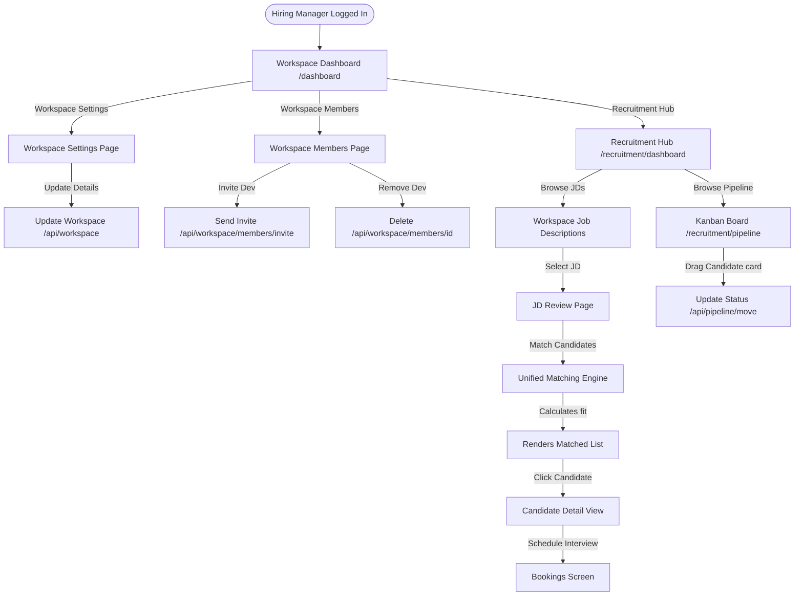

# Hiring Manager Screen Flow Audit

## Actor Overview

* **Description**: A Hiring Manager is a workspace-specific business user responsible for managing vacancies, reviewing candidate capability scores, and conducting assessments for their assigned team workspaces.
* **Responsibilities**:
  * Manage hiring requirements and JDs within their designated workspaces.
  * Evaluate candidate code maturity levels and match details for open roles.
  * Manage candidate pipelines and schedule interviews for their open vacancies.
  * Onboard team members into their assigned workspaces.
* **Permissions**:
  * Role mapping: `BUSINESS` (assigned as `manager` or `workspace_admin` inside a specific `Workspace`).
  * Permissions assigned in permission registry:
    * `verification:view:list` (Review candidate analysis reports).
    * `evidence:graph:view` (Review candidate portfolios and skill trees).
* **Accessible Modules**:
  * Business Portal dashboard (`/business/[organizationSlug]/dashboard`)
  * Recruitment Hub (filtered to their workspaces: `/business/[organizationSlug]/recruitment/dashboard`)
  * Job Descriptions list (`/business/[organizationSlug]/recruitment/jd`)
  * Job Match reviewer (`/business/[organizationSlug]/recruitment/jd/[id]/review`)
  * Kanban hiring pipeline (`/business/[organizationSlug]/recruitment/pipeline`)
  * Workspace members manager (`/business/[organizationSlug]/workspace/members`)
  * Workspace settings manager (`/business/[organizationSlug]/workspace/settings`)
  * Bookings schedule (`/business/[organizationSlug]/bookings`)
  * Candidate detailed portfolio (`/business/[organizationSlug]/intelligence/[id]`)
  * AI Chat assistant (`/chat`)
  * All public guest pages.
* **Restricted Modules**:
  * Platform administrative panel (`/admin` and sub-routes).
  * Organization settings, billing records, or company invoices.
  * Organization-wide team management (`/business/[organizationSlug]/members`).
  * Organization-wide roles and permissions editor (`/business/[organizationSlug]/roles`).
  * Other workspaces within the same organization (unless explicitly added).
  * VietQR company verification (`/business/[organizationSlug]/verification`).

---

## Screen Inventory

### 1. Workspace Private Dashboard Page
* **Route / URL**: `/business/[organizationSlug]/dashboard`
* **Entry Point**: Sidebar link.
* **Purpose**: Overview of active workspaces where the manager is registered, showing quick links to workspace settings and recruitment boards.
* **Required Permission**: `organization:workspaces:view` (at workspace scope).
* **Components Involved**: Workspace list cards, active workspace summary widgets.
* **API Calls**: `GET /api/workspace/{organizationSlug}` (loads workspaces list).
* **Backend Services**: `IWorkspaceMembershipService`.
* **Database Entities**: `Workspace`, `WorkspaceMember`.
* **State Transitions**: Switch active workspace.
* **Navigation Destinations**: `/recruitment/dashboard`, `/workspace/settings`.
* **Preconditions**: User is mapped as a member in the workspace.
* **Postconditions**: None.
* **Error/Empty States**: Shows no workspaces found warning if not assigned.
* **Loading States**: Card skeletons.
* **Success States**: Render workspaces.

### 2. Workspace Recruitment Board
* **Route / URL**: `/business/[organizationSlug]/recruitment/dashboard`
* **Entry Point**: Dashboard workspace card selection.
* **Purpose**: Workspace-scoped recruitment metrics (active jobs in workspace, pending reviews, upcoming candidate interviews).
* **Required Permission**: `verification:view:list`.
* **Components Involved**: KPI widgets, Interview agenda.
* **API Calls**: `GET /api/workspace/{organizationSlug}/jobs` (filtered to workspace).
* **Database Entities**: `JobVacancy`, `JobApplication`.
* **Navigation Destinations**: `/recruitment/jd`, `/recruitment/pipeline`.

### 3. Workspace Job Descriptions board
* **Route / URL**: `/business/[organizationSlug]/recruitment/jd`
* **Entry Point**: Sidebar link.
* **Purpose**: List and draft jobs specifically for the team.
* **Required Permission**: `verification:view:list`.
* **Components Involved**: `JdDashboardList`, `JdIntakeWizard`.
* **API Calls**: `GET /api/workspace/{organizationSlug}/jobs?workspaceId=...`.
* **Database Entities**: `JobVacancy`.
* **Navigation Destinations**: `/recruitment/jd/[id]/review`.

### 4. Job Match Reviewer Page
* **Route / URL**: `/business/[organizationSlug]/recruitment/jd/[id]/review`
* **Entry Point**: Click JD item in board.
* **Purpose**: Review requirements, adjust skill priorities, and see matched candidate list.
* **Required Permission**: `verification:view:list`.
* **Components Involved**: `JdDetailView`, `TaxonomyManager`.
* **API Calls**:
  * `GET /api/shared/jobs/{id}` (loads details).
  * `POST /api/intelligence/jobs/{id}/match` (calculates matches).
* **Database Entities**: `JobVacancy`, `CandidateMatchProjection`.
* **Navigation Destinations**: `/business/[organizationSlug]/intelligence/[id]`.

### 5. Workspace Kanban Pipeline Page
* **Route / URL**: `/business/[organizationSlug]/recruitment/pipeline`
* **Entry Point**: Sidebar link.
* **Purpose**: Drag-and-drop candidates in hiring phases (Applied, Screened, Interview, Offered).
* **Required Permission**: `verification:view:list` (scoped).
* **Components Involved**: Kanban board.
* **API Calls**: `PUT /api/workspace/{organizationSlug}/pipeline/move` (updates application stage).
* **Database Entities**: `JobApplication`.

### 6. Workspace Members Manager
* **Route / URL**: `/business/[organizationSlug]/workspace/members`
* **Entry Point**: Sidebar "Workspace Members" link.
* **Purpose**: Manage, invite, and remove developers/engineers mapped to the workspace.
* **Required Permission**: `organization:workspaces:view` (with `workspace_admin` role).
* **Components Involved**: Members table, Invite member dialog.
* **API Calls**:
  * `GET /api/workspace/{organizationSlug}/members` (lists workspace members).
  * `POST /api/workspace/{organizationSlug}/members/invite` (sends invitation).
  * `DELETE /api/workspace/{organizationSlug}/members/{id}` (removes member).
* **Backend Services**: `IWorkspaceMembershipService`.
* **Database Entities**: `WorkspaceMember`, `User`.
* **State Transitions**: Add/remove members updates list.
* **Navigation Destinations**: `/business/[organizationSlug]/dashboard`.
* **Preconditions**: Requires workspace-level admin credentials.
* **Postconditions**: Membership updated.
* **Error/Empty States**: Shows empty directory message.
* **Loading States**: Table skeletons.
* **Success States**: Membership update toast.

### 7. Workspace Settings Manager
* **Route / URL**: `/business/[organizationSlug]/workspace/settings`
* **Entry Point**: Sidebar "Workspace Settings" link.
* **Purpose**: Edit workspace name, description, and visibility details.
* **Required Permission**: `organization:workspaces:view` (with `workspace_admin` role).
* **Components Involved**: Settings form, delete workspace button.
* **API Calls**:
  * `PUT /api/workspace/{organizationSlug}` (updates workspace details).
  * `DELETE /api/workspace/{organizationSlug}` (deletes workspace).
* **Backend Services**: `IWorkspaceProvisioningService`.
* **Database Entities**: `Workspace`.
* **State Transitions**: Submit forms.
* **Navigation Destinations**: `/business/[organizationSlug]/dashboard`.
* **Preconditions**: Must be workspace admin.
* **Postconditions**: Workspace details modified.
* **Error States**: Cannot delete default workspace (Validation warning).
* **Empty/Success States**: Updates details successfully.

### 8. Candidate Portfolio Detail Page
* **Route / URL**: `/business/[organizationSlug]/intelligence/[id]`
* **Entry Point**: Click candidate in matching list or pipeline.
* **Purpose**: Evaluate candidate's verified skill nodes, code maturity signals, and plagiarism details.
* **Required Permission**: `evidence:graph:view`.
* **Components Involved**: verified Skill Tree graph, code authenticity cards, project contribution SVGs.
* **API Calls**: `GET /api/candidate/assessments/{id}/details` (fetches candidate details).
* **Database Entities**: `CandidateAssessment`, `UserProfile`.

---

## Navigation Flow

```
                     [Workspace Dashboard (/dashboard)]
                       │
       ┌───────────────┼───────────────┬───────────────┐
       ▼               ▼               ▼               ▼
 [Workspace Settings] [Members]  [Recruitment]   [Bookings]
 (/workspace/settings) (/workspace/ (/recruitment/ (/bookings)
                       members)      dashboard)
                                       │
                                       ▼
                                 [Hiring JDs]
                               (/recruitment/jd)
                                       │
                                       ▼
                                 [Pipeline]
                            (/recruitment/pipeline)
                                       │
                                       ▼
                           [Candidate Portfolio]
                             (/intelligence/id)
```

---

## Mermaid Diagram



---

## API Dependencies

* `GET /api/workspace/{organizationSlug}` (loads workspaces list)
* `GET /api/workspace/{organizationSlug}/jobs` (lists workspace vacancies)
* `PUT /api/workspace/{organizationSlug}` (updates workspace details)
* `DELETE /api/workspace/{organizationSlug}` (deletes workspace)
* `GET /api/workspace/{organizationSlug}/members` (lists workspace members)
* `POST /api/workspace/{organizationSlug}/members/invite` (invites members)
* `DELETE /api/workspace/{organizationSlug}/members/{id}` (deletes member)
* `GET /api/shared/jobs/{id}` (loads vacancy details)
* `POST /api/intelligence/jobs/{id}/match` (calculates candidate match rankings)
* `PUT /api/workspace/{organizationSlug}/pipeline/move` (updates candidate stage)
* `GET /api/candidate/assessments/{id}/details` (fetches candidate verified metrics)

---

## Database Dependencies

* `workspaces` & `workspace_members`: Configures workspace boundaries and manager assignments.
* `job_vacancies`: Stores vacancies linked to specific workspace ID.
* `job_applications`: Stores candidate applications under the workspace.
* `candidate_assessments`: Feeds candidate evaluations.
* `users` & `user_profiles`: Accesses member profiles.

---

## Edge Cases

* **Accessing Blocked Workspaces**: Manager attempts to modify organization slug parameter in url to access another department's workspace.
  * *Handling*: The `WorkspaceAccessGuard` checks if the user is in the `workspace_members` table for that slug. If missing, it blocks rendering and displays the Access Denied warning card.
* **Default Workspace deletion**: Manager attempts to delete the primary workspace of the organization.
  * *Handling*: The API checks if the workspace `isDefault` column is `true`. If so, it blocks the delete operation and throws a validation error.
* **Orphaned Member Invitations**: Inviting a member to a workspace, and then the workspace is deleted before they accept.
  * *Handling*: Cascading deletes clean up pending invitations mapped to the deleted workspace ID. When the user clicks the invite link, they see an "Invitation Invalid / Expired" page.

---

## Findings

* **Missing Workspace boundaries in Candidate Intelligence**: While the manager's dashboard and job lists are restricted to their workspaces, once they navigate to `/intelligence/[id]`, they can view all candidate details, even if the candidate has never applied to their specific workspace's jobs, leading to organizational information leakage.
* **No check on Maximum Workspaces**: The system does not enforce a limit on the number of workspaces an organization can create, which could lead to DB spam.
* **Workspace Role changes**: The workspace manager can change roles of other members in the workspace, but there is no audit log event created for workspace-level role reassignments.

---

## Improvement Suggestions

* **Access Scoped Portfolios**: Restrict candidate detailed intelligence viewing to candidates who have an active application mapped to the manager's assigned workspaces.
* **Workspace Audit Logs**: Track workspace role assignments, member removals, and invitations in the `audit_logs` table for compliance.
