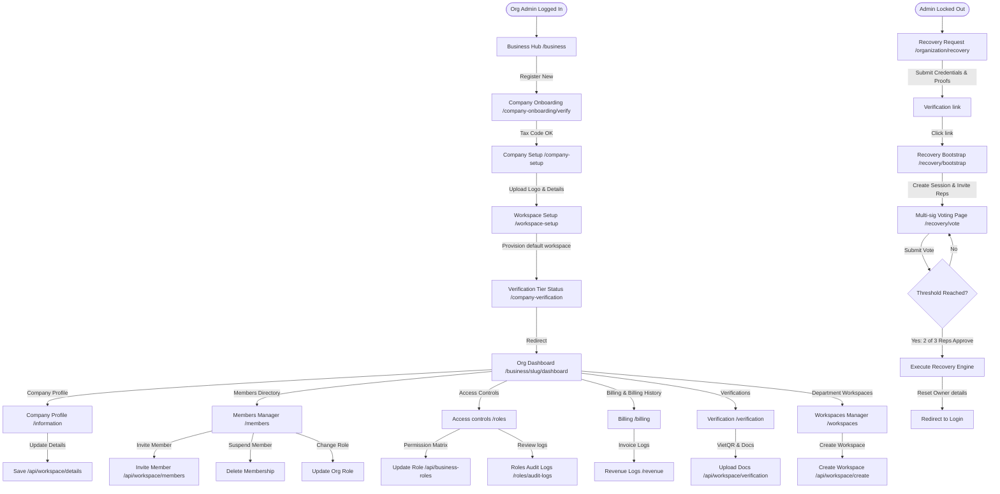

# Organization Administrator Screen Flow Audit

## Actor Overview

* **Description**: The Organization Administrator (usually the Company Owner) has full control over a company's profile, workspace structures, employee directory, custom business roles, billing plans, and security recovery setups.
* **Responsibilities**:
  * Complete initial company registration, onboarding, and VietQR tax checks.
  * Invite, suspend, or update roles of organization-wide employees (HR, Representatives, Workspace Admins).
  * Configure tenant-level Role-Based Access Control (RBAC) permission matrices.
  * Provision, customize, and delete workspaces.
  * Manage organization subscriptions, credit cards, and invoice logs.
  * Trigger and participate in multi-sig organization recovery sessions or representative rotations.
* **Permissions**:
  * Role mapping: `BUSINESS` (orgRole = `OWNER`).
  * Permissions assigned in permission registry:
    * `verification:view:list` (Full recruitment analysis access).
    * `verification:update:status` (Manage application stages).
    * `evidence:graph:view` (Review candidate portfolios).
    * `ai:chat:use` (Utilize AI chat capabilities).
    * Has full tenant-level admin override (`organization:workspaces:manage`, `organization:billing:manage`, `organization:members:manage`, `organization:roles:manage`).
* **Accessible Modules**:
  * Business Portal Hub (`/business`)
  * Organization dashboard (`/business/[organizationSlug]/dashboard`)
  * Organization profile settings (`/business/[organizationSlug]/information`)
  * Company settings (`/business/[organizationSlug]/settings`)
  * Organization members directory (`/business/[organizationSlug]/members`)
  * Tenant RBAC manager (`/business/[organizationSlug]/roles`)
  * Billing settings (`/business/[organizationSlug]/billing`)
  * Invoices & transaction tracker (`/business/[organizationSlug]/revenue`)
  * VietQR verification status (`/business/[organizationSlug]/verification`)
  * Workspaces manager (`/business/[organizationSlug]/workspaces`)
  * Workspace members editor (`/business/[organizationSlug]/workspace/members`)
  * Workspace configuration editor (`/business/[organizationSlug]/workspace/settings`)
  * Onboarding pages (`/workspace-setup`, `/company-setup`, `/company-verification`)
  * Recovery pages (`/organization/recovery`, `/organization/recovery/bootstrap`, `/organization/recovery/vote`)
  * Reclaim requests (`/organization/reclaim`)
  * All public guest pages and recruiter views.
* **Restricted Modules**:
  * Platform administrative panel (`/admin` and sub-routes).
  * Direct editing of system roles/permissions (restricted to system `SUPER_ADMIN`).

---

## Screen Inventory

### 1. Business Hub Page
* **Route / URL**: `/business`
* **Entry Point**: Log in redirect or manual URL entry.
* **Purpose**: List all companies owned or managed by the administrator, or prompt to register a new one.
* **Required Permission**: None (gated by `AuthGuard`).
* **Components Involved**: Company directory cards, create company CTA.
* **API Calls**: `GET /api/workspace/organizations` (lists user organizations).
* **Backend Services**: `IWorkspaceMembershipService`.
* **Database Entities**: `Organization`, `OrganizationMembership`.
* **Navigation Destinations**: `/business/[organizationSlug]/dashboard`, `/company-onboarding/verify`.

### 2. Company Setup Onboarding Page
* **Route / URL**: `/company-setup`
* **Entry Point**: Redirected post signup during company creation.
* **Purpose**: Configure initial organization profile (logo upload, legal address, website, description).
* **Required Permission**: None (registration state session required).
* **Components Involved**: Company details form, R2 logo drop zone.
* **API Calls**: `POST /api/auth/organization/setup` (saves organization details).
* **Database Entities**: `Organization`.
* **Navigation Destinations**: `/workspace-setup`.

### 3. Workspace Setup Onboarding Page
* **Route / URL**: `/workspace-setup`
* **Entry Point**: Post company setup redirect.
* **Purpose**: Provision the first workspace (e.g. Engineering, Sales) for the organization.
* **Required Permission**: None.
* **Components Involved**: Workspace form.
* **API Calls**: `POST /api/auth/workspace/setup` (provisions default workspace).
* **Database Entities**: `Workspace`, `WorkspaceMember`.
* **Navigation Destinations**: `/company-verification`.

### 4. Company Verification Page
* **Route / URL**: `/company-verification`
* **Entry Point**: Post workspace setup redirect.
* **Purpose**: Status check on Tier verification (Tier 1 vs Tier 2) showing required validation documents.
* **Required Permission**: None.
* **Components Involved**: Status badge cards.
* **API Calls**: `GET /api/auth/organization/verification-status`.
* **Database Entities**: `OrganizationVerification`.
* **Navigation Destinations**: `/business/[organizationSlug]/dashboard`.

### 5. Organization Profile Page
* **Route / URL**: `/business/[organizationSlug]/information`
* **Entry Point**: Sidebar "Company Profile" link.
* **Purpose**: View or edit address, description, legal website, contact emails, and logo details.
* **Required Permission**: `organization:workspaces:manage` (Tenant-wide Owner).
* **Components Involved**: Profile form, update button.
* **API Calls**:
  * `GET /api/workspace/{organizationSlug}` (loads details).
  * `PUT /api/workspace/{organizationSlug}/details` (updates company profile).
* **Database Entities**: `Organization`.

### 6. Organization Members Directory Page
* **Route / URL**: `/business/[organizationSlug]/members`
* **Entry Point**: Sidebar "Organization Members" link.
* **Purpose**: List all company-wide employees, invite new staff members, assign organization roles (OWNER, HR, REPRESENTATIVE, MEMBER), or suspend memberships.
* **Required Permission**: `organization:members:manage`.
* **Components Involved**: Employees table lists, Add Employee modal, Status toggle.
* **API Calls**:
  * `GET /api/workspace/{organizationSlug}/members` (lists all members).
  * `POST /api/workspace/{organizationSlug}/members` (invites new member).
  * `PUT /api/workspace/{organizationSlug}/members/{id}/role` (updates role).
  * `DELETE /api/workspace/{organizationSlug}/members/{id}` (suspends membership).
* **Backend Services**: `IOrganizationInvitationService`, `IWorkspaceMembershipService`.
* **Database Entities**: `OrganizationMembership`, `User`, `OrganizationInvitation`.

### 7. Tenant RBAC Roles matrix Page
* **Route / URL**: `/business/[organizationSlug]/roles`
* **Entry Point**: Sidebar "Access Controls" link.
* **Purpose**: Manage custom organizational roles and edit their permission checkboxes. Includes role change audit log viewer.
* **Required Permission**: `organization:roles:manage`.
* **Components Involved**:
  * `roles-list`
  * `permission-grid`
  * `role-editor-modal`
  * `role-audit-logs`
* **API Calls**:
  * `GET /api/business-roles/{orgSlug}` (lists custom roles).
  * `POST /api/business-roles/{orgSlug}` (creates role).
  * `PUT /api/business-roles/{orgSlug}/{roleId}` (updates role permissions).
  * `DELETE /api/business-roles/{orgSlug}/{roleId}` (deletes role).
  * `GET /api/business-roles/{orgSlug}/permissions` (loads available permissions).
  * `GET /api/business-roles/{orgSlug}/audit-logs` (loads role changes log).
* **Backend Services**: `IBusinessRoleService`, `IPermissionService`.
* **Database Entities**: `OrganizationBusinessRole`, `BusinessPermission`, `AuditLog`.

### 8. Billing Plans Page
* **Route / URL**: `/business/[organizationSlug]/billing`
* **Entry Point**: Sidebar "Subscriptions" link.
* **Purpose**: Upgrade/downgrade subscription tiers, update payment credit cards, view usage limits.
* **Required Permission**: `organization:billing:manage`.
* **Components Involved**: Pricing cards grid, credit card update form.
* **API Calls**:
  * `GET /api/workspace/{organizationSlug}/billing/plan` (current plan).
  * `POST /api/workspace/{organizationSlug}/billing/checkout` (updates subscription).
* **Backend Services**: Stripe/VietQR Billing Integration Client.
* **Database Entities**: `Organization`.

### 9. Transaction Logs Page
* **Route / URL**: `/business/[organizationSlug]/revenue`
* **Entry Point**: Link inside the billing page.
* **Purpose**: Log table showing payment histories, invoice download links.
* **Required Permission**: `organization:billing:manage`.
* **API Calls**: `GET /api/workspace/{organizationSlug}/billing/transactions`.
* **Database Entities**: `BusinessOutcome`.

### 10. VietQR & Tax Verification Page
* **Route / URL**: `/business/[organizationSlug]/verification`
* **Entry Point**: Sidebar "Verifications" link.
* **Purpose**: Submit business registration documents, link bank accounts using VietQR API, and verify Level 2 organizational authenticity.
* **Required Permission**: `organization:workspaces:manage`.
* **Components Involved**: Upload boundary box, Bank details form, Status stepper.
* **API Calls**:
  * `GET /api/workspace/{organizationSlug}/verification` (current verification level).
  * `POST /api/workspace/{organizationSlug}/verification/upload` (uploads corporate files).
* **Backend Services**: `VietQR Client`, `IStorageService`.
* **Database Entities**: `OrganizationVerification`, `OrganizationAuthority`.

### 11. Workspaces Configuration Dashboard
* **Route / URL**: `/business/[organizationSlug]/workspaces`
* **Entry Point**: Sidebar "Workspaces Manager" link.
* **Purpose**: List all departments, provision new workspaces, delete or archive inactive workspaces.
* **Required Permission**: `organization:workspaces:manage`.
* **Components Involved**: Workspaces lists grid, Create Workspace modal.
* **API Calls**:
  * `GET /api/workspace/{organizationSlug}/all` (loads workspaces).
  * `POST /api/workspace/{organizationSlug}/create` (provisions new workspace).
* **Database Entities**: `Workspace`.

### 12. Organization Reclaim Page
* **Route / URL**: `/organization/reclaim`
* **Entry Point**: Triggered when tax code lookup during onboarding flags that the company is already registered.
* **Purpose**: Allow a legitimate administrator to submit a reclamation claim (submitting authorization letters and corporate certificates) to take over the profile.
* **Required Permission**: None.
* **Components Involved**: Upload files form, description box, submit button.
* **API Calls**: `POST /api/auth/organization/reclaim` (saves claim files).
* **Backend Services**: `IOrganizationReclaimService`.
* **Database Entities**: `OrganizationRecoveryClaim`.

### 13. Organizational Recovery Page
* **Route / URL**: `/organization/recovery`
* **Entry Point**: Login menu "Company Lockout Recovery" link.
* **Purpose**: Initiate emergency recovery protocols if the primary administrator account is lost or compromised.
* **Required Permission**: None.
* **Components Involved**: Recovery form, document uploader.
* **API Calls**: `POST /api/recovery/organization/initiate`.
* **Backend Services**: `IOrganizationRecoveryService`.
* **Database Entities**: `OrganizationRecoveryClaim`.

### 14. Recovery Bootstrap Page
* **Route / URL**: `/organization/recovery/bootstrap`
* **Entry Point**: Click link in recovery initiation email.
* **Purpose**: Setup a recovery session and assign representatives.
* **Required Permission**: None (token authenticated).
* **API Calls**: `POST /api/recovery/organization/bootstrap` (creates recovery session).
* **Database Entities**: `ApprovedRecoverySession`, `RecoveryToken`.

### 15. Representative Recovery Voting Page
* **Route / URL**: `/organization/recovery/vote` (expected query params: `?session=...`)
* **Entry Point**: Recovery voting link sent to representatives.
* **Purpose**: Multi-sig consensus panel where company representatives cast votes (Approve/Reject) to execute the recovery plan.
* **Required Permission**: None (token verification).
* **Components Involved**: Session overview panel, Approve button, Reject button, Votes progress stepper.
* **API Calls**:
  * `GET /api/recovery/session/{sessionId}` (details of recovery request).
  * `POST /api/recovery/session/{sessionId}/vote` (submits vote: Approve or Reject).
* **Backend Services**: `ILevel2RecoveryService`, `REcoveryExecutionEngine`.
* **Database Entities**: `ApprovedRecoverySession`, `RepresentativeApprovalVote`, `RepresentativeAuthorityHistory`.
* **State Transitions**: 
  * Representative votes -> updates DB -> checks if threshold reached (e.g. 2 out of 3 votes).
  * Once threshold is reached, automatically executes recovery (resets owner email, rotates key) and redirects owner.
* **Preconditions**: Session must be active, representative token verified.
* **Postconditions**: Recovery session executed if multi-sig passes.
* **Error States**: Token revoked or session expired.
* **Loading/Success States**: Renders vote count progress indicator.

---

## Navigation Flow

```
                     [Business Hub (/business)]
                                  │
      ┌───────────────────────────┼───────────────────────────┐
      ▼                           ▼                           ▼
[Company Onboarding]     [Company Setup]             [Workspace Setup]
(/company-onboarding)    (/company-setup)            (/workspace-setup)
      │                                                       │
      ▼                                                       ▼
[Company Verification] ◄──────────────────────────────────────┘
(/company-verification)
      │
      ▼
[Organization Dashboard] ──► [Workspaces] ──► [Workspace Members/Settings]
      │
      ├─► [Profile details (/information)]
      ├─► [Access controls (/roles)] ──► [Role Audit Logs]
      ├─► [Employee directory (/members)]
      ├─► [Billing (/billing)] ──► [Transaction logs (/revenue)]
      ├─► [Verification (/verification)]
      │
      ▼
[Emergency Recovery] ──► [Bootstrap] ──► [Multi-sig Voting panel (/recovery/vote)]
```

---

## Mermaid Diagram



---

## API Dependencies

* `GET /api/workspace/organizations` (user organizations list)
* `POST /api/auth/organization/setup` (saves company configuration details)
* `POST /api/auth/workspace/setup` (saves default workspace details)
* `GET /api/auth/organization/verification-status` (checks tier verification level)
* `PUT /api/workspace/{organizationSlug}/details` (updates profile details)
* `GET /api/workspace/{organizationSlug}/members` (lists employees)
* `POST /api/workspace/{organizationSlug}/members` (invites new employee)
* `PUT /api/workspace/{organizationSlug}/members/{id}/role` (modifies membership role)
* `DELETE /api/workspace/{organizationSlug}/members/{id}` (removes/suspends membership)
* `GET /api/business-roles/{orgSlug}` (lists custom RBAC roles)
* `POST /api/business-roles/{orgSlug}` (creates custom RBAC role)
* `PUT /api/business-roles/{orgSlug}/{roleId}` (updates role permissions)
* `DELETE /api/business-roles/{orgSlug}/{roleId}` (deletes custom role)
* `GET /api/business-roles/{orgSlug}/permissions` (loads permissions list)
* `GET /api/business-roles/{orgSlug}/audit-logs` (loads custom roles modification history)
* `GET /api/workspace/{organizationSlug}/billing/plan` (loads subscription plan details)
* `GET /api/workspace/{organizationSlug}/billing/transactions` (loads invoice records)
* `POST /api/workspace/{organizationSlug}/verification/upload` (uploads corporate verification documents)
* `GET /api/workspace/{organizationSlug}/all` (loads workspaces directory)
* `POST /api/workspace/{organizationSlug}/create` (provisions new workspace)
* `POST /api/auth/organization/reclaim` (submits reclamation request)
* `POST /api/recovery/organization/initiate` (registers recovery request)
* `POST /api/recovery/organization/bootstrap` (creates recovery voting session)
* `GET /api/recovery/session/{sessionId}` (loads recovery session details)
* `POST /api/recovery/session/{sessionId}/vote` (registers representative vote)

---

## Database Dependencies

* `organizations`: Company profile configurations, status, levels.
* `workspaces` & `workspace_members`: Departments structure.
* `organization_memberships`: Organization-level employees directory.
* `organization_credentials`: Company-specific authentication settings.
* `organization_business_roles` & `business_permissions`: Custom RBAC maps.
* `organization_verifications` & `organization_authorities`: Level 2 VietQR checks.
* `organization_recovery_claims` & `approved_recovery_sessions`: Tracks recovery session details.
* `representative_approval_votes` & `representative_authority_histories`: Multi-sig voting logs.
* `audit_logs`: Stores company action logs, role change histories, security logs.

---

## Edge Cases

* **Tax Code Ownership Reclamation**: A user tries to register a company name, but it is already taken.
  * *Handling*: The uploader interface on `/organization/reclaim` allows them to submit verification files. The backend flags the organization state as `RECLAIM_PENDING` and locks editing until a system admin reviews the request.
* **Multi-sig Representative Rotation Vote Deadlocks**: A recovery session is bootstrapped with 3 representatives. One representative rejects the vote, one approves, and the third is unreachable.
  * *Handling*: The session has an expiration window of 7 days. If the approval threshold is not met (2 out of 3 votes), the recovery session automatically expires, the recovery session record status updates to `Failed`, and the recovery execution locks are released.
* **VietQR Bank Details Discrepancy**: During company level 2 verification, the name on the corporate bank account does not match the company name registered in the database.
  * *Handling*: The backend verification validator blocks onboarding, flags a verification warning state, and prompts the owner to submit official tax registration certificates for manual audit review.

---

## Findings

* **Missing Audit Log Limits on custom role edits**: When updating custom role permissions in `/roles`, each permission change triggers a database audit log insertion. Rapidly editing checkboxes creates hundreds of audit log rows, bloating the database.
* **Lack of Workspace Cascade Deletion Checks**: If an admin deletes a workspace, the system deletes it without verifying if there are unresolved job applications or active interviews within that workspace, leaving broken candidate links in the pipeline.
* **Weak OTP for Recovery Bootstrapping**: Setting up a recovery session requires clicking a link sent to representative emails. There is no secondary factor check (like phone OTP) for representatives, presenting a vulnerability if the email account is compromised.

---

## Improvement Suggestions

* **Audit Log Debouncing**: Batch multiple permission checkbox updates into a single audit log entry when the roles matrix is saved, instead of writing a log entry for every individual click.
* **Cascade Safeguards**: Enforce database validation rules that block workspace deletion if active vacancies, unresolved applications, or booked interviews are present in the workspace.
* **Securing Multi-sig Votes**: Require a secondary SMS/Phone OTP verification step before a representative can submit their vote on `/organization/recovery/vote`.
