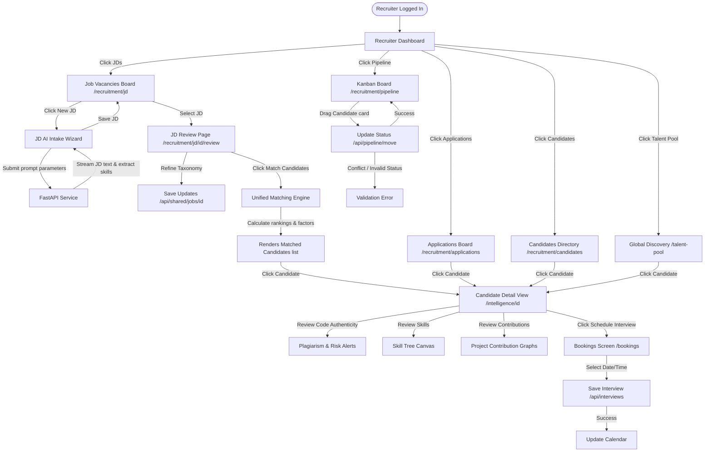

# Recruiter / Talent Partner Screen Flow Audit

## Actor Overview

* **Description**: A Recruiter (or Talent Partner) is a business user responsible for sourcing candidates, drafting job descriptions, initiating AI matching algorithms, scheduling interviews, and tracking candidates through the hiring pipeline.
* **Responsibilities**:
  * Create, refine, and manage Job Descriptions (JDs) and their associated capability requirements.
  * Search, filter, and discover candidates using global search indices and AI-powered recommendations.
  * Evaluate candidate portfolios, verify code authenticity (plagiarism checks, git history patterns), review verified skill trees, and inspect developer project contribution graphs.
  * Review candidate job applications and run AI match algorithms to obtain fit indicators.
  * Manage candidate progress through a Kanban-style pipeline.
  * Coordinate and book interviews with candidates.
* **Permissions**:
  * Role mapping: `BUSINESS` (associated with organization as `HR` role).
  * Permissions assigned in permission registry:
    * `verification:view:list` (List verification and code analysis records).
    * `verification:update:status` (Manage application assessment status).
    * `evidence:graph:view` (Review candidate contribution profiles and skill trees).
    * `ai:chat:use` (Utilize AI chat capabilities for candidate evaluation queries).
* **Accessible Modules**:
  * Business Portal dashboard (`/business/[organizationSlug]/dashboard`)
  * Recruitment Hub main (`/business/[organizationSlug]/recruitment/dashboard`)
  * Candidate search directory (`/business/[organizationSlug]/recruitment/candidates`)
  * Job applications reviewer (`/business/[organizationSlug]/recruitment/applications`)
  * Interviews panel (`/business/[organizationSlug]/recruitment/interviews`)
  * Job Descriptions board (`/business/[organizationSlug]/recruitment/jd`)
  * Job Match reviewer (`/business/[organizationSlug]/recruitment/jd/[id]/review`)
  * Recruitment Kanban pipeline (`/business/[organizationSlug]/recruitment/pipeline`)
  * Global Talent Pool discovery (`/business/[organizationSlug]/talent-pool`)
  * Bookings screen (`/business/[organizationSlug]/bookings`)
  * Workspaces listing (`/business/[organizationSlug]/workspaces`)
  * Candidate Intelligence dashboard (`/business/[organizationSlug]/intelligence`)
  * Candidate Intelligence detail sheet (`/business/[organizationSlug]/intelligence/[id]`)
  * AI Chat assistant (`/chat`)
  * All public guest pages.
* **Restricted Modules**:
  * Platform administrative panel (`/admin` and sub-routes).
  * Organization core settings (`/business/[organizationSlug]/settings`, `/business/[organizationSlug]/information` - restricted to `OWNER`).
  * Business role configurations and team memberships (`/business/[organizationSlug]/roles`, `/business/[organizationSlug]/members` - restricted to `OWNER`).
  * Billing subscriptions and invoices (`/business/[organizationSlug]/billing`, `/business/[organizationSlug]/revenue` - restricted to `OWNER`).
  * Manual database seed/initialization controls.

---

## Screen Inventory

### 1. Recruiter Dashboard Page
* **Route / URL**: `/business/[organizationSlug]/recruitment/dashboard`
* **Entry Point**: Navigation sidebar "Recruitment" link.
* **Purpose**: Provide overview of recruiting KPIs (total active jobs, pending applications, interviews today) and quick shortcuts.
* **Required Permission**: `verification:view:list`.
* **Components Involved**: KPI widgets, calendar overview, recent applications card.
* **API Calls**: `GET /api/public/jobs` (vacancies count), `GET /api/workspace/{slug}/members` (hiring statistics).
* **Backend Services**: `ISystemService`.
* **Database Entities**: `JobVacancy`, `JobApplication`.
* **State Transitions**: None.
* **Navigation Destinations**: `/recruitment/jd`, `/recruitment/applications`, `/recruitment/pipeline`.
* **Preconditions**: User belongs to company workspace as an HR/Owner member.
* **Postconditions**: None.
* **Error States**: Organization workspace disabled (redirects to `/unauthorized`).
* **Empty States**: No active hiring metrics (displays blank widgets with "Post your first job" CTA).
* **Loading States**: Skeletons.
* **Success States**: Render metrics.

### 2. Candidates Directory Page
* **Route / URL**: `/business/[organizationSlug]/recruitment/candidates`
* **Entry Point**: Navigation link.
* **Purpose**: Directory of candidates who have applied or engaged with the company.
* **Required Permission**: `verification:view:list`.
* **Components Involved**: Filter sidebar, candidate lists, search bar.
* **API Calls**: `GET /api/candidate/search?organizationSlug=...` (fetches candidate directory).
* **Backend Services**: `ITalentDiscoveryService`.
* **Database Entities**: `UserProfile`, `CandidateAssessment`.
* **State Transitions**: Typing filters updates directory list.
* **Navigation Destinations**: `/business/[organizationSlug]/intelligence/[id]`.
* **Preconditions**: Active business membership.
* **Postconditions**: None.
* **Error/Empty States**: Shows empty state illustration if no matches found.
* **Loading States**: Candidate card skeletons.
* **Success States**: View listings.

### 3. Job Descriptions (JD) board
* **Route / URL**: `/business/[organizationSlug]/recruitment/jd`
* **Entry Point**: Sidebar "Job Descriptions" link.
* **Purpose**: Draft, publish, and review JDs. Includes an AI JD builder wizard.
* **Required Permission**: `verification:view:list`.
* **Components Involved**:
  * `JdDashboardList`
  * `JdIntakeWizard` (modal wizard to generate JDs with AI)
* **API Calls**:
  * `GET /api/workspace/{organizationSlug}/jobs` (lists JDs).
  * `POST /api/shared/jobs` (saves new JD).
  * `POST /api/shared/jobs/draft` (AI drafts JDs).
* **Backend Services**: `IJobVacancyService`, `IHttpClientFactory` (AI Service).
* **Database Entities**: `JobVacancy`, `HiringRequirement`.
* **State Transitions**:
  * Clicking "Create New" launches `JdIntakeWizard`.
  * Drafting triggers AI text streaming -> maps skills metadata -> populates fields.
* **Navigation Destinations**: `/recruitment/jd/[id]/review`.
* **Preconditions**: None.
* **Postconditions**: Job vacancy record is saved in database as Draft or Published.
* **Error States**: AI draft generation failure (displays server error banner, prompts manual creation).
* **Empty States**: No JDs created yet (renders "Create your first Job Description" placeholder).
* **Loading States**: Streaming AI text skeleton in the wizard.
* **Success States**: Job created toast message.

### 4. Job Match Reviewer Page
* **Route / URL**: `/business/[organizationSlug]/recruitment/jd/[id]/review`
* **Entry Point**: Click JD item in board.
* **Purpose**: Edit JD details, review extracted capability taxonomy, run matching algorithm, and list eligible candidates sorted by match percentage.
* **Required Permission**: `verification:view:list`.
* **Components Involved**:
  * `JdDetailView`
  * `TaxonomyManager`
* **API Calls**:
  * `GET /api/shared/jobs/{id}` (loads JD details).
  * `PUT /api/shared/jobs/{id}` (updates JD details).
  * `POST /api/intelligence/jobs/{id}/match` (calculates candidate rankings for this JD).
* **Backend Services**: `IUnifiedMatchingEngine`, `ICandidateRankingCalculator`.
* **Database Entities**: `JobVacancy`, `HiringRequirement`, `CandidateMatchProjection`, `CandidateEvaluationSnapshot`.
* **State Transitions**: 
  * Modifying requirements updates JSON taxonomies.
  * Clicking "Match Candidates" triggers backend query -> populates candidate list with overall scores and explanation factors.
* **Navigation Destinations**: `/business/[organizationSlug]/intelligence/[id]`.
* **Preconditions**: Job vacancy must exist.
* **Postconditions**: Candidates matched and rankings projected.
* **Error States**: No matches returned from matching engine.
* **Empty States**: Matching list empty before clicking match command.
* **Loading States**: Running matching algorithms spinner.
* **Success States**: Candidates matched table list.

### 5. Job Applications Page
* **Route / URL**: `/business/[organizationSlug]/recruitment/applications`
* **Entry Point**: Sidebar "Applications" link.
* **Purpose**: List candidate applications for all jobs.
* **Required Permission**: `verification:view:list`.
* **Components Involved**: Search filter toolbar, applications table lists.
* **API Calls**: `GET /api/workspace/{organizationSlug}/applications` (lists job applications).
* **Backend Services**: `IJobVacancyService`.
* **Database Entities**: `JobApplication`, `User`, `JobVacancy`.
* **State Transitions**: Approving/rejecting applications.
* **Navigation Destinations**: `/business/[organizationSlug]/intelligence/[id]`.
* **Preconditions**: None.
* **Postconditions**: None.
* **Error States**: None.
* **Empty States**: No applications logged yet.
* **Loading States**: Table skeletons.
* **Success States**: Render applications.

### 6. Recruitment Kanban Pipeline Page
* **Route / URL**: `/business/[organizationSlug]/recruitment/pipeline`
* **Entry Point**: Sidebar "Hiring Pipeline" link.
* **Purpose**: Kanban board displaying candidates categorized by their application stage (Applied, Screened, Interview, Offered).
* **Required Permission**: `verification:update:status`.
* **Components Involved**: Drag-and-drop Kanban board, candidate summary cards.
* **API Calls**:
  * `GET /api/workspace/{organizationSlug}/pipeline` (loads pipeline stages).
  * `PUT /api/workspace/{organizationSlug}/pipeline/move` (updates candidate stage).
* **Backend Services**: `IJobVacancyService`.
* **Database Entities**: `JobApplication`.
* **State Transitions**: Dragging a card triggers API status updates.
* **Navigation Destinations**: `/business/[organizationSlug]/intelligence/[id]`.
* **Preconditions**: Job description must be selected from a filter header.
* **Postconditions**: Candidate application status updated.
* **Error/Empty States**: Shows warning if no JD is selected.
* **Loading States**: Skeletons.
* **Success States**: Updated board.

### 7. Global Talent Pool Page
* **Route / URL**: `/business/[organizationSlug]/talent-pool`
* **Entry Point**: Sidebar "Talent Discovery" link.
* **Purpose**: Search candidates globally using AI discovery tools.
* **Required Permission**: `verification:view:list`.
* **Components Involved**: Natural language search input, filter controls, candidate match profile cards.
* **API Calls**: `POST /api/intelligence/discovery/run` (starts AI discovery query).
* **Backend Services**: `ITalentGraphBuilder`, `ICandidateEvaluationService`.
* **Database Entities**: `CandidateSearchProfile`, `CandidateDiscoveryRun`.
* **State Transitions**: Submit natural language search -> executes semantic match -> returns candidate records.
* **Navigation Destinations**: `/business/[organizationSlug]/intelligence/[id]`.
* **Preconditions**: None.
* **Postconditions**: Discovery logs saved.
* **Error States**: Natural language parsing failure.
* **Empty States**: Zero search matches (renders empty state suggestion list).
* **Loading States**: Searching global index...
* **Success States**: Displays matched developer cards with match indicators.

### 8. Bookings Screen
* **Route / URL**: `/business/[organizationSlug]/bookings`
* **Entry Point**: Sidebar "Interviews Schedule" link.
* **Purpose**: Coordinate and schedule interviews with candidates.
* **Required Permission**: `verification:view:list`.
* **Components Involved**: Calendar widget, interview booking forms.
* **API Calls**: `GET /api/workspace/{organizationSlug}/interviews` (lists scheduled interviews).
* **Backend Services**: None (mock/integration client).
* **Database Entities**: `JobApplication`.
* **State Transitions**: Book slot -> updates calendar.
* **Navigation Destinations**: `/recruitment/pipeline`.
* **Preconditions**: Candidate must be in the "Interview" stage.
* **Postconditions**: Interview logged.
* **Error/Empty States**: No interviews booked.

### 9. Candidate Intelligence Detail Page
* **Route / URL**: `/business/[organizationSlug]/intelligence/[id]`
* **Entry Point**: Click candidate items in talent pool, matching lists, or applications directories.
* **Purpose**: Deep-dive review of a candidate's credentials, code authenticity verification metrics, project contributions, and AI narrative evaluation.
* **Required Permission**: `evidence:graph:view`.
* **Components Involved**:
  * Candidate summary header.
  * Maturity, Problem Solving, and Key Strengths widgets.
  * verified Skill Tree canvas.
  * Code authenticity alerts.
  * Commit timeline graphs.
* **API Calls**: `GET /api/candidate/assessments/{id}/details` (fetches candidate reports).
* **Backend Services**: `ICandidateEvaluationService`, `ITrustEngineService`.
* **Database Entities**: `CandidateAssessment`, `CandidateAssessmentArtifact`, `UserProfile`, `User`.
* **State Transitions**: Toggling tabs (Resume, Code Analysis, Skill Tree, Contributions).
* **Navigation Destinations**: `/recruitment/pipeline`, `/chat` (Ask AI about this candidate).
* **Preconditions**: Candidate evaluation must be completed.
* **Postconditions**: None.
* **Error States**: Assessment details not found (renders 404 page).
* **Empty States**: Empty tabs (displays placeholders).
* **Loading States**: Page skeletons.
* **Success States**: Renders full verified report.

---

## Navigation Flow

```
                      [Recruitment Dashboard]
                                 │
     ┌────────────────┬──────────┼──────────┬────────────────┐
     ▼                ▼          ▼          ▼                ▼
[Candidates]     [Applications] [Kanban]  [Job vacancy] [Talent Pool]
(/recruitment/   (/recruitment/ (/recru.. (/recruitment/ (/talent-pool)
 candidates)     applications)  pipeline)      jd)           │
     │                │          │          │                ▼
     └────────────────┴──────────┼──────────┘           (AI Search)
                                 ▼
                     [Candidate Intelligence Detail]
                 (/business/slug/intelligence/[id])
```

---

## Mermaid Diagram



---

## API Dependencies

* `GET /api/workspace/{organizationSlug}/jobs` (lists vacancies)
* `POST /api/shared/jobs` (saves JD)
* `POST /api/shared/jobs/draft` (AI prompts drafting)
* `GET /api/shared/jobs/{id}` (loads JD details)
* `PUT /api/shared/jobs/{id}` (saves JD edits)
* `POST /api/intelligence/jobs/{id}/match` (calculates matching scores)
* `GET /api/workspace/{organizationSlug}/applications` (lists applications)
* `GET /api/workspace/{organizationSlug}/pipeline` (loads Kanban data)
* `PUT /api/workspace/{organizationSlug}/pipeline/move` (updates stage status)
* `POST /api/intelligence/discovery/run` (AI natural language talent discovery query)
* `GET /api/workspace/{organizationSlug}/interviews` (lists interviews)
* `POST /api/interviews` (books slot)
* `GET /api/candidate/assessments/{id}/details` (fetches verified metrics of the candidate)
* `GET /api/candidate/search` (searches company candidate directory)

---

## Database Dependencies

* `job_vacancies`: Stores JD descriptions, roles, levels, status.
* `hiring_requirements`: Stores skill taxonomies.
* `job_applications`: Stores candidate applications and Kanban stages.
* `candidate_search_profiles` & `candidate_discovery_runs`: Logs discovery runs.
* `candidate_match_projections`: Matches list entries.
* `candidate_assessments` & `candidate_assessment_artifacts`: Detailed evaluation metrics.
* `user_profiles` & `users`: Basic candidate information.
* `organization_memberships` & `workspace_members`: Configures Recruiter permissions.

---

## Edge Cases

* **Empty Talent Discovery Index**: Sourcing for niche technical stacks (e.g. Haskell) returns zero candidates in talent-pool query.
  * *Handling*: The discovery engine catches empty matches, and suggests broader categories (e.g. Functional Programming). Renders fallback suggestion pills.
* **Failed AI JD Extraction**: Creating a JD with incomplete prompts (e.g. "want coder") causes AI parser failure.
  * *Handling*: The system catches validation exceptions, blocks saving, and prompts the recruiter to select standard skills from a drop-down.
* **Application Status Concurrency**: Multiple recruiters move the same candidate card in pipeline simultaneously.
  * *Handling*: PostgreSQL `Version` concurrency check throws a DB update error. The API returns a 409 Conflict. The frontend catches this to trigger an automatic reload of Kanban board.

---

## Findings

* **Missing Active Job Sync checks**: When deleting a job vacancy in `/recruitment/jd`, the system deletes it from the database even if there are active candidate applications mapped to it. This leaves orphaned `JobApplication` records pointing to invalid jobs.
* **Exposed Private Repositories details in Matching**: When matching candidates to a JD, the engine evaluates private repository analysis results. If the recruiter views match details, they can see commit data of private candidate repos even when the candidate has profile visibility set to `private`.
* **Missing Candidate Status updates**: Moving a candidate in pipeline does not trigger an email notification or notification alert to the Candidate, forcing them to manually check status.

---

## Improvement Suggestions

* **Cascade Constraint / Archival Policy**: Replace hard deletes of `JobVacancy` with soft deletes or archive state to preserve application history.
* **Private Code Masking**: Ensure the matching details explanation page masks private repository names and commit directories.
* **Notification Integration**: Trigger `InAppNotification` and email logs to the candidate when their application is moved to "Interview" or "Offered" stages.
```
