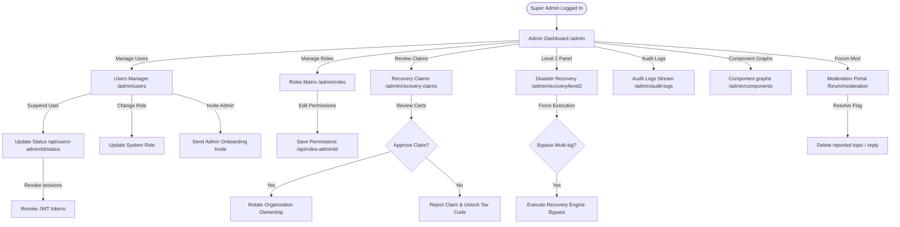

# System Administrator / Super Admin Screen Flow Audit

## Actor Overview

* **Description**: The System Administrator (including the Super Admin role) has root-level control over the entire CVerify platform, including system-wide user statuses, global security roles, platform audit log streams, organization ownership claims, and Level 2 emergency recovery panels.
* **Responsibilities**:
  * Oversee platform health metrics, active jobs, and verification totals.
  * Search, filter, invite, suspend, or update permissions of platform users and administrators.
  * Define, update, and manage global system roles (SUPER_ADMIN, ADMIN, BUSINESS, USER) and permissions.
  * Review, approve, or deny company ownership reclamation claims.
  * Moderate community discussions, flags, reports, and replies in the forum.
  * Approve or deny Level 2 emergency disaster recovery actions.
* **Permissions**:
  * Role mapping: `ADMIN` / `SUPER_ADMIN`.
  * Permissions assigned in permission registry:
    * `admin:users:view` (View system users).
    * `admin:users:manage` (Manage system users).
    * `admin:roles:view` (View system roles).
    * `admin:roles:manage` (Manage system roles).
    * `admin:verification:view` (View global verification logs).
    * `admin:verification:manage` (Manage verification overrides).
    * `admin:ai:audit` (Review AI prompts and cost metrics).
    * `admin:components:read` (Review system component diagrams).
    * `*:*:*` (Full wildcard override for `SUPER_ADMIN`).
* **Accessible Modules**:
  * Admin main dashboard (`/admin`)
  * User management portal (`/admin/users`)
  * Roles and permissions matrices (`/admin/roles`)
  * Platform audit logs stream (`/admin/audit-logs`)
  * Recovery claims review sheet (`/admin/recovery-claims`)
  * Level 2 emergency recovery console (`/admin/recovery/level2`)
  * Component dependency graph (`/admin/components`)
  * Community Forum Moderation panel (`/forum/moderation`)
  * All public guest pages, candidate pages, and business dashboards.
* **Restricted Modules**:
  * None (full wildcard override active).

---

## Screen Inventory

### 1. System Administration Dashboard Page
* **Route / URL**: `/admin`
* **Entry Point**: Log in redirect, or Sidebar "Admin Dashboard" selection.
* **Purpose**: Summary of system metrics (total users, verified candidates, pending recovery claims, database ping speeds, and AI execution queues).
* **Required Permission**: `admin:users:view`.
* **Components Involved**:
  * `AdminDashboardView`
  * Metric cards grid, queue status lists.
* **API Calls**: `GET /api/system/stats` (loads platform totals).
* **Backend Services**: `ISystemService`.
* **Database Entities**: `User`, `JobVacancy`, `Organization`, `PipelineJob`.
* **State Transitions**: Real-time SignalR notifications update metrics on the fly.
* **Navigation Destinations**: `/admin/users`, `/admin/recovery-claims`, `/admin/audit-logs`.
* **Preconditions**: Verified administrator session.
* **Postconditions**: None.
* **Error States**: None.
* **Empty States**: None.
* **Loading States**: Skeletons.
* **Success States**: View displays.

### 2. User Management Portal Page
* **Route / URL**: `/admin/users`
* **Entry Point**: Sidebar "User Management" link.
* **Purpose**: Search, filter, suspend, reactivate, or assign system roles to platform users.
* **Required Permission**: `admin:users:manage`.
* **Components Involved**:
  * `UsersManagementView`
  * Users table, Filter drawer, Edit User modal.
* **API Calls**:
  * `GET /api/users-admin` (lists users).
  * `PUT /api/users-admin/{id}/status` (suspends or reactivates user).
  * `PUT /api/users-admin/{id}/role` (updates system roles).
  * `POST /api/users-admin/invite` (invites new administrator).
* **Backend Services**: `IAdminMemberService`.
* **Database Entities**: `User`, `RoleAssignment`, `AdminMember`.
* **State Transitions**: Modifying status immediately terminates active user sessions.
* **Navigation Destinations**: None.
* **Preconditions**: Administrator status.
* **Postconditions**: User session revoked if suspended.
* **Error States**: 
  * Cannot suspend the last active Super Admin (Throws validation error).
* **Empty States**: No users match criteria (renders empty table).
* **Loading States**: Table skeletons.
* **Success States**: Updates toast notifications.

### 3. Roles and Permissions Matrix Page
* **Route / URL**: `/admin/roles`
* **Entry Point**: Sidebar "Roles Management" link.
* **Purpose**: View global system roles and map their permission matrix checkboxes.
* **Required Permission**: `admin:roles:manage`.
* **Components Involved**:
  * `roles-matrix-view`
  * `role-editor-modal`
* **API Calls**:
  * `GET /api/roles-admin` (lists system roles).
  * `POST /api/roles-admin` (creates role).
  * `PUT /api/roles-admin/{id}` (updates role permissions).
  * `DELETE /api/roles-admin/{id}` (deletes role).
* **Backend Services**: `IPermissionService`.
* **Database Entities**: `Role`, `Permission`, `RolePermission`.

### 4. Platform Audit Logs Viewer Page
* **Route / URL**: `/admin/audit-logs`
* **Entry Point**: Sidebar "Audit Logs" link.
* **Purpose**: Review all platform activities (auth events, workspace creations, role changes, IP address origins).
* **Required Permission**: `admin:verification:view`.
* **Components Involved**:
  * `AuditLogsView`
  * Audit logs table, log details inspector panel.
* **API Calls**: `GET /api/audit-logs?page=...&actor=...` (fetches paginated logs).
* **Backend Services**: `ISystemService`.
* **Database Entities**: `AuditLog`.
* **State Transitions**: Real-time logs update via SignalR hub connection.
* **Navigation Destinations**: None.
* **Preconditions**: None.
* **Postconditions**: None.
* **Error/Empty States**: Shows no results if filters are too restrictive.
* **Loading States**: Table loading skeletons.
* **Success States**: Renders logs grid.

### 5. Recovery Claims Review Panel
* **Route / URL**: `/admin/recovery-claims`
* **Entry Point**: Sidebar "Recovery Claims" link.
* **Purpose**: Review and approve/deny company ownership reclaim requests.
* **Required Permission**: `admin:verification:manage`.
* **Components Involved**:
  * `RecoveryClaimsView`
  * Claims table list, document viewer drawer.
* **API Calls**:
  * `GET /api/recovery/claims` (lists pending claims).
  * `PUT /api/recovery/claims/{id}/approve` (approves claim).
  * `PUT /api/recovery/claims/{id}/reject` (rejects claim).
* **Backend Services**: `IOrganizationReclaimService`.
* **Database Entities**: `OrganizationRecoveryClaim`, `Organization`, `WorkspaceMember`.
* **State Transitions**: 
  * Click Approve -> flags organization active -> maps claim user as new Owner.
  * Click Reject -> flags claim rejected -> unlocks tax code for future reclaim requests.
* **Navigation Destinations**: None.
* **Preconditions**: Requires Super Admin status.
* **Postconditions**: Organization ownership rotates.
* **Error States**: Claim files missing in storage.
* **Empty States**: No pending claims (renders "No pending recovery claims" icon).
* **Loading States**: Details skeletons.
* **Success States**: Redirects / toast alerts.

### 6. Level 2 Disaster Recovery Panel
* **Route / URL**: `/admin/recovery/level2`
* **Entry Point**: Sidebar "Level 2 Recovery" link.
* **Purpose**: Review active multi-sig organizational recovery sessions, bypass session thresholds, or execute emergency disaster recovery actions.
* **Required Permission**: `admin:verification:manage` (restricted to `SUPER_ADMIN`).
* **Components Involved**: active sessions list, emergency execution triggers.
* **API Calls**:
  * `GET /api/recovery/level2/sessions` (lists active recoveries).
  * `POST /api/recovery/level2/execute/{sessionId}` (super-admin bypass execution).
* **Backend Services**: `ILevel2RecoveryService`.
* **Database Entities**: `ApprovedRecoverySession`, `RepresentativeApprovalVote`.
* **State Transitions**: Triggers emergency override -> bypasses voting -> executes recovery immediately.
* **Preconditions**: Full Super Admin credentials.
* **Postconditions**: System recovery applied.
* **Error States**: Lock conflicts.

### 7. Component Visual dependency graph Page
* **Route / URL**: `/admin/components`
* **Entry Point**: Sidebar "Component Shell" link.
* **Purpose**: Displays system component architecture, dependency nodes, and system health checking.
* **Required Permission**: `admin:components:read`.
* **Components Involved**:
  * `ComponentsSystemView`
  * `ComponentsDependencyGraph`
* **API Calls**: `GET /api/system/components` (loads component registry details).
* **Backend Services**: `ISystemService`.
* **Database Entities**: None.
* **State Transitions**: Click node -> renders component description.
* **Success States**: Displays interactive SVG dependency graph.

### 8. Community Forum Moderation Page
* **Route / URL**: `/forum/moderation`
* **Entry Point**: Click "Moderation Portal" link inside forum.
* **Purpose**: List reported topics, replies, delete posts violating rules, or assign user forum badges.
* **Required Permission**: `admin:users:manage`.
* **Components Involved**: Moderation queue table, post review modals.
* **API Calls**:
  * `GET /api/forum/moderation/reports` (lists flags).
  * `POST /api/forum/moderation/resolve` (resolves report).
  * `DELETE /api/forum/topics/{id}` (deletes topic).
* **Backend Services**: `IForumService`.
* **Database Entities**: `ForumReport`, `ForumTopic`, `ForumReply`.
* **State Transitions**: Resolving report updates queue status.

---

## Navigation Flow

```
                      [Admin Dashboard (/admin)]
                                 │
     ┌──────────────┬────────────┼────────────┬──────────────┐
     ▼              ▼            ▼            ▼              ▼
  [Users]        [Roles]     [Claims]    [Level 2]     [Audit Logs]
  (/admin/      (/admin/    (/admin/     (/admin/      (/admin/
   users)        roles)     recovery-   recovery/      audit-logs)
                             claims)     level2)
                                 │
                                 ▼
                       (Ownership Rotation)
```

---

## Mermaid Diagram



---

## API Dependencies

* `GET /api/system/stats` (platform metric counts)
* `GET /api/users-admin` (lists users directory)
* `PUT /api/users-admin/{id}/status` (suspends/reactivates user)
* `PUT /api/users-admin/{id}/role` (updates system role)
* `POST /api/users-admin/invite` (invites new administrator)
* `GET /api/roles-admin` (lists system roles)
* `PUT /api/roles-admin/{id}` (updates role permissions)
* `GET /api/audit-logs` (paginated platform audit trails)
* `GET /api/recovery/claims` (lists pending reclaims)
* `PUT /api/recovery/claims/{id}/approve` (approves reclamation)
* `PUT /api/recovery/claims/{id}/reject` (rejects reclamation)
* `GET /api/recovery/level2/sessions` (lists active recovery sessions)
* `POST /api/recovery/level2/execute/{sessionId}` (bypasses recovery multi-sig)
* `GET /api/system/components` (loads component registry details)
* `GET /api/forum/moderation/reports` (lists flagged posts)
* `POST /api/forum/moderation/resolve` (resolves community flags)

---

## Database Dependencies

* `users` & `admin_members`: Stores accounts and administrator status.
* `role_assignments` & `roles`: System RBAC assignments.
* `permissions` & `role_permissions`: Core permission schemas.
* `audit_logs` & `admin_audit_logs`: Detailed platform activity trails.
* `organization_recovery_claims`: Company reclaims metadata.
* `approved_recovery_sessions`: Tracks recovery session details.
* `forum_reports` & `forum_topics`: Forum moderation targets.

---

## Edge Cases

* **Orphaned Admin Sessions**: Suspending an active administrator while they are currently logged in.
  * *Handling*: The status change immediately updates their record in the database. On their next API call, the `SessionValidationMiddleware` flags the suspension, invalidates the HTTP-only cookie, and redirects them to `/login`.
* **Super-Admin Lockout Prevention**: Deleting or suspending the last active administrator with `SUPER_ADMIN` privileges.
  * *Handling*: The `AdminMemberService` queries `GetActiveSuperAdminCountAsync`. If the count is equal to or less than 1, it blocks the update and returns a validation exception, preventing locking the system.
* **Concurrent Claim Auditing**: Two system admins review and act on the same pending reclamation claim at the same time.
  * *Handling*: Entity Framework concurrency check handles database conflicts. The first admin succeeds; the second admin receives a 409 Conflict indicating "Claim already resolved".

---

## Findings

* **Missing Audit Log Details**: The audit logs record that a user's role was changed, but do not log the specific roles that were added or revoked, making security tracing difficult.
* **Unrestricted Component Viewing**: The `/admin/components` route shows detail graphs of backend code blocks, but it does not check if the system status is in development or production. Leaving this page active in production presents an information leakage risk.
* **No File Cleanup on Claim Rejection**: When an admin rejects an organization reclaim request on `/admin/recovery-claims`, the uploaded certificates and letters remain in the R2 bucket directory, bloating storage.

---

## Improvement Suggestions

* **Audit Log Enrichment**: Log the specific before-and-after state changes for roles, status updates, and permission matrices.
* **Production Guard on Components**: Disable the component dependency graph route in Production environments by checking the environment variable inside `next.config.ts`.
* **Reclaim File Cleanup**: Invoke `IStorageService.DeleteAsync` to clear submitted files from the R2 bucket when a reclamation claim is rejected.
```
