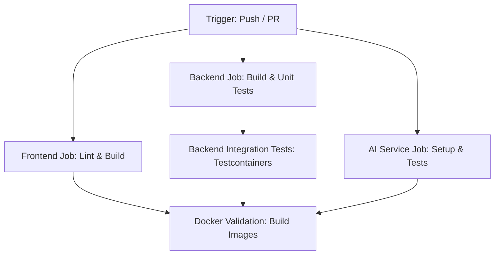

# CVerify Continuous Integration (CI) Implementation Report

This report documents the implementation of the Continuous Integration (CI) pipeline for CVerify. The pipeline is designed to build, validate, and test all application components—Frontend, Backend, and AI Service—ensuring all commits and pull requests are production-ready.

---

## 1. Pipeline Architecture & Workflow Design

The CI pipeline is implemented as a unified GitHub Actions workflow in [.github/workflows/ci.yml](file:///d:/Coding%20Space/Github/CVerify/.github/workflows/ci.yml).

### Trigger Conditions
The workflow runs automatically under the following conditions:
* **Pull Requests** targeting:
  * `main`
  * `cverify-uat`
* **Pushes** to:
  * `main`
  * `cverify-uat`

### Job Topology & Parallelization
To maximize build speed and preserve resources, the workflow uses a parallelized job structure with strict dependencies:

* **Frontend Validation (`frontend-ci`):** Independent parallel execution.
* **Backend Validation (`backend-ci`):** Compiles and runs unit tests.
* **Integration Testing (`backend-integration-tests`):** Run after the backend build and unit tests pass, using Docker containers.
* **AI Service Validation (`ai-service-ci`):** Independent parallel execution.
* **Docker Build Validation (`docker-validation`):** Orchestrated as the final gate. It runs only if the frontend, backend, and AI service validation jobs pass.

---

## 2. Executed Jobs & Steps

### Job 1: Frontend Validation (`frontend-ci`)
Validates the React/Next.js client code:
1. **Checkout Code:** Retrieves the latest code.
2. **Setup Node.js:** Installs Node.js v20 with npm caching mapped to `client/package-lock.json`.
3. **Restore Dependencies:** Wipes and reinstalls dependencies cleanly via `npm ci --legacy-peer-deps`.
4. **Run Linter:** Executes `npm run lint` to enforce formatting and React code guidelines.
5. **Verify Compilation:** Executes `npm run build` to verify type safety and Turbopack production compilation.

### Job 2: Backend Validation (`backend-ci`)
Validates the ASP.NET Core v10 backend code:
1. **Setup .NET SDK:** Installs the latest .NET 10.0.x SDK with native NuGet dependency caching.
2. **Restore NuGet Packages:** Restores all project references.
3. **Verify Formatting:** Enforces style compliance using `dotnet format CVerify.Core/CVerify.sln --verify-no-changes`. Any formatting issue will immediately fail the build.
4. **Compile Backend:** Builds the solution using `dotnet build --configuration Release --no-restore`.
5. **Execute Unit Tests:** Runs the mock-driven unit test suite via `dotnet test` and collects code coverage.

### Job 3: Integration Testing (`backend-integration-tests`)
Runs integration tests using dockerized infrastructure:
1. **Setup .NET SDK & Docker:** Runs on `ubuntu-latest` with pre-installed Docker daemon.
2. **dotnet test (Testcontainers):** Executes the integration tests project. `DotNet.Testcontainers` boots up isolated instances of PostgreSQL (`pgvector/pgvector:0.7.0-pg16`) and Redis (`redis:7.2.4-alpine3.19`) to run endpoints under live container environments.
3. **Upload Coverage Results:** Packages and uploads backend coverage reports as artifacts.

### Job 4: AI Service Validation (`ai-service-ci`)
Validates the FastAPI Python service:
1. **Setup Python:** Installs Python 3.11 and restores pip dependencies with caching mapped to `CVerify.AI/requirements.txt`.
2. **Install System Dependencies:** Installs `tesseract-ocr` and Poppler utilities needed for OCR processing in the runner environment.
3. **Execute Pytest Suite:** Runs the unit/integration tests with `pytest-cov` to collect coverage metrics.
4. **Upload Coverage XML:** Saves reports as workflow artifacts.

### Job 5: Docker Build Validation (`docker-validation`)
Ensures all services can be built into production Docker images:
* Leverages `docker/setup-buildx-action` to configure BuildKit.
* Conducts dry-run builds (`push: false`) for `client/Dockerfile`, `CVerify.Core/Dockerfile`, and `CVerify.AI/Dockerfile` to verify docker configuration without publishing.

---

## 3. Security Decisions & Best Practices

The pipeline implements security hardening configurations:
* **Least Privilege:** Top-level permissions are explicitly set to read-only (`permissions: contents: read`) to prevent tokens from writing code or tagging releases without authorization.
* **Immutable Version Pinning:** All third-party GitHub Actions are pinned to specific commit SHAs (e.g., `actions/checkout@11bd71901bbe5b1630ceea73d27597364c9af683`) to prevent supply chain injection attacks from compromised action versions.
* **Secure Secret Management:** Secrets are injected dynamically (e.g. `ANTHROPIC_API_KEY` for AI service mock configurations) rather than hardcoded in source control.

---

## 4. Code Coverage Summary

Code coverage is enabled in the CI pipeline for the backend and python services:
* **Backend:** Leverages `coverlet.collector` (added to both CVerify unit and integration test projects) to generate standard Cobertura XML files.
* **AI Service:** Uses `pytest-cov` to output coverage reports.
* **Known Gap (Frontend):** The frontend has exactly one test script ([auth.validator.test.ts](file:///d:/Coding%20Space/Github/CVerify/client/src/features/auth/validators/auth.validator.test.ts)) executed via raw Node.js assertions. There is no frontend test runner (like Jest or Vitest) configured. Therefore, frontend code coverage is currently unavailable in this implementation.

---

## 5. Failure Recovery & Reliable Execution

* **Fail-Fast Behavior:** Any compile error, test failure, lint violation, or formatting issue in any step will instantly terminate the job with a non-zero exit code.
* **Release Gate Blocking:** Because `docker-validation` has `needs: [frontend-ci, backend-ci, ai-service-ci]`, any upstream failure prevents the validation of Docker images and blocks downstream delivery phases.

---

## 6. Future Improvements

1. **Configure Container Registry:** Add publishing steps to push validated Docker images to GitHub Packages Container Registry (`ghcr.io`) upon pushing to the `main` or `cverify-uat` branch.
2. **Frontend Unit Testing:** Setup Vitest or Jest in `client/` and migrate the validator scripts into formal test suites to collect client-side code coverage.
3. **Infrastructure as Code (IaC) Deployment:** Extend the pipeline to automate deployment rollouts to AWS/Azure/GCP using Terraform or Kubernetes manifests.
4. **Vulnerability Scanning:** Integrate Trivy or Snyk in the docker validation stage to scan compiled containers for system dependency vulnerabilities.
