# Hệ Thống CV AI Analysis: Tài Liệu Chi Tiết Về Kiến Trúc & Quy Trình Hoạt Động

Tài liệu này cung cấp hướng dẫn kỹ thuật chi tiết được reverse-engineer từ mã nguồn của hệ thống Candidate CV AI Analysis (Line 2 Pipeline) trong CVerify. Tài liệu mô tả cách hệ thống tổng hợp thông tin từ repository intelligence, contributor evidence và hồ sơ khai báo của ứng viên để tạo ra Digital CV, các capability vector và báo cáo đánh giá năng lực được chứng thực bằng AI.

---

## 1. Executive Summary (Tóm tắt dự án)

**CV AI Analysis Subsystem** (thường được gọi là **Line 2 Pipeline**) là bộ não phân tích năng lực ứng viên của CVerify. Subsystem này chịu trách nhiệm hợp nhất các dữ liệu phân tích mã nguồn cấp thấp từ Line 1 Pipeline (static analysis, git blame, commit diff) với các thông tin tự khai báo (self-declared) trên CV của ứng viên để tạo ra một bản đồ năng lực đa chiều, xác thực các kỹ năng thực tế và đưa ra các đánh giá chuyên sâu về lộ trình nghề nghiệp.

### Các mục tiêu kiến trúc cốt lõi
* **Evidence-Based Evaluation (Đánh giá dựa trên bằng chứng)**: Đảm bảo mọi kỹ năng và kinh nghiệm của ứng viên đều được đối chiếu trực tiếp với các bằng chứng code thực tế (file code, commit pattern, tỷ lệ đóng góp).
* **Deterministic Seniority Validation (Xác thực cấp độ năng lực bằng thuật toán)**: Loại bỏ sự đánh giá cảm tính về mức độ seniority (Junior, Middle, Senior, Staff, Principal) bằng cách áp dụng các thuật toán tính điểm capability vector và các rào cản (gating thresholds) nghiêm ngặt trước khi chuyển cho LLM tinh chỉnh.
* **Profile Verification & Trust Scoring (Điểm tin cậy hồ sơ)**: Đo lường tỷ lệ trùng khớp giữa các kỹ năng ứng viên khai báo và bằng chứng code thực tế để phát hiện tình trạng thổi phồng CV.
* **Recruiter-Friendly Syntheses (Tổng hợp thân thiện với nhà tuyển dụng)**: Dịch các chỉ số kỹ thuật phức tạp (độ phức tạp mã nguồn AST, lịch sử sửa lỗi, thói quen code) thành các bản tóm tắt định tính dễ hiểu và lộ trình cải thiện rõ ràng.

### Các subsystem liên quan
1. **Frontend Client (React)**: Gửi yêu cầu phân tích, theo dõi tiến độ thời gian thực thông qua kết nối Server-Sent Events (SSE) và hiển thị Digital CV.
2. **CVerify.Core (.NET API & Worker)**: Chịu trách nhiệm kiểm tra điều kiện readiness của hồ sơ ứng viên, điều phối hàng đợi (Redis FIFO Queue), quản lý cơ chế lock chống trùng lặp, gọi API phân tích của Python backend, thực hiện transaction ghi dữ liệu vào PostgreSQL và phát sự kiện tiến độ qua Redis Pub/Sub.
3. **CVerify.AI (FastAPI Subsystem)**: Chạy pipeline 15 tác vụ (từ L2-001 đến L2-015) theo mô hình Directed Acyclic Graph (DAG) để chuẩn hóa kỹ năng, tính toán các chiều capability vector, xếp hạng technical tendency và phân loại working style của ứng viên thông qua Claude API.
4. **Redis Data Layer**: Quản lý hàng đợi thực thi (`candidate:assessment:queue`), lock concurrency chống xung đột (`candidate:assessment:lock:{userId}`) và kênh Pub/Sub truyền thông tin tiến trình (`candidate:assessment:progress:{userId}`).
5. **PostgreSQL Database**: Lưu trữ dữ liệu hồ sơ năng lực, các thực thể quan hệ (`CandidateSkill`, `CandidateDomainProfile`, `CandidateBestFitRole`, v.v.) và các artifact JSON chi tiết.

### Sơ đồ quy trình tổng quan (High-Level Diagram)

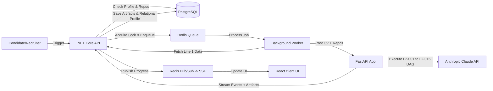

#### Giải thích sơ đồ quy trình tổng quan:
Sơ đồ trên mô tả luồng tương tác cấp cao khi người dùng kích hoạt quá trình phân tích CV:
1. Người dùng (Ứng viên hoặc Nhà tuyển dụng) nhấn nút kích hoạt trên giao diện, gửi yêu cầu tới **.NET Core API**.
2. API kiểm tra thông tin hồ sơ và trạng thái phân tích các repository trong **PostgreSQL** để đảm bảo ứng viên đã đủ điều kiện đánh giá.
3. Nếu đủ điều kiện, hệ thống lấy concurrency lock trong **Redis** và đẩy ID công việc vào hàng đợi hàng đợi thực thi (**Redis Queue**).
4. **Background Worker** lấy công việc ra khỏi hàng đợi, tải toàn bộ dữ liệu phân tích chi tiết Line 1 (lịch sử commit, cấu trúc thư mục) và gọi HTTP POST kèm theo dữ liệu CV sang **FastAPI Subsystem** trong Python.
5. **FastAPI** chạy pipeline DAG gồm 15 tác vụ độc lập, tương tác với **Anthropic Claude API** để sinh ra các đánh giá định tính.
6. Kết quả từng bước và các artifact JSON hoàn chỉnh được FastAPI truyền ngược về dưới dạng SSE. **.NET Core API** lưu các file artifact và dữ liệu quan hệ tương ứng vào **PostgreSQL**, đồng thời gửi tiến độ thời gian thực qua **Redis Pub/Sub** để client React cập nhật trạng thái giao diện trực tiếp.

---

## 2. System Architecture (Kiến trúc hệ thống)

Kiến trúc phân tích CV AI của CVerify được thiết kế theo dạng phân tán để phân tách rõ ràng giữa phần xử lý nghiệp vụ, quản lý trạng thái dữ liệu (.NET Core) và phần xử lý tính toán AI, phân tích dữ liệu chuyên sâu (FastAPI & Claude API).

### Các API Endpoints chính
* `GET /api/v1/candidate-assessments/readiness`: Kiểm tra mức độ hoàn thiện của hồ sơ ứng viên (headline, bio, skills, education, work experience) và xác định xem có dữ liệu phân tích repository mới cần cập nhật hay không.
* `POST /api/v1/candidate-assessments`: Kích hoạt một lượt đánh giá CV mới. Endpoint này sẽ kiểm tra lock concurrency trên Redis để tránh việc một ứng viên chạy nhiều tiến trình phân tích cùng lúc.
* `GET /api/v1/candidate-assessments/progress/{userId}`: Thiết lập kết nối SSE (Server-Sent Events) để client lắng nghe các cập nhật tiến độ từ kênh Pub/Sub của Redis.
* `GET /api/v1/candidate-assessments/{assessmentId}/details`: Lấy thông tin chi tiết của kết quả đánh giá cùng danh sách các artifact JSON đi kèm.
* `POST /api/v1/candidate/assess/stream` (FastAPI): API nội bộ nhận dữ liệu đầu vào đã hợp nhất, chạy pipeline thực thi DAG và stream các gói JSON thể hiện tiến trình và kết quả của từng task.

### Sơ đồ thành phần kiến trúc (Component Architecture Diagram)

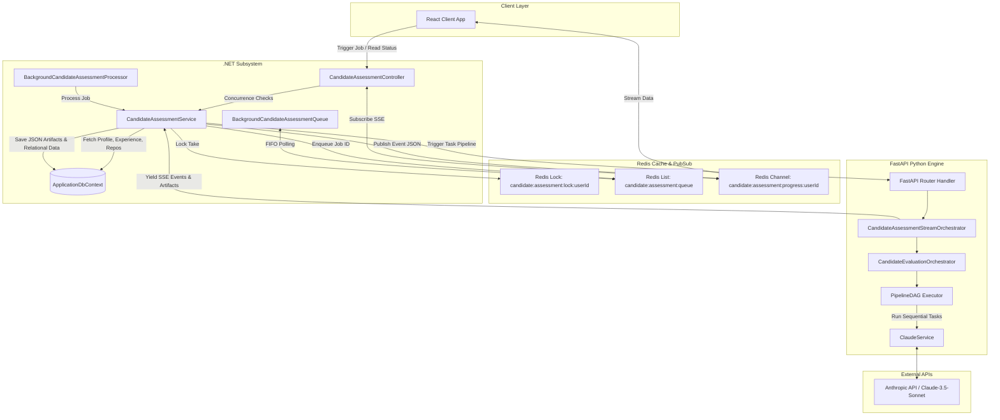

#### Giải thích sơ đồ thành phần kiến trúc:
Sơ đồ mô tả chi tiết các thành phần phân lớp và giao thức kết nối trong hệ thống:
1. **Lớp Giao Diện (React Client)** kết nối trực tiếp với **CandidateAssessmentController** trong .NET.
2. **Lớp Nghiệp Vụ (.NET Subsystem)** bao gồm Controller điều phối HTTP Request, **CandidateAssessmentService** thực hiện logic kiểm tra nghiệp vụ và ghi DB, **BackgroundQueue** quản lý hàng đợi và **BackgroundProcessor** là worker chạy ngầm để lấy job ra xử lý. Dữ liệu được đọc/ghi thông qua Entity Framework Core (**ApplicationDbContext**).
3. **Lớp Đệm và Truyền Tin (Redis)** đóng vai trò trung gian: **RedisLock** ngăn chặn ghi đè tài nguyên bằng cách tạo khóa lock độc quyền thời hạn 10 phút, **RedisQueue** lưu hàng đợi FIFO dưới dạng Redis List, và **RedisChannel** là kênh Pub/Sub truyền các event tiến độ dạng JSON.
4. **Lớp Tính Toán AI (FastAPI Subsystem)** nhận payload từ .NET, giải nén và chuyển tiếp cho **CandidateAssessmentStreamOrchestrator**. Bộ sinh dữ liệu stream này dùng **CandidateEvaluationOrchestrator** để khởi tạo danh sách các Task dạng DAG thông qua **PipelineDAG**. Mỗi Task sẽ gọi **ClaudeService** để kết nối bảo mật đến **Anthropic API** (sử dụng model Claude-3.5-Sonnet).
5. Khi có kết quả trả về từ Anthropic, FastAPI stream ngược lại từng phần dữ liệu cho .NET Service để ghi nhận vào Database, đồng thời đẩy lên Redis Channel để Controller chuyển tiếp đến React UI qua SSE.

---

## 3. Quy Trình Đầu Cuối Tạo Digital CV (End-to-End CV Generation Workflow)

Quy trình xử lý một lượt đánh giá và tạo CV đi qua nhiều thành phần và hệ thống kiểm soát khác nhau:

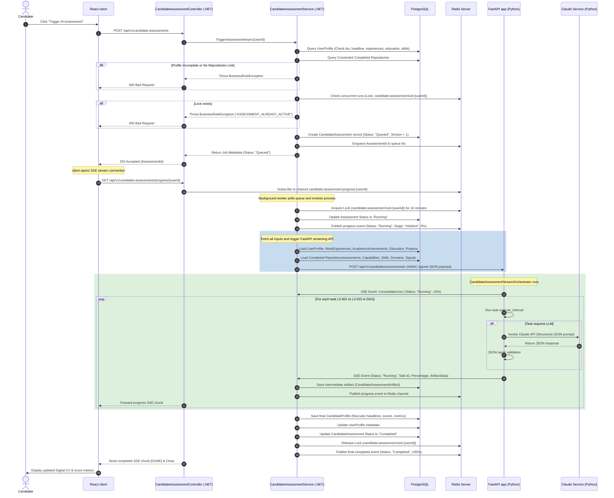

#### Giải thích sơ đồ tuần tự quy trình đầu cuối:
Sơ đồ sequence diagram trên mô tả chi tiết 24 bước thực thi từ khi ứng viên bấm nút kích hoạt cho đến khi nhận được Digital CV:
1. **Giai đoạn kích hoạt (Bước 1 - 10)**: Ứng viên gửi yêu cầu `Trigger AI Assessment` từ giao diện React. API thực hiện truy vấn cơ sở dữ liệu PostgreSQL để kiểm tra xem ứng viên đã hoàn thành tối thiểu các trường bắt buộc của hồ sơ cá nhân và đã kết nối, phân tích thành công ít nhất một repository hay chưa. Tiếp theo, hệ thống gửi lệnh `LockTake` đến Redis để kiểm tra khóa trùng lặp. Nếu các điều kiện hợp lệ, một bản ghi `CandidateAssessment` mới được lưu với trạng thái `Queued`, ID của lượt đánh giá được đẩy vào Redis List và trả về mã HTTP `202 Accepted` kèm theo ID của lượt đánh giá này để client hiển thị màn hình chờ.
2. **Giai đoạn lắng nghe (Bước 11 - 12)**: Ngay sau khi nhận phản hồi 202, React client mở một đường truyền SSE nối trực tiếp đến controller .NET. Controller đăng ký lắng nghe (subscribe) sự kiện trên Redis channel `candidate:assessment:progress:{userId}`.
3. **Giai đoạn chuẩn bị (Bước 13 - 17)**: Worker ngầm phát hiện job mới trong hàng đợi, chuyển trạng thái job thành `Running` và gửi thông điệp tiến trình đầu tiên đến Redis. Tiếp theo, nó truy vấn toàn bộ dữ liệu CV và các RepositoryAssessment Line 1 liên quan từ PostgreSQL để tạo payload JSON lớn, mã hóa chữ ký HMAC và gửi qua HTTP POST đến FastAPI.
4. **Giai đoạn chạy pipeline AI (Bước 18 - 20)**: FastAPI nhận payload, thông báo khởi chạy và bắt đầu vòng lặp qua 15 stage của DAG. Với mỗi tác vụ yêu cầu trí tuệ nhân tạo (như L2-001, L2-002, L2-003, v.v.), FastAPI sinh prompt cấu trúc, gửi đến Claude Service và nhận lại kết quả JSON. Kết quả này sau đó được đi qua hàm `json_repair` để vá lỗi cú pháp. Từng gói kết quả (SSE event) chứa phần trăm hoàn thành và dữ liệu artifact thô được stream về cho .NET API theo thời gian thực. API lưu dữ liệu thô này vào bảng `CandidateAssessmentArtifact` và bắn sự kiện tiến trình vào Redis Channel để React UI hiển thị tiến độ chạy mượt mà.
5. **Giai đoạn hoàn tất và lưu trữ (Bước 21 - 24)**: Sau khi tác vụ cuối cùng L2-015 hoàn tất, .NET API phân tích gói artifact `CandidateProfile` cuối cùng, cập nhật các chỉ số tổng hợp (`OverallScore`, `CareerLevel`, `TechnicalDepth`, v.v.), cập nhật ngày cập nhật hồ sơ năng lực của ứng viên, lưu các bảng dữ liệu quan hệ, xóa khóa lock concurrency trên Redis và xuất chuỗi đặc biệt `[DONE]` để đóng luồng SSE. Client React tải lại dữ liệu mới nhất và vẽ biểu đồ năng lực cho ứng viên.

---

## 4. Vòng Đời Phân Tích (Analysis Lifecycle)

Mỗi lượt chạy đánh giá năng lực ứng viên được giám sát chặt chẽ thông qua các trạng thái tuần tự để bảo vệ tính toàn vẹn của dữ liệu trong Database và tránh xung đột tài nguyên.

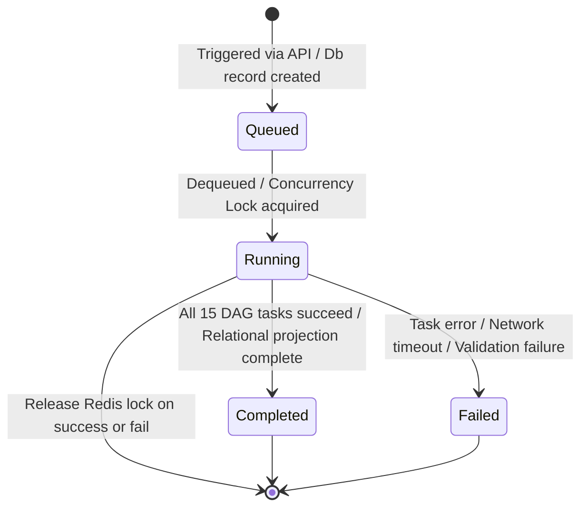

#### Giải thích sơ đồ vòng đời phân tích:
Sơ đồ trạng thái trên mô tả cách một job chuyển đổi giữa các trạng thái và cơ chế dọn dẹp khóa lock:
* **Queued**: Trạng thái ban đầu khi bản ghi được ghi nhận vào cơ sở dữ liệu và công việc nằm chờ trong hàng đợi Redis.
* **Running**: Khi processor ngầm bắt đầu thực thi job. Trạng thái này được bảo vệ bởi khóa lock trên Redis để đảm bảo không có job nào khác được chạy đồng thời cho cùng một `userId`.
* **Completed**: Trạng thái thành công cuối cùng khi toàn bộ 15 task của pipeline chạy xong, các cấu trúc dữ liệu quan hệ được ghi nhận thành công vào database PostgreSQL. Khóa lock concurrency được giải phóng ở bước này.
* **Failed**: Trạng thái lỗi nếu có bất kỳ ngoại lệ nào phát sinh (lỗi kết nối API Claude, lỗi cú pháp JSON không thể vá, lỗi ghi database). Hệ thống sẽ cập nhật lý do lỗi (`FailureReason`), lưu tên task bị lỗi (`FailedStage`), giải phóng khóa lock trên Redis và kết thúc tiến trình.

### Bảng định nghĩa chi tiết các trạng thái vòng đời

| Trạng thái | Điều kiện kích hoạt (Entry) | Điều kiện thoát (Exit) | Hành vi phục hồi / Xử lý sự cố |
| :--- | :--- | :--- | :--- |
| **Queued** | API gửi yêu cầu hợp lệ; tạo bản ghi `CandidateAssessment` với phiên bản mới (`Version = maxVersion + 1`). | Background Worker pop ID job ra khỏi hàng đợi Redis. | Kiểm tra khóa lock ngăn chặn tối đa 1 job chạy ngầm cho mỗi ứng viên. |
| **Running** | Worker bắt đầu thực thi job và lấy thành công khóa lock Redis `candidate:assessment:lock:{userId}` thời hạn 10 phút. | Tất cả 15 task trong pipeline FastAPI chạy thành công và các cấu trúc dữ liệu quan hệ được ánh xạ đầy đủ. | Nếu luồng xử lý bị sập đột ngột (crash), khóa lock Redis sẽ tự động hết hạn sau 10 phút, giải phóng tài nguyên cho các lượt chạy tiếp theo. |
| **Completed**| Artifact `CandidateProfile` được lưu, các trường điểm được tính toán đầy đủ và ghi nhận trạng thái `Completed`. | Job kết thúc thành công. | Trạng thái cuối cùng. Các lượt yêu cầu phân tích tiếp theo sẽ tăng chỉ số phiên bản (`Version`). |
| **Failed** | Xuất hiện exception trong worker .NET hoặc FastAPI trả về lỗi nghiêm trọng hoặc lỗi ghi database. | Trạng thái chuyển thành `Failed`, lưu thông tin `FailedStage` và `FailureReason`. | Giải phóng khóa lock Redis ngay lập tức, thông báo lỗi qua SSE về phía client và dừng tiến trình. |

---

## 5. Chi Tiết Về Pipeline Engine (Pipeline Engine Deep Dive)

Pipeline L2 xử lý việc chạy tuần tự các task trong FastAPI bằng cách sử dụng một custom Directed Acyclic Graph (DAG) executor được thiết kế đảm bảo tính nhất quán dữ liệu.

### Kiến trúc Pipeline
* **Task Isolation (Cô lập Tác vụ)**: Mỗi task kế thừa từ lớp cơ sở `BaseTask`. Lớp này định nghĩa các thuộc tính trừu tượng gồm danh sách các dependencies (tác vụ tiền đề), `input_keys` (các khóa dữ liệu đầu vào bắt buộc từ context) và `output_keys` (các trường dữ liệu đầu ra mà tác vụ này sẽ ghi vào context).
* **Context Propagation (Lan truyền Context)**: Toàn bộ dữ liệu được luân chuyển qua một thực thể `PipelineContext`. Đối tượng này triển khai cơ chế kiểm tra tính bất biến (immutability) nghiêm ngặt trong hàm `update()`. Khi một trường dữ liệu đã được ghi bởi một tác vụ trước đó, nó sẽ bị khóa và không cho phép chỉnh sửa hay ghi đè bởi các tác vụ sau (ngoại trừ một số biến đặc biệt như `candidateProfile` và `cvImprovementSuggestions`), bảo vệ tính toàn vẹn của kết quả tính toán.
* **Fail-Fast Validation**: Khi khởi tạo orchestrator, hệ thống tự động gọi hàm `PipelineDAG.validate()` để kiểm tra toàn bộ đồ thị: phát hiện các chu kỳ dependency khép kín (cyclic dependencies) và đảm bảo các khóa đầu ra của các tác vụ trước đáp ứng đầy đủ yêu cầu `input_keys` của các tác vụ sau.

### Sơ đồ phụ thuộc các tác vụ (Task Dependencies Graph)

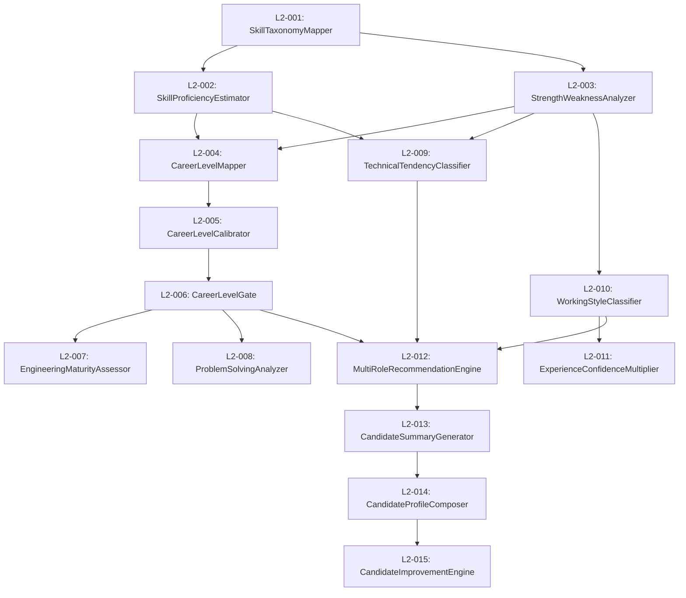

#### Giải thích sơ đồ phụ thuộc các tác vụ:
Sơ đồ trên thể hiện dòng chảy dữ liệu và thứ tự bắt buộc khi thực thi các tác vụ:
1. **L2-001 (SkillTaxonomyMapper)** chạy đầu tiên để chuẩn hóa tên kỹ năng. Kết quả của nó là đầu vào cho **L2-002 (SkillProficiencyEstimator)** tính điểm thành thạo và **L2-003 (StrengthWeaknessAnalyzer)** phân tích điểm mạnh/điểm yếu.
2. **L2-004 (CareerLevelMapper)** cần kết quả của cả L2-002 và L2-003 để ước lượng cấp bậc nghề nghiệp ban đầu.
3. Cấp bậc này tiếp tục đi qua **L2-005 (CareerLevelCalibrator)** để điều chỉnh tiệm cận và **L2-006 (CareerLevelGate)** để áp dụng các điều kiện kiểm soát cứng (Seniority Gates).
4. Sau khi chốt cấp bậc tại L2-006, hệ thống chạy **L2-007 (EngineeringMaturityAssessor)** đánh giá độ chín kỹ thuật và **L2-008 (ProblemSolvingAnalyzer)** phân tích năng lực giải quyết vấn đề.
5. Song song đó, xu hướng kỹ thuật **L2-009 (TechnicalTendencyClassifier)** và làm việc **L2-010 (WorkingStyleClassifier)** được phân loại. Tác vụ L2-010 cung cấp đầu vào cho **L2-011 (ExperienceConfidenceMultiplier)** để tính hệ số tự tin dựa trên thâm niên thực tế.
6. **L2-012 (MultiRoleRecommendationEngine)** tích hợp các thông tin từ L2-006 (cấp bậc), L2-009 (xu hướng) và L2-010 (phong cách làm việc) để gợi ý vị trí phù hợp.
7. Cuối cùng, thông tin được chuyển qua **L2-013 (CandidateSummaryGenerator)** viết tóm tắt ngắn, **L2-014 (CandidateProfileComposer)** cấu trúc hồ sơ hoàn chỉnh và **L2-015 (CandidateImprovementEngine)** vạch ra lộ trình tối ưu hóa điểm số.

---

## 6. Hệ Thống Tổng Hợp Bằng Chứng (Evidence Aggregation System)

Hệ thống thu thập bằng chứng từ ba nguồn dữ liệu chính để xây dựng nên một cái nhìn toàn diện về năng lực thực tế của ứng viên:
1. **Repository Evidence (Line 1)**: Đọc từ các phân tích repository được chứng thực trước đó. Bao gồm: `skillAttributions` (kỹ năng được trích xuất từ code), `capabilities` (các tính năng nghiệp vụ đã triển khai) và `intelligenceSignal` (các chỉ số định lượng về tỷ lệ tác giả, độ phức tạp cấu trúc).
2. **Project Evidence (Self-Declared)**: Dữ liệu dự án khai báo trên CV, bao gồm tên dự án, vai trò đảm nhận, mô tả công việc và danh sách công nghệ sử dụng.
3. **User Evidence**: Thông tin chung của ứng viên bao gồm headline, bio, quá trình học vấn và kinh nghiệm làm việc chi tiết.

```mermaid
flowchart TD
    subgraph Repo Evidence (Line 1)
        R_Attributions[Skill Attributions]
        R_Capabilities[Capabilities Maturity]
        R_Signals[Scope, Complexity & Ownership]
    end

    subgraph Project Evidence (Self-Declared)
        P_Metadata[Projects, Durations & Roles]
        P_Tech[Declared Tech Stacks]
    end

    subgraph User Evidence
        U_Profile[Headline, Bio, Experiences & Education]
    end

    R_Attributions & R_Capabilities & R_Signals -->|ConsolidateLine1| ConsolidatedReport[Consolidated Report]
    P_Metadata & P_Tech & U_Profile -->|ConsolidateLine1| ConsolidatedReport

    ConsolidatedReport -->|L2-001 Skill Taxonomy| SkillMapping[Taxonomy Map]
```

#### Giải thích sơ đồ tổng hợp bằng chứng:
Sơ đồ trên mô tả cơ chế gộp dữ liệu:
* Các thông tin đo lường chính xác từ code thực tế trong Line 1 Subsystem được cấu trúc lại và gộp chung với các mô tả tự khai báo trên giao diện CV của ứng viên.
* Toàn bộ dữ liệu này được tích hợp thành một cấu trúc đồng nhất mang tên `Consolidated Report` trong bước `ConsolidateLine1`.
* Báo cáo này sau đó được chuyển trực tiếp vào tác vụ chuẩn hóa kỹ năng đầu tiên `L2-001` để bắt đầu phân tích năng lực.

---

## 7. Pipeline Trích Xuất Kỹ Năng (Skill Extraction Pipeline)

Pipeline trích xuất kỹ năng đảm bảo mọi công nghệ được khai báo trên CV đều phải trải qua quá trình kiểm chứng mức độ tin cậy dựa trên dữ liệu code thực tế.

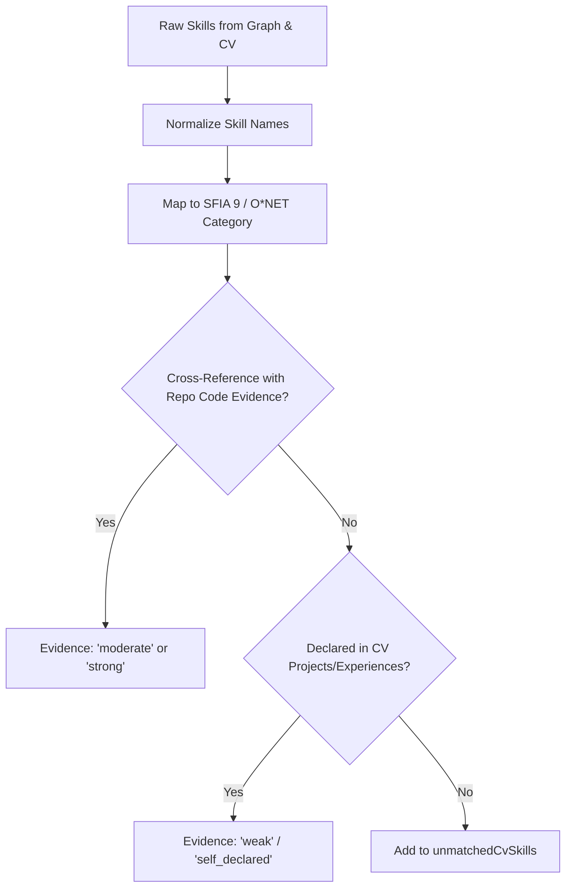

#### Giải thích sơ đồ pipeline trích xuất kỹ năng:
Sơ đồ trên mô tả luồng kiểm chứng và phân loại độ tin cậy của một kỹ năng:
1. Danh sách kỹ năng thô (Raw Skills) từ sơ đồ bằng chứng mã nguồn và CV khai báo sẽ được chuẩn hóa tên (Normalize Skill Names) để đồng bộ hóa danh xưng công nghệ.
2. Tiếp theo, hệ thống thực hiện ánh xạ kỹ năng vào danh mục tiêu chuẩn SFIA 9 và mã nghề nghiệp O*NET.
3. Bước quan trọng nhất là đối chiếu (Cross-Reference) với dữ liệu code thực tế:
   * Nếu tìm thấy bằng chứng code hỗ trợ kỹ năng này, mức độ tin cậy được thiết lập là `moderate` (trung bình) hoặc `strong` (mạnh) tùy thuộc vào số lượng và tầm quan trọng của file code đóng góp.
   * Nếu không tìm thấy code thực tế, hệ thống kiểm tra xem kỹ năng đó có được mô tả trong các dự án hoặc kinh nghiệm làm việc tự khai báo hay không. Nếu có, gán mức tin cậy thấp `weak` hoặc `self_declared`.
   * Nếu hoàn toàn không tìm thấy bất kỳ liên kết hay mô tả dự án nào, kỹ năng đó sẽ bị phân loại vào danh sách `unmatchedCvSkills` (kỹ năng khai báo khống).

---

## 8. Cơ Chế Tính Toán Capability Vector (Capability Vector Generation)

Hệ thống xây dựng một vector năng lực đa chiều gồm 5 tọa độ số học độc lập để đánh giá toàn diện kỹ năng của ứng viên:

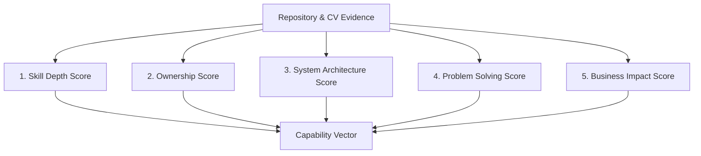

#### Giải thích sơ đồ tính toán Capability Vector:
Sơ đồ mô tả cách dữ liệu thô đầu vào được phân tách thành 5 chỉ số năng lực độc lập cấu thành nên bộ định dạng năng lực ứng viên (Capability Vector). Dưới đây là các công thức toán học thực tế được cài đặt trong file `scoring_engine.py` và `career_level.py`:

### 1. Skill Depth Score ($SD$ - Độ sâu kỹ thuật)
Đo lường mức độ chuyên sâu của các công nghệ được chứng thực bằng code. Điểm số được tính theo hàm logarit để giảm thiểu sự tăng trưởng tuyến tính quá mức khi ứng viên viết quá nhiều file code lặp lại:
$$SD = 22.0 \times \ln(1.0 + 0.05 \times \text{raw\_skills\_verified})$$
Trong đó:
* $\text{raw\_skills\_verified} = \sum (\text{proficiencyLevel} \times 25.0)$ đối với những kỹ năng ứng viên khai báo mà tìm thấy bằng chứng đóng góp code thực tế trong các repository được liên kết.

### 2. Ownership Score ($O$ - Mức độ làm chủ mã nguồn)
Thể hiện mức độ đóng góp và quyền tác giả của ứng viên trên toàn bộ các repository được phân tích:
$$O = \frac{\sum (\text{ownershipSignal} \times \text{size})}{\sum \text{size}}$$
Trong đó:
* $\text{ownershipSignal}$ là tỷ lệ đóng góp commit của ứng viên trong repository (được chuẩn hóa về khoảng $[0.0, 1.0]$).
* $\text{size}$ là số lượng tính năng/năng lực (`capabilities`) được phát hiện trong repo đó cộng thêm 1.0 (nhằm gán trọng số lớn hơn cho những dự án lớn).

### 3. System Architecture Score ($A$ - Năng lực thiết kế hệ thống)
Đánh giá khả năng thiết kế và áp dụng các mẫu kiến trúc phần mềm phức tạp của ứng viên. Điểm số được tính bằng cách tổng hợp điểm khó của các capability kiến trúc và nhân với hệ số mũ của các mẫu thiết kế đã được chứng thực:
$$A = \text{base\_arch\_score} \times e^{(M_{\text{pattern}} - 1.0)}$$
Trong đó:
* $\text{base\_arch\_score} = \sum (\text{difficultyScore} \times 10.0 \times \text{maturity\_multiplier})$ của các capability độc nhất có điểm độ khó $\ge 5.0$.
* $\text{maturity\_multiplier}$ nhận các giá trị: $0.5$ (Basic), $1.0$ (Intermediate), $1.5$ (Advanced), $2.0$ (Enterprise).
* $M_{\text{pattern}}$ là hệ số nhân thiết kế kiến trúc hệ thống, được cộng dồn theo các quy tắc:
  * $+0.25$ nếu phát hiện các mẫu cơ bản: Dependency Injection, IoC, hoặc Interfaces.
  * $+0.35$ nếu phát hiện các mẫu kiến trúc nâng cao: CQRS, Hexagonal Architecture, Clean Architecture.
  * $+0.15$ nếu phát hiện các mẫu vận hành sản xuất: Telemetry, Middleware, Custom Logging.

### 4. Problem Solving Score ($PS$ - Năng lực giải quyết vấn đề)
Đo lường khả năng chuẩn đoán lỗi, bảo trì hệ thống và khắc phục sự cố dựa trên chất lượng và độ phức tạp của các commit sửa lỗi:
$$PS = 10.0 \times \sum \left( \frac{\text{complexity}}{1.0 + e^{-0.1 \times (\text{complexity} - 2.0)}} \right)$$
Trong đó:
* $\text{complexity} = \frac{\text{complexityScore}}{10.0}$ (lấy từ các chỉ số chất lượng mã nguồn Line 1). Công thức sử dụng hàm Sigmoid để phóng đại các đóng góp giải quyết những vấn đề có độ phức tạp cao và bỏ qua các sửa đổi nhỏ lẻ.

### 5. Business Impact Score ($I$ - Mức độ ảnh hưởng kinh doanh)
Đánh giá giá trị thực tế ứng viên đóng góp dựa trên thời gian làm việc, quy mô doanh nghiệp và cấp độ quản lý kỹ thuật khai báo trên CV:
$$I = 10.0 \times (\text{months}^{0.4}) \times \text{company\_scale} \times \text{role\_scale}$$
Trong đó:
* $\text{months}$ là tổng thời gian làm việc thực tế được quy đổi từ CV.
* $\text{company\_scale}$ nhận giá trị $1.25$ nếu ứng viên từng làm việc tại các tập đoàn công nghệ lớn (Google, Apple, Facebook/Meta, Netflix, Amazon, Microsoft).
* $\text{role\_scale}$ là hệ số cấp bậc: Principal/Director/Head: $1.6$, Staff/Lead/Manager: $1.4$, Senior: $1.2$, Middle: $1.0$, Junior/Intern: $0.8$.

---

## 9. Đánh Giá Năng Lực Chi Tiết (Assessment Generation Pipeline)

Trong quá trình thực thi, hệ thống sẽ tự động tổng hợp thông tin để sinh ra các cấu phần đánh giá năng lực chi tiết sau:

### 1. Engineering Assessment (Đánh giá thói quen kỹ thuật)
* **Mục đích**: Đánh giá thói quen viết code sạch, mức độ phủ kiểm thử (test coverage) và cách tổ chức xử lý lỗi trong mã nguồn.
* **Đầu vào**: `repoIntelligenceReport`, `commitTimelineData`, `codeQualityData`, CV experiences.
* **Đầu ra**: Chỉ số điểm `engineeringMaturityScore`, nhãn `maturityLevel` và mảng tín hiệu `maturitySignals`.
* **Cơ chế Prompt**: Claude phân tích xem ứng viên có thói quen viết test song song với tính năng hay chỉ code chay, có thực hiện refactor mã nguồn chủ động hay không.
* **Lưu trữ**: Bản ghi `CandidateIntelligenceSignal` và gói JSON `Maturity`.

### 2. Capability Assessment (Đánh giá năng lực triển khai tính năng)
* **Mục đích**: Xác định năng lực triển khai các nghiệp vụ thực tế và phân nhóm độ chín năng lực.
* **Đầu vào**: Danh sách capability tổng hợp từ các repository được liên kết.
* **Đầu ra**: Bản ghi `RepositoryCapability` trong database.
* **Lưu trữ**: PostgreSQL quan hệ.

### 3. Skill Assessment (Đánh giá mức độ thành thạo công nghệ)
* **Mục đích**: Gán điểm số và nhãn thành thạo cụ thể cho từng kỹ năng của ứng viên.
* **Đầu vào**: Danh sách kỹ năng chuẩn hóa (`mappedSkills`) và biểu đồ bằng chứng (`skillEvidenceGraph`).
* **Đầu ra**: Mảng `skillProficiencies` chứa điểm số và bằng chứng chứng thực chi tiết cho từng công nghệ.
* **Lưu trữ**: Bảng `CandidateSkill` trong database và gói JSON `SkillsList`.

### 4. Experience & Leadership Assessment (Đánh giá kinh nghiệm và khả năng dẫn dắt)
* **Mục đích**: Phân tích lịch sử làm việc để xác định thâm niên thực tế (có chiết khấu thời gian trùng lặp) và phát hiện năng lực quản lý.
* **Đầu vào**: Danh sách `experiences` và `projects` trên CV ứng viên.
* **Đầu ra**: `confidenceMultiplier` (hệ số tự tin thâm niên) và `totalExperienceYears` (số năm kinh nghiệm thực tế).
* **Lưu trữ**: Phục vụ tính toán và lưu trực tiếp trong gói JSON `CandidateProfile`.

### 5. Trust Assessment (Đánh giá độ tin cậy của CV)
* **Mục đích**: Xác minh độ trung thực của hồ sơ cá nhân và phát hiện hành vi phóng đại năng lực.
* **Đầu vào**: Danh sách kỹ năng ứng viên tự khai báo và danh sách kỹ năng thực sự tìm thấy trong code.
* **Đầu ra**: Chỉ số `trustLevel` và bộ thông số `trustScoreMetrics`.
* **Lưu trữ**: Cập nhật trực tiếp vào trường dữ liệu trên bảng `CandidateAssessments`.

---

## 10. Hệ Thống Điểm Tin Cậy (Trust Score System)

Trust Score đóng vai trò chốt chặn để phân biệt giữa các CV khai khống công nghệ và các kỹ sư thực lực có code chứng minh rõ ràng.

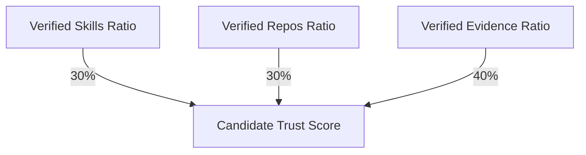

#### Giải thích sơ đồ tính điểm tin cậy:
Sơ đồ trên mô tả cơ cấu tính điểm tin cậy của ứng viên ($T_{\text{candidate}}$). Điểm số này là trung bình có trọng số của ba tỷ lệ xác thực:
1. **Verified Skill Ratio ($R_{\text{skills}}$ - Trọng số 30%)**: Tỷ lệ kỹ năng khai báo trên CV tìm thấy bằng chứng code thực tế trong repository:
   $$R_{\text{skills}} = \frac{\text{Số lượng kỹ năng tự khai báo tìm thấy trong code}}{\text{Tổng số lượng kỹ năng tự khai báo}}$$
2. **Verified Repository Ratio ($R_{\text{repos}}$ - Trọng số 30%)**: Tỷ lệ các repository được liên kết đáp ứng đầy đủ điều kiện sở hữu tác quyền của ứng viên:
   $$R_{\text{repos}} = \frac{\text{Số lượng repository có ownership} \ge 30\%}{\text{Tổng số lượng repository liên kết}}$$
3. **Verified Evidence Ratio ($R_{\text{evidence}}$ - Trọng số 40%)**: Tỷ lệ đóng góp thực tế trên tổng điểm năng lực đánh giá:
   $$R_{\text{evidence}} = \frac{\text{ownershipScore}}{\text{candidateScore}}$$

Công thức tổng hợp điểm tin cậy:
$$T_{\text{candidate}} = \left( R_{\text{skills}} \times 0.30 + R_{\text{repos}} \times 0.30 + R_{\text{evidence}} \times 0.40 \right) \times 100.0$$

#### Trường hợp ứng viên không liên kết Repository
Nếu ứng viên không kết nối bất kỳ repository nào mà chỉ khai báo CV chay:
* Hệ thống gán trọng số đóng góp code thực tế là $0.0$ và trọng số tự khai báo (self-declared) là $1.0$.
* Điểm tổng của ứng viên sẽ bị áp dụng trần giới hạn tối đa (**Scale Ceiling Factor = $0.40$**), nghĩa là điểm tổng của một ứng viên không có code chứng thực không bao giờ vượt quá **40 điểm**.

---

## 11. Tổng Hợp Tạo Digital CV (Digital CV Generation)

Tác vụ L2-014 (CandidateProfileComposer) tập hợp toàn bộ các kết quả trung gian để cấu trúc thành một tài liệu JSON thống nhất theo chuẩn `candidate-profile-v2`.

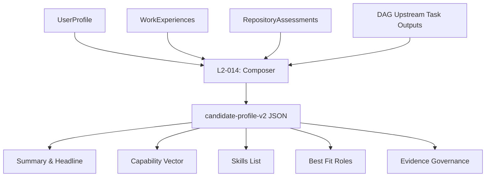

#### Giải thích sơ đồ tổng hợp tạo Digital CV:
Sơ đồ trên minh họa cách các nguồn dữ liệu đầu vào chạy vào bộ soạn thảo hồ sơ `L2-014: Composer` để xuất bản ra tài liệu JSON tổng hợp. Tài liệu này sau đó phân rã thành các cấu phần chính hiển thị trên giao diện của ứng viên:

* **Summary & About (Tóm tắt và Mô tả)**: Sinh từ kết quả của tác vụ L2-013, kết hợp từ thông tin career level, primary tendency và working style để sinh ra headline ngắn gọn và đoạn mô tả năng lực khách quan.
* **Capability Vector**: Bản ghi mảng cấu phần điểm số năng lực đa chiều ($SD, O, A, PS, I$) dùng để vẽ biểu đồ radar trên giao diện.
* **Skills List**: Danh sách kỹ năng kèm theo mức điểm thành thạo chi tiết, hệ số tin cậy và nguồn bằng chứng xác minh cụ thể.
* **Best Fit Roles**: Đề xuất top 3 vai trò công việc phù hợp nhất dựa trên thuật toán so khớp vector năng lực với các archetype nghề nghiệp.
* **Evidence Governance**: Bảng kê khai chi tiết tỷ lệ đóng góp commit và mức độ đóng góp điểm số của từng repository liên kết, tạo tính minh bạch tuyệt đối đối với nhà tuyển dụng.

---

## 12. Điều Phối AI (AI Orchestration Analysis)

Các tương tác với API của Anthropic Claude được thực thi thông qua lớp `ClaudeService` để đảm bảo tính ổn định và tính định hình của cấu trúc JSON đầu ra.

### Quy trình điều phối tác vụ AI (AI Workflow Diagram)

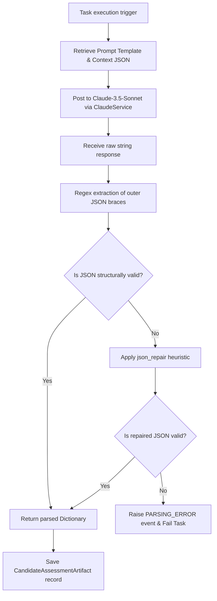

#### Giải thích sơ đồ điều phối tác vụ AI:
Sơ đồ mô tả quy trình xử lý khép kín đối với một cuộc gọi AI:
1. Hệ thống lấy mẫu prompt tương ứng với mã tác vụ (ví dụ: `get_career_level_mapper_prompt`), chèn dữ liệu JSON context đầu vào.
2. Gọi API Anthropic Claude qua `ClaudeService`.
3. Nhận phản hồi dạng chuỗi thô.
4. Sử dụng biểu thức chính quy (Regex) để trích xuất nội dung nằm giữa ký tự `{` đầu tiên và ký tự `}` cuối cùng (loại bỏ các đoạn văn bản giải thích thừa).
5. Thực hiện phân tích cấu trúc (Parse JSON). Nếu cấu trúc hợp lệ, trả về kết quả thành công.
6. Nếu có lỗi cú pháp (như thiếu dấu đóng ngoặc, thừa dấu phẩy), hệ thống áp dụng thư viện `json_repair` để tự động vá lỗi cấu trúc JSON. Nếu vá thành công, trả về kết quả; nếu thất bại, ghi nhận lỗi phân tích cú pháp (`PARSING_ERROR`) và đánh dấu tác vụ thất bại.

---

## 13. Sơ Đồ Thực Thể Dữ Liệu (Data Model Mapping)

Mô hình thực thể quan hệ lưu trữ dữ liệu đánh giá ứng viên được cấu trúc chặt chẽ trong PostgreSQL:

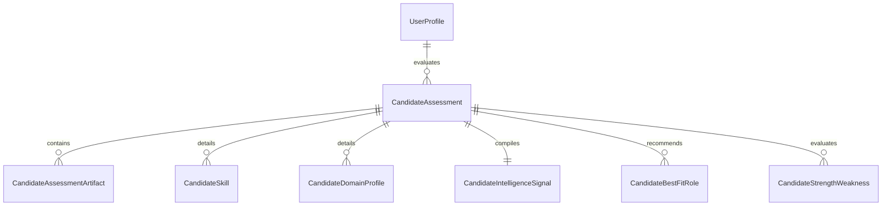

#### Giải thích sơ đồ thực thể dữ liệu:
Sơ đồ ER Diagram trên mô tả mối quan hệ giữa các thực thể trong cơ sở dữ liệu:
* **UserProfile** là thực thể gốc của người dùng. Một UserProfile có thể trải qua nhiều lượt đánh giá năng lực (**CandidateAssessment**) theo thời gian (để lưu trữ lịch sử đánh giá).
* Một bản ghi **CandidateAssessment** đóng vai trò là Aggregate Root, liên kết trực tiếp với:
  * Nhiều **CandidateAssessmentArtifact**: Lưu trữ các tài liệu JSON thô của từng tác vụ trung gian trong pipeline (như `SkillsList`, `CandidateProfile`).
  * Nhiều **CandidateSkill**: Lưu trữ danh sách kỹ năng đã được chuẩn hóa kèm điểm số để tối ưu hóa truy vấn tìm kiếm.
  * Nhiều **CandidateDomainProfile**: Lưu trữ điểm số thâm niên trung bình theo từng miền công nghệ (Backend, Frontend).
  * Một **CandidateIntelligenceSignal**: Lưu trữ 5 giá trị số tương ứng với các tọa độ năng lực phục vụ vẽ biểu đồ radar.
  * Nhiều **CandidateBestFitRole**: Lưu trữ các đề xuất công việc phù hợp kèm độ tin cậy và thứ tự xếp hạng.
  * Nhiều **CandidateStrengthWeakness**: Lưu trữ các phát hiện về điểm mạnh và các lỗ hổng kỹ năng cần cải thiện.

---

## 14. Quy Trình Lưu Trữ Dữ Liệu (Persistence Flow)

Quy trình ghi dữ liệu đảm bảo tính nhất quán cao và hỗ trợ ghi nhận từng bước trong suốt quá trình chạy pipeline.

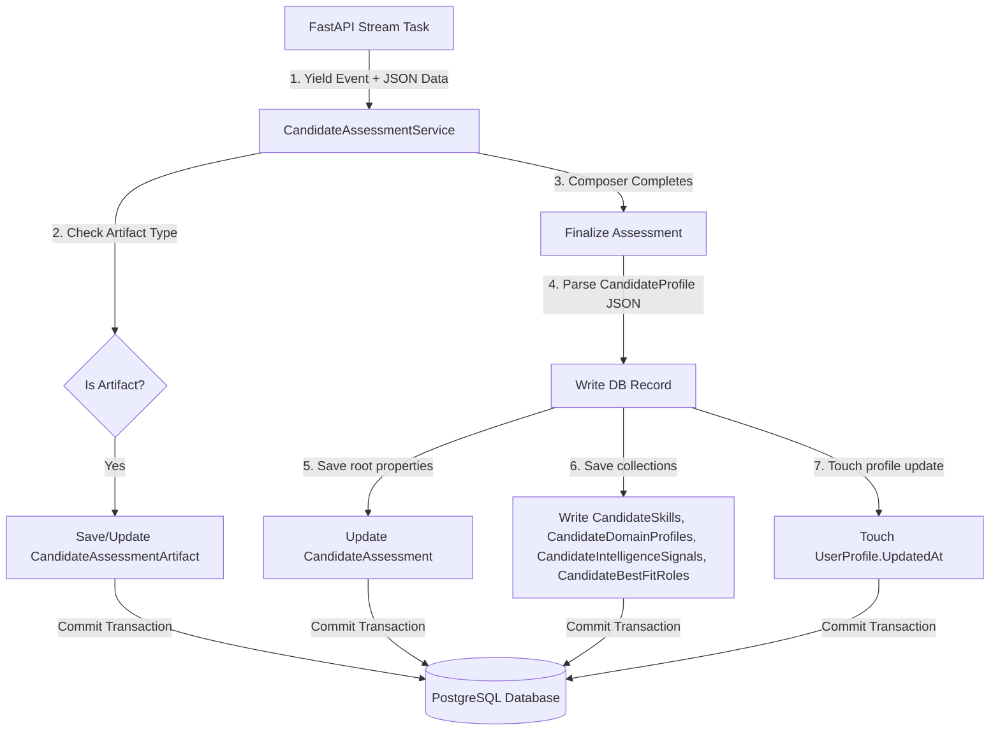

#### Giải thích sơ đồ quy trình lưu trữ dữ liệu:
Sơ đồ trên mô tả cách hệ thống kiểm soát ghi dữ liệu xuống database PostgreSQL thông qua hai cơ chế song song:
1. **Ghi nhận gia tăng (Incremental Write)**: Mỗi khi FastAPI hoàn thành một task đơn lẻ trong pipeline và stream sự kiện về cho .NET, hệ thống sẽ kiểm tra xem sự kiện đó có đính kèm kết quả JSON hay không. Nếu có, nó sẽ lưu/cập nhật trực tiếp một bản ghi vào bảng `CandidateAssessmentArtifacts` mà không cần chờ toàn bộ pipeline chạy xong. Điều này giúp hệ thống giữ được trạng thái trung gian phòng trường hợp sự cố mạng xảy ra ở các tác vụ sau.
2. **Ghi nhận tổng hợp (Finalize Transaction)**: Khi tác vụ `CandidateProfileComposer` hoàn thành, hệ thống nhận được gói kết quả tổng hợp `CandidateProfile`. .NET Service sẽ phân tích JSON này và thực hiện cập nhật toàn bộ thông tin gốc của bản ghi `CandidateAssessment` (cập nhật điểm số, cấp bậc, nhãn xu hướng), đồng thời xóa sạch các bản ghi kỹ năng, vai trò cũ của lượt đánh giá đó để ghi đè dữ liệu mới nhằm đảm bảo tính lũy tích không trùng lặp (idempotency). Cuối cùng, thực hiện cập nhật trường `UpdatedAt` của UserProfile và commit toàn bộ dữ liệu dưới dạng một database transaction khép kín.

---

## 15. Hệ Thống Phát Sự Kiện Tiến Độ (Event and Streaming System)

Hệ thống truyền thông tin cập nhật tiến độ thời gian thực (real-time progress updates) từ worker chạy ngầm lên giao diện người dùng thông qua mô hình Pub/Sub và Server-Sent Events (SSE).

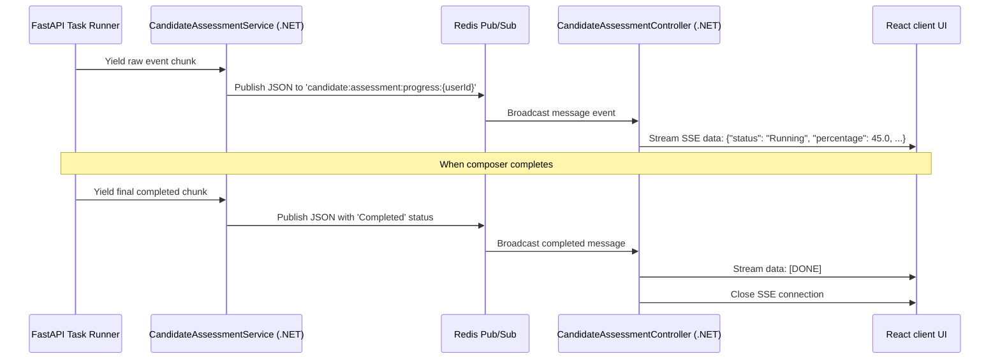

#### Giải thích sơ đồ phát sự kiện tiến độ:
Sơ đồ sequence diagram trên mô tả cách truyền tin bất đồng bộ từ các tiểu tiến trình chạy ngầm lên giao diện:
1. FastAPI chạy tác vụ và xuất ra (yield) một block dữ liệu dạng stream.
2. .NET Service nhận được gói tin, chuyển đổi thành JSON và đẩy vào kênh truyền tin Redis Pub/Sub dưới tên `candidate:assessment:progress:{userId}`.
3. Controller .NET đang đăng ký kênh này sẽ bắt được thông điệp và ghi trực tiếp dòng chữ vào luồng Response HTTP của kết nối SSE đang mở với client React.
4. Client nhận gói JSON và cập nhật thanh tiến độ tương ứng.
5. Khi kết thúc, worker đẩy thông điệp kết thúc. Controller ghi nhận trạng thái hoàn thành, ghi chuỗi `[DONE]` lên luồng Response để báo hiệu cho client tự động đóng kết nối SSE, tối ưu hóa băng thông kết nối cho Server.

---

## 16. Khả Năng Phục Hồi & Tự Phục Hồi (Failure Recovery and Resilience)

Hệ thống phân tích CV được trang bị nhiều lớp bảo vệ để đảm bảo khả năng chịu lỗi và tính sẵn sàng cao trước các sự cố API ngoại vi hoặc xung đột ghi dữ liệu.

### 1. Redis Concurrency Lock (Khóa chống trùng lặp)
Để tránh việc người dùng bấm nút kích hoạt liên tục tạo ra nhiều tiến trình phân tích trùng nhau gây quá tải tài nguyên và sai lệch điểm số, hệ thống sử dụng khóa lock phân tán trên Redis:
* Khóa được thiết lập dạng key-value với tên `candidate:assessment:lock:{userId}` có thời hạn tối đa là **10 phút**.
* Nếu tiến trình chạy thành công hoặc gặp lỗi, hệ thống sẽ thực hiện giải phóng khóa (Release Lock) trong khối lệnh `finally`.
* Nếu server chạy ngầm bị sập nguồn đột ngột (crash), khóa lock sẽ tự động biến mất sau 10 phút, đảm bảo tài khoản của ứng viên không bị kẹt trạng thái khóa vĩnh viễn.

### 2. Phân loại lỗi và cơ chế thử lại (Retry Policy)
Khi một tác vụ trong pipeline FastAPI gặp lỗi, orchestrator sẽ phân tích nội dung thông điệp lỗi để đưa ra phương án xử lý:
* Nếu lỗi thuộc dạng tạm thời (Transient Errors) như lỗi vượt hạn mức cuộc gọi Claude API (`RATE_LIMIT_EXCEEDED` / HTTP 429) hoặc lỗi mạng chờ phản hồi (`TIMEOUT`), tác vụ được đánh dấu là `retryable = true` và hệ thống sẽ tự động thử lại tối đa **3 lần** với khoảng cách thời gian tăng dần (500ms, 1000ms, 2000ms).
* Nếu lỗi liên quan đến cấu trúc dữ liệu không thể vá (`PARSING_ERROR`), tác vụ sẽ bị đánh dấu `retryable = false` và dừng pipeline ngay lập tức để tiết kiệm chi phí tài nguyên API.

### 3. Graceful Degradation & Fallbacks (Suy giảm có kiểm soát & Dự phòng)
Hệ thống sử dụng các thuật toán dự phòng để tránh việc sập toàn bộ pipeline khi một cấu phần gặp lỗi:
* **Taxonomy Mapper Fallbacks**: Nếu Claude không thể ánh xạ một kỹ năng vào danh mục SFIA 9 tiêu chuẩn, hệ thống tự động giữ nguyên tên kỹ năng thô của ứng viên khai báo và gán độ tin cậy mặc định ở mức thấp nhất (`0.20`), đảm bảo tiến trình chạy tiếp.
* **Classifier Overrides**: Nếu AI trả về nhãn phong cách làm việc không khớp với 6 danh mục tiêu chuẩn (Feature Builder, System Designer, v.v.), hệ thống sẽ tự động ghi đè kết quả của AI bằng nhãn tính toán được từ bộ quy tắc so khớp commit thô (Rule-based Working Style) và gán độ tự tin ở mức thấp để tiếp tục tổng hợp hồ sơ.

---

## 17. Phân Tích Hiệu Năng (Performance Analysis)

Phân tích hiệu năng chỉ ra sự phân bổ thời gian và tài nguyên của hệ thống trong một lượt chạy thực tế.

### Sơ đồ phân rã thời gian chạy pipeline (Gantt Chart)

```mermaid
gantt
    title Bảng Phân Bổ Thời Gian Chạy Thực Tế Pipeline L2
    dateFormat  X
    axisFormat %s
    
    section Initializing
    Consolidate inputs    :active, 0, 2
    
    section AI Analysis
    L2-001 Skill Taxonomy   : 2, 6
    L2-002 Skill Prof   : 6, 11
    L2-003 Strengths/Gaps   : 11, 15
    L2-004 Career Mapper    : 15, 20
    L2-005 Calibration      : 20, 24
    L2-006 Gating Check     : 24, 27
    L2-007 Maturity Assessor: 27, 32
    L2-008 Problem Solving  : 32, 38
    L2-009 Tendency         : 38, 41
    L2-010 Working Style    : 41, 45
    L2-012 Recommendations  : 45, 51
    L2-013 summaries        : 51, 56
    
    section Completion
    Composer & Save         : 56, 60
```

#### Giải thích sơ đồ Gantt phân bổ thời gian:
Sơ đồ Gantt trên mô tả tổng thời gian xử lý trung bình của một lượt chạy pipeline CV AI dao động khoảng **60 giây**:
* Khoảng 2 giây đầu dùng để truy vấn DB và gộp dữ liệu Line 1 tại .NET.
* Quá trình chạy các tác vụ AI từ L2-001 đến L2-013 chiếm phần lớn thời gian (từ giây thứ 2 đến giây thứ 56) do phải chờ phản hồi HTTP từ Anthropic Claude API. Mỗi tác vụ LLM mất trung bình từ 3.5 đến 6.0 giây để sinh cấu trúc dữ liệu JSON đầy đủ.
* Khoảng 4 giây cuối cùng được dùng để chạy tác vụ Composer tổng hợp dữ liệu và thực hiện các câu lệnh ghi database quan hệ PostgreSQL.

### Bảng phân tích chi phí và tài nguyên các tác vụ chính

| Tên tác vụ / Tiến trình | Phương thức thực thi | Mức độ tiêu thụ chi phí | Thời gian chạy trung bình | Điểm nghẽn hiệu năng (Bottleneck) |
| :--- | :--- | :--- | :--- | :--- |
| **L2-004: CareerLevelMapper** | LLM API | Cao | 4.0 - 6.0s | Chờ phản hồi mạng (latency) từ Anthropic API. |
| **L2-008: ProblemSolvingAnalyzer** | LLM API | Trung bình | 4.0 - 5.0s | Latency của Anthropic API. |
| **L2-012: MultiRoleRecommendationEngine** | LLM API | Trung bình | 4.0 - 5.0s | Latency của Anthropic API. |
| **L2-002: SkillProficiencyEstimator** | LLM API | Trung bình | 3.5 - 5.0s | Số lượng token đầu vào lớn (khi ứng viên có danh sách kỹ năng Line 1 đồ sộ). |
| **L2-014: CandidateProfileComposer** | CPU / DB | Thấp | 1.0 - 2.0s | Khóa bảng và thời gian thực thi ghi dữ liệu đồng thời vào PostgreSQL. |
| **ConsolidateLine1** | CPU / DB | Thấp | 0.5 - 1.0s | Đọc dữ liệu từ database. |

### Các cơ hội tối ưu hóa hiệu năng
1. **Thực thi song song (Parallel execution)**: Hiện tại, các tác vụ đang được chạy hoàn toàn tuần tự. Một số tác vụ không phụ thuộc dữ liệu lẫn nhau như: Đánh giá độ chín công nghệ (`L2-007`), Đánh giá phong cách giải quyết vấn đề (`L2-008`), Phân loại xu hướng kỹ thuật (`L2-009`) và Phân loại phong cách làm việc (`L2-010`) hoàn toàn có thể chạy song song. Việc này giúp giảm tổng thời gian chạy pipeline đi khoảng **30% - 40%** (tiết kiệm khoảng 15 - 20 giây chờ API).
2. **Context Compression (Nén ngữ cảnh)**: Do context truyền tin ngày càng phình to qua từng bước của pipeline, lượng token đầu vào (prompt tokens) tăng dần gây tốn kém chi phí API Anthropic. Việc rút gọn các trường dữ liệu trung gian không cần thiết trước khi gửi sang Claude ở các tác vụ cuối sẽ giúp tối ưu hóa chi phí vận hành.
3. **Database Bulk Operations**: Thay vì xóa và chèn lại từng dòng cho các bảng quan hệ phụ thuộc như `CandidateSkills` hay `CandidateBestFitRoles`, chuyển sang cơ chế chèn hàng loạt (Bulk Insert) để giảm thời gian khóa connection database.

---

## 18. Bản Đồ Tra Cứu Mã Nguồn (Code Reference Map)

Bảng dưới đây cung cấp bản đồ dẫn đường để tra cứu trực tiếp các file code triển khai logic của hệ thống CV AI Analysis:

| Thành phần kỹ thuật | Đường dẫn file mã nguồn | Trách nhiệm chính trong hệ thống |
| :--- | :--- | :--- |
| **CandidateAssessmentController** | [CandidateAssessmentController.cs](file:///d:/Coding%20Space/Projects/CVerify/CVerify.Core/Modules/Profiles/Controllers/CandidateAssessmentController.cs) | Tiếp nhận HTTP Request của client, quản lý luồng SSE progress và trả về thông tin chi tiết. |
| **CandidateAssessmentService** | [CandidateAssessmentService.cs](file:///d:/Coding%20Space/Projects/CVerify/CVerify.Core/Modules/Profiles/Services/CandidateAssessmentService.cs) | Quản lý vòng đời lưu trữ, thực hiện transaction database PostgreSQL và đóng khóa lock concurrency. |
| **BackgroundCandidateAssessmentProcessor**| [BackgroundCandidateAssessmentProcessor.cs](file:///d:/Coding%20Space/Projects/CVerify/CVerify.Core/Modules/Profiles/BackgroundWorkers/BackgroundCandidateAssessmentProcessor.cs) | Worker chạy ngầm định kỳ quét hàng đợi Redis để dequeue job và kích hoạt xử lý. |
| **CandidateAssessmentStreamOrchestrator** | [orchestrate_stream.py](file:///d:/Coding%20Space/Projects/CVerify/CVerify.AI/app/pipelines/candidate/orchestrate_stream.py) | Điều phối quy trình stream, gộp dữ liệu thô đầu vào và quản lý việc chạy tuần tự các task từ L2-001 đến L2-015. |
| **CandidateEvaluationOrchestrator** | [orchestrator.py](file:///d:/Coding%20Space/Projects/CVerify/CVerify.AI/app/pipelines/candidate/orchestrator.py) | Khởi tạo PipelineDAG và định nghĩa phương thức thực thi riêng lẻ cho từng Task. |
| **PipelineContext** | [context.py](file:///d:/Coding%20Space/Projects/CVerify/CVerify.AI/app/pipelines/candidate/context.py) | Lớp dữ liệu Pydantic quản lý context luân chuyển giữa các task, kiểm tra tính bất biến của dữ liệu. |
| **Scoring Engine** | [scoring_engine.py](file:///d:/Coding%20Space/Projects/CVerify/CVerify.AI/app/pipelines/candidate/scoring_engine.py) | Cài đặt các công thức toán học và logic tính toán điểm số năng lực, điểm tin cậy hồ sơ và so khớp phân vị cohort. |
| **BaseTask** | [base_task.py](file:///d:/Coding%20Space/Projects/CVerify/CVerify.AI/app/pipelines/candidate/base_task.py) | Lớp cơ sở trừu tượng định nghĩa khung sườn cho các task chạy trong pipeline. |
| **CareerLevelMapper & Gates** | [career_level.py](file:///d:/Coding%20Space/Projects/CVerify/CVerify.AI/app/pipelines/candidate/tasks/career_level.py) | Triển khai các tác vụ L2-004, L2-005, L2-006 liên quan đến đánh giá và hiệu chuẩn cấp bậc kỹ sư. |
| **CandidateProfileComposer** | [composer.py](file:///d:/Coding%20Space/Projects/CVerify/CVerify.AI/app/pipelines/candidate/tasks/composer.py) | Lắp ráp các artifact thành CandidateProfile hoàn chỉnh ở bước L2-014. |
| **CandidateImprovementEngine** | [improvement_engine.py](file:///d:/Coding%20Space/Projects/CVerify/CVerify.AI/app/pipelines/candidate/tasks/improvement_engine.py) | Phân tích vector điểm số để phát hiện lỗ hổng và đề xuất lộ trình cải thiện năng lực ở bước L2-015. |

---

## 19. Sơ Đồ Quy Trình Tổng Thể Hệ Thống (Complete CV Analysis Workflow Diagram)

Dưới đây là sơ đồ chi tiết biểu diễn toàn bộ dòng chảy dữ liệu của hệ thống CV AI Analysis:

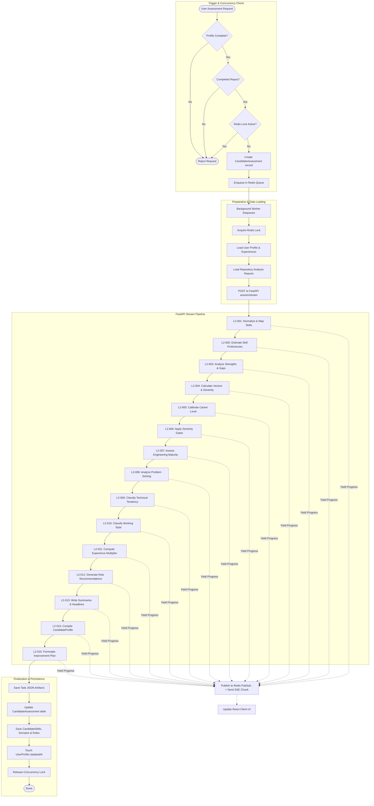

#### Giải thích sơ đồ quy trình tổng thể hệ thống:
Sơ đồ trên mô tả dòng chảy khép kín của toàn bộ hệ thống CV AI Analysis từ đầu tới cuối:
1. **Trigger & Concurrency Check**: Một yêu cầu phân tích CV mới được khởi chạy từ API. Hệ thống tiến hành ba bước kiểm tra điều kiện nghiêm ngặt: kiểm tra độ hoàn thiện của hồ sơ cá nhân (`Headline`, `Bio`, `Skills`, `Experiences`, `Education`), kiểm tra xem ứng viên đã có tối thiểu một repository phân tích thành công hay chưa, và cuối cùng kiểm tra khóa lock concurrency trên Redis. Nếu không thỏa mãn, yêu cầu bị từ chối (`Reject Request`). Nếu thỏa mãn, hệ thống ghi nhận một bản ghi `CandidateAssessment` ở trạng thái `Queued` và enqueue ID vào hàng đợi Redis.
2. **Preparation & Data Loading**: Khi Background Worker kéo job từ hàng đợi Redis ra để thực thi, nó ngay lập tức lấy khóa lock phân tán Redis thời hạn 10 phút chống trùng lặp. Tiếp theo, worker truy vấn PostgreSQL để nạp toàn bộ thông tin hồ sơ ứng viên và kết quả phân tích repository chi tiết Line 1. Sau đó, nó đóng gói dữ liệu thành payload JSON, ký mã hóa HMAC và thực hiện gọi HTTP POST đến FastAPI endpoint `/api/v1/candidate/assess/stream`.
3. **FastAPI Stream Pipeline**: FastAPI tiếp nhận payload và chạy tuần tự đồ thị DAG gồm 15 tác vụ độc lập từ `L2-001` đến `L2-015` để thực hiện chuẩn hóa kỹ năng, ước lượng độ thành thạo, phân tích điểm mạnh/điểm yếu, tính toán các chiều capability vector, ước lượng seniority cấp bậc kỹ sư, đánh giá chất lượng code và thói quen bảo trì sửa lỗi, phân loại xu hướng vai trò và phong cách làm việc, và cuối cùng đề xuất công việc tối ưu và lập kế hoạch cải thiện năng lực.
4. **Finalization & Persistence**: Mỗi khi một task trong pipeline hoàn thành, nó sẽ gửi ngược dữ liệu qua kênh stream. .NET API tiếp nhận và ghi nhận ngay các artifact JSON trung gian. Khi tác vụ cuối cùng chạy xong, API tiến hành phân tích gói profile tổng hợp, ghi đè các bảng dữ liệu quan hệ (`CandidateSkills`, `CandidateDomainProfiles`, v.v.) nhằm tránh trùng lặp dữ liệu, chạm thay đổi trường `UpdatedAt` của UserProfile và commit cơ sở dữ liệu. Sau đó giải phóng khóa lock Redis và kết thúc tiến trình.
5. **Real-time Streaming**: Trong suốt thời gian FastAPI thực hiện các tác vụ của pipeline, các sự kiện tiến trình (Progress Chunks) liên tục được yield về cho .NET, đẩy vào kênh Redis Pub/Sub và truyền trực tiếp xuống React Client UI qua kết nối SSE để hiển thị giao diện động thời gian thực cho người dùng.
