# CV AI Analysis System: Complete Architecture & Workflow Documentation

This document provides a comprehensive, reverse-engineered technical guide to the CVerify Candidate CV AI Analysis pipeline. It details how the platform transforms repository intelligence, contributor evidence, and user-declared profiles into an AI-generated Digital CV, capability vectors, and assessment artifacts.

---

## 1. Executive Summary

The **CV AI Analysis Subsystem** (referred to as **Line 2 Pipeline**) is CVerify's intelligence core for candidate evaluation. It consolidates raw repository-level intelligence (Line 1 outputs) with self-declared developer profiles to synthesize a multi-dimensional capability map, verify engineering claims, and output career-readiness assessments.

### Main Architectural Goals
* **Evidence-Based Evaluation**: Enforce absolute grounding of developer profiles in verified commit histories, code structures, and git metadata.
* **Algorithmic Seniority Validation**: Replace subjective seniority labels with deterministic capability score gates and LLM calibration.
* **Profile Verification & Trust Scoring**: Quantify the ratio of self-declared skills vs. verified code proof to flag inflation.
* **recruiter-friendly Syntheses**: Translate raw AST complexities and git blame details into human-readable engineering personas and growth plans.

### Subsystems Involved
1. **Frontend Client (React)**: Triggers evaluations, polls for status, and consumes real-time SSE stream events.
2. **CVerify.Core (.NET Backend)**: Validates profile completeness, manages Redis execution queues and concurrent lock controls, fetches CV data, triggers Python tasks, handles database persistence, and broadcasts SSE updates via Redis Pub/Sub.
3. **CVerify.AI (FastAPI Subsystem)**: Executes the 15-stage sequential DAG pipeline, mapping taxonomies, calculating capability vectors, classifying tendencies, and invoking LLM evaluations via Anthropic Claude.
4. **Redis Data Layer**: Powers the asynchronous FIFO queue (`candidate:assessment:queue`) and handles SSE channel broadcasting (`candidate:assessment:progress:{userId}`).
5. **PostgreSQL Database**: Relational storage for candidate assessment aggregates, capability lists, best-fit roles, domain weights, and metadata.

### High-Level End-to-End Workflow
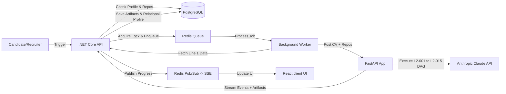

---

## 2. System Architecture

The CV AI Analysis system crosses a .NET Core and FastAPI Python boundary, sharing state via JSON APIs, Redis, and PostgreSQL.

### Core API Endpoints
* `GET /api/v1/candidate-assessments/readiness`: Inspects candidate profile completeness and determines if repo updates require a refresh.
* `POST /api/v1/candidate-assessments`: Triggers a new assessment job. Ensures concurrency limits via Redis locks.
* `GET /api/v1/candidate-assessments/progress/{userId}`: Exposes an SSE connection streaming execution updates.
* `GET /api/v1/candidate-assessments/{assessmentId}/details`: Retrieves compiled results and intermediate JSON artifacts.
* `POST /api/v1/candidate/assess/stream` (FastAPI): Python gateway that runs the sequential pipeline and streams JSON chunk events back.

### Component Architecture Diagram
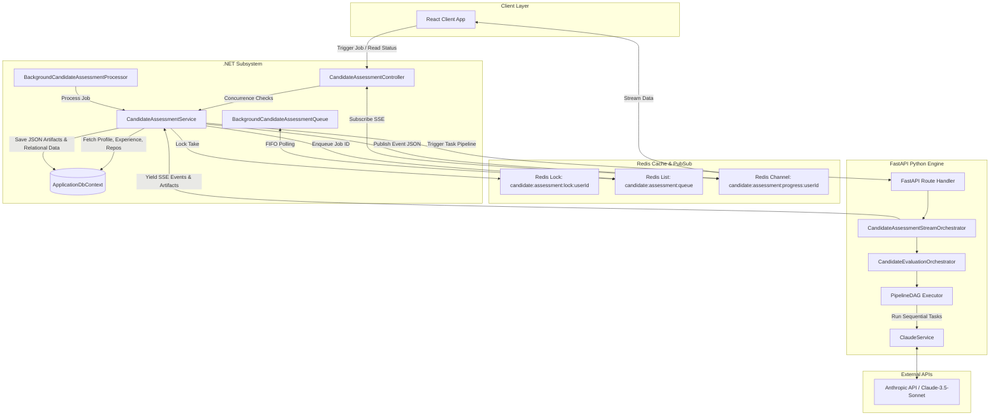

---

## 3. End-to-End CV Generation Workflow

This sequence diagram illustrates the lifecycle of a CV AI Analysis trigger, from initiation to presentation:

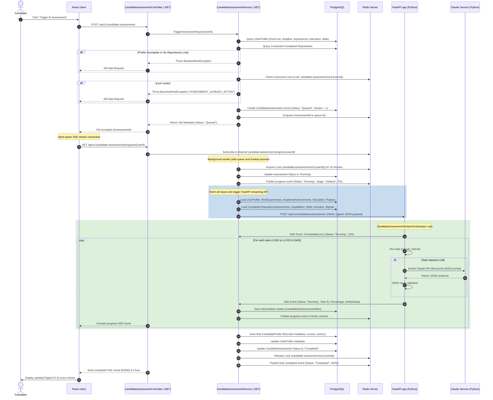

---

## 4. Analysis Lifecycle

The execution of a Candidate CV Assessment traverses a strict set of states to maintain concurrency safety and idempotency.

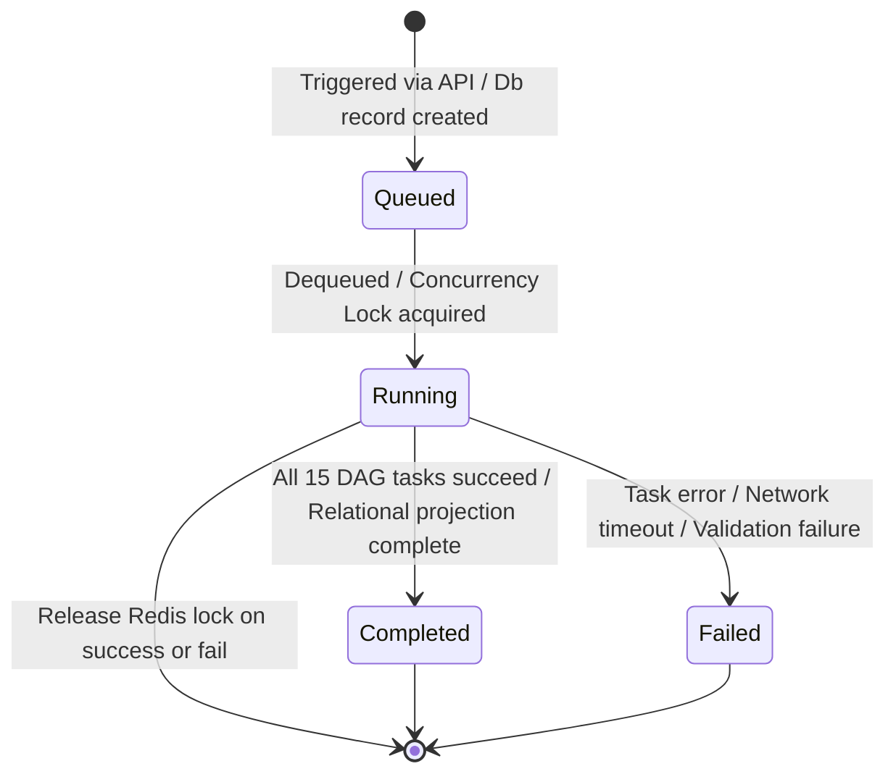

### State Transition Matrix

| State | Entry Conditions | Exit Conditions | Recovery Behavior / Fallbacks |
| :--- | :--- | :--- | :--- |
| **Queued** | API initiates trigger. Record created in PostgreSQL `CandidateAssessments` table with version increment. | Job is popped by the Background Processor worker. | Lock check limits queuing to 1 pending job per candidate. |
| **Running** | Background processor acquires the 10-minute Redis lock `candidate:assessment:lock:{userId}`. | All 15 tasks of the FastAPI DAG complete and the final profile is mapped. | If the execution crashes without updating the DB, the Redis lock expires after 10 minutes, allowing future runs. |
| **Completed**| Artifact `CandidateProfile` is successfully stored, relational scores projected, and status set to `Completed`. | Job terminates successfully. | Terminal state. Subsequent requests will increment version. |
| **Failed** | A task throws an unhandled exception, FastAPI returns a non-200 code, or database projection fails. | Job status updated to `Failed`, `FailedStage` and `FailureReason` populated. | Releases Redis concurrency lock, publishes failure progress chunk, and halts pipeline. |

---

## 5. Pipeline Engine Deep Dive

The FastAPI backend uses a custom Directed Acyclic Graph (DAG) executor to process the evaluation pipeline.

### Pipeline Architecture
* **Task Isolation**: Tasks inherit from [BaseTask](file:///d:/Coding%20Space/Projects%20/CVerify/CVerify.AI/app/pipelines/candidate/base_task.py). They declare their dependencies, input keys, and output keys.
* **Context Propagation**: A single [PipelineContext](file:///d:/Coding%20Space/Projects/CVerify/CVerify.AI/app/pipelines/candidate/context.py) object is passed across tasks. Its properties are immutable once written (verified by `PipelineContext.update`), protecting state integrity during execution.
* **Fail-Fast Compilation**: The orchestrator validates the graph on startup via `PipelineDAG.validate()`, ensuring no cyclic dependencies or missing input keys exist.

### Task Dependencies Graph
The Python engine runs the following 15 tasks sequentially (mapped by `TASK_ALIASES` in `orchestrator.py`):

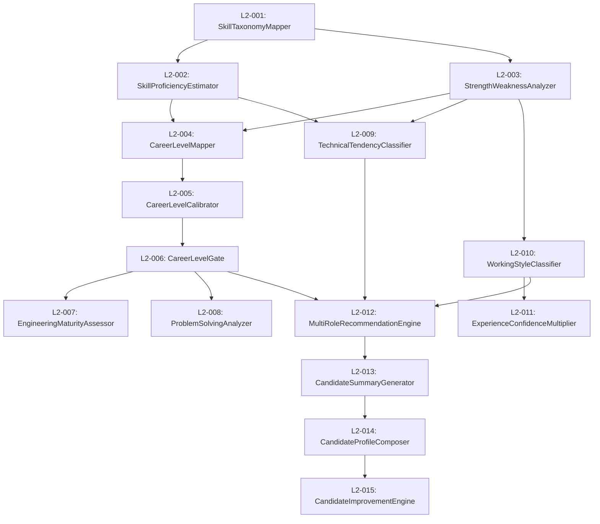

### Execution Details
1. **Context Initialization**: FastAPI accepts CV details and attached repository metrics, packing them into `PipelineContext`.
2. **Sequential Evaluation**: The orchestrator loops over `STAGES` (from `orchestrate_stream.py`). For each stage, it:
   * Resolves the task class.
   * Spawns the task runner with a custom callback listener.
   * Streams intermediate events (e.g. `LEVEL_ESTIMATE_UPDATED`) via Python async queues.
   * Merges output parameters back into the pipeline context.
3. **Robust JSON Parsing**: The engine uses a robust JSON regex extractor coupled with `json_repair` to recover structured objects from Anthropic responses, preventing failures due to partial completions or formatting errors.

---

## 6. Evidence Aggregation System

The pipeline integrates objective repository analysis (Line 1 outputs) and self-declared profiles into a single assessment matrix.

```mermaid
flowchart TD
    subgraph Repo Evidence (Line 1)
        R_Attributions[Skill Attributions]
        R_Capabilities[Capabilities Maturity]
        R_Signals[Scope, Complexity & Ownership]
    end

    subgraph Project Evidence (Self-Declared)
        P_Metadata[Projects, Durations & Roles]
        P_Tech[Declared Tech Stacks]
    end

    subgraph User Evidence
        U_Profile[Headline, Bio, Experiences & Education]
    end

    R_Attributions & R_Capabilities & R_Signals -->|ConsolidateLine1| ConsolidatedReport[Consolidated Report]
    P_Metadata & P_Tech & U_Profile -->|ConsolidateLine1| ConsolidatedReport

    ConsolidatedReport -->|L2-001 Skill Taxonomy| SkillMapping[Taxonomy Map]
```

### Aggregation Mechanism
During `ConsolidateLine1`, the pipeline merges:
* **Repository Reports**: Selects up to 5 completed repository analysis records linked to active projects.
* **Technology Stacks**: Combines repository languages and frameworks into a maximum score map.
* **Capabilities & Skill Attributions**: Parses the skill attribution tables and builds a consolidated skill evidence graph mapping `nodes` (skills/capabilities) and `edges` (repository usage and weights).

---

## 7. Skill Extraction Pipeline

The skill extraction pipeline identifies, normalizes, and validates candidate competencies:

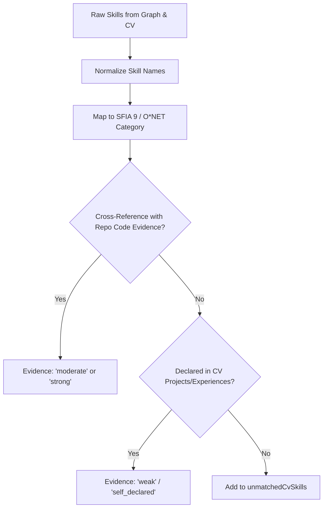

### Mapping Matrix
* **Raw inputs**: Combined list of `cvSkills` and `skillEvidenceGraph` nodes.
* **Taxonomy Mapper (L2-001)**: Mapped using [SKILL_TAXONOMY](file:///d:/Coding%20Space/Projects/CVerify/CVerify.AI/app/pipelines/candidate/skill_taxonomy.py). For instance:
  * Backend frameworks are normalized and mapped to **Backend Engineering**.
  * Frontend packages are normalized and mapped to **Frontend Engineering**.
* **Proficiency Estimator (L2-002)**: Evaluates normalized categories against the SFIA-aligned proficiency scale (1: Awareness, 2: Working, 3: Practitioner, 4: Expert).

---

## 8. Capability Vector Generation

The multi-dimensional capability vector represents the candidate's verified skills, experience, and output.

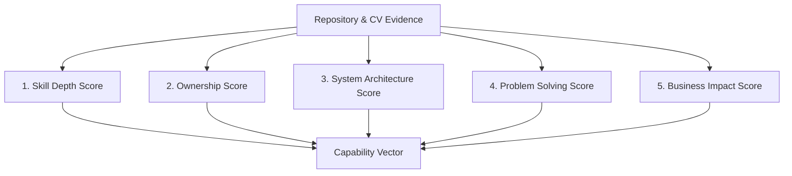

### 1. Skill Depth ($SD$)
Calculated logarithmically from verified skill proficiencies:
$$SD = 22.0 \times \ln(1.0 + 0.05 \times \text{raw\_skills\_verified})$$
Where:
* $\text{raw\_skills\_verified} = \sum (\text{proficiencyLevel} \times 25.0)$ for skills verified via repository code evidence.

### 2. Ownership ($O$)
A bounded ratio representing the weight of the developer's contribution:
$$O = \frac{\sum (\text{ownershipSignal} \times \text{size})}{\sum \text{size}}$$
Where:
* $\text{ownershipSignal}$ is parsed from the repository signals (clamped to $[0.0, 1.0]$).
* $\text{size} = \text{number of capabilities detected} + 1.0$.

### 3. System Architecture ($A$)
Calculated from the complexity of unique architectural capabilities scaled by patterns:
$$A = \text{base\_arch\_score} \times e^{(M_{\text{pattern}} - 1.0)}$$
Where:
* $\text{base\_arch\_score} = \sum (\text{difficultyScore} \times 10.0 \times \text{maturity\_multiplier})$.
* $\text{maturity\_multiplier} \in \{0.5 \text{ (Basic)}, 1.0 \text{ (Intermediate)}, 1.5 \text{ (Advanced)}, 2.0 \text{ (Enterprise)}\}$.
* $M_{\text{pattern}}$ is an architecture pattern modifier incremented by:
  * $+0.25$ for basic structures (Dependency Injection, IOC, Interfaces).
  * $+0.35$ for architectural patterns (CQRS, Hexagonal, Clean Architecture).
  * $+0.15$ for operational patterns (Telemetry, Middleware, Logging).

### 4. Problem Solving ($PS$)
Evaluated using a sigmoid complexity scaling function over repository quality scores:
$$PS = 10.0 \times \sum \left( \frac{\text{complexity}}{1.0 + e^{-0.1 \times (\text{complexity} - 2.0)}} \right)$$
Where:
* $\text{complexity} = \frac{\text{complexityScore}}{10.0}$.

### 5. Business Impact ($I$)
A power-law growth function based on experience longevity and organizational scale:
$$I = 10.0 \times (\text{months}^{0.4}) \times \text{company\_scale} \times \text{role\_scale}$$
Where:
* $\text{months}$ is the total experience duration.
* $\text{company\_scale}$ is scaled to $1.25$ if experience includes top tier companies (Google, Meta, Amazon, Microsoft, Netflix, Apple).
* $\text{role\_scale}$ reflects leadership seniority (Principal/Head: $1.6$, Staff/Lead: $1.4$, Senior: $1.2$, Middle: $1.0$, Junior/Intern: $0.8$).

---

## 9. Assessment Generation Pipeline

The pipeline generates several structured assessment reports during execution:

### 1. Engineering Assessment
* **Purpose**: Rates the developer's code hygiene, testing practices, and error handling.
* **Inputs**: `repoIntelligenceReport`, `commitTimelineData`, `codeQualityData`.
* **Outputs**: `engineeringMaturityScore`, `maturityLevel`, `maturitySignals` array.
* **AI Prompts**: Evaluates proactiveness of refactoring vs. feature bloat.
* **Persistence**: Stored in `CandidateIntelligenceSignals` table and `Maturity` JSON artifact.

### 2. Capability Assessment
* **Purpose**: Maps capability maturity levels (Basic, Intermediate, Advanced, Enterprise).
* **Inputs**: Consolidated repository capability arrays.
* **Outputs**: Relational `RepositoryCapabilities` database records.
* **Persistence**: Projected in PostgreSQL database during aggregation.

### 3. Skill Assessment
* **Purpose**: Assigns proficiency levels to extracted skills.
* **Inputs**: `mappedSkills`, `skillEvidenceGraph`.
* **Outputs**: `skillProficiencies` list.
* **Persistence**: Saved in `CandidateSkills` table and `SkillsList` JSON artifact.

### 4. Experience & Leadership Assessment
* **Purpose**: Analyzes leadership responsibilities and computes the experience confidence multiplier.
* **Inputs**: `cv.experiences`, `cv.projects`.
* **Outputs**: `confidenceMultiplier`, `totalExperienceYears`.
* **Persistence**: Evaluated in task L2-011 and persisted in the final `CandidateProfile` artifact.

### 5. Trust Assessment
* **Purpose**: Evaluates candidate profile credibility and computes verification ratios.
* **Inputs**: `cvSkills`, `repositoryAssessments`.
* **Outputs**: `trustLevel`, `trustScoreMetrics`.
* **Persistence**: Saved in the `CandidateAssessments` table and projected to PostgreSQL.

---

## 10. Trust Score System

The trust score system evaluates profile integrity by measuring the alignment between self-declared experience and verified repository evidence.

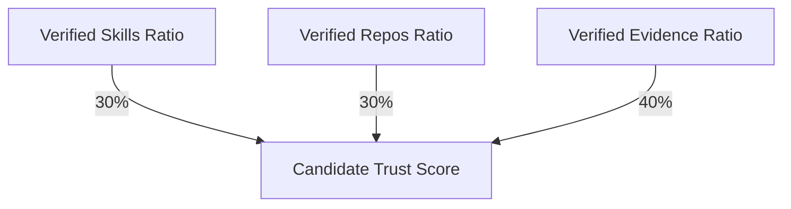

### Trust Score Calculation
The trust score ($T_{\text{candidate}}$) is calculated as:
$$T_{\text{candidate}} = \left( R_{\text{skills}} \times 0.30 + R_{\text{repos}} \times 0.30 + R_{\text{evidence}} \times 0.40 \right) \times 100.0$$
Where:
1. **Verified Skill Ratio ($R_{\text{skills}}$)**:
   $$R_{\text{skills}} = \frac{\text{number of CV skills found in verified repositories}}{\text{total number of CV skills}}$$
2. **Verified Repository Ratio ($R_{\text{repos}}$)**:
   $$R_{\text{repos}} = \frac{\text{number of connected repositories passing ownership check}}{\text{total number of connected repositories}}$$
3. **Verified Evidence Ratio ($R_{\text{evidence}}$)**:
   $$R_{\text{evidence}} = \frac{\text{ownershipScore}}{\text{candidateScore}}$$

### Purely Self-Declared Profiles
If the candidate has not connected any repositories to CVerify, the pipeline falls back to a self-declared scoring mode:
* **Weights**: $\text{verified\_weight} = 0.0$, $\text{self\_declared\_weight} = 1.0$.
* **Ceiling Factor**: The final score is scaled down by a ceiling factor of **$0.40$**:
  $$\text{score}_{\text{final}} = \text{self\_declared\_score} \times 0.40$$

---

## 11. Digital CV Generation

The final step compiles all generated assessments and data models into a unified profile schema (`candidate-profile-v2`):

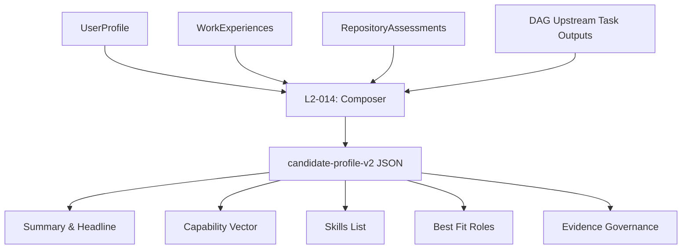

### Section Mapping & Rules

| Section | Source Data | Generation Logic & Rules |
| :--- | :--- | :--- |
| **Summary & Headline** | L2-013 outputs. | Evaluates career level and technical tendency to output recruiter-friendly summaries. |
| **Capability Vector** | Upstream scoring engine. | Maps calculated scores ($SD, O, A, PS, I$) to the vector payload. |
| **Skills & Domains** | L2-002 proficiencies & taxonomy. | Evaluates skills and groups them into domain profiles with confidence ratings. |
| **Best-Fit Roles** | L2-012 recommendations. | Suggests job matches using candidate scores and background repositories. |
| **Evidence Governance**| Repository assessment links. | Maps repository ownership percentages to track source credibility. |

---

## 12. AI Orchestration Analysis

The pipeline orchestrates interactions with Anthropic Claude for deep reasoning tasks.

### AI Task Specifications

| Stage ID & Task Name | Prompt Builder | Context & Inputs | Model Used | Structured Output Schema |
| :--- | :--- | :--- | :--- | :--- |
| **L2-001: SkillTaxonomyMapper** | `get_skill_taxonomy_mapper_prompt` | `skillEvidenceGraph`, `cvSkills`, CV experiences & projects. | Claude 3.5 Sonnet | `{"mappedSkills": [{"rawName", "normalizedName", "sfiaCategory", "declaredInCv"}], "unmatchedCvSkills": []}` |
| **L2-002: SkillProficiencyEstimator**| `get_skill_proficiency_estimator_prompt`| `mappedSkills`, `skillEvidenceGraph`, CV projects & experiences. | Claude 3.5 Sonnet | `{"skillProficiencies": [{"skill", "proficiencyLevel", "evidenceRationale"}]}` |
| **L2-003: StrengthWeaknessAnalyzer** | `get_strength_weakness_prompt` | `skillProficiencies`, `unmatchedCvSkills`. | Claude 3.5 Sonnet | `{"strongestDomains": [{"domain", "skills", "avgProficiency"}], "skillGaps": [{"skill", "gapType", "severity"}]}` |
| **L2-004: CareerLevelMapper** | `get_career_level_mapper_prompt` | `repoIntelligenceReport`, `skillProficiencies`, `strongestDomains`, CV experiences & projects. | Claude 3.5 Sonnet | `{"candidateScore", "estimatedLevel", "levelEvidence", "levelRationale"}` |
| **L2-005: CareerLevelCalibrator** | `get_career_level_calibrator_prompt` | `candidateScore`, `scoreBreakdown`, `levelEvidence`. | Claude 3.5 Sonnet | `{"calibratedScore", "calibratedLevel", "confidenceInLevel", "calibrationNotes"}` |
| **L2-006: CareerLevelGate** | `get_career_level_gate_prompt` | `calibratedLevel`, `calibratedScore`, `levelEvidence`, `repoIntelligenceReport`. | Claude 3.5 Sonnet | `{"gatePassed", "finalLevel", "gateViolations", "gateRationale"}` |
| **L2-007: EngineeringMaturityAssessor**| `get_engineering_maturity_prompt` | `repoIntelligenceReport`, `commitTimelineData`, `codeQualityData`, CV experiences. | Claude 3.5 Sonnet | `{"engineeringMaturityScore", "maturityLevel", "signals": []}` |
| **L2-008: ProblemSolvingAnalyzer** | `get_problem_solving_prompt` | `commitTimelineData`, `commitIntentData`, CV projects & experiences. | Claude 3.5 Sonnet | `{"problemSolvingScore", "problemSolvingPatterns": [], "problemSolvingSummary"}` |
| **L2-009: TechnicalTendencyClassifier**| `get_technical_tendency_prompt` | `skillProficiencies`, `strongestDomains`, `repoIntelligenceReport`. | Claude 3.5 Sonnet | `{"primaryTendency", "tendencyRanking": [{"role", "confidence", "evidenceSignals"}], "tendencySummary"}` |
| **L2-010: WorkingStyleClassifier** | `get_working_style_prompt` | `commitTimelineData`, `commitIntentData`, `strongestDomains`. | Claude 3.5 Sonnet | `{"primaryWorkingStyle", "styleDistribution": [], "workingStyleSummary"}` |
| **L2-012: MultiRoleRecommendationEngine**| `get_multi_role_recommendation_prompt`| `primaryTendency`, `finalLevel`, `workingStyle`, `strongestDomains`, `backgroundRepositories`. | Claude 3.5 Sonnet | `{"topMatch": {"roleTitle", "confidence"}, "suggestedRoles": [], "cvImprovementSuggestions": []}` |
| **L2-013: CandidateSummaryGenerator** | `get_candidate_summary_prompt` | `finalLevel`, `primaryTendency`, `workingStyle`, `strongestDomains`, `skillGaps`, `engineeringMaturitySummary`, `problemSolvingSummary`. | Claude 3.5 Sonnet | `{"recruiterHeadline", "fullSummary", "keyStrengths": [], "watchPoints": []}` |

---

## 13. Data Model Mapping

The system relies on a rich relational and document schema.

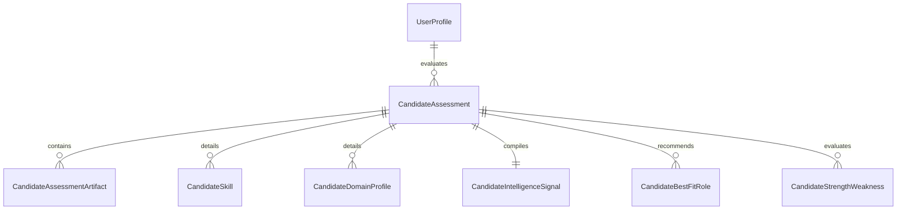

### Relational Entities (PostgreSQL)
* **CandidateAssessment**: Tracks the root evaluation run. Includes career level, overall score, and primary tendencies.
* **CandidateAssessmentArtifact**: Contains raw JSON document blobs for each DAG stage (e.g. `CandidateProfile`).
* **CandidateSkill**: Stores normalizations and proficiency scores for extracted skills.
* **CandidateDomainProfile**: Stores weighted seniority scores for technical domains.
* **CandidateIntelligenceSignal**: Relational table representing calculated metrics ($SD, O, A, PS, I$).
* **CandidateBestFitRole**: Stores matching role recommendations and engine metadata.
* **CandidateStrengthWeakness**: Stores findings identified during analysis.

### Cohort Snapshot (`cohort_snapshot_v1.json`)
Used for cohort normalization. Contains score distributions:
* **cohortVersion**: Semantic version of the cohort snapshot.
* **percentiles**: Key-value array of score thresholds (e.g. `{"score": 70.0, "percentile": 85.0}`) used for linear interpolation.

---

## 14. Persistence Flow

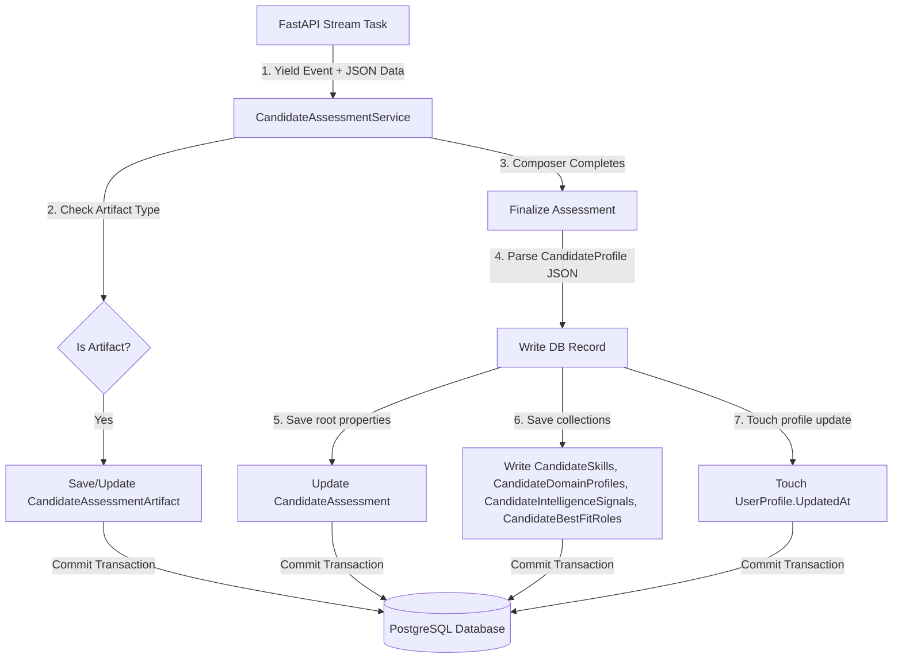

### Transaction Boundaries
1. **Incremental Save**: During execution, the .NET orchestrator saves intermediate task outputs to the `CandidateAssessmentArtifacts` table as they arrive.
2. **Finalization Save**: When `CandidateProfileComposer` completes, the .NET orchestrator reads the final profile document and updates the database:
   * Replaces existing relational collections (`CandidateSkills`, `CandidateDomainProfiles`, etc.) to ensure idempotency.
   * Updates the `CandidateAssessment` root record with final scores.
   * Updates `UserProfile.UpdatedAt`.

---

## 15. Event and Streaming System

Progress updates are streamed in real-time back to the client using Server-Sent Events (SSE).

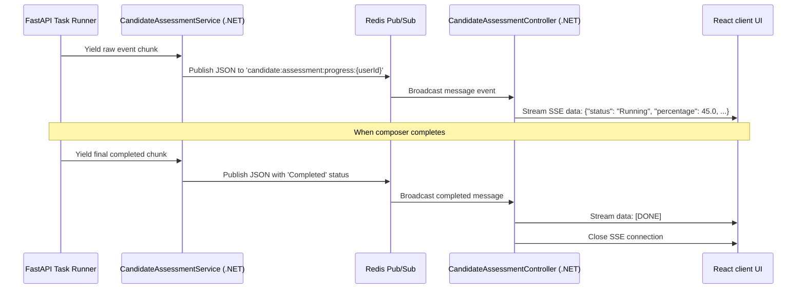

### Event Schema
The FastAPI backend yields stream chunks using the `FastApiProgressEvent` schema:
```json
{
  "status": "Running",
  "step": "L2-004",
  "message": "Executing task L2-004 (CareerLevelMapper)...",
  "percentage": 34.0,
  "artifactType": null,
  "jsonData": null
}
```
* **Done Indicator**: When the final stage completes, the .NET orchestrator publishes a raw `[DONE]` string to close the client SSE stream connection.

---

## 16. Failure Recovery and Resilience

The pipeline implements several recovery strategies to handle transient failures and execution issues.

### 1. Redis Concurrency Lock
* **Mechanism**: Sets a `candidate:assessment:lock:{userId}` key in Redis when starting a run.
* **Duration**: Expires after 10 minutes to prevent permanent lockouts if an execution fails or crashes.

### 2. Error Code Mapping & Retries
The orchestrator handles errors gracefully:
```python
def _err(self, task_type: str, job_id: str, e: Exception) -> dict:
    err_str = str(e).lower()
    if "rate limit" in err_str or "429" in err_str:
        code, retry = "RATE_LIMIT_EXCEEDED", True
    elif "timeout" in err_str:
        code, retry = "TIMEOUT", True
    elif "json" in err_str or "parse" in err_str:
        code, retry = "PARSING_ERROR", False
    else:
        code, retry = "UNKNOWN_ERROR", True
```
* **Retries**: Retries are only attempted for retryable errors (e.g. rate limits, timeouts) up to **3 times**.

### 3. Graceful Degradation & Fallbacks
* **Taxonomy Mapper Fallbacks**: If the AI model fails to normalize a skill, the taxonomy mapper falls back to the raw skill name with a default confidence rating of `0.20`.
* **Classifier Overrides**: If the AI model classifies a candidate's working style as invalid, the system overrides the classification with the deterministic rule-based output:
```python
if primary_style not in valid_styles:
    data["primaryWorkingStyle"] = rule_primary
    data["styleConfidence"] = min(0.3, max(0.1, conf_val))
```

---

## 17. Performance Analysis

An analysis of resource usage, execution bottlenecks, and execution times.

### Performance Profile

```mermaid
gantt
    title Typical Task Execution Duration Breakdown
    dateFormat  X
    axisFormat %s
    
    section Initializing
    Consolidate inputs    :active, 0, 2
    
    section AI Analysis
    L2-001 Skill Taxonomy   : 2, 6
    L2-002 Skill Prof   : 6, 11
    L2-003 Strengths/Gaps   : 11, 15
    L2-004 Career Mapper    : 15, 20
    L2-005 Calibration      : 20, 24
    L2-006 Gating Check     : 24, 27
    L2-007 Maturity Assessor: 27, 32
    L2-008 Problem Solving  : 32, 38
    L2-009 Tendency         : 38, 41
    L2-010 Working Style    : 41, 45
    L2-012 Recommendations  : 45, 51
    L2-013 summaries        : 51, 56
    
    section Completion
    Composer & Save         : 56, 60
```

### Resource Profiling

| Task Name / Operation | Execution Type | Relative Cost | Est. Execution Time | Bottleneck Source |
| :--- | :--- | :--- | :--- | :--- |
| **L2-004: CareerLevelMapper** | LLM API | High | 4.0 - 6.0s | Anthropic API latency |
| **L2-008: ProblemSolvingAnalyzer** | LLM API | Medium | 4.0 - 5.0s | Anthropic API latency |
| **L2-012: MultiRoleRecommendationEngine** | LLM API | Medium | 4.0 - 5.0s | Anthropic API latency |
| **L2-002: SkillProficiencyEstimator** | LLM API | Medium | 3.5 - 5.0s | Input token size (graph size) |
| **L2-014: CandidateProfileComposer** | CPU / DB | Low | 1.0 - 2.0s | Relational DB writes & locks |
| **ConsolidateLine1** | CPU / DB | Low | 0.5 - 1.0s | Database reads |

### Key Bottlenecks
1. **Sequential DAG Execution**: Tasks are processed sequentially. Running independent tasks (e.g. `TechnicalTendencyClassifier` and `EngineeringMaturityAssessor`) in parallel could reduce total execution times by up to **30%**.
2. **Context Growth**: As output parameters accumulate in `PipelineContext`, prompt input token counts increase, raising execution costs.
3. **Database Write Performance**: Replacing the candidate's relational profiles requires deleting and writing multiple rows, which can block database threads during concurrent runs.

---

## 18. Code Reference Map

A guide to the main classes, services, and tasks in the codebase.

| Component | File | Responsibility |
| :--- | :--- | :--- |
| **CandidateAssessmentController** | [CandidateAssessmentController.cs](file:///d:/Coding%20Space/Projects/CVerify/CVerify.Core/Modules/Profiles/Controllers/CandidateAssessmentController.cs) | Exposes HTTP routes and initiates user assessments. |
| **CandidateAssessmentService** | [CandidateAssessmentService.cs](file:///d:/Coding%20Space/Projects/CVerify/CVerify.Core/Modules/Profiles/Services/CandidateAssessmentService.cs) | Coordinates DB state transitions, executes REST calls, and manages PostgreSQL transactions. |
| **BackgroundCandidateAssessmentProcessor** | [BackgroundCandidateAssessmentProcessor.cs](file:///d:/Coding%20Space/Projects/CVerify/CVerify.Core/Modules/Profiles/BackgroundWorkers/BackgroundCandidateAssessmentProcessor.cs) | Asynchronous worker that pops job requests from the Redis queue. |
| **CandidateAssessmentStreamOrchestrator** | [orchestrate_stream.py](file:///d:/Coding%20Space/Projects/CVerify/CVerify.AI/app/pipelines/candidate/orchestrate_stream.py) | Coordinates sequential task execution and streams progress events. |
| **CandidateEvaluationOrchestrator** | [orchestrator.py](file:///d:/Coding%20Space/Projects/CVerify/CVerify.AI/app/pipelines/candidate/orchestrator.py) | Sets up the DAG and provides the interface for executing individual tasks. |
| **PipelineContext** | [context.py](file:///d:/Coding%20Space/Projects/CVerify/CVerify.AI/app/pipelines/candidate/context.py) | Stores intermediate and final task outputs. Enforces immutability. |
| **Scoring Engine** | [scoring_engine.py](file:///d:/Coding%20Space/Projects/CVerify/CVerify.AI/app/pipelines/candidate/scoring_engine.py) | Implements mathematical models for calculating capability vectors and trust scores. |
| **BaseTask** | [base_task.py](file:///d:/Coding%20Space/Projects/CVerify/CVerify.AI/app/pipelines/candidate/base_task.py) | Base class for all L2 analysis tasks. |
| **CareerLevelMapper** | [career_level.py](file:///d:/Coding%20Space/Projects/CVerify/CVerify.AI/app/pipelines/candidate/tasks/career_level.py) | Calculates vectors, estimates career levels, calibrates results, and applies gates. |
| **CandidateProfileComposer** | [composer.py](file:///d:/Coding%20Space/Projects/CVerify/CVerify.AI/app/pipelines/candidate/tasks/composer.py) | Compiles the final v2 profile schema and evaluates trust scores. |
| **CandidateImprovementEngine** | [improvement_engine.py](file:///d:/Coding%20Space/Projects/CVerify/CVerify.AI/app/pipelines/candidate/tasks/improvement_engine.py) | Evaluates capability vectors to generate action plans and recommendations. |

---

## 19. Complete CV Analysis Workflow Diagram

This Mermaid diagram illustrates the complete execution flow of the CV AI Analysis pipeline:

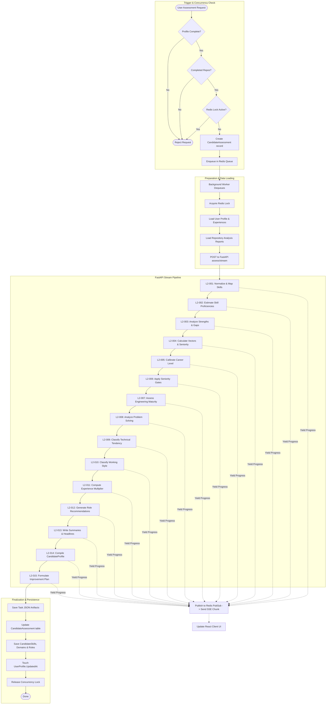
