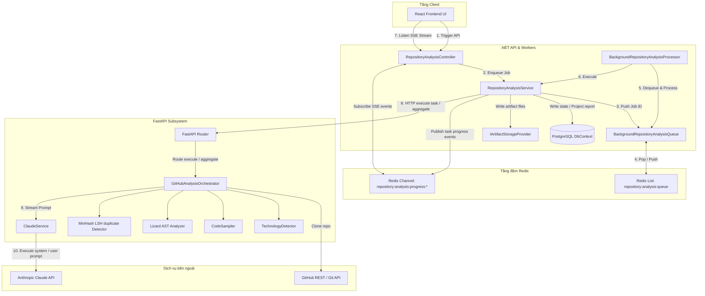
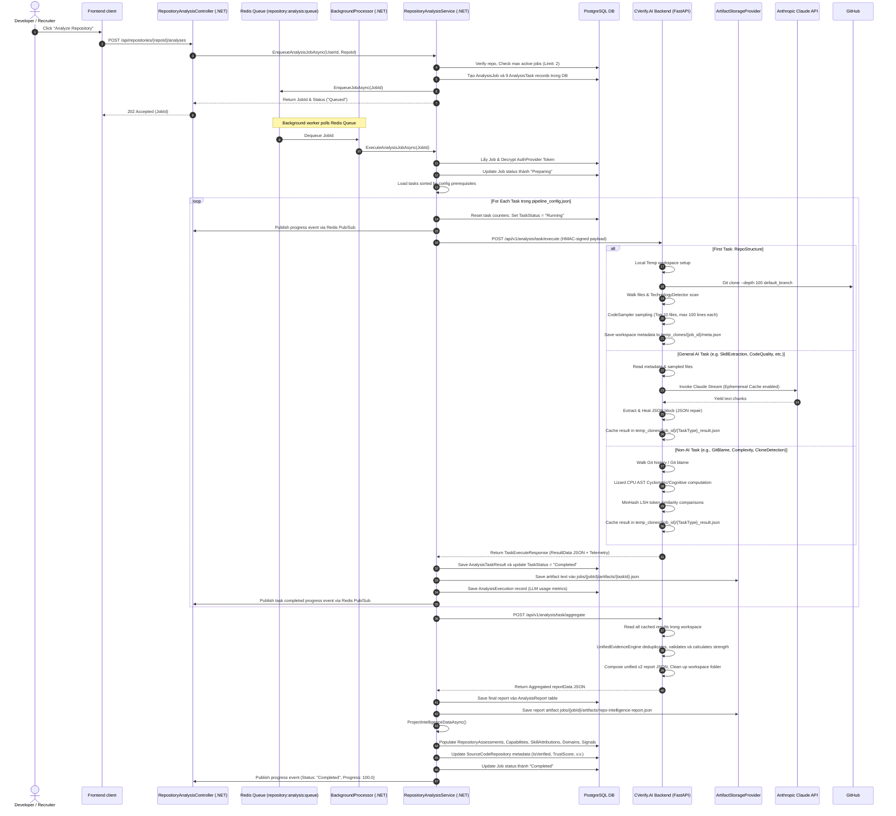
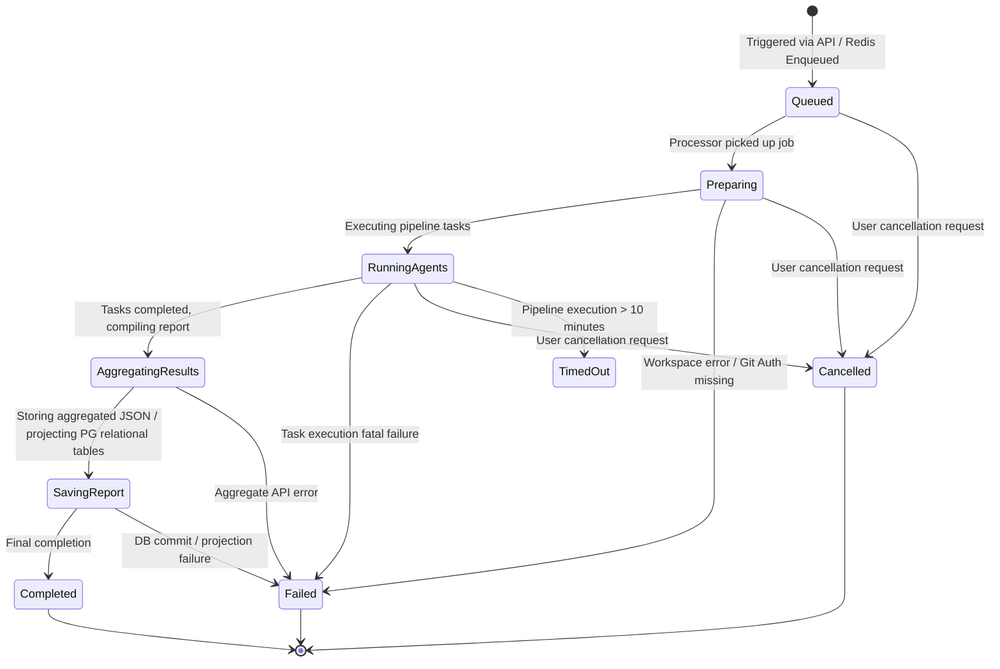
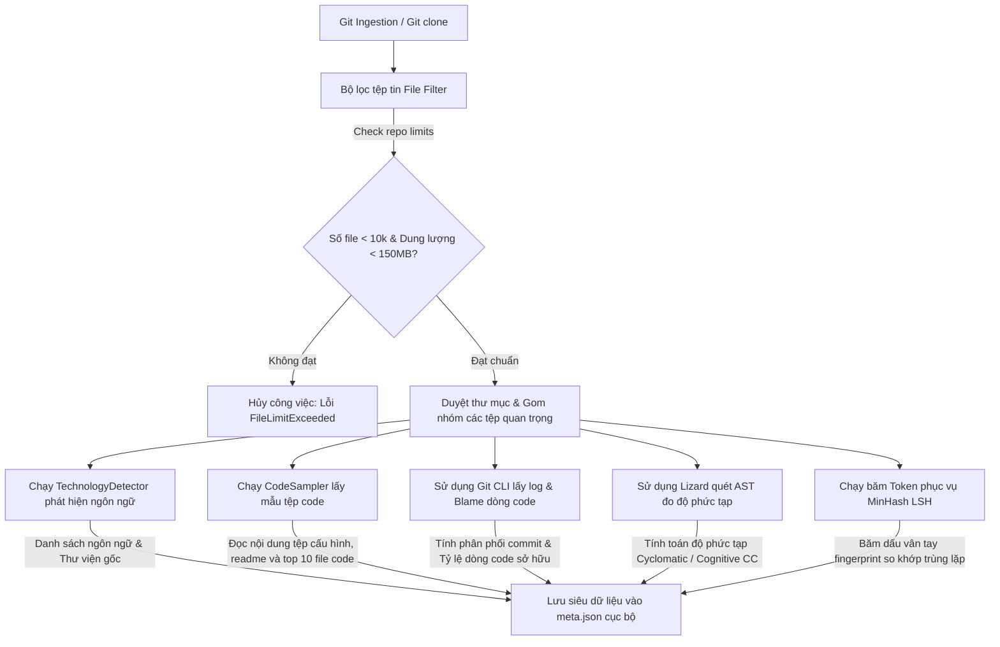
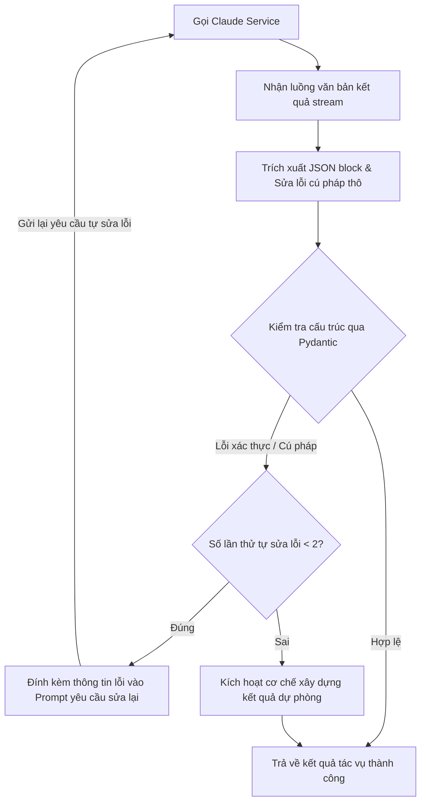
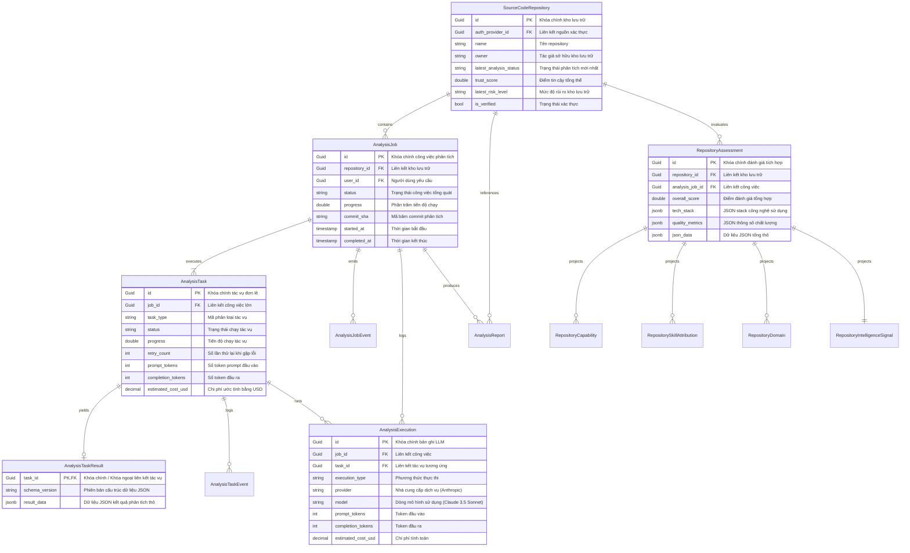
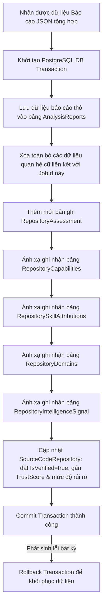

# Repository Analysis System: Tài liệu Kiến trúc & Workflow chi tiết

Tài liệu này cung cấp hướng dẫn kỹ thuật toàn diện, được reverse-engineer từ source code thực tế của Repository Analysis system trong CVerify. Tài liệu chi tiết hóa system architecture, end-to-end workflow, data models, state transitions, failure recovery mechanisms và code reference map của subsystem này.

---

## 1. Executive Summary (Tóm tắt tổng quan)

**Repository Analysis Subsystem** là core engine của CVerify dùng để đánh giá và xác thực developer credentials, skill profiles và project authenticity. Hệ thống thực hiện phân tích sâu repositories thông qua một pipeline gồm git audits, static code analysis, semantic analysis và LLM-powered reasoning.

### Main Goals (Mục tiêu chính)
* **Authenticity Verification**: Nhận diện repository origin, check rebranding/dumping, compute user authorship metrics và flag plagiarism hoặc AI-generated anomalies.
* **Semantic Domain Classification**: Tự động detect functional và business domain của project (ví dụ: SaaS, CLI tool, library) mà không phụ thuộc vào repository metadata cơ bản.
* **Technical Skill Attributions**: Trích xuất granular developer skills từ raw source code và manifest files, validating chúng với active repository configs.
* **Risk & Code Quality Auditing**: Inspect testing configurations, observability logging, CI/CD pipelines, security vulnerabilities và code complexity metrics.
* **CV Synthesis**: Translate verified codebase intelligence thành một structured professional summary mapping developer's ownership và highlights.

### Subsystems Involved (Các phân hệ liên quan)
1. **Frontend Client**: Khởi tạo analysis requests và listen to a real-time progress stream qua Server-Sent Events (SSE).
2. **CVerify.Core (.NET API)**: Orchestrates analysis lifecycle, handles API routing, quản lý Redis-backed FIFO queue, manage state transitions và persist findings vào PostgreSQL.
3. **CVerify.AI (FastAPI Backend)**: Executes repository cloning, file traversal, code sampling, local Git logs parsing, complexity checks, SimHash/MinHash near-duplicate matching và LLM orchestration với Anthropic Claude.
4. **Redis Cache & Message Broker**: Backs job execution queue và drive progress event streaming qua Redis Pub/Sub.
5. **PostgreSQL Database**: Persists operational state (`analysis_jobs`, `analysis_tasks`, v.v.) và projects aggregated findings vào relational tables (`repository_assessments`, `repository_capabilities`, v.v.).
6. **Object Storage (GCS/S3)**: Đóng vai trò là physical vault cho task JSON envelopes và aggregated intelligence reports.

---

## 2. System Architecture (Kiến trúc hệ thống)

Subsystem này hoạt động xuyên biên giới giữa .NET và Python, tích hợp thông qua REST API, Redis Pub/Sub và mã hóa xác thực HMAC trong secure request headers.

### Core Components (Thành phần cốt lõi)
* **RepositoryAnalysisController (C#)**: Exposes các API endpoints cho enqueuing, status checks, SSE progress streaming và cost summary statistics.
* **RepositoryAnalysisService (C#)**: Core orchestrator quản lý DB state transitions, OAuth token decryption, task sequencing dựa trên `pipeline_config.json`, artifact registration và relational PostgreSQL projection.
* **BackgroundRepositoryAnalysisProcessor (C#)**: Background worker lắng nghe Redis-backed queue để process job execution bất đồng bộ.
* **BackgroundRepositoryAnalysisQueue (C#)**: Cài đặt FIFO job queuing sử dụng Redis List (`repository:analysis:queue`).
* **FastAPI Router (Python)**: Validates incoming HMAC signatures và maps incoming task requests đến các orchestrator components tương ứng.
* **GitHubAnalysisOrchestrator (Python)**: Executes local workspace provisioning, technology detection, file sampling, git blame processing, lizard complexity AST walks, MinHash LSH clone matching và AI reasoning runs.
* **ClaudeService (Python)**: Kết nối với Anthropic API hỗ trợ stream bất đồng bộ, tự động retry với exponential backoff, token normalization và cost tracking.
* **IArtifactStorageProvider (C#)**: Abstract interface dùng để lưu và truy xuất raw JSON result packages trong object storage.

### Sơ đồ thành phần hệ thống (System Component Diagram)

#### Giải thích sơ đồ thành phần (Component Flow Explanation)
Sơ đồ thành phần mô tả sự phân tách trách nhiệm rõ ràng giữa các phân hệ:
1. **Client Layer**: Trình duyệt React gửi yêu cầu phân tích thông qua REST API HTTP đến `RepositoryAnalysisController` và thiết lập kết nối thời gian thực qua luồng Server-Sent Events (SSE).
2. **CVerify.Core (.NET API & Workers)**: Nhận yêu cầu và giao việc cho `RepositoryAnalysisService`. Dịch vụ này lưu Job vào PostgreSQL thông qua `DbContext`, đồng thời đẩy Job ID vào `BackgroundRepositoryAnalysisQueue` (lưu trữ vật lý trong Redis List). Một `BackgroundRepositoryAnalysisProcessor` chạy ngầm liên tục dequeue Job để thực thi bất đồng bộ.
3. **Redis Cache**: Lưu trữ FIFO Queue công việc và phân phối các kênh Pub/Sub phục vụ cập nhật tiến độ tức thời cho Controller.
4. **CVerify.AI (FastAPI Subsystem)**: Nhận HMAC-signed HTTP request để thực thi các tác vụ phân tích chuyên sâu. `GitHubAnalysisOrchestrator` thực hiện clone code từ GitHub API, kích hoạt `TechnologyDetector` để check stack, `CodeSampler` để lấy mẫu code, `Lizard` và `MinHash` để đo độ phức tạp/trùng lặp mã nguồn, và gọi `ClaudeService` để giao tiếp trực tiếp với Anthropic Claude API.

---

## 3. End-to-End Workflow (Quy trình đầu-cuối)

Vòng đời repository analysis tuân theo một sequential execution pipeline:

#### Giải thích quy trình tuần tự (Sequence Workflow Explanation)
Quy trình thực thi tuần tự được chia làm 4 giai đoạn chính:
1. **Khởi tạo và Enqueue (Bước 1 - 9)**: Developer click yêu cầu phân tích từ UI. Yêu cầu chuyển đến API .NET. Service kiểm tra các giới hạn công việc đang hoạt động (tối đa 2 jobs đồng thời trên mỗi user) trước khi tạo bản ghi Job và các Sub-tasks trong DB, sau đó đẩy Job ID vào Redis Queue và phản hồi HTTP 202 Accepted tức thì cho Client.
2. **Worker Dequeue và Prepare (Bước 10 - 17)**: Worker nền liên tục poll Redis list để dequeue Job ID. Sau khi lấy được Job ID, nó chuyển trạng thái sang `Preparing`, giải mã Git credentials (OAuth token) lưu trong DB, và load danh sách task đã cấu hình để chuẩn bị thực hiện.
3. **Vòng lặp thực thi Task (Bước 18 - 29)**: Với mỗi task định nghĩa trong config, Service cập nhật trạng thái tác vụ sang `Running`, phát tin nhắn tiến độ (progress events) qua Redis Pub/Sub, và gọi POST HTTP sang FastAPI backend.
   - *RepoStructure*: FastAPI tiến hành clone repository cục bộ, quét file danh mục, check technologies và lấy mẫu source code bằng `CodeSampler`, lưu metadata vào file `meta.json` trong workspace tạm thời.
   - *AI Tasks*: FastAPI đọc sampled files, gọi API Anthropic Claude qua stream và lưu JSON kết quả tạm thời.
   - *Non-AI Tasks*: FastAPI duyệt Git history, chạy Lizard AST đo độ phức tạp mã nguồn hoặc chạy MinHash so khớp trùng lặp.
   Sau mỗi task, FastAPI phản hồi kết quả về .NET. Service ghi nhận kết quả JSON vào PostgreSQL, upload artifact lên GCS, cập nhật số lượng token tiêu thụ và phát sự kiện hoàn thành tác vụ.
4. **Aggregate và Project Report (Bước 30 - 43)**: Sau khi chạy xong toàn bộ task, Service yêu cầu FastAPI chạy tác vụ tổng hợp. FastAPI đọc các kết quả đệm, kích hoạt `UnifiedEvidenceEngine` để lọc trùng lặp và tính toán độ mạnh bằng chứng, rồi trả về report JSON hợp nhất. .NET tiến hành ghi report vào DB, upload artifact lên GCS, chạy `ProjectIntelligenceDataAsync` để tách dữ liệu và điền vào các relational tables (`RepositoryAssessments`, `Capabilities`, v.v.), cập nhật trạng thái Job thành `Completed` và phát sự kiện tiến độ 100% đến Frontend.

---

## 4. Repository Analysis Lifecycle (Vòng đời phân tích repository)

Một repository analysis job đi qua một workflow trạng thái được giám sát chặt chẽ. Mỗi status transition đều ghi nhận vào DB và phát qua Redis Pub/Sub.

#### Giải thích vòng đời trạng thái (State Diagram Explanation)
Sơ đồ trạng thái mô tả cách thức một job phân tích chuyển dịch giữa các trạng thái từ lúc bắt đầu đến khi kết thúc:
- **Queued**: Trạng thái ban đầu khi Job mới được khởi tạo và đang xếp hàng chờ trong Redis FIFO list.
- **Preparing**: Được chuyển sang khi background worker nhặt job và bắt đầu verify workspace cùng Git authentication. Nếu thất bại tại đây (như OAuth token không giải mã được), job chuyển thẳng sang trạng thái kết thúc lỗi `Failed`.
- **RunningAgents**: Giai đoạn chạy tuần tự các task trong pipeline. Trạng thái này có thể chuyển sang `Failed` nếu bất kỳ task nào gặp lỗi nghiêm trọng (sau khi đã thử lại 3 lần), chuyển sang `Cancelled` nếu user yêu cầu hủy bỏ thông qua API, hoặc chuyển sang `TimedOut` nếu thời gian xử lý toàn bộ pipeline vượt quá giới hạn 10 phút.
- **AggregatingResults & SavingReport**: Các trạng thái xử lý sau khi hoàn thành các tác vụ đơn lẻ, thực hiện tổng hợp dữ liệu và đồng bộ vào PostgreSQL relational tables. Các lỗi phát sinh trong giao dịch DB hoặc kết nối GCS tại đây cũng sẽ làm job chuyển sang `Failed`.
- **Completed, Failed, Cancelled, TimedOut**: Các trạng thái kết thúc (terminal states) của một job phân tích.

### State Definitions (Định nghĩa các trạng thái)

| Lifecycle State | Purpose (Mục đích) | Entry Conditions (Điều kiện vào) | Exit Conditions (Điều kiện ra) | Failure / Interrupt Conditions (Điều kiện lỗi/hủy) |
| :--- | :--- | :--- | :--- | :--- |
| **Queued** | Job chờ trong Redis FIFO list. | API triggers analysis; DB record được tạo. | Processor pops Job ID và start execution. | User cancels job; state chuyển sang `Cancelled`. |
| **Preparing** | Workspace folder verification, Git credentials resolution. | Job được popped bởi processor; `ExecuteAnalysisJobAsync` được gọi. | OAuth token được resolved và decrypted. | Decryption key missing hoặc repository record bị xóa. |
| **RunningAgents** | Sequential execution của các pipeline tasks (RepoStructure, CommitDiff, AI reasoning, v.v.). | Preparing state kết thúc thành công. | Toàn bộ configured tasks trong `pipeline_config.json` hoàn thành. | Tác vụ thất bại sau 3 retries (chuyển sang `Failed`); user cancels (chuyển sang `Cancelled`); run time > 10m (chuyển sang `TimedOut`). |
| **AggregatingResults** | Compile các task cache files cục bộ thành một unified v2 report. | Tất cả pipeline tasks có status `Completed` trong DB. | Aggregate API trả về một valid aggregated JSON response. | FastAPI aggregation endpoint trả về error. |
| **SavingReport** | Persist final JSON report vào DB và GCS; project dữ liệu vào PostgreSQL relational tables. | Aggregation payload được nhận và validated. | DB transaction được commit thành công. | DB concurrency conflicts, schema validation errors hoặc GCS network drops. |
| **Completed** | Job kết thúc thành công. Terminal state. | DB transaction committed; repository metadata được cập nhật. | None | None |
| **Failed** | Job bị gián đoạn do lỗi. Terminal state. | Catch block trong C# orchestrator được kích hoạt. | None | None |
| **Cancelled** | Job bị hủy bởi user. Terminal state. | `CancelJobAsync` được gọi trên một active job. | None | None |
| **TimedOut** | Thực thi vượt quá timeout 10 phút. | Linked cancellation token source đạt 10 phút. | None | None |

---

## 5. Pipeline Engine Deep Dive (Chi tiết về Pipeline Engine)

Pipeline orchestrator kiểm soát sequencing, configuration và resilience của các discrete tasks.

### Engine Configuration (`pipeline_config.json`)
Cấu trúc pipeline hoàn toàn được định nghĩa bởi file cấu hình. .NET orchestrator phân tích `pipeline_config.json` để xác định:
1. **Task Sequencing**: Thứ tự thực thi khớp với layout của mảng cấu hình.
2. **Progress Weighting**: Mỗi task được gán một `weight` (mặc định 5.0) và được scale động so với tổng số weight của các tác vụ để cập nhật thông số tiến độ `AnalysisJob.Progress`.
3. **Prerequisite DAG**: Khai báo downstream task blockers (ví dụ: `CvSynthesis` yêu cầu `RepositorySummary` phải chạy trước).

### Context Model
Workspace state được cô lập theo từng `jobId` cả ở local cache và object storage:
* **Local Python Cache**: Nằm tại thư mục `CVerify.AI/temp_clones/{jobId}/`.
  * `repo/`: Thư mục chứa cloned Git repository.
  * `meta.json`: Lưu trữ repository metadata (commit distributions, stars, branches, active contributors, resolved author identity hashes).
  * `{TaskType}_result.json`: Các tệp kết quả tạm thời làm context đầu vào cho các tác vụ phía sau.
* **GCS Artifact Store**: Rooted tại thư mục `jobs/{jobId}/artifacts/`. Lưu trữ kết quả chi tiết của từng tác vụ để theo dõi cost/audit.

### Resilience & Error Handling (Khả năng chịu lỗi & Thử lại)
* **Transient API Retries**: Toàn bộ cuộc gọi HTTP đến FastAPI và API Anthropic Claude đều được bọc trong các cơ chế retry.
  * *Claude API calls*: Các lỗi Anthropic tạm thời (429, 500, 502, 503, 504, rate limit, timeout) sẽ được retry lên đến **5 lần** với exponential backoff và randomized jitter (`sleep_time = delay + random_jitter`).
  * *Pipeline tasks*: Vòng lặp tác vụ C# tự động retry tác vụ bị lỗi tạm thời lên đến **3 lần** (delays: 500ms, 1000ms, 2000ms) trước khi fail cả job.
* **JSON Recovery Heuristic (Cơ chế sửa lỗi JSON)**: Phản hồi từ Claude bị cắt cụt giữa chừng hoặc chứa các unescaped control characters sẽ được xử lý qua hàm `_repair_json_string`. Parser sẽ định vị dấu `{` đầu tiên và `}` cuối cùng rồi tự động sửa các ngoặc/dấu chuỗi còn thiếu để đảm bảo tính cấu trúc của JSON.

---

## 6. Detailed Task Breakdown (Chi tiết các tác vụ trong hệ thống)

Pipeline chạy tổng cộng 22 loại tác vụ riêng biệt (bao gồm cả legacy và alias mappings). Dưới đây là bảng tổng hợp các tác vụ cùng chi tiết các tác vụ lớn:

### Bảng tổng hợp các tác vụ trong Pipeline (Pipeline Tasks Summary)

| Task ID | Task Name | Purpose & Core Function (Mục tiêu & Chức năng chính) | Inputs / Dependencies | Technologies & Services | Task Type |
| :--- | :--- | :--- | :--- | :--- | :--- |
| **L1-001** | **RepoStructure** | Khởi tạo workspace, clone Git, file scan, tech detection và code sampling. | Repo URL, OAuth Token | Git CLI, `TechnologyDetector`, `CodeSampler` | Deterministic |
| **L1-002** | **CommitIntelligence** | Đánh giá lịch sử commit, đóng góp của dev, bus factor và chạy AI trust evaluation. | `RepoStructure`, User Hashes | Git Log, `ClaudeService` (LLM) | AI & Deterministic |
| **L1-003** | **CommitDiff** | Phân tích code changes của top 30 commits gần nhất để map sang capability signals. | Git Repository | Git CLI, RegEx | Deterministic |
| **L1-004** | **SkillExtraction** | Trích xuất granular technical skills, libraries kèm citations dòng code cụ thể. | `RepoStructure`, sampled files | `ClaudeService` (LLM) | AI |
| **L1-005** | **FeatureExtraction** | NLP-based nhận diện các features nghiệp vụ lớn cài đặt trong codebase. | `RepoStructure`, `CommitDiff` | `ClaudeService` (LLM) | AI |
| **L1-006** | **ArchitectureAnalysis** | Phân tích cấu trúc thư mục và phát hiện architectural patterns. | `RepoStructure` | `ClaudeService` (LLM) | AI |
| **L1-007** | **CommitTimeline** | Tính toán tần suất và mật độ đóng góp mã nguồn theo thời gian. | Git history | Git CLI | Deterministic |
| **L1-008** | **ArchitectureChange** | Đánh giá chất lượng refactoring hệ thống qua lịch sử commit. | Git diff trees | Git CLI | Deterministic |
| **L1-009** | **CommitIntent** | Suy luận ý định thực tế của commit (bugfix, feature, cleanup, refactor). | `CommitDiff` | `ClaudeService` (LLM) | AI |
| **L1-010** | **Complexity** | Đánh giá Cyclomatic và Cognitive complexity của các hàm. | `RepoStructure` | Lizard AST | Deterministic |
| **L1-011** | **CodeQuality** | Kiểm toán automated tests, CI/CD configs, logging/observability và code smells. | `RepoStructure` | `ClaudeService` (LLM) | AI |
| **L1-012** | **GitBlame** | Truy vấn tác giả của từng dòng mã trong các tệp thay đổi nhiều nhất. | `RepoStructure` | Git CLI | Deterministic |
| **L1-013** | **CloneDetection** | Phát hiện trùng lặp mã nguồn gần đúng chống plagiarism. | `RepoStructure` | `datasketch` (MinHash LSH) | Deterministic |
| **L1-014** | **AiGeneratedCode** | Phát hiện lượng lớn mã nguồn được chép từ AI/LLM generator. | `RepoStructure`, Git log | Commit patterns | Deterministic |
| **L1-015** | **Ownership** | Tính toán điểm số sở hữu mã nguồn của developer mục tiêu. | `GitBlame`, `CloneDetection` | Trọng số công thức | Deterministic |
| **L1-016** | **RepoIntelligenceReport** | Hợp nhất kết quả từ tất cả các tác vụ thành báo cáo JSON tổng. | Tất cả kết quả tác vụ trước | `UnifiedEvidenceEngine` | Deterministic |
| **L1-017** | **SkillGraph** | Xây dựng đồ thị liên kết kỹ năng và bằng chứng kiểm chứng. | `SkillExtraction` | Graph compiler | Deterministic |
| **L1-018** | **TrustScore** | Tính điểm tin cậy tổng hợp dựa trên 4 chiều đo lường chính. | `Ownership`, `CodeQuality`, v.v. | Trọng số công thức | Deterministic |
| **L1-019** | **SecurityAnalysis** | Quét lỗ hổng bảo mật phổ biến và verify các phát hiện. | `RepoStructure` | `ClaudeService` (LLM) | AI |
| **L1-020** | **RepositoryClassification**| Phân loại application type (SaaS, Library, CLI, v.v.) và business domain. | `RepoStructure` | `ClaudeService` (LLM) | AI |
| **L1-021** | **RepositorySummary** | Tạo mô tả tóm tắt, chỉ ra điểm mạnh/yếu của mã nguồn. | `RepoIntelligenceReport` | `ClaudeService` (LLM) | AI |
| **L1-022 / CVSynthesis** | **CvSynthesis** | Tổng hợp trí tuệ codebase thành các highlights hồ sơ CV. | `RepositorySummary`, v.v. | `ClaudeService` (LLM) | AI |

---

### RepoStructure / L1-001
* **Purpose**: Workspace provisioning, Git cloning, file scan, technology detection và code sampling.
* **Inputs**: Repo URL, encrypted OAuth token, default branch.
* **Outputs**: File list, technology array, sampled files contents, Git clone indicators.
* **Context Dependencies**: None (Root node).
* **Services Used**: `GitHubIdentityService` (giải quyết xác thực), `TechnologyDetector`, `CodeSampler`.
* **AI Calls**: None.
* **Database Operations**: None (Chỉ ghi metadata xuống file `meta.json` của local workspace).
* **Failure Handling**: Tự động chuyển đổi sang clone default branch hệ thống nếu branch chỉ định bị lỗi. Ném ngoại lệ hủy tác vụ nếu kho lưu trữ chứa hơn 10.000 tệp hoặc dung lượng vượt quá 150MB.
* **Downstream Consumers**: Toàn bộ các tác vụ trong pipeline.

### CommitIntelligence / L1-002
* **Purpose**: Phân tích local Git log để tính toán contributor commit distributions, bus factor, user commit ratio và chạy AI check repository trust signals.
* **Inputs**: Danh sách resolved user identity hashes, metadata, sampled files.
* **Outputs**: Factual Git metrics (bus factor, user commit ratio, contributors), AI-inferred trust classification (`personal_authentic`, `fork_rebranded`, `template_dump`, `collaboration`).
* **Context Dependencies**: `RepoStructure`.
* **Services Used**: `ContributorIdentityResolver`, `ClaudeService`.
* **AI Calls**: Prompt gọi Claude đối chiếu repository metadata với code style để đánh giá authenticity.
* **Database Operations**: None.
* **Failure Handling**: Tự động bypass AI và fallback về deterministic evaluation nếu repository type được flag là `FORK_NO_CONTRIBUTION`.

### CommitDiff / L1-003
* **Purpose**: Phân tích diff tree thô của top 30 commits gần nhất để map changed files trực tiếp sang capability signals (Kiến trúc Diff-First).
* **Inputs**: Git repository.
* **Outputs**: List commits đã phân tích, files changed, inferred type (feature, test, cleanup, refactor), intent conflict flag.
* **Context Dependencies**: `RepoStructure`.
* **Services Used**: Git CLI.
* **AI Calls**: None (Phân loại định tính dựa trên path structures và regex).
* **Database Operations**: None.
* **Downstream Consumers**: `CommitIntent`, `SkillGraph`, `RepoIntelligenceReport`.

### SkillExtraction / L1-004
* **Purpose**: Phân tích code samples để trích xuất granular technical skills.
* **Inputs**: Sampled file contents, detected technologies.
* **Outputs**: Array các skill items gồm skill name, category (backend, frontend, devops, database), confidence và citations dòng code cụ thể minh chứng.
* **Context Dependencies**: `RepoStructure`.
* **Services Used**: `ClaudeService`.
* **AI Calls**: Skill extraction prompt map code constructs sang libraries và practices tương ứng.
* **Downstream Consumers**: `SkillGraph`, `RepoIntelligenceReport`, `CvSynthesis`.

### FeatureExtraction / L1-005
* **Purpose**: NLP-based nhận diện các major features được cài đặt trong codebase.
* **Inputs**: Sampled code, filenames, capability signals.
* **Outputs**: Array các feature objects chứa name, description, complexity score (1-10) và evidence.
* **Context Dependencies**: `RepoStructure`, `CommitDiff`, `ArchitectureAnalysis`.
* **Services Used**: `ClaudeService`.
* **AI Calls**: Feature extraction prompt đánh giá files vs capabilities.
* **Downstream Consumers**: `RepoIntelligenceReport`, PostgreSQL relational tables.

### CodeQuality / L1-011
* **Purpose**: Kiểm toán test coverage configurations, logging/observability instrumentation, CI/CD configs và code smell patterns.
* **Inputs**: Code samples.
* **Outputs**: Testing framework list, observability indicators, CI/CD provider list, findings array.
* **Context Dependencies**: `RepoStructure`.
* **Services Used**: `ClaudeService`.
* **AI Calls**: Code quality prompt quét code tìm assertions, logging calls và pipeline files.
* **Downstream Consumers**: `TrustScore`, `RepoIntelligenceReport`.

### CloneDetection / L1-013
* **Purpose**: Near-duplicate detection để phát hiện code plagiarism.
* **Inputs**: Code workspace.
* **Outputs**: Clone risk score, clone similarity score, clone pairs list.
* **Context Dependencies**: `RepoStructure`.
* **Services Used**: Thư viện `datasketch` (MinHash LSH).
* **AI Calls**: None (Băm token định tính để tối ưu performance).
* **Failure Handling**: Tự động fallback sang commit-pattern heuristics (large initial commits, commit bombs, commit velocity) nếu thư viện `datasketch` bị missing.
* **Downstream Consumers**: `TrustScore`, `Ownership`.

### Ownership / L1-015
* **Purpose**: Tính toán code ownership score của developer trong project.
* **Inputs**: Kết quả từ `GitBlame` và `CloneDetection`.
* **Outputs**: Weighted ownership score, primary author indicator.
* **Context Dependencies**: `GitBlame`, `CloneDetection`, `CommitIntelligence`, `CommitTimeline`.
* **AI Calls**: None.
* **Downstream Consumers**: `TrustScore`, `SkillGraph`, `RepoIntelligenceReport`.

### TrustScore / L1-018
* **Purpose**: Tính toán overall trust score dựa trên 4 khía cạnh chính.
* **Inputs**: `Ownership`, `CodeQuality`, `Complexity`, `CommitTimeline`, `CloneDetection`, `AiGeneratedCode`, `CommitIntent`.
* **Outputs**: Trust score, trust level (low, medium, high), dimensional breakdown.
* **Context Dependencies**: Tất cả các tác vụ kiểm toán chất lượng/chống gian lận phía trước.
* **AI Calls**: None (Tính toán bằng công thức trọng số cứng).
* **Downstream Consumers**: `RepoIntelligenceReport`.

### RepoIntelligenceReport / L1-016
* **Purpose**: Hợp nhất toàn bộ kết quả đầu ra của các tác vụ thành một unified JSON report.
* **Inputs**: Tất cả kết quả tác vụ.
* **Outputs**: Combined report schema.
* **Context Dependencies**: `TrustScore`, `SkillGraph`, `CommitDiff`.
* **AI Calls**: None.
* **Database Operations**: Persisted vào bảng `AnalysisReports` và project các bảng quan hệ SQL.
* **Downstream Consumers**: `RepositorySummary`.

### CvSynthesis
* **Purpose**: Tổng hợp verified codebase intelligence thành một professional CV representation.
* **Inputs**: Kết quả từ `RepositoryClassification`, `SkillExtraction`, `CommitIntelligence`, `RepositorySummary`.
* **Outputs**: Professional title, summary paragraph, bulleted highlights.
* **Context Dependencies**: `RepositorySummary`.
* **Services Used**: `ClaudeService`, Pydantic validator, difflib.
* **AI Calls**: CV synthesis prompt biên dịch thông tin thành tóm tắt hồ sơ CV.
* **Failure Handling**: Áp dụng luật kiểm duyệt Pydantic nghiêm ngặt. Hệ thống sử dụng thư viện `difflib.SequenceMatcher` so khớp độ tương đồng văn bản (giới hạn tương đồng > 0.6) để từ chối các phản hồi từ Claude sao chép nguyên văn tóm tắt của tác vụ trước đó. Hệ thống tự động chuyển sang cơ chế xây dựng hồ sơ định tính nếu cả hai lượt gọi AI đều lỗi hoặc bị từ chối.

---

## 7. Repository Processing Flow (Quy trình tiền xử lý repository)

Quy trình di chuyển dữ liệu từ bước Git clone thô đến bước chuẩn hóa dữ liệu:

#### Giải thích quy trình tiền xử lý repository (Processing Flow Explanation)
Quy trình tiền xử lý mã nguồn bắt đầu bằng việc nạp kho lưu trữ thông qua Git CLI:
1. **Kiểm tra giới hạn**: Hệ thống kiểm tra số lượng file (tối đa 10k files) và dung lượng (tối đa 150MB) của repository được clone. Nếu vượt quá giới hạn này, job sẽ bị hủy ngay lập tức với lỗi `FileLimitExceeded`.
2. **Kích hoạt các bộ phân tích song song**:
   - `TechnologyDetector` quét cấu trúc thư mục để nhận diện các ngôn ngữ lập trình và các frameworks đang được sử dụng dựa trên các file cấu hình manifest (như package.json, csproj, go.mod, v.v.).
   - `CodeSampler` chọn ra tối đa 10 file mã nguồn quan trọng (loại bỏ các file thư viện bên thứ ba, tệp sinh ra tự động) và lấy mẫu tối đa 100 dòng mã trên mỗi file.
   - `Git CLI & Git Blame` duyệt qua lịch sử commit để tính toán số lượng đóng góp và xác định tỷ lệ sở hữu mã nguồn của từng tác giả.
   - `Lizard AST` phân tích cấu trúc mã nguồn để tính toán độ phức tạp Cyclomatic và Cognitive của từng hàm.
   - `MinHash LSH` thực hiện băm token để tạo dấu vân tay phục vụ việc đối chiếu trùng lặp mã nguồn cục bộ.
3. **Lưu trữ metadata**: Toàn bộ kết quả phân tích định tính thô này được lưu trữ tập trung vào tệp `meta.json` của workspace cục bộ làm context đầu vào cho các tác vụ LLM tiếp theo.

---

## 8. AI Analysis Flow (Quy trình phân tích AI)

Các tác vụ AI được quản lý và phối hợp bằng cách áp dụng prompt hệ thống, luật prompt caching và các hàm kiểm duyệt hậu xử lý.

### Prompts & Caching
Các template prompt hệ thống được khai báo tập trung trong tệp `github_prompt_factory.py`. Prompt hệ thống được nhúng cấu hình `cache_control: {"type": "ephemeral"}`. Cấu hình này kích hoạt tính năng Prompt Caching của Anthropic Claude, giúp giảm đáng kể thời gian phản hồi và tiết kiệm chi phí gọi API khi xử lý chuỗi tác vụ liên tục sử dụng chung ngữ cảnh cấu trúc thư mục mã nguồn.

### Pydantic Validation & Self-Correction (Kiểm duyệt Pydantic & Tự sửa lỗi)
Dữ liệu trả về từ Claude bắt buộc phải ở định dạng JSON khớp với định nghĩa cấu trúc dữ liệu. Nếu phát sinh lỗi cú pháp hoặc sai cấu trúc dữ liệu, hệ thống tự động chạy vòng lặp tự sửa lỗi:

#### Giải thích quy trình phân tích AI (AI Flow Explanation)
Quy trình điều phối AI đảm bảo tính toàn vẹn dữ liệu JSON đầu ra thông qua cơ chế tự động sửa lỗi:
1. **Gọi Claude Service & Stream**: Gửi prompt hệ thống cùng ngữ cảnh mã nguồn đã lấy mẫu đến Anthropic Claude API dưới dạng stream để nhận phản hồi liên tục.
2. **JSON Repair**: Trích xuất khối văn bản nằm trong dấu `{` và `}` đầu/cuối của phản hồi, tiến hành sửa chữa các lỗi cú pháp thô (ngoặc thiếu, dấu nháy kép không hợp lệ).
3. **Pydantic Validation**: Đối chiếu dữ liệu JSON đã sửa chữa với cấu trúc Python định nghĩa sẵn. Nếu pass, trả về kết quả thành công.
4. **Self-Correction Loop**: Nếu phát hiện lỗi cấu trúc dữ liệu, hệ thống đính kèm chi tiết lỗi vào prompt và gửi yêu cầu Claude phân tích sửa lỗi lại (tối đa 2 lần). Nếu sau 2 lần vẫn lỗi, hệ thống sẽ kích hoạt một trình tạo kết quả dự phòng định tính (deterministic fallback builder) để đảm bảo pipeline không bị đứt gãy.

---

## 9. Data Model Mapping (Ánh xạ mô hình dữ liệu)

Mối quan hệ dữ liệu quan hệ được lưu trữ trong cơ sở dữ liệu PostgreSQL của hệ thống CVerify:

#### Giải thích sơ đồ quan hệ cơ sở dữ liệu (Database Schema Explanation)
Sơ đồ thực thực thể mối quan hệ (ERD) chi tiết hóa cách thức lưu trữ dữ liệu phân tích:
1. **SourceCodeRepository**: Bảng trung tâm lưu trữ thông tin về repository (name, owner, trust_score, is_verified). Nó có mối quan hệ một-nhiều (1-to-many) với các bản ghi `AnalysisJob`, `AnalysisReport` và `RepositoryAssessment`.
2. **AnalysisJob & AnalysisTask**: Một job lớn (`AnalysisJob`) đại diện cho một lượt phân tích toàn bộ repository và liên kết với một danh sách các tác vụ nhỏ hơn (`AnalysisTask`). Mỗi `AnalysisTask` liên kết với một `AnalysisTaskResult` để lưu trữ dữ liệu thô dạng JSON (`jsonb`).
3. **AnalysisExecution**: Lưu lại chi tiết cuộc gọi LLM bao gồm model sử dụng (ví dụ: Claude 3.5 Sonnet) và tokens sử dụng để quản lý chi phí.
4. **RepositoryAssessment**: Bảng tổng hợp báo cáo sau khi tổng hợp thành công, đóng vai trò gốc liên kết một-nhiều với các chiều dữ liệu quan hệ được ánh xạ chi tiết như: `RepositoryCapability` (năng lực kỹ thuật), `RepositorySkillAttribution` (kỹ năng lập trình), `RepositoryDomain` (phân loại nghiệp vụ dự án) và `RepositoryIntelligenceSignal` (các tín hiệu thông minh của dự án).

---

## 10. Persistence Flow (Quy trình lưu trữ dữ liệu)

Quá trình lưu trữ dữ liệu được thực thi dưới các ràng buộc giao dịch cơ sở dữ liệu (Database Transaction) nghiêm ngặt nhằm bảo toàn tính toàn vẹn của dữ liệu.

### Task Execution Save Path
Trong quá trình vòng lặp tác vụ chạy, `RepositoryAnalysisService` ghi nhận dữ liệu:
1. Ghi hoặc cập nhật bản ghi `AnalysisTaskResult` lưu dưới dạng kiểu cột `jsonb` của PostgreSQL.
2. Thêm một bản ghi `AnalysisExecution` ghi nhận lượng token, loại mô hình, chi phí ước tính.
3. Ghi chép lịch sử chi tiết tác vụ vào bảng `AnalysisTaskEvents` đóng vai trò log vết hệ thống.

### Aggregation and SQL Projection Save Path
Khi FastAPI báo cáo hoàn thành việc tổng hợp toàn bộ kết quả, bộ điều phối .NET thực hiện ghi dữ liệu báo cáo tích hợp và ánh xạ dữ liệu vào các bảng quan hệ trong cùng một giao dịch cơ sở dữ liệu duy nhất:

#### Giải thích sơ đồ lưu dữ liệu quan hệ (Relational Projection Explanation)
Quy trình ghi nhận báo cáo tổng hợp và ánh xạ dữ liệu (relational projection) sử dụng mô hình DB Transaction để đảm bảo tính nguyên tử (atomicity):
1. **Khởi tạo Transaction**: Toàn bộ luồng ghi dữ liệu quan hệ bắt đầu bằng việc thiết lập một DB Transaction để tránh tình trạng dữ liệu bị cập nhật dở dang khi có lỗi xảy ra.
2. **Xóa dữ liệu cũ**: Tìm và xóa sạch tất cả các bản ghi quan hệ cũ của Job ID nhằm đảm bảo tính cập nhật và tránh bị ghi trùng lặp.
3. **Thêm dữ liệu mới**: Tiến hành ghi lần lượt các bản ghi mới từ báo cáo JSON vào các bảng quan hệ tương ứng (`RepositoryAssessment`, `RepositoryCapabilities`, v.v.).
4. **Commit & Rollback**: Nếu toàn bộ tiến trình ghi dữ liệu thành công không có lỗi, Transaction được Commit để lưu lại thay đổi lâu dài. Nếu phát sinh bất kỳ exception nào trong quá trình ghi dữ liệu, Transaction được Rollback lập tức để phục hồi lại trạng thái dữ liệu cũ trong cơ sở dữ liệu.

### Ranh Giới Giao Dịch Reset Phân Tích (The Reset Transaction Boundary)
Khi người dùng yêu cầu reset (đặt lại) toàn bộ kết quả phân tích cũ qua hàm `ResetRepositoryAnalysisAsync`:
1. Hệ thống yêu cầu một khóa phân tán Redis (Redis Distributed Lock) dựa trên khóa: `repository:reset:lock:{repositoryId}`.
2. Kiểm tra xác nhận không có bất kỳ công việc phân tích nào đang chạy trên repository này.
3. Khởi tạo một giao dịch cơ sở dữ liệu DB Transaction:
   * Xóa bản ghi `ProjectRepositoryLinks` và gỡ bỏ liên kết kho lưu trữ này khỏi CV lập trình viên.
   * Xóa tất cả các thông tin đánh giá quan hệ (`repository_capabilities`, `repository_skill_attributions`, `repository_domains`, `repository_intelligence_signals`, `repository_assessments`).
   * Xóa toàn bộ lịch sử công việc phân tích (`artifact_registry_entries`, `analysis_executions`, `analysis_task_results`, `analysis_task_events`, `analysis_tasks`, `analysis_reports`, `analysis_job_events`, `analysis_jobs`).
   * Đặt các trường thông tin kiểm chứng của kho lưu trữ về giá trị mặc định.
   * Tạo bản ghi `AuditLog` lưu lại lịch sử hành động xóa thông tin.
   * Commit giao dịch DB Transaction.
4. Phát các tác vụ nền bất đồng bộ để xóa tệp vật lý của công việc cũ trên Object Storage (GCS) và tính toán lại điểm năng lực của ứng viên.

---

## 11. Event and Streaming Flow (Quy trình sự kiện & stream tiến độ)

Cập nhật tiến độ phân tích được truyền phát thời gian thực tới trình duyệt người dùng bằng công nghệ Server-Sent Events (SSE), sử dụng Redis Pub/Sub làm trung gian truyền phát.

### Quy Trình Truyền Phát Tiến Độ
1. Trong vòng lặp thực thi tác vụ của `RepositoryAnalysisService.cs`, hàm `PublishTaskProgressEventAsync` được gọi để đóng gói dữ liệu sự kiện gồm trạng thái công việc, tiến độ phần trăm và thông tin bước chạy hiện tại.
2. Hệ thống phát payload này vào kênh Redis Pub/Sub tương ứng có tên: `repository:analysis:progress:{jobId}`.
3. Khi trình duyệt gọi API `GET /api/repository-analyses/jobs/{jobId}/progress-stream`:
   * Bộ điều khiển Controller thiết lập header phản hồi với định dạng `text/event-stream`.
   * Đọc và ghi toàn bộ lịch sử sự kiện đã diễn ra từ bảng `AnalysisJobEvents` vào luồng phản hồi để tránh mất mát thông tin tiến độ trước đó.
   * Đăng ký lắng nghe kênh Redis Pub/Sub tương ứng.
   * Mỗi khi nhận được sự kiện mới từ kênh Redis, hệ thống lập tức đẩy dữ liệu đó vào luồng phản hồi HTTP SSE.
   * Khi phát hiện công việc chuyển sang các trạng thái kết thúc (`Completed`, `Failed`, `Cancelled`, `TimedOut`), hệ thống gửi sự kiện cuối cùng chứa tiêu đề `data: [DONE]` và đóng kết nối stream.

---

## 12. Failure Recovery & Resilience (Phục hồi sự cố & Khả năng chống chịu)

Hệ thống thiết lập nhiều lớp cơ chế tự động phục hồi sự cố nhằm giảm thiểu tối đa các lỗi do dừng máy chủ đột ngột, quá tải API bên thứ ba.

### Bộ Quét Dọn Khởi Động (`AnalysisQueueRecoverySweeper`)
Khi hệ thống CVerify.Core khởi động, một sweeper chạy ngầm sẽ được khởi chạy để phục hồi các công việc bị kẹt do máy chủ bị tắt đột ngột:
1. Quét DB tìm các công việc đang ở trạng thái hoạt động dở dang (`Queued`, `Preparing`, `RunningAgents`, v.v.).
2. Cập nhật trạng thái các công việc này thành `Failed` kèm theo mô tả lỗi: *"Job bị gián đoạn do máy chủ đột ngột khởi động lại."*
3. Cập nhật trạng thái kho lưu trữ liên kết tương ứng thành `Failed`.
4. Tìm kiếm các kho lưu trữ đang ở trạng thái chờ phân tích nhưng không gắn với công việc nào và chuyển chúng sang trạng thái lỗi để người dùng có thể bấm chạy lại.

### Chính Sách Thử Lại (Retry Policies)
* **Gọi Tác Vụ FastAPI**: Khi dịch vụ FastAPI Python báo lỗi, .NET kiểm tra cờ `retryable`. Nếu lỗi thuộc dạng tạm thời, hệ thống sẽ trì hoãn tăng dần và gọi lại tối đa 3 lần.
* **API Anthropic Claude**: Phân hệ `ClaudeService` phía Python tự động thử lại tối đa 5 lần với thời gian trễ tăng theo hàm lũy thừa kèm độ nhiễu ngẫu nhiên để vượt qua các giới hạn Rate Limit (lỗi 429) của Anthropic.

### Hủy Bỏ Công Việc (Cancellation)
Khi hàm `CancelJobAsync` được gọi:
1. Đặt trạng thái công việc là `Cancelled` trong DB ngay lập tức.
2. Trong vòng lặp thực thi tác vụ, trước khi bắt đầu gọi một tác vụ mới, bộ điều phối kiểm tra trạng thái công việc trong DB. Nếu phát hiện trạng thái là `Cancelled`, hệ thống lập tức hủy bỏ và dọn dẹp tài nguyên.

---

## 13. Performance Characteristics (Đặc điểm hiệu năng)

### Xử Lý Tuần Tự vs Song Song
* *Hiện trạng*: Bộ điều phối .NET thực hiện gọi tuần tự (sequential) từng tác vụ khai báo trong `pipeline_config.json`. Dù hệ thống có hỗ trợ cấu trúc đồ thị ràng buộc tác vụ DAG phía Python, tiến trình thực thi tại `RepositoryAnalysisService` vẫn đang chạy tuần tự.
* *Điểm nghẽn*: Kho lưu trữ có dung lượng lớn phải trải qua nhiều tác vụ phân tích AI liên tục dễ dẫn đến thời gian thực thi chạm ngưỡng giới hạn 10 phút của hệ thống.

### Các Điểm Nghẽn Hiệu Năng Lớn
1. **Tải Kho Lưu Trữ (Git Clone)**: Việc clone mã nguồn qua giao thức Git phụ thuộc hoàn toàn vào băng thông mạng cục bộ và độ phản hồi từ GitHub.
2. **Đo độ trễ phản hồi AI (Claude Latency)**: Mỗi tác vụ phân tích LLM tiêu tốn từ 5 đến 25 giây tùy thuộc vào độ phức tạp của mã nguồn và prompt.
3. **Duyệt cấu trúc AST (Lizard AST Walk)**: Lizard phân tích độ phức tạp chạy hoàn toàn trên CPU và có thể gây nghẽn luồng xử lý trên các thư mục chứa hàng ngàn tệp mã nguồn lồng nhau.
4. **Phân tích trùng lặp MinHash**: Quá trình băm token và so sánh chéo dấu vân tay giữa hàng ngàn file mã nguồn yêu cầu tài nguyên bộ nhớ RAM và CPU lớn.

---

## 14. Code Reference Map (Bản đồ tham chiếu mã nguồn)

Bảng chỉ dẫn cấu trúc thư mục mã nguồn để điều hướng và sửa lỗi hệ thống phân tích:

| Thành phần | Đường dẫn tệp tin | Class / Hàm | Vai trò & Trách nhiệm |
| :--- | :--- | :--- | :--- |
| **API Entry Controller** | [RepositoryAnalysisController.cs](file:///d:/Coding%20Space/Projects/CVerify/CVerify.Core/Modules/SourceCode/Controllers/RepositoryAnalysisController.cs) | `RepositoryAnalysisController` | Handles API endpoints, SSE progress stream. |
| **Queue Manager** | [BackgroundRepositoryAnalysisQueue.cs](file:///d:/Coding%20Space/Projects/CVerify/CVerify.Core/Modules/SourceCode/Services/BackgroundRepositoryAnalysisQueue.cs) | `BackgroundRepositoryAnalysisQueue` | Pushes/pops jobs sử dụng Redis list formats. |
| **Queue Consumer** | [BackgroundRepositoryAnalysisProcessor.cs](file:///d:/Coding%20Space/Projects/CVerify/CVerify.Core/Modules/SourceCode/BackgroundWorkers/BackgroundRepositoryAnalysisProcessor.cs) | `BackgroundRepositoryAnalysisProcessor` | Background service consuming the Redis list queue. |
| **Core .NET Orchestrator** | [RepositoryAnalysisService.cs](file:///d:/Coding%20Space/Projects/CVerify/CVerify.Core/Modules/SourceCode/Services/RepositoryAnalysisService.cs) | `RepositoryAnalysisService` | Orchestration, task loop, DB writes, relational table projections. |
| **Boot Sweeper** | [AnalysisQueueRecoverySweeper.cs](file:///d:/Coding%20Space/Projects/CVerify/CVerify.Core/Modules/SourceCode/BackgroundWorkers/AnalysisQueueRecoverySweeper.cs) | `AnalysisQueueRecoverySweeper` | Phục hồi các công việc đang chạy bị kẹt khi server reboot. |
| **FastAPI Router** | [analysis_router.py](file:///d:/Coding%20Space/Projects/CVerify/CVerify.AI/app/api/routes/analysis_router.py) | `execute_task` / `aggregate_results` | Handles incoming HTTP requests từ .NET backend. |
| **Python Orchestrator** | [github_analysis_orchestrator.py](file:///d:/Coding%20Space/Projects/CVerify/CVerify.AI/app/pipelines/repository/orchestrators/github_analysis_orchestrator.py) | `GitHubAnalysisOrchestrator` | Khởi tạo workspace, quản lý Git blame, Lizard AST và MinHash. |
| **Code Sampler** | [code_sampler.py](file:///d:/Coding%20Space/Projects/CVerify/CVerify.AI/app/pipelines/repository/github/code_sampler.py) | `CodeSampler` | Extracts code files lên đến limits 10k file / 150MB size. |
| **MinHash LSH** | [github_analysis_orchestrator.py](file:///d:/Coding%20Space/Projects/CVerify/CVerify.AI/app/pipelines/repository/orchestrators/github_analysis_orchestrator.py#L2333-L2521) | `analyze_clone_detection` | Detects near-duplicates sử dụng SimHash/MinHash LSH. |
| **Lizard Complexity AST** | [github_analysis_orchestrator.py](file:///d:/Coding%20Space/Projects/CVerify/CVerify.AI/app/pipelines/repository/orchestrators/github_analysis_orchestrator.py#L1975-L2095) | `analyze_complexity` | Evaluates function Cyclomatic và Cognitive complexity. |
| **Evidence Processor** | [unified_evidence.py](file:///d:/Coding%20Space/Projects/CVerify/CVerify.AI/app/pipelines/repository/orchestrators/unified_evidence.py) | `UnifiedEvidenceEngine` | Normalizes, deduplicates và calculates evidence strength. |
| **Claude API Service** | [claude_service.py](file:///d:/Coding%20Space/Projects/CVerify/CVerify.AI/app/core/services/claude_service.py) | `ClaudeService` | Executes stream Claude calls, cost accounting và backoff retries. |
| **Prompt Factories** | [github_prompt_factory.py](file:///d:/Coding%20Space/Projects/CVerify/CVerify.AI/app/pipelines/shared/ai/prompts/github_prompt_factory.py) | `GitHubPromptFactory` | Declares system và user templates cho LLM. |

---

## 15. Sơ Đồ Quy Trình Tổng Hợp (Complete Mermaid Workflow Diagram)

Tổng quan quy trình đầu-cuối của hệ thống Repository Analysis từ lúc khởi tạo công việc đến khi ánh xạ dữ liệu:

```mermaid
flowchart TD
    subgraph Phase1 [1. Initiation Phase]
        UI[User clicks Analyze trên UI] -->|1. POST request| API[RepositoryAnalysisController]
        API -->|2. Tạo Job & Tasks trong DB| Service[RepositoryAnalysisService]
        Service -->|3. Đặt trạng thái: Queued| Queue[BackgroundRepositoryAnalysisQueue]
        Queue -->|4. Đẩy Job ID| RedisList[Redis List: repository:analysis:queue]
    end

    subgraph Phase2 [2. Background Processing]
        RedisList -->|5. Pop Job ID| Processor[BackgroundRepositoryAnalysisProcessor]
        Processor -->|6. Chạy thực thi Job| Service
        Service -->|7. Giải mã OAuth Token của Git| Service
        Service -->|8. Đặt trạng thái: Preparing| Service
    end

    subgraph Phase3 [3. Task Execution Loop]
        direction TB
        Service -->|9. Duyệt qua danh sách tác vụ cấu hình| TaskLoop{Xong hết tác vụ?}
        TaskLoop -->|Chưa: Chạy Tác vụ| RunningTask[Đặt trạng thái tác vụ: Running trong DB]
        RunningTask -->|10. Phát tiến độ qua Redis PubSub| RedisPub[Kênh Tiến độ Redis PubSub]
        RunningTask -->|11. Gửi yêu cầu POST chạy tác vụ| FastRouter[FastAPI Router]
        
        %% Các tác vụ Python nội bộ
        FastRouter -->|RepoStructure| T1[Clone Git & Quét danh sách file]
        FastRouter -->|CommitIntelligence| T2[Kiểm toán Git log & Đánh giá rủi ro qua AI]
        FastRouter -->|CommitDiff| T3[Phân tích diffs & Nhận diện tín hiệu năng lực]
        FastRouter -->|SkillExtraction| T4[Trích xuất kỹ năng kỹ thuật & thư viện]
        FastRouter -->|FeatureExtraction| T5[Trích xuất các tính năng nghiệp vụ lớn]
        FastRouter -->|ArchitectureAnalysis| T6[Nhận diện mẫu thiết kế kiến trúc]
        FastRouter -->|CommitTimeline| T7[Tính toán tần suất đóng góp theo thời gian]
        FastRouter -->|ArchitectureChange| T8[Đánh giá chất lượng cấu trúc lại mã nguồn]
        FastRouter -->|CommitIntent| T9[Suy luận ý định thay đổi từ git diff]
        FastRouter -->|Complexity| T10[Duyệt AST tính Cyclomatic/Cognitive complexity]
        FastRouter -->|CodeQuality| T11[Kiểm toán test, logging và lỗi viết code]
        FastRouter -->|GitBlame| T12[Git blame tác giả trên top file thay đổi]
        FastRouter -->|CloneDetection| T13[MinHash LSH phát hiện trùng lặp mã]
        FastRouter -->|AiGeneratedCode| T14[Phát hiện mã nguồn chép hàng loạt từ AI]
        FastRouter -->|Ownership| T15[Tính toán điểm số sở hữu mã nguồn của user]
        FastRouter -->|SkillGraph| T17[Xây dựng đồ thị kỹ năng & bằng chứng]
        FastRouter -->|TrustScore| T18[Tính toán điểm tin cậy tổng thể 4 chiều]
        FastRouter -->|SecurityAnalysis| T19[Quét lỗi bảo mật & Kiểm chứng phát hiện]
        FastRouter -->|RepositoryClassification| T20[Phân loại tên miền nghiệp vụ dự án]
        FastRouter -->|RepositorySummary| T21[Tạo mô tả tóm tắt điểm mạnh / điểm yếu]
        FastRouter -->|CvSynthesis| T22[Tạo chức danh & tóm tắt chuyên môn cho CV]

        T2 & T4 & T5 & T6 & T9 & T11 & T19 & T20 & T21 & T22 -->|Gọi LLM| Claude[API Claude Async Stream]
        Claude -->|Thử lại nếu lỗi rate limit/5xx| Claude
        Claude -->|Trả về JSON| Repair[Sửa lỗi và kiểm duyệt cú pháp JSON]
        
        T1 & T3 & T7 & T8 & T10 & T12 & T13 & T14 & T15 & T17 & T18 & Repair -->|Lưu kết quả tạm| Cache[Thư mục đệm kết quả cục bộ]
        
        Cache -->|12. Trả về TaskExecuteResponse| FastRouter
        FastRouter -->|13. Phản hồi HTTP| Service
        Service -->|14. Lưu TaskResult vào DB| DB[(Cơ sở dữ liệu PostgreSQL)]
        Service -->|15. Lưu file Artifact| GCS[(Artifact Storage)]
        Service -->|16. Ghi nhận telemetry token & chi phí| DB
        Service -->|17. Đặt trạng thái tác vụ: Completed| DB
        Service -->|18. Phát sự kiện hoàn thành tác vụ| RedisPub
        RedisPub -->|SSE Stream| UI
        DB --> TaskLoop
    end

    subgraph Phase4 [4. Aggregation & Persistence]
        TaskLoop -->|Rồi: Tổng hợp kết quả| Agg[Đặt trạng thái Job: AggregatingResults]
        Agg -->|19. Gọi POST yêu cầu tổng hợp| FastRouter
        FastRouter -->|20. Đọc toàn bộ file kết quả tạm| AggEngine[UnifiedEvidenceEngine]
        AggEngine -->|21. Lọc trùng lặp & kiểm chứng các file| AggEngine
        AggEngine -->|22. Tính điểm rủi ro & độ mạnh bằng chứng tổng hợp| AggEngine
        AggEngine -->|23. Xóa sạch thư mục tạm làm việc cục bộ| AggEngine
        AggEngine -->|24. Trả về JSON dữ liệu báo cáo hợp nhất| FastRouter
        FastRouter -->|25. Phản hồi HTTP| Service
        Service -->|26. Đặt trạng thái Job: SavingReport| Service
        Service -->|27. Lưu báo cáo tổng hợp vào DB và GCS| DB
        Service -->|28. Ánh xạ dữ liệu báo cáo vào các bảng quan hệ SQL| DB
        DB -->|29. Cập nhật thông tin SourceCodeRepository| DB
        Service -->|30. Đặt trạng thái Job: Completed| DB
        Service -->|31. Phát sự kiện Job hoàn thành cuối cùng| RedisPub
    end
```

#### Giải thích luồng hoạt động tổng thể (Complete Workflow Explanation)
Sơ đồ trên mô tả chi tiết tất cả các bước đi của dữ liệu từ khi user click vào nút Analyze cho đến khi kết quả được đồng bộ thành công vào các bảng quan hệ:
- **Phase 1: Initiation Phase**: Nhận request từ UI, tạo các bản ghi trạng thái trong PostgreSQL, và enqueue Job ID vào Redis List.
- **Phase 2: Background Processing**: Background worker lấy Job ID từ hàng đợi Redis, giải mã Git OAuth token, và thiết lập thư mục làm việc tạm thời.
- **Phase 3: Task Execution Loop**: Vòng lặp duyệt qua danh sách các tác vụ được cấu hình trong `pipeline_config.json`. Các tác vụ được chia làm hai loại chính: các tác vụ định tính sử dụng thư viện/công cụ nội bộ (như Git CLI, Lizard AST, MinHash LSH) và các tác vụ sử dụng LLM thông qua API Claude. Các kết quả trung gian được lưu trữ tạm thời tại bộ nhớ đệm cục bộ và lưu trữ lâu dài dạng JSON trong PostgreSQL và Object Storage (GCS). Đồng thời phát đi các sự kiện tiến độ qua SSE stream đến người dùng.
- **Phase 4: Aggregation & Persistence**: Sau khi kết thúc vòng lặp tác vụ, hệ thống tiến hành tổng hợp dữ liệu thông qua `UnifiedEvidenceEngine` tại FastAPI backend, xóa không gian làm việc cục bộ tạm thời, trả về dữ liệu báo cáo tích hợp để lưu vào cơ sở dữ liệu và ánh xạ vào các bảng quan hệ PostgreSQL thông qua DB Transaction.
