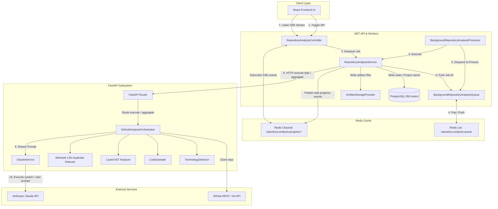
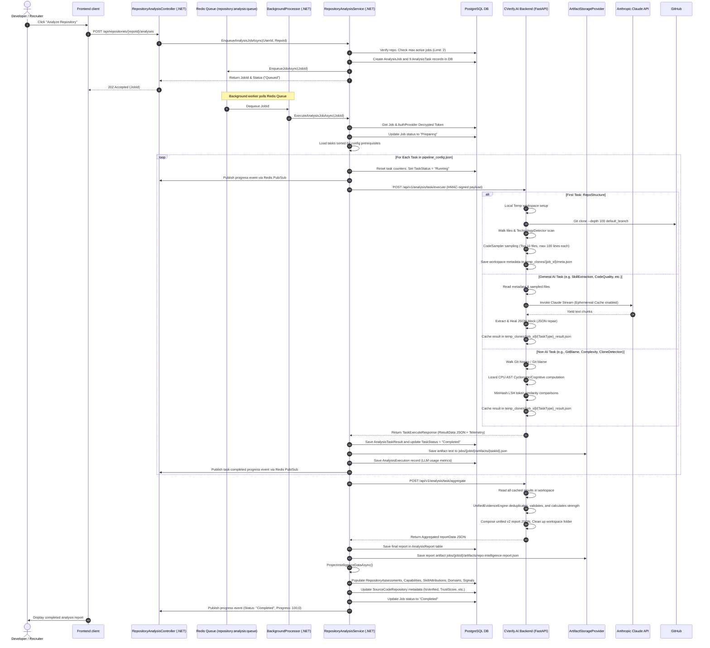
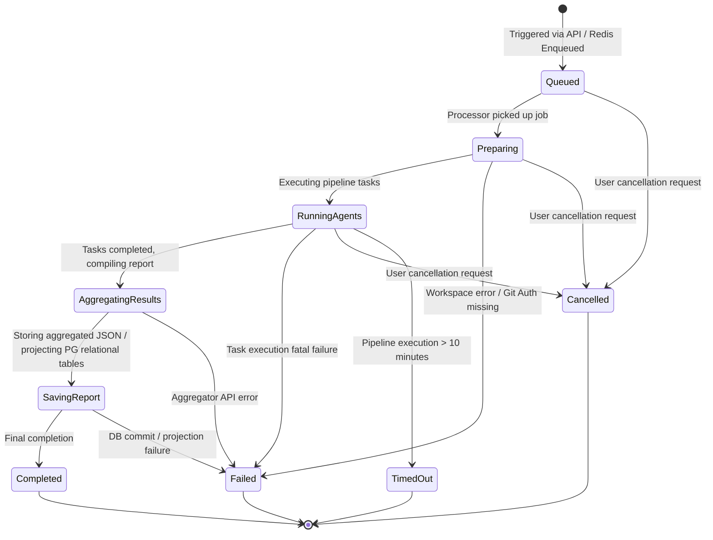
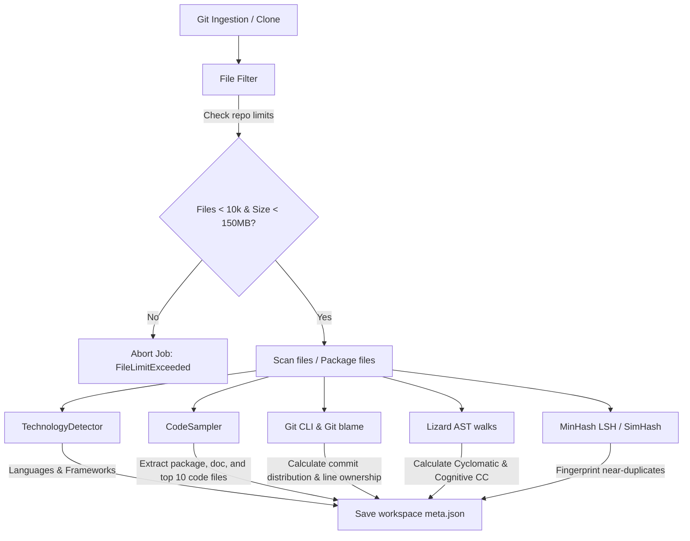
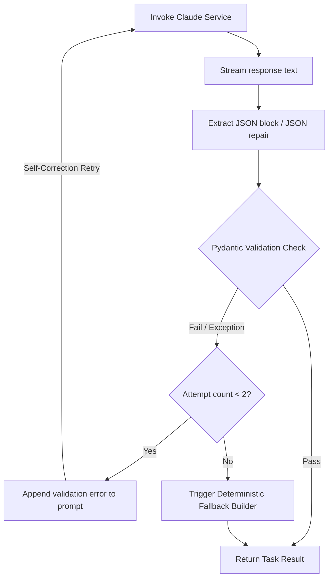
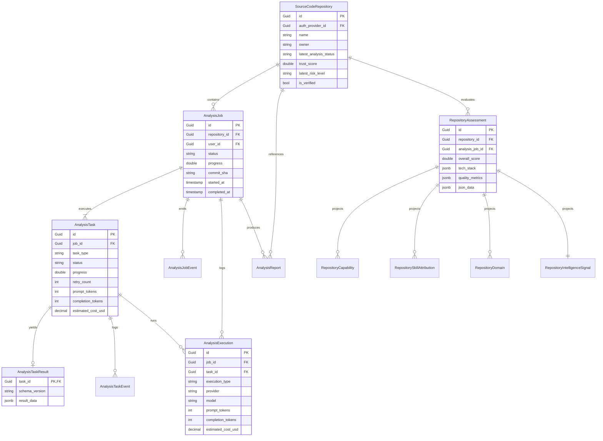
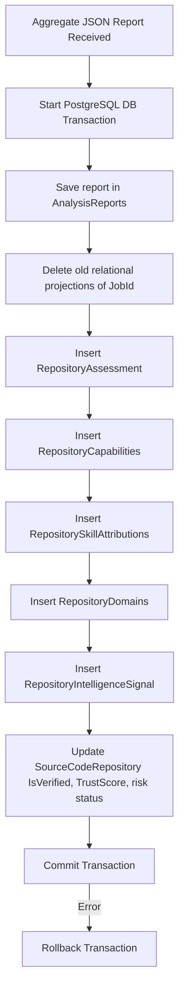

# Repository Analysis System: Complete Architecture & Workflow Documentation

This document provides a comprehensive reverse-engineered technical guide to the CVerify Repository Analysis pipeline. It details the system architecture, end-to-end workflow, data models, state transitions, failure recovery mechanisms, and code mapping of the Repository Analysis subsystem.

---

## 1. Executive Summary

The **Repository Analysis Subsystem** is CVerify's core engine for evaluating and verifying developer credentials, skill profiles, and project authenticity. It performs deep reverse-engineering of code repositories through a pipeline of git audits, static code analysis, semantic analysis, and LLM-powered reasoning.

### Main Goals
* **Authenticity Verification**: Identify repository origin, check for rebranding/dumping, compute user authorship metrics, and flag plagiarism or AI-generated anomalies.
* **Semantic Domain Classification**: Detect the functional and business domain of the project (e.g., SaaS, CLI tool, library) without relying on basic repository metadata.
* **Technical Skill Attributions**: Extract granular developer skills from raw source code and manifest files, validating them against active repository configs.
* **Risk & Code Quality Auditing**: Inspect testing configurations, observability logging, CI/CD pipelines, security vulnerabilities, and code complexity metrics.
* **CV Synthesis**: Translate verified codebase intelligence into a structured professional summary mapping the developer's ownership and highlights.

### Subsystems Involved
1. **Frontend Client**: Initiates analysis requests and listens to a real-time progress stream via Server-Sent Events (SSE).
2. **CVerify.Core (.NET API)**: Orchestrates the analysis lifecycle, handles API routing, manages a Redis-backed FIFO queue, manages state transitions, and persists structured findings in PostgreSQL.
3. **CVerify.AI (FastAPI Backend)**: Executes repository cloning, file traversal, code sampling, local Git logs parsing, complexity checks, SimHash/MinHash near-duplicate matching, and LLM orchestration with Anthropic Claude.
4. **Redis Cache & Message Broker**: Backs the job execution queue and drives progress event streaming via Redis Pub/Sub.
5. **PostgreSQL Database**: Persists operational state (`analysis_jobs`, `analysis_tasks`, etc.) and projects aggregated findings into relational tables (`repository_assessments`, `repository_capabilities`, etc.).
6. **Object Storage (GCS/S3)**: Acts as the physical vault for task JSON envelopes and aggregated intelligence reports.

---

## 2. System Architecture

The subsystem spans a highly distributed .NET and Python boundary, integrated via REST APIs, Redis Pub/Sub, and HMAC-signed secure request headers.

### Core Components
* **RepositoryAnalysisController (C#)**: Exposes API endpoints for enqueuing, status checks, SSE progress streaming, and cost summary statistics.
* **RepositoryAnalysisService (C#)**: Core orchestrator managing DB state transitions, OAuth token decryption, task sequencing based on `pipeline_config.json`, artifact registration, and relational PostgreSQL projection.
* **BackgroundRepositoryAnalysisProcessor (C#)**: Background worker listening to the Redis-backed queue to process job execution asynchronously.
* **BackgroundRepositoryAnalysisQueue (C#)**: Implements FIFO job queuing using a Redis List (`repository:analysis:queue`).
* **FastAPI Router (Python)**: Validates incoming HMAC signatures and maps incoming task requests to orchestrator components.
* **GitHubAnalysisOrchestrator (Python)**: Executes local workspace provisioning, technology detection, file sampling, git blame processing, lizard complexity AST walks, MinHash LSH clone matching, and AI reasoning runs.
* **ClaudeService (Python)**: Connects to the Anthropic API with async streaming, automated exponential backoff retries, token normalization, and cost tracking.
* **IArtifactStorageProvider (C#)**: Abstract interface used to save and retrieve raw JSON result packages in object storage.

### System Component Diagram

---

## 3. End-to-End Workflow

The repository analysis lifecycle follows a sequential execution pipeline:

---

## 4. Repository Analysis Lifecycle

A repository analysis job traverses a strict, monitored lifecycle. Each status transition is backed by database updates and broadcasted to Redis Pub/Sub.

### State Definitions

| Lifecycle State | Purpose | Entry Conditions | Exit Conditions | Failure / Interrupt Conditions |
| :--- | :--- | :--- | :--- | :--- |
| **Queued** | Job is waiting in Redis FIFO list. | API triggers analysis; database record created. | Processor pops Job ID and starts execution. | User cancels the job; state transitions to `Cancelled`. |
| **Preparing** | Workspace folder verification, Git credentials resolution. | Job popped by processor; `ExecuteAnalysisJobAsync` invoked. | OAuth token resolved and decrypted. | Decryption key missing or repository record deleted. |
| **RunningAgents** | Sequential execution of discrete pipeline tasks (RepoStructure, CommitDiff, AI reasoning, etc.). | Preparing state successfully finishes. | All configured tasks in `pipeline_config.json` complete. | Any task fails after 3 retries (transitions to `Failed`); user cancels (transitions to `Cancelled`); run time > 10m (transitions to `TimedOut`). |
| **AggregatingResults** | Compiling individual task cache files into a unified v2 report. | All pipeline tasks have `Completed` status in DB. | Aggregate API returns a valid aggregated JSON response. | FastAPI aggregation endpoint returns an error. |
| **SavingReport** | Persisting final JSON report to DB and GCS; projecting PostgreSQL relational tables. | Aggregation payload received and validated. | DB transaction successfully commits. | DB concurrency conflicts, schema validation errors, or GCS network drops. |
| **Completed** | Job finished successfully. Terminal state. | DB transaction committed; repository metadata updated. | None | None |
| **Failed** | Job interrupted by error. Terminal state. | Catch block in C# orchestrator triggered. | None | None |
| **Cancelled** | Job terminated by user. Terminal state. | `CancelJobAsync` called on an active job. | None | None |
| **TimedOut** | Execution exceeded 10-minute timeout. | Linked cancellation token source reaches 10 minutes. | None | None |

---

## 5. Pipeline Engine Deep Dive

The pipeline orchestrator controls the sequencing, configuration, and resilience of the discrete tasks.

### Engine Configuration (`pipeline_config.json`)
The pipeline structure is configuration-driven. The .NET orchestrator parses `pipeline_config.json` to determine:
1. **Task Sequencing**: Order of execution matches the array layout.
2. **Progress Weighting**: Each task is assigned a specific `weight` (default 5.0) which is scaled dynamically against the total weights to update the global `AnalysisJob.Progress` parameter.
3. **Prerequisite DAG**: Declares downstream task blockers (e.g. `CvSynthesis` requires `RepositorySummary`).

### Context Model
Workspace state is isolated per `jobId` in both local directories and object storage:
* **Local Python Cache**: Located at `CVerify.AI/temp_clones/{jobId}/`.
  * `repo/`: Cloned Git directory.
  * `meta.json`: Holds repository metadata (commit distributions, stars, branches, active contributors, resolved author identity hashes).
  * `{TaskType}_result.json`: Intermediary result cache files for downstream tasks context.
* **GCS Artifact Store**: Rooted at `jobs/{jobId}/artifacts/`. Saves task-specific results for historical cost/audit tracking.

### Resilience & Error Handling
* **Transient API Retries**: FastAPI HTTP calls and Anthropic Claude requests are wrapped in retries.
  * *Claude calls*: Anthropic errors (429, 500, 502, 503, 504, rate limit, timeout) retry up to **5 times** with exponential backoff and randomized jitter (`sleep_time = delay + random_jitter`).
  * *Pipeline tasks*: C# task loop retries failed tasks up to **3 times** (delays: 500ms, 1000ms, 2000ms) for transient errors before failing the job.
* **JSON Recovery Heuristic**: Claude responses that are truncated or have unescaped control characters are passed through the `_repair_json_string` algorithm. The parser locates the first `{` and last `}` braces and repairs missing closing brackets/strings to guarantee structural integrity.

---

## 6. Detailed Task Breakdown

The pipeline runs 22 specific task types (including legacy and alias mappings). The major tasks are detailed below:

### RepoStructure / L1-001
* **Purpose**: Workspace provisioning, Git cloning, file scan, technology detection, and code sampling.
* **Inputs**: Repo URL, encrypted OAuth token, default branch.
* **Outputs**: File list, technology array, sampled files contents, Git clone indicators.
* **Context Dependencies**: None (Root node).
* **Services Used**: `GitHubIdentityService` (resolves authentication), `TechnologyDetector`, `CodeSampler`.
* **AI Calls**: None.
* **Database Operations**: None (Writes metadata to local workspace `meta.json`).
* **Failure Handling**: Falls back to clone standard default branch if specified default branch fails. Throws error if repo exceeds 10,000 files or 150MB.
* **Downstream Consumers**: All pipeline tasks.

### CommitIntelligence / L1-002
* **Purpose**: Parse local Git log to compute contributor commit distributions, bus factor, user commit ratio, and invoke AI to analyze repository trust signals.
* **Inputs**: Resolved user identity hashes, metadata, sampled files.
* **Outputs**: Factual Git metrics (bus factor, user commit ratio, contributors), AI-inferred trust classification (`personal_authentic`, `fork_rebranded`, `template_dump`, `collaboration`).
* **Context Dependencies**: `RepoStructure`.
* **Services Used**: `ContributorIdentityResolver`, `ClaudeService`.
* **AI Calls**: Claude analysis prompt mapping repository metadata vs code style to evaluate authenticity.
* **Database Operations**: None.
* **Failure Handling**: Short-circuits with deterministic "ecosystem familiarity evaluation only" fallback if repository type is flagged as `FORK_NO_CONTRIBUTION`.

### CommitDiff / L1-003
* **Purpose**: Parse raw Git diff trees of the top 30 commits to map changed files directly to technical capability signals (Diff-First architecture).
* **Inputs**: Git repository.
* **Outputs**: List of analyzed commits, files changed, inferred type (feature, test, cleanup, refactor), intent conflict flag.
* **Context Dependencies**: `RepoStructure`.
* **Services Used**: Git CLI.
* **AI Calls**: None (Deterministic regex classification based on path structures).
* **Database Operations**: None.
* **Downstream Consumers**: `CommitIntent`, `SkillGraph`, `RepoIntelligenceReport`.

### SkillExtraction / L1-004
* **Purpose**: Analyze code samples to extract granular technical skills.
* **Inputs**: Sampled file contents, detected technologies.
* **Outputs**: Array of skill items containing skill name, category (backend, frontend, devops, database), confidence, and specific code line citations.
* **Context Dependencies**: `RepoStructure`.
* **Services Used**: `ClaudeService`.
* **AI Calls**: Skill extraction prompt mapping code constructs to libraries and practices.
* **Downstream Consumers**: `SkillGraph`, `RepoIntelligenceReport`, `CvSynthesis`.

### FeatureExtraction / L1-005
* **Purpose**: NLP-based identification of major features implemented in the codebase.
* **Inputs**: Sampled code, filenames, capability signals.
* **Outputs**: Array of feature objects containing name, description, complexity score (1-10), evidence.
* **Context Dependencies**: `RepoStructure`, `CommitDiff`, `ArchitectureAnalysis`.
* **Services Used**: `ClaudeService`.
* **AI Calls**: Feature extraction prompt evaluating files vs capabilities.
* **Downstream Consumers**: `RepoIntelligenceReport`, PostgreSQL relational tables.

### CodeQuality / L1-011
* **Purpose**: Audits test coverage configurations, logging instrumentation, CI/CD configs, and code smell patterns.
* **Inputs**: Code samples.
* **Outputs**: Testing framework list, observability indicators, CI/CD provider list, findings array.
* **Context Dependencies**: `RepoStructure`.
* **Services Used**: `ClaudeService`.
* **AI Calls**: Code quality prompt inspecting files for assertions, logging calls, and pipeline files.
* **Downstream Consumers**: `TrustScore`, `RepoIntelligenceReport`.

### CloneDetection / L1-013
* **Purpose**: Near-duplicate detection to identify code plagiarism.
* **Inputs**: Code workspace.
* **Outputs**: Clone risk score, clone similarity score, clone pairs list.
* **Context Dependencies**: `RepoStructure`.
* **Services Used**: `datasketch` library (MinHash LSH).
* **AI Calls**: None (Deterministic token hashing).
* **Failure Handling**: Falls back to commit-pattern heuristics (large initial commits, commit bombs, commit velocity) if datasketch library is missing.
* **Downstream Consumers**: `TrustScore`, `Ownership`.

### Ownership / L1-015
* **Purpose**: Calculates developer's code ownership score.
* **Inputs**: `GitBlame` and `CloneDetection` outputs.
* **Outputs**: Weighted ownership score, primary author indicator.
* **Context Dependencies**: `GitBlame`, `CloneDetection`, `CommitIntelligence`, `CommitTimeline`.
* **AI Calls**: None.
* **Downstream Consumers**: `TrustScore`, `SkillGraph`, `RepoIntelligenceReport`.

### TrustScore / L1-018
* **Purpose**: Compute overall codebase trust score based on four distinct dimensions.
* **Inputs**: `Ownership`, `CodeQuality`, `Complexity`, `CommitTimeline`, `CloneDetection`, `AiGeneratedCode`, `CommitIntent`.
* **Outputs**: Trust score, trust level (low, medium, high), dimensional breakdown.
* **Context Dependencies**: All upstream quality/anti-fraud tasks.
* **AI Calls**: None (Deterministic weight formula).
* **Downstream Consumers**: `RepoIntelligenceReport`.

### RepoIntelligenceReport / L1-016
* **Purpose**: Compiles all pipeline task outputs into a single JSON report.
* **Inputs**: All task results.
* **Outputs**: Combined report schema.
* **Context Dependencies**: `TrustScore`, `SkillGraph`, `CommitDiff`.
* **AI Calls**: None.
* **Database Operations**: Persisted to `AnalysisReports` table; projects SQL relational tables.
* **Downstream Consumers**: `RepositorySummary`.

### CvSynthesis
* **Purpose**: Synthesizes verified codebase intelligence into a professional resume representation.
* **Inputs**: `RepositoryClassification`, `SkillExtraction`, `CommitIntelligence`, `RepositorySummary` cache results.
* **Outputs**: Professional title, summary paragraph, bulleted highlights.
* **Context Dependencies**: `RepositorySummary`.
* **Services Used**: `ClaudeService`, Pydantic validator, difflib.
* **AI Calls**: CV synthesis prompt generating narrative summary.
* **Failure Handling**: Pydantic validations enforce bounds. Similarity guard (difflib SequenceMatcher > 0.6) rejects responses mirroring preceding task summaries. Falls back to a deterministic fallback builder on dual failure.

---

## 7. Repository Processing Flow

The processing flow moves from raw repository cloning to data normalization:

---

## 8. AI Analysis Flow

AI tasks are orchestrated using systemic prompt engineering, caching rules, and strict post-processing validators.

### Prompts & Caching
System prompts are declared in `github_prompt_factory.py`. System prompts include `cache_control: {"type": "ephemeral"}` configurations. This enables Anthropic prompt caching, yielding speedups and cost reductions when processing consecutive analysis tasks containing overlapping file samplings.

### Pydantic Validation & Self-Correction
Task responses are returned as JSON. If validation fails, CVerify.AI executes a self-correction loop:

---

## 9. Data Model Mapping

The system architecture utilizes a rich PostgreSQL relational database mapping:

---

## 10. Persistence Flow

Data persistence operates under strict transactional controls and idempotency guarantees.

### Task Execution Save Path
During execution, `RepositoryAnalysisService` saves intermediate task results:
1. `AnalysisTaskResult` is written (or updated if retried) using PostgreSQL `jsonb` formats.
2. An `AnalysisExecution` record logs prompt, completion, and cached tokens to track costs.
3. Sub-events are persisted in `AnalysisTaskEvents` to record logs.

### Aggregation and SQL Projection Save Path
When the pipeline successfully aggregates, the final report data is stored, and PostgreSQL tables are updated within a single transaction:

### The Reset Transaction Boundary
When `ResetRepositoryAnalysisAsync` is invoked:
1. A Redis distributed lock is acquired: `repository:reset:lock:{repositoryId}`.
2. Verifies that no active analysis job is running.
3. Starts a database transaction:
   * Removes `ProjectRepositoryLinks` and unlinks mapping entries from the user's CV.
   * Deletes all relational assessments (`repository_capabilities`, `repository_skill_attributions`, `repository_domains`, `repository_intelligence_signals`, `repository_assessments`).
   * Deletes all job metadata (`artifact_registry_entries`, `analysis_executions`, `analysis_task_results`, `analysis_task_events`, `analysis_tasks`, `analysis_reports`, `analysis_job_events`, `analysis_jobs`).
   * Resets repository metadata fields.
   * Inserts an `AuditLog` entry recording the action.
   * Commits database changes.
4. Spawns asynchronous tasks to delete physical artifacts from object storage and re-trigger candidate assessment calculations.

---

## 11. Event and Streaming Flow

Progress updates are streamed in real time to the frontend using Server-Sent Events (SSE), backed by a Redis Pub/Sub channel.

### Progress Events Propagation
1. Inside the task loop in `RepositoryAnalysisService.cs`, `PublishTaskProgressEventAsync` compiles a JSON payload detailing the current job status, step, and progress.
2. .NET publishes this payload to a Redis channel named `repository:analysis:progress:{jobId}`.
3. When the client calls `GET /api/repository-analyses/jobs/{jobId}/progress-stream`:
   * The controller responds with `text/event-stream`.
   * It fetches and streams all historical events from `AnalysisJobEvents` first.
   * It then subscribes to the Redis Pub/Sub channel.
   * Real-time events popped from the Redis channel are immediately written to the HTTP response stream.
   * Once a terminal state (`Completed`, `Failed`, `Cancelled`, `TimedOut`) is detected, a final `data: [DONE]` event is sent, and the connection is closed.

---

## 12. Failure Recovery & Resilience

The system implements multi-tier recovery strategies to handle system crashes, connection drops, and API limits.

### Startup Sweeper (`AnalysisQueueRecoverySweeper`)
When CVerify.Core boots, it starts a background sweeper to recover jobs interrupted by a server reboot or crash:
1. Queries database for jobs stuck in active states (Queued, Preparing, RunningAgents, etc.).
2. Marks these jobs as `Failed` with the message: *"Job interrupted by server reboot or restart."*
3. Marks associated repositories as `Failed`.
4. Identifies pending repositories with no active job and updates their state to `Failed` to allow the user to retry.

### Retry Policies
* **FastAPI Task Execution**: If CVerify.AI returns an error, the service checks the `retryable` flag. If transient, it delays and retries the HTTP post up to 3 times before failing.
* **Anthropic API**: The Python `ClaudeService` implements exponential backoff retries with randomized jitter to handle rate limits and service timeouts.

### Cancellation
When `CancelJobAsync` is called:
1. Job status is updated to `Cancelled` in the database.
2. Real-time check: before executing a task, the service checks if the database status is `Cancelled`. If yes, it aborts immediately.

---

## 13. Performance Characteristics

### Parallelization vs Serialization
* *Current State*: The .NET orchestrator iterates through the stages of `pipeline_config.json` sequentially. Although task dependency DAG specifications are defined in the C# orchestrator and Python code, the execution path in `RepositoryAnalysisService` is serialized.
* *Bottleneck*: Large codebases with multiple AI analysis tasks run sequentially, which can lead to execution times approaching the 10-minute timeout limit.

### Key Performance Bottlenecks
1. **Repository Acquisition**: Cloning a repository over Git is network-intensive and depends on GitHub's responsiveness.
2. **AI Reasoning Latency**: Claude completions take between 5 to 25 seconds per task, depending on the prompt complexity.
3. **AST lizards Walk**: Lizard walks are CPU-bound and can block thread execution on directories containing massive volumes of nested functions.
4. **MinHash Duplicate Checking**: Hashing and comparing tokens across thousands of code files is memory-intensive.

---

## 14. Code Reference Map

Guide for navigating the codebase:

| Component | File Path | Class / Function | Responsibility |
| :--- | :--- | :--- | :--- |
| **API Entry Controller** | [RepositoryAnalysisController.cs](file:///d:/Coding%20Space/Projects/CVerify/CVerify.Core/Modules/SourceCode/Controllers/RepositoryAnalysisController.cs) | `RepositoryAnalysisController` | Handles API endpoints, SSE progress stream. |
| **Queue Manager** | [BackgroundRepositoryAnalysisQueue.cs](file:///d:/Coding%20Space/Projects/CVerify/CVerify.Core/Modules/SourceCode/Services/BackgroundRepositoryAnalysisQueue.cs) | `BackgroundRepositoryAnalysisQueue` | Pushes/pops jobs using Redis list formats. |
| **Queue Consumer** | [BackgroundRepositoryAnalysisProcessor.cs](file:///d:/Coding%20Space/Projects/CVerify/CVerify.Core/Modules/SourceCode/BackgroundWorkers/BackgroundRepositoryAnalysisProcessor.cs) | `BackgroundRepositoryAnalysisProcessor` | Background service consuming the Redis list queue. |
| **Core .NET Orchestrator** | [RepositoryAnalysisService.cs](file:///d:/Coding%20Space/Projects/CVerify/CVerify.Core/Modules/SourceCode/Services/RepositoryAnalysisService.cs) | `RepositoryAnalysisService` | Orchestration, task loop, DB writes, relational table projections. |
| **Boot Sweeper** | [AnalysisQueueRecoverySweeper.cs](file:///d:/Coding%20Space/Projects/CVerify/CVerify.Core/Modules/SourceCode/BackgroundWorkers/AnalysisQueueRecoverySweeper.cs) | `AnalysisQueueRecoverySweeper` | Recovers stuck active jobs during server reboots. |
| **FastAPI Router** | [analysis_router.py](file:///d:/Coding%20Space/Projects/CVerify/CVerify.AI/app/api/routes/analysis_router.py) | `execute_task` / `aggregate_results` | Handles incoming HTTP requests from the .NET backend. |
| **Python Orchestrator** | [github_analysis_orchestrator.py](file:///d:/Coding%20Space/Projects/CVerify/CVerify.AI/app/pipelines/repository/orchestrators/github_analysis_orchestrator.py) | `GitHubAnalysisOrchestrator` | Provisons workspace, manages Git blame, Lizard AST, and MinHash. |
| **Code Sampler** | [code_sampler.py](file:///d:/Coding%20Space/Projects/CVerify/CVerify.AI/app/pipelines/repository/github/code_sampler.py) | `CodeSampler` | Extracts code files up to 10k limits / 150MB sizes. |
| **MinHash LSH** | [github_analysis_orchestrator.py](file:///d:/Coding%20Space/Projects/CVerify/CVerify.AI/app/pipelines/repository/orchestrators/github_analysis_orchestrator.py#L2333-L2521) | `analyze_clone_detection` | Detects near-duplicates using SimHash/MinHash LSH. |
| **Lizard Complexity AST** | [github_analysis_orchestrator.py](file:///d:/Coding%20Space/Projects/CVerify/CVerify.AI/app/pipelines/repository/orchestrators/github_analysis_orchestrator.py#L1975-L2095) | `analyze_complexity` | Evaluates function Cyclomatic and Cognitive complexity. |
| **Evidence Processor** | [unified_evidence.py](file:///d:/Coding%20Space/Projects/CVerify/CVerify.AI/app/pipelines/repository/orchestrators/unified_evidence.py) | `UnifiedEvidenceEngine` | Normalizes, deduplicates, and calculates evidence strength. |
| **Claude API Service** | [claude_service.py](file:///d:/Coding%20Space/Projects/CVerify/CVerify.AI/app/core/services/claude_service.py) | `ClaudeService` | Executes stream Claude calls, cost accounting, and backoff retries. |
| **Prompt Factories** | [github_prompt_factory.py](file:///d:/Coding%20Space/Projects/CVerify/CVerify.AI/app/pipelines/shared/ai/prompts/github_prompt_factory.py) | `GitHubPromptFactory` | Declares system and user templates for the LLM. |

---

## 15. Complete Mermaid Workflow

An end-to-end overview of the entire CVerify Repository Analysis system from job creation to Postgres projections:

```mermaid
flowchart TD
    subgraph 1. Initiation Phase
        UI[User clicks Analyze in UI] -->|1. POST request| API[RepositoryAnalysisController]
        API -->|2. Create Job & Tasks in DB| Service[RepositoryAnalysisService]
        Service -->|3. Status set to Queued| Queue[BackgroundRepositoryAnalysisQueue]
        Queue -->|4. Push Job ID| RedisList[Redis List: repository:analysis:queue]
    end

    subgraph 2. Background Processing
        RedisList -->|5. Pop Job ID| Processor[BackgroundRepositoryAnalysisProcessor]
        Processor -->|6. Execute Job| Service
        Service -->|7. Decrypt Git OAuth Token| Service
        Service -->|8. Status set to Preparing| Service
    end

    subgraph 3. Task Execution Loop
        direction TB
        Service -->|9. Iterate task config| TaskLoop{All tasks done?}
        TaskLoop -->|No: Run Task| RunningTask[Update Task status to Running in DB]
        RunningTask -->|10. Stream progress to Redis PubSub| RedisPub[Redis PubSub Progress Channel]
        RunningTask -->|11. POST execute task| FastRouter[FastAPI Router]
        
        %% Internal Python tasks
        FastRouter -->|RepoStructure| T1[Clone Git repository & Scan filenames]
        FastRouter -->|CommitIntelligence| T2[Git log audit & AI trust evaluation]
        FastRouter -->|CommitDiff| T3[Parse git diffs & map file paths to capability signals]
        FastRouter -->|SkillExtraction| T4[Extract granular code/library skills]
        FastRouter -->|FeatureExtraction| T5[Extract implemented features]
        FastRouter -->|ArchitectureAnalysis| T6[Detect architectural patterns]
        FastRouter -->|CommitTimeline| T7[Compute temporal frequency and burst trends]
        FastRouter -->|ArchitectureChange| T8[Evaluate structural metrics refactoring quality]
        FastRouter -->|CommitIntent| T9[Infer commit intent from diffs]
        FastRouter -->|Complexity| T10[Lizard AST function cyclomatic/cognitive walk]
        FastRouter -->|CodeQuality| T11[Audit tests, observability, and code smells]
        FastRouter -->|GitBlame| T12[Git blame top changed files line authorship]
        FastRouter -->|CloneDetection| T13[MinHash LSH duplicate detection]
        FastRouter -->|AiGeneratedCode| T14[Detect large AI single-burst code dumps]
        FastRouter -->|Ownership| T15[Calculate weighted ownership score formula]
        FastRouter -->|SkillGraph| T17[Map skills & evidence nodes graph]
        FastRouter -->|TrustScore| T18[Calculate overall trust score based on dimensions]
        FastRouter -->|SecurityAnalysis| T19[Scan vulnerabilities & verify findings]
        FastRouter -->|RepositoryClassification| T20[Classify semantic domain of project]
        FastRouter -->|RepositorySummary| T21[Narrative summaries & strengths/limitations]
        FastRouter -->|CvSynthesis| T22[Generate professional CV title & summary highlights]

        T2 & T4 & T5 & T6 & T9 & T11 & T19 & T20 & T21 & T22 -->|Invoke LLM| Claude[Claude API Async Stream]
        Claude -->|Retry backoff on 429/5xx| Claude
        Claude -->|Return JSON| Repair[Heal & repair JSON syntax blocks]
        
        T1 & T3 & T7 & T8 & T10 & T12 & T13 & T14 & T15 & T17 & T18 & Repair -->|Cache result| Cache[Workspace results cache]
        
        Cache -->|12. Return TaskExecuteResponse| FastRouter
        FastRouter -->|13. HTTP Response| Service
        Service -->|14. Save TaskResult to DB| DB[(PostgreSQL Database)]
        Service -->|15. Save Artifact file| GCS[(Artifact Storage)]
        Service -->|16. Log Token & Cost Telemetry| DB
        Service -->|17. Status set to Completed| DB
        Service -->|18. Publish task complete event| RedisPub
        RedisPub -->|SSE Stream| UI
        DB --> TaskLoop
    end

    subgraph 4. Aggregation & Persistence
        TaskLoop -->|Yes: Aggregate| Agg[Update Job status to AggregatingResults]
        Agg -->|19. POST aggregate| FastRouter
        FastRouter -->|20. Read all task cache files| AggEngine[UnifiedEvidenceEngine]
        AggEngine -->|21. Deduplicate & validate files| AggEngine
        AggEngine -->|22. Calculate overall risk score & evidence strength| AggEngine
        AggEngine -->|23. Clean up local workspace folder| AggEngine
        AggEngine -->|24. Return aggregated reportData JSON| FastRouter
        FastRouter -->|25. Return HTTP Response| Service
        Service -->|26. Status set to SavingReport| Service
        Service -->|27. Save report data to DB and GCS| DB
        Service -->|28. Project data into SQL relational tables| DB
        DB -->|29. Update SourceCodeRepository metadata| DB
        Service -->|30. Status set to Completed| DB
        Service -->|31. Publish Job Completed Event| RedisPub
    end
```

